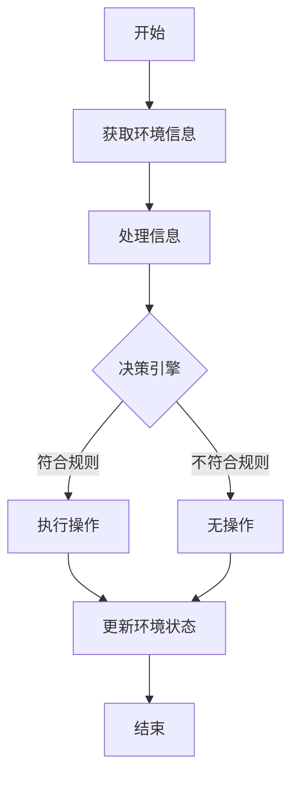

# AI人工智能代理工作流AI Agent WorkFlow：智能代理在智能家居中的实践

## 1.背景介绍

### 1.1 智能家居的兴起

随着人工智能(AI)和物联网(IoT)技术的飞速发展,智能家居已经成为一个备受关注的热门领域。智能家居旨在通过互联网将家中的各种设备连接起来,实现自动化控制和智能管理,从而提高生活质量、节约能源并提供更安全舒适的居住环境。

### 1.2 智能代理的重要性

在智能家居系统中,智能代理扮演着关键角色。智能代理是一种软件实体,能够根据用户的偏好、环境条件和设备状态做出智能决策,并执行相应的操作。它们可以自主地管理和协调家中的各种智能设备,实现自动化控制和优化。

### 1.3 AI Agent WorkFlow概述  

AI Agent WorkFlow(智能代理工作流)是一种用于管理和协调智能代理行为的框架。它定义了智能代理如何感知环境、做出决策并执行相应操作的过程。通过合理设计AI Agent WorkFlow,我们可以实现高效、智能且人性化的智能家居系统。

## 2.核心概念与联系

### 2.1 智能代理

智能代理是指能够感知环境、处理信息、做出决策并执行操作的自主软件实体。在智能家居系统中,智能代理负责管理和控制各种智能设备,以满足用户需求并优化家居环境。

### 2.2 感知器(Sensor)

感知器是智能代理获取环境信息的重要组成部分。它们可以检测各种物理量,如温度、湿度、光线、运动等,并将这些信息传递给智能代理进行处理。

### 2.3 执行器(Actuator)

执行器是智能代理对环境进行操作的组成部分。根据智能代理的决策,执行器可以控制各种智能设备的开关、调节参数等,从而改变家居环境的状态。

### 2.4 决策引擎(Decision Engine)

决策引擎是智能代理的核心部分,负责根据感知器获取的环境信息、用户偏好设置和预定义的规则做出智能决策。它通常采用机器学习、规则引擎或其他AI技术来实现决策过程。

### 2.5 工作流(WorkFlow)

工作流定义了智能代理的行为模式,描述了感知、决策和执行操作的流程。合理设计工作流对于实现高效、智能且人性化的智能家居系统至关重要。

## 3.核心算法原理具体操作步骤  

AI Agent WorkFlow的核心算法原理可以概括为以下几个步骤:



### 3.1 获取环境信息

智能代理通过各种感知器(如温度计、运动传感器等)获取家居环境的实时信息,包括温度、湿度、光线、人员位置和活动状态等数据。

### 3.2 处理信息

获取到的原始环境数据通常需要进行预处理,以消除噪声、填补缺失值并将其转换为适合决策引擎处理的格式。这一步可以应用数据清洗、特征提取等技术。

### 3.3 决策引擎

决策引擎是整个系统的大脑,它根据处理后的环境信息、用户设置的偏好以及预定义的规则或策略做出智能决策。决策引擎可以采用多种技术实现,如机器学习、规则引擎、优化算法等。

#### 3.3.1 机器学习方法

机器学习算法可以从历史数据中学习用户的行为模式,并预测未来可能的偏好,从而做出相应的决策。常用的机器学习算法包括决策树、支持向量机、神经网络等。

#### 3.3.2 规则引擎方法

规则引擎是基于一系列预定义的if-then规则进行决策的方法。规则可以由专家或从历史数据中提取,它们描述了在特定条件下应该采取的操作。

#### 3.3.3 优化算法方法  

优化算法旨在寻找满足一定约束条件下的最优解。在智能家居系统中,优化算法可用于实现节能、提高舒适度等目标,如控制供暖系统以最小化能耗等。

### 3.4 执行操作

一旦决策引擎做出决策,智能代理就会通过各种执行器(如电灯开关、恒温器等)对家居环境进行相应的操作和调节。

### 3.5 更新环境状态

在执行操作后,智能代理需要重新获取环境信息,评估操作的效果,并根据新的环境状态继续进行下一轮的决策循环。

## 4.数学模型和公式详细讲解举例说明

在设计和优化AI Agent WorkFlow时,我们常常需要借助数学模型和公式来量化和描述系统的行为。以下是一些常用的数学模型和公式:

### 4.1 马尔可夫决策过程(MDP)

马尔可夫决策过程(Markov Decision Process,MDP)是一种描述决策序列的数学框架,常用于强化学习等领域。在智能家居系统中,MDP可用于建模智能代理的决策过程。

MDP由一个五元组(S,A,P,R,γ)定义:
- S是状态集合,描述环境的可能状态
- A是行动集合,描述智能代理可执行的操作
- P是状态转移概率,P(s'|s,a)表示在状态s执行动作a后,转移到状态s'的概率
- R是回报函数,R(s,a)表示在状态s执行动作a所获得的即时回报
- γ是折现因子,用于权衡即时回报和长期回报的重要性

在MDP框架下,智能代理的目标是找到一个策略π,使得期望的累积回报最大化:

$$\max_\pi \mathbb{E}\left[\sum_{t=0}^\infty \gamma^t R(s_t, a_t)\right]$$

其中t是时间步长,s_t和a_t分别是第t步的状态和行动。

### 4.2 约束马尔可夫决策过程(CMDP)

约束马尔可夫决策过程(Constrained Markov Decision Process,CMDP)是MDP的扩展,它在优化累积回报的同时,还考虑了一些约束条件,如能耗、成本等。

CMDP由一个六元组(S,A,P,R,C,L)定义:
- S,A,P,R与MDP相同
- C是代价函数集合,C_i(s,a)表示在状态s执行动作a所产生的第i种代价
- L是代价约束向量,L_i是对第i种代价的上限

在CMDP框架下,智能代理的目标是最大化期望累积回报,同时满足所有代价约束:

$$\max_\pi \mathbb{E}\left[\sum_{t=0}^\infty \gamma^t R(s_t, a_t)\right]$$
$$\text{subject to: }\mathbb{E}\left[\sum_{t=0}^\infty \gamma^t C_i(s_t, a_t)\right] \leq L_i, \forall i$$

CMDP在智能家居系统中有广泛应用,例如在供暖控制中,我们可以将能耗作为一种代价,并设置相应的约束,以实现节能的目标。

### 4.3 Q-Learning算法

Q-Learning是一种常用的强化学习算法,可用于求解MDP或CMDP模型。它通过不断尝试和更新,逐步学习出一个最优策略。

对于MDP,Q-Learning算法的更新规则为:

$$Q(s_t, a_t) \leftarrow Q(s_t, a_t) + \alpha\left(R(s_t, a_t) + \gamma \max_{a'}Q(s_{t+1}, a') - Q(s_t, a_t)\right)$$

其中:
- Q(s,a)是状态-行动对的价值函数,表示在状态s执行行动a后的期望累积回报
- α是学习率,控制新信息对Q函数更新的影响程度
- γ是折现因子,与MDP中的定义相同

通过不断更新Q函数,算法最终会收敛到最优策略。

对于CMDP,Q-Learning算法的更新规则需要考虑代价约束,通常采用乘法或对数等方式将约束条件融入到Q函数中。

## 5.项目实践:代码实例和详细解释说明

为了更好地理解AI Agent WorkFlow在智能家居中的应用,我们将通过一个简单的Python示例项目来演示其实现过程。

### 5.1 项目概述

我们将构建一个简单的智能家居系统,包括以下组件:
- 温度传感器
- 加热器
- 智能代理

智能代理的目标是根据温度传感器的读数,控制加热器的开关,以维持房间在舒适的温度范围内。我们将使用Q-Learning算法训练智能代理,使其学习到最优的控制策略。

### 5.2 状态空间

我们将房间温度离散化为以下几个状态:
- 太冷(温度<18°C)
- 冷(18°C <= 温度 < 20°C)  
- 舒适(20°C <= 温度 <= 22°C)
- 热(22°C < 温度 <= 24°C)
- 太热(温度 > 24°C)

### 5.3 行动空间

智能代理可以执行以下两个行动:
- 打开加热器
- 关闭加热器

### 5.4 回报函数

我们设计了一个简单的回报函数,鼓励智能代理维持舒适的温度范围:

$$R(s, a) = \begin{cases}
+1, & \text{if } 20^\circ\text{C} \leq \text{Temperature} \leq 22^\circ\text{C} \\
-1, & \text{otherwise}
\end{cases}$$

### 5.5 Q-Learning实现

```python
import numpy as np

# 状态空间
states = ['too_cold', 'cold', 'comfortable', 'hot', 'too_hot']
n_states = len(states)

# 行动空间
actions = ['turn_on_heater', 'turn_off_heater']
n_actions = len(actions)

# 初始化Q表
Q = np.zeros((n_states, n_actions))

# 超参数
alpha = 0.1  # 学习率
gamma = 0.9  # 折现因子
epsilon = 0.1  # 探索率

# 训练函数
def train(n_episodes):
    for episode in range(n_episodes):
        # 初始化状态
        state = np.random.randint(n_states)
        done = False
        
        while not done:
            # 选择行动
            if np.random.uniform() < epsilon:
                action = np.random.randint(n_actions)  # 探索
            else:
                action = np.argmax(Q[state])  # 利用
            
            # 执行行动并获取新状态和回报
            new_state, reward = take_action(state, actions[action])
            
            # 更新Q表
            Q[state, action] += alpha * (reward + gamma * np.max(Q[new_state]) - Q[state, action])
            
            state = new_state
            
            # 检查是否结束
            if is_terminal(state):
                done = True

# 执行行动的函数(模拟环境)
def take_action(state, action):
    # 模拟环境状态转移和回报
    # ...
    return new_state, reward

# 检查是否为终止状态
def is_terminal(state):
    # 检查状态是否为终止状态
    # ...
    return is_terminal

# 训练智能代理
train(n_episodes=10000)

# 使用训练好的Q表进行决策
current_state = 'cold'
action = actions[np.argmax(Q[states.index(current_state)])]
print(f'当前状态为{current_state}，智能代理决定{action}')
```

在这个示例中,我们首先定义了状态空间、行动空间和回报函数。然后,我们使用Q-Learning算法训练智能代理,通过不断尝试和更新Q表,逐步学习到最优的控制策略。

训练过程中,智能代理会根据当前状态和探索/利用策略选择一个行动,执行该行动并观察环境的反馈(新状态和回报)。根据这些信息,智能代理会更新Q表中相应的状态-行动对的价值函数。

经过足够多的训练episodes后,Q表将收敛到最优策略。我们可以使用训练好的Q表