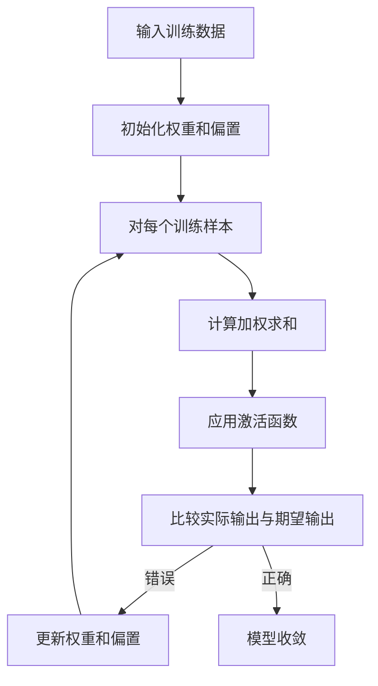

# AI人工智能核心算法原理与代码实例讲解：感知器

## 1.背景介绍

### 1.1 人工智能的兴起

人工智能(Artificial Intelligence, AI)是当代科技领域最具革命性和颠覆性的技术之一。自20世纪50年代被正式提出以来,AI技术不断发展壮大,逐渐渗透到我们生活的方方面面。从语音助手到无人驾驶,从医疗诊断到金融投资,AI正在彻底改变着人类的生产和生活方式。

### 1.2 感知器的重要地位

在人工智能的发展历程中,感知器(Perceptron)算法是最早也是最基础的机器学习模型之一。它由心理学家弗兰克·罗森布拉特(Frank Rosenblatt)于1957年提出,是最初的人工神经网络模型。尽管感知器算法非常简单,但它奠定了神经网络和机器学习的基础,对后续的深度学习等先进技术产生了深远影响。

### 1.3 本文内容概览

本文将全面深入地介绍感知器算法的原理、数学模型、实现方法以及实际应用。我们将从感知器的基本概念出发,逐步探索其核心思想、算法流程、训练过程,并通过实例代码加深理解。最后,我们将讨论感知器的局限性,以及在实际应用中的挑战和发展趋势。

## 2.核心概念与联系

### 2.1 感知器的基本概念

感知器是一种二分类线性模型,它通过对输入特征进行加权求和,再与阈值进行比较,从而实现对输入数据的分类。感知器的核心思想是模拟人脑中神经元的工作机制,通过调整权重和阈值,使模型能够学习并对新的输入数据进行正确分类。

### 2.2 感知器与其他机器学习模型的联系

感知器算法是机器学习领域中最基础的监督学习模型之一。它与逻辑回归、支持向量机等线性分类器有着密切的联系,都是通过构建线性决策边界来实现分类。同时,感知器也是深度神经网络的基础组成单元,多层神经网络可以看作是多个感知器的组合和叠加。

### 2.3 感知器的数学表示

感知器的数学表示如下:

$$
y = f(\sum_{i=1}^{n}w_ix_i + b)
$$

其中:

- $x_i$是输入特征向量的第i个分量
- $w_i$是对应于第i个特征的权重系数
- $b$是偏置项(阈值)
- $f$是激活函数,通常使用符号函数或阶跃函数

如果加权求和结果大于0,则输出为1(正类),否则输出为-1(负类)。

## 3.核心算法原理具体操作步骤 

### 3.1 感知器算法流程

感知器算法的工作流程如下:



1. 输入训练数据集,包括特征向量和对应的标签
2. 初始化权重向量和偏置项,通常使用小的随机值
3. 对每个训练样本:
   - 计算加权求和: $\sum_{i=1}^{n}w_ix_i + b$
   - 应用激活函数(通常为符号函数或阶跃函数)获得输出
   - 将输出与实际标签进行比较
4. 如果输出与实际标签不同,则更新权重和偏置:
   - $w_i = w_i + \eta(y - \hat{y})x_i$
   - $b = b + \eta(y - \hat{y})$
   
   其中$\eta$是学习率,控制更新的步长。
   
5. 重复步骤3,直到模型在训练集上收敛(所有样本都被正确分类)或达到最大迭代次数。

### 3.2 感知器算法收敛性

感知器算法的收敛性定理:如果训练数据是线性可分的,并且学习率被设置为一个合适的正值,那么感知器算法就一定会收敛。

该定理保证了在线性可分数据的情况下,感知器算法总能找到一组权重和偏置,使所有训练样本都被正确分类。然而,如果训练数据不是线性可分的,感知器算法将无法收敛,这也是感知器算法的主要局限性之一。

## 4.数学模型和公式详细讲解举例说明

### 4.1 感知器的数学模型

感知器的数学模型可以表示为:

$$
y = f(\vec{w}^T\vec{x} + b)
$$

其中:

- $\vec{x} = (x_1, x_2, \dots, x_n)$是输入特征向量
- $\vec{w} = (w_1, w_2, \dots, w_n)$是权重向量
- $b$是偏置项(阈值)
- $f$是激活函数,通常使用符号函数或阶跃函数

激活函数的作用是将加权求和的结果映射到输出空间,通常为{-1, 1}或{0, 1}。常用的激活函数包括:

1. 符号函数(Sign Function):

$$
f(z) = \begin{cases}
1, & \text{if } z \geq 0\\
-1, & \text{if } z < 0
\end{cases}
$$

2. 阶跃函数(Heaviside Step Function):

$$
f(z) = \begin{cases}
1, & \text{if } z \geq 0\\
0, & \text{if } z < 0
\end{cases}
$$

### 4.2 感知器算法的误差函数

为了更新权重和偏置,我们需要定义一个误差函数(Loss Function),用于衡量模型的预测结果与实际标签之间的差距。对于感知器算法,我们通常使用以下误差函数:

$$
E = -\sum_{i=1}^{m}y_i(\vec{w}^T\vec{x_i} + b)
$$

其中:

- $m$是训练样本的数量
- $y_i$是第i个样本的实际标签,取值为{-1, 1}
- $\vec{x_i}$是第i个样本的特征向量
- $\vec{w}$是权重向量
- $b$是偏置项

我们的目标是最小化这个误差函数,从而使模型的预测结果尽可能接近实际标签。

### 4.3 权重和偏置的更新规则

为了最小化误差函数,我们需要根据梯度下降法则更新权重和偏置。对于第i个样本,更新规则如下:

$$
\begin{aligned}
w_j &= w_j + \eta y_i x_{ij} \\
b &= b + \eta y_i
\end{aligned}
$$

其中:

- $\eta$是学习率,控制更新的步长
- $y_i$是第i个样本的实际标签
- $x_{ij}$是第i个样本的第j个特征值

这个更新规则可以确保权重和偏置朝着减小误差函数的方向移动,从而使模型的预测结果逐渐接近实际标签。

### 4.4 示例:使用感知器对数据进行分类

假设我们有一个二维数据集,其中正类样本(标签为1)和负类样本(标签为-1)在平面上呈线性可分的分布。我们可以使用感知器算法对这些数据进行分类。

```python
import numpy as np
import matplotlib.pyplot as plt

# 生成线性可分的数据
X_pos = np.array([[1, 3], [2, 5], [3, 6], [5, 7]])
y_pos = np.ones(4)  # 正类标签为1

X_neg = np.array([[2, 1], [4, 2], [6, 3], [7, 5]])
y_neg = -np.ones(4)  # 负类标签为-1

X = np.concatenate((X_pos, X_neg), axis=0)
y = np.concatenate((y_pos, y_neg))

# 初始化权重和偏置
w = np.zeros(2)
b = 0

# 训练感知器
epochs = 10
eta = 0.1

for epoch in range(epochs):
    for i in range(len(X)):
        y_pred = np.sign(np.dot(w, X[i]) + b)
        if y_pred != y[i]:
            w += eta * y[i] * X[i]
            b += eta * y[i]

# 可视化决策边界
x1 = np.linspace(0, 8, 100)
x2 = -(w[0] * x1 + b) / w[1]

plt.scatter(X_pos[:, 0], X_pos[:, 1], color='r', marker='o', label='Positive')
plt.scatter(X_neg[:, 0], X_neg[:, 1], color='b', marker='x', label='Negative')
plt.plot(x1, x2, color='g', label='Decision Boundary')
plt.xlabel('Feature 1')
plt.ylabel('Feature 2')
plt.legend()
plt.show()
```

在这个示例中,我们首先生成了一个线性可分的二维数据集,包含正类和负类样本。然后,我们初始化权重向量和偏置项,并使用感知器算法对数据进行训练。最后,我们可视化了训练后的决策边界,以及正类和负类样本在平面上的分布。

通过这个示例,我们可以直观地理解感知器算法的工作原理,以及如何使用它对线性可分数据进行分类。

## 5.项目实践:代码实例和详细解释说明

为了更好地理解感知器算法,我们将通过一个实际项目来实践。在这个项目中,我们将使用Python和NumPy库实现感知器算法,并将其应用于著名的Iris数据集进行鸢尾花种类的分类。

### 5.1 导入所需库

```python
import numpy as np
from sklearn import datasets
```

我们首先导入NumPy库用于数值计算,并从scikit-learn库中导入Iris数据集。

### 5.2 加载和预处理数据

```python
# 加载Iris数据集
iris = datasets.load_iris()
X = iris.data[:, :2]  # 只使用前两个特征
y = np.where(iris.target != 0, 1, -1)  # 将标签二值化
```

在这个示例中,我们只使用Iris数据集的前两个特征(花萼长度和花萼宽度),并将标签二值化,将'Iris-setosa'标记为1,将其他两个品种标记为-1。这样做是为了将问题简化为二分类问题,以便使用感知器算法进行处理。

### 5.3 实现感知器算法

```python
class Perceptron:
    def __init__(self, learning_rate=0.01, max_iter=100):
        self.lr = learning_rate
        self.max_iter = max_iter
        self.weights = None
        self.bias = None

    def fit(self, X, y):
        n_samples, n_features = X.shape
        self.weights = np.zeros(n_features)
        self.bias = 0

        for _ in range(self.max_iter):
            for idx, x_i in enumerate(X):
                linear_output = np.dot(x_i, self.weights) + self.bias
                y_pred = np.sign(linear_output)

                if y_pred != y[idx]:
                    update = self.lr * y[idx]
                    self.weights += update * x_i
                    self.bias += update

    def predict(self, X):
        linear_output = np.dot(X, self.weights) + self.bias
        y_pred = np.sign(linear_output)
        return y_pred
```

我们定义了一个`Perceptron`类来实现感知器算法。在`__init__`方法中,我们初始化了学习率和最大迭代次数。

`fit`方法是用于训练模型的核心函数。它首先初始化权重向量和偏置项,然后遍历所有训练样本。对于每个样本,它计算加权求和的线性输出,并使用符号函数获得预测标签。如果预测标签与实际标签不同,就根据误差更新权重向量和偏置项。

`predict`方法用于对新的输入数据进行预测。它计算加权求和的线性输出,并使用符号函数获得预测标签。

### 5.4 训练和评估模型

```python
# 训练模型
perceptron = Perceptron(learning_rate=0.1, max_iter=1000)
perceptron.fit(X, y)

# 评估模型
y_pred = perceptron.predict(X)
accuracy = np.sum(y_pred == y) / len(y)
print(f"Accuracy: {accuracy * 100:.2f}%")
```

我们实例