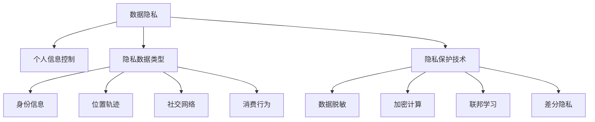

# AI人工智能核心算法原理与代码实例讲解：数据隐私

## 1. 背景介绍

### 1.1 数据隐私的重要性

在当今大数据时代,随着人工智能、物联网、云计算等技术的快速发展,海量数据被收集和利用。然而,在数据带来便利的同时,个人隐私面临着前所未有的挑战。个人信息的泄露、滥用已成为亟待解决的问题。保护数据隐私,已成为人工智能时代不可回避的话题。

### 1.2 数据隐私面临的挑战

#### 1.2.1 数据规模巨大

当前,各行各业每天产生的数据量呈指数级增长。如何在海量异构数据中保护隐私,是一大挑战。

#### 1.2.2 数据共享需求

大数据分析、机器学习等人工智能技术需要大量数据作为支撑。但不同机构、部门间的数据共享可能造成隐私泄露。如何在保护隐私的同时实现数据共享利用,是一大难题。

#### 1.2.3 攻击手段日益复杂

随着人工智能技术的发展,数据窃取、破解的手段也变得越来越复杂。传统的数据加密、访问控制等方法已难以完全保证数据安全。

### 1.3 保护数据隐私的意义

保护数据隐私不仅关系到个人利益,更关乎社会公平正义。没有隐私保护的数据滥用可能加剧歧视、影响社会稳定。保护数据隐私有利于数字经济健康发展,增强公众对新技术的信任和接纳度。因此,研究数据隐私保护的人工智能算法具有重要意义。

## 2. 核心概念与联系

### 2.1 数据隐私的定义

数据隐私指个人信息不被非授权方获取、使用的权利。其核心在于用户对个人信息的控制权。

### 2.2 常见的隐私数据类型

#### 2.2.1 个人身份信息 
如姓名、身份证号、生物特征等。

#### 2.2.2 位置轨迹数据
如GPS定位、移动通信数据等。

#### 2.2.3 社交网络数据
如微博、朋友圈等社交媒体数据。

#### 2.2.4 消费行为数据
如购物、金融交易记录等。

### 2.3 人工智能中的隐私保护

人工智能系统大都依赖于用户数据进行训练优化。如何在保护用户隐私的同时,又不影响AI系统性能,是需要重点考虑的问题。需要研究隐私保护机器学习、联邦学习、加密计算等技术,实现数据"可用不可见"。

### 2.4 核心概念关系图



## 3. 核心算法原理具体操作步骤

本节重点介绍几种常用的数据隐私保护算法,包括数据脱敏、同态加密、差分隐私等。

### 3.1 数据脱敏

数据脱敏是指对敏感信息通过脱敏规则进行数据的变形,实现敏感隐私数据的可靠保护。

#### 3.1.1 哈希脱敏

- 将敏感数据输入哈希函数如MD5、SHA256等,获得哈希值
- 用哈希值替代原始敏感数据存储和使用

#### 3.1.2 加密脱敏 

- 使用对称加密或非对称加密算法,对敏感数据进行加密
- 存储、使用加密后的密文数据
- 数据使用时,由有权限方解密还原

#### 3.1.3 掩码脱敏

- 将敏感数据的部分信息使用特殊字符(如*号)替换
- 比如手机号136****0000

#### 3.1.4 数据置换

- 对敏感数据的不同部分进行随机置换
- 置换后数据无实际意义,但保留了原始数据的某些特征

### 3.2 同态加密

同态加密可以直接对密文数据进行处理,得到的结果解密后等价于对原始数据进行同样处理。这为隐私数据的存储和计算提供了新的思路。

设E为加密函数,D为解密函数,M为明文空间,C为密文空间,同态性质可表示为:
$$
\forall x,y \in M, E(x \odot y) = E(x) \oplus E(y)
$$
其中$\odot$表示明文空间上的运算,$\oplus$表示密文空间上的运算。

#### 3.2.1 部分同态加密

仅支持密文数据的加法或乘法运算,代表算法有:
- Paillier加密:支持密文加法同态
- RSA加密:支持密文乘法同态

#### 3.2.2 全同态加密

支持密文数据的任意多项式函数计算。

全同态加密算法流程:

1. 密钥生成:选取安全参数,生成公钥pk、私钥sk。
2. 加密:对明文数据m和公钥pk,计算密文$c = Enc(pk, m)$。
3. 计算:对密文c进行任意多项式函数f的计算,得到$c' = f(c)$。 
4. 解密:对c'和私钥sk解密,得到$f(m) = Dec(sk, c')$。

### 3.3 差分隐私

差分隐私通过在原始数据中加入随机噪声,使得攻击者无法通过查询结果准确推断出个人隐私信息。

#### 3.3.1 基本原理

设$D$和$D'$为相邻数据集,它们之间只相差一条记录。一个随机算法$\mathcal{A}$满足$\varepsilon$-差分隐私,若对任意输出结果$S$:

$$
Pr[\mathcal{A}(D) \in S] \leq e^{\varepsilon} Pr[\mathcal{A}(D') \in S] 
$$

其中$\varepsilon$为隐私预算,表示隐私保护强度。$\varepsilon$越小,隐私保护程度越高。

#### 3.3.2 Laplace机制

对查询函数$f$的输出结果添加Laplace噪声实现差分隐私。

Laplace噪声公式:
$$
Lap(x|\mu,b) = \frac{1}{2b}\exp(-\frac{|x-\mu|}{b})
$$
其中$\mu$为0,$b$为噪声尺度。

Laplace机制流程:
1. 计算查询函数$f$在相邻数据集上的敏感度:
$$\Delta f = \max_{D,D'} \| f(D)-f(D')\|_1$$

2. 生成Laplace噪声:$Y \sim Lap(\Delta f/\varepsilon)$
3. 输出带噪声的查询结果: $f(D) + Y$

## 4. 数学模型和公式详细讲解举例说明

本节以差分隐私中的Laplace机制为例,详细讲解其数学模型和公式。

假设一个数据集$D$记录了用户的年龄信息,我们希望统计用户的平均年龄,但又不想泄露个人隐私。可以使用Laplace机制实现差分隐私保护。

具体步骤如下:

1. 定义查询函数$f$为计算数据集的平均值:

$$
f(D) = \frac{1}{n}\sum_{i=1}^n x_i
$$
其中$x_i$为第$i$个用户的年龄,$n$为数据集大小。

2. 计算$f$的敏感度$\Delta f$。由于相邻数据集只相差一条记录,因此:

$$
\Delta f = \max_{D,D'} \| f(D)-f(D')\|_1 = \max_{D,D'} \frac{1}{n}|x_i-x_j| \leq \frac{1}{n}(x_{max}-x_{min})
$$

其中$x_{max}$和$x_{min}$分别为年龄的最大值和最小值。

3. 根据隐私预算$\varepsilon$生成Laplace噪声$Y$:

$$
Y \sim Lap(\Delta f/\varepsilon) = Lap(\frac{x_{max}-x_{min}}{n\varepsilon})
$$

4. 输出带噪声的平均年龄:

$$
\bar{x}_{DP} = f(D) + Y = \frac{1}{n}\sum_{i=1}^n x_i + Lap(\frac{x_{max}-x_{min}}{n\varepsilon})
$$

举例说明:假设数据集$D=\{25,30,45,50\}$,隐私预算$\varepsilon=0.1$。则
$$
\begin{aligned}
\Delta f &= \frac{1}{4}(50-25)=6.25 \\
Y &\sim Lap(6.25/0.1) = Lap(62.5) \\
\bar{x}_{DP} &= \frac{25+30+45+50}{4} + Y = 37.5 + Y
\end{aligned}
$$

添加Laplace噪声后,即使攻击者知道其中3个人的年龄,也难以准确推断出第4个人的隐私信息。Laplace机制在保护个人隐私的同时,也保证了数据分析结果的可用性。

## 5. 项目实践：代码实例和详细解释说明

下面以Python为例,实现Laplace机制的差分隐私代码。

```python
import numpy as np

def laplace_mech(data, query, sensitivity, epsilon):
    """
    Laplace机制实现差分隐私
    :param data: 原始数据集
    :param query: 查询函数
    :param sensitivity: 查询函数敏感度
    :param epsilon: 隐私预算
    :return: 满足差分隐私的查询结果
    """
    real_result = query(data)
    scale = sensitivity / epsilon
    noise = np.random.laplace(0, scale)
    noisy_result = real_result + noise
    return noisy_result

# 示例:对年龄数据进行差分隐私的均值查询
ages = [25, 30, 45, 50]

def age_mean(data):
    return np.mean(data)

sensitivity = 25 / len(ages)
epsilon = 0.1

dp_mean = laplace_mech(ages, age_mean, sensitivity, epsilon)
print(f"差分隐私均值: {dp_mean:.2f}")
```

代码说明:
- `laplace_mech`函数实现了Laplace机制,它接受原始数据、查询函数、敏感度和隐私预算作为输入,输出满足差分隐私的查询结果。
- 首先使用`query`函数计算原始查询结果`real_result`。
- 根据`sensitivity`和`epsilon`计算Laplace噪声的尺度`scale`。
- 从Laplace分布中采样得到噪声`noise`,将其与`real_result`相加得到带噪声的查询结果`noisy_result`。
- 在示例中,定义了计算均值的查询函数`age_mean`,并设置敏感度为25/4=6.25(年龄范围25~50)。
- 调用`laplace_mech`函数,传入年龄数据、查询函数、敏感度和隐私预算,得到差分隐私均值查询结果。

运行示例代码,可得到类似如下输出:
```
差分隐私均值: 42.73
```

添加Laplace噪声后的均值与原始均值37.5存在一定偏差,但这是为了保护个人隐私所付出的代价。通过调节隐私预算$\varepsilon$可以权衡隐私保护和数据效用。

## 6. 实际应用场景

数据隐私保护在各行各业中都有广泛应用,下面列举几个典型场景。

### 6.1 医疗健康领域

医疗数据涉及患者的身体状况、基因信息等敏感隐私。利用隐私保护机器学习可以在不泄露患者隐私的前提下,实现医疗大数据的共享利用,促进智慧医疗发展。

### 6.2 金融领域

金融交易数据蕴含客户的收入、支出、投资等敏感信息。运用安全多方计算、联邦学习等隐私保护技术,可以在保护个人隐私的同时实现金融风控、反欺诈等数据分析应用。

### 6.3 智慧城市

城市物联网设备采集的数据涉及居民的生活轨迹、行为习