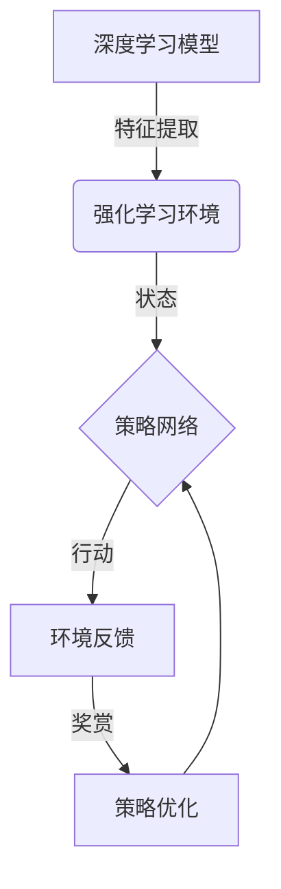

# AI人工智能深度学习算法：使用强化学习优化深度学习模型

## 1.背景介绍

深度学习作为机器学习的一个新兴热门领域,近年来取得了令人瞩目的进展,在计算机视觉、自然语言处理、语音识别等领域展现出了强大的能力。然而,传统的深度学习模型通常是基于监督学习训练而成,需要大量标注数据作为训练集,且模型的泛化能力和鲁棒性仍有待提高。为了解决这些问题,研究人员开始探索将强化学习与深度学习相结合,以优化和增强深度学习模型的性能。

强化学习是一种基于奖赏机制的学习范式,其目标是通过与环境进行交互,学习一种策略,使得在完成某项任务时能获得最大的累积奖赏。将强化学习与深度学习相结合,可以充分利用深度学习模型强大的特征提取和模式识别能力,同时借助强化学习的探索和决策优化能力,从而训练出更加鲁棒、泛化能力更强的智能系统。

### Mermaid 流程图:

## 2.核心概念与联系

### 2.1 深度学习

深度学习是机器学习的一个子领域,它基于具有多层非线性变换单元的人工神经网络,通过对大量数据的训练,学习数据的内在特征表示,从而解决复杂的任务。常见的深度学习模型包括卷积神经网络(CNN)、递归神经网络(RNN)、长短期记忆网络(LSTM)等。

### 2.2 强化学习

强化学习是一种基于奖赏机制的学习范式,其核心思想是通过与环境进行交互,根据获得的奖赏信号,不断优化策略,从而使累积奖赏最大化。强化学习主要包括四个核心要素:状态(State)、行动(Action)、奖赏(Reward)和策略(Policy)。

### 2.3 深度强化学习

深度强化学习是将深度学习与强化学习相结合的一种方法。在深度强化学习中,深度神经网络被用于近似策略函数或值函数,从而能够处理高维、连续的状态和行动空间,解决复杂的决策和控制问题。

常见的深度强化学习算法包括深度Q网络(DQN)、策略梯度(Policy Gradient)、Actor-Critic算法等。这些算法利用深度神经网络的强大表示能力,可以从原始输入(如图像、语音等)中直接学习策略或值函数,而无需手工设计特征工程。

## 3.核心算法原理具体操作步骤

### 3.1 深度Q网络(DQN)

深度Q网络是将Q学习与深度神经网络相结合的一种算法,它可以直接从原始输入(如图像)中学习Q值函数,而不需要手工设计特征。DQN的核心思想是使用一个深度神经网络来近似Q值函数,通过经验回放和目标网络两种技巧来提高训练的稳定性和效率。

DQN算法的具体步骤如下:

1. 初始化一个评估网络(Q网络)和一个目标网络(Target Network),两个网络的权重参数初始化相同。
2. 对于每一个时间步:
   - 根据当前状态 $s_t$ ,使用评估网络计算所有可能行动的Q值 $Q(s_t, a; \theta)$,并选择Q值最大的行动 $a_t$。
   - 执行选择的行动 $a_t$,观察到下一个状态 $s_{t+1}$ 和获得的奖赏 $r_t$。
   - 将转移过程 $(s_t, a_t, r_t, s_{t+1})$ 存储到经验回放池中。
   - 从经验回放池中随机采样一个批次的转移过程 $(s_j, a_j, r_j, s_{j+1})$。
   - 计算目标Q值:
     $$
     y_j = \begin{cases}
       r_j, & \text{if } s_{j+1} \text{ is terminal}\\
       r_j + \gamma \max_{a'} Q(s_{j+1}, a'; \theta^-), & \text{otherwise}
     \end{cases}
     $$
     其中 $\theta^-$ 表示目标网络的权重参数。
   - 使用均方误差损失函数优化评估网络的参数 $\theta$:
     $$
     L(\theta) = \mathbb{E}_{(s_j, a_j, r_j, s_{j+1}) \sim U(D)}\left[(y_j - Q(s_j, a_j; \theta))^2\right]
     $$
   - 每隔一定步数,将评估网络的权重参数复制到目标网络。

3. 重复步骤2,直到模型收敛。

### 3.2 策略梯度(Policy Gradient)

策略梯度是一种直接优化策略函数的深度强化学习算法。它使用一个深度神经网络来近似策略函数 $\pi_\theta(a|s)$,表示在状态 $s$ 下选择行动 $a$ 的概率。通过最大化期望的累积奖赏,可以直接优化策略网络的参数 $\theta$。

策略梯度算法的具体步骤如下:

1. 初始化一个策略网络 $\pi_\theta(a|s)$,其中 $\theta$ 表示网络的权重参数。
2. 对于每一个时间步:
   - 根据当前状态 $s_t$,从策略网络 $\pi_\theta(a|s_t)$ 中采样一个行动 $a_t$。
   - 执行选择的行动 $a_t$,观察到下一个状态 $s_{t+1}$ 和获得的奖赏 $r_t$。
   - 计算累积奖赏 $R_t = \sum_{i=t}^{T} \gamma^{i-t} r_i$,其中 $\gamma$ 是折现因子,用于权衡即时奖赏和未来奖赏的重要性。
   - 根据策略梯度定理,计算策略梯度:
     $$
     \nabla_\theta J(\theta) = \mathbb{E}_{\pi_\theta}\left[\sum_{t=0}^{T} \nabla_\theta \log \pi_\theta(a_t|s_t) R_t\right]
     $$
   - 使用策略梯度更新策略网络的参数 $\theta$。

3. 重复步骤2,直到模型收敛。

### 3.3 Actor-Critic算法

Actor-Critic算法是一种将策略梯度与值函数估计相结合的深度强化学习算法。它包含两个部分:Actor网络用于近似策略函数,Critic网络用于近似值函数。通过同时优化Actor和Critic网络,可以提高算法的稳定性和收敛速度。

Actor-Critic算法的具体步骤如下:

1. 初始化一个Actor网络 $\pi_\theta(a|s)$ 和一个Critic网络 $V_w(s)$,分别用于近似策略函数和值函数。
2. 对于每一个时间步:
   - 根据当前状态 $s_t$,从Actor网络 $\pi_\theta(a|s_t)$ 中采样一个行动 $a_t$。
   - 执行选择的行动 $a_t$,观察到下一个状态 $s_{t+1}$ 和获得的奖赏 $r_t$。
   - 计算TD误差:
     $$
     \delta_t = r_t + \gamma V_w(s_{t+1}) - V_w(s_t)
     $$
   - 使用TD误差更新Critic网络的参数 $w$,最小化均方误差:
     $$
     L_w = \mathbb{E}\left[\delta_t^2\right]
     $$
   - 根据策略梯度定理,计算Actor网络的策略梯度:
     $$
     \nabla_\theta J(\theta) = \mathbb{E}_{\pi_\theta}\left[\nabla_\theta \log \pi_\theta(a_t|s_t) A_t(s_t, a_t)\right]
     $$
     其中 $A_t(s_t, a_t)$ 是优势函数,表示在状态 $s_t$ 下选择行动 $a_t$ 相对于平均行为的优势。
   - 使用策略梯度更新Actor网络的参数 $\theta$。

3. 重复步骤2,直到模型收敛。

## 4.数学模型和公式详细讲解举例说明

### 4.1 马尔可夫决策过程(MDP)

强化学习问题通常被建模为马尔可夫决策过程(Markov Decision Process, MDP)。一个MDP可以用一个元组 $\langle\mathcal{S}, \mathcal{A}, \mathcal{P}, \mathcal{R}, \gamma\rangle$ 来表示,其中:

- $\mathcal{S}$ 是状态空间,表示可能的状态集合。
- $\mathcal{A}$ 是行动空间,表示在每个状态下可选择的行动集合。
- $\mathcal{P}$ 是状态转移概率函数,定义为 $\mathcal{P}_{ss'}^a = \mathbb{P}[S_{t+1}=s'|S_t=s, A_t=a]$,表示在状态 $s$ 下执行行动 $a$ 后,转移到状态 $s'$ 的概率。
- $\mathcal{R}$ 是奖赏函数,定义为 $\mathcal{R}_s^a = \mathbb{E}[R_{t+1}|S_t=s, A_t=a]$,表示在状态 $s$ 下执行行动 $a$ 后获得的期望奖赏。
- $\gamma \in [0, 1)$ 是折现因子,用于权衡即时奖赏和未来奖赏的重要性。

强化学习的目标是找到一个策略 $\pi: \mathcal{S} \rightarrow \mathcal{A}$,使得在遵循该策略时,从任意初始状态出发,能够最大化期望的累积奖赏:

$$
J(\pi) = \mathbb{E}_\pi\left[\sum_{t=0}^{\infty} \gamma^t R_t\right]
$$

其中 $R_t$ 是在时间步 $t$ 获得的奖赏。

### 4.2 Q-Learning

Q-Learning是一种基于值函数的强化学习算法,它直接估计在状态 $s$ 下执行行动 $a$ 后,能够获得的最大期望累积奖赏,即Q值函数 $Q(s, a)$。Q值函数可以通过下式进行迭代更新:

$$
Q(s_t, a_t) \leftarrow Q(s_t, a_t) + \alpha \left[r_t + \gamma \max_{a} Q(s_{t+1}, a) - Q(s_t, a_t)\right]
$$

其中 $\alpha$ 是学习率,用于控制更新步长。在Q值函数收敛后,最优策略 $\pi^*(s)$ 可以通过选择在每个状态 $s$ 下Q值最大的行动来获得:

$$
\pi^*(s) = \arg\max_a Q(s, a)
$$

### 4.3 策略梯度

策略梯度是一种基于策略的强化学习算法,它直接优化策略函数 $\pi_\theta(a|s)$,使得在遵循该策略时,期望的累积奖赏最大化。根据策略梯度定理,策略梯度可以表示为:

$$
\nabla_\theta J(\theta) = \mathbb{E}_{\pi_\theta}\left[\sum_{t=0}^{T} \nabla_\theta \log \pi_\theta(a_t|s_t) R_t\right]
$$

其中 $R_t = \sum_{i=t}^{T} \gamma^{i-t} r_i$ 是从时间步 $t$ 开始的累积奖赏。通过对策略网络的参数 $\theta$ 进行梯度上升,可以最大化期望的累积奖赏。

### 4.4 Actor-Critic算法

Actor-Critic算法将策略梯度与值函数估计相结合,包含两个部分:Actor网络用于近似策略函数,Critic网络用于近似值函数。Actor网络的策略梯度可以表示为:

$$
\nabla_\theta J(\theta) = \mathbb{E}_{\pi_\theta}\left[\nabla_\theta \log \pi_\theta(a_t|s_t) A_t(s_t, a_t)\right]
$$

其中 $A_t(s_t, a_t)$ 是优势函数,定义为:

$$
A_t(s_t,