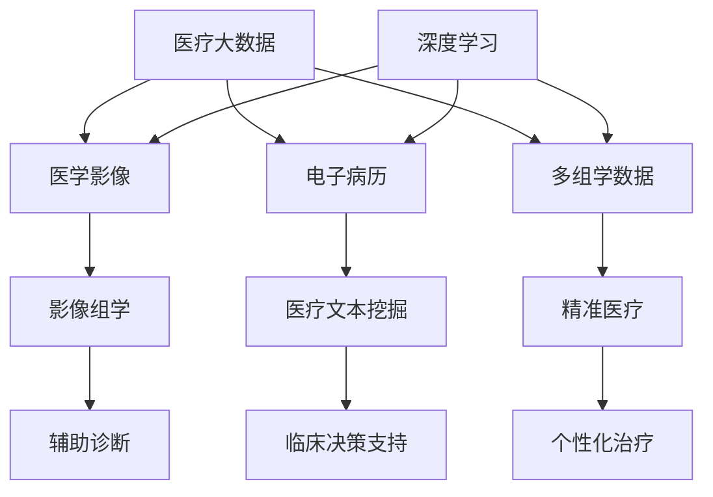

# AI人工智能深度学习算法：在健康医疗领域部署智能深度学习代理

## 1.背景介绍

人工智能(AI)技术的快速发展,尤其是深度学习算法的突破,正在深刻影响和改变着各行各业。医疗健康领域作为一个与人类生命健康息息相关的重要领域,近年来也开始广泛应用深度学习技术来辅助疾病诊断、药物研发、个性化治疗等方面。将深度学习算法应用于医疗健康领域,可以提高医疗诊断的准确性和效率,节省医疗资源,造福广大患者。

### 1.1 人工智能在医疗健康领域的应用现状

#### 1.1.1 医学影像分析

深度学习在医学影像分析中得到了广泛应用,如用于肺结节、乳腺癌、皮肤癌等疾病的影像学辅助诊断。一些研究表明,深度学习算法在某些医学影像分析任务上已经达到甚至超过了人类医生的水平。

#### 1.1.2 电子病历分析 

利用深度学习对电子病历进行自然语言处理和数据挖掘分析,可以快速准确地提取患者的临床信息,发现疾病相关因素,预测疾病风险,辅助临床决策。

#### 1.1.3 药物研发

深度学习可以应用于药物虚拟筛选、药物-靶点相互作用预测、新药设计等药物研发环节,加速新药研发进程,降低研发成本。

#### 1.1.4 精准医疗

深度学习可以整合分析患者的基因组、蛋白组、代谢组等多组学数据,发现疾病的分子机制,预测患者对药物的响应,实现个性化精准治疗。

### 1.2 深度学习在医疗健康领域面临的挑战

尽管深度学习在医疗领域展现了广阔的应用前景,但同时也面临着一些挑战:

#### 1.2.1 医疗数据的获取和标注

深度学习需要大量高质量的数据进行训练,而医疗数据往往难以获取,且需要专业医生进行标注,耗时耗力。

#### 1.2.2 模型的可解释性

作为辅助医疗决策的工具,深度学习模型需要具备一定的可解释性,让医生能够理解其决策依据。而深度学习模型因其"黑盒"特性,可解释性有待加强。

#### 1.2.3 医疗场景的复杂性

疾病的发生发展往往受到多种因素的影响,医疗场景错综复杂。如何让深度学习模型很好地建模这些复杂场景,是一大挑战。

#### 1.2.4 临床应用转化

如何让深度学习技术真正应用于临床实践,获得医生和患者的信任,通过严格的临床试验和监管,也是一个关键问题。

## 2.核心概念与联系

在医疗健康领域应用深度学习,涉及到以下几个核心概念:

### 2.1 深度学习

深度学习是机器学习的一个分支,它模仿人脑的神经网络结构,构建多层次的学习网络,可以从大量数据中自动学习高层次的特征表示。常见的深度学习模型包括卷积神经网络(CNN)、循环神经网络(RNN)、生成对抗网络(GAN)等。

### 2.2 医学影像

医学影像泛指利用各种成像技术获取人体内部结构与功能的图像,如X射线、CT、MRI、PET等。医学影像蕴含着丰富的解剖结构和病理信息。将深度学习应用于医学影像分析,可以自动化提取这些信息,辅助疾病诊断。

### 2.3 电子病历

电子病历(Electronic Health Record)是以数字化方式存储的患者诊疗信息的总和,包括人口学信息、生命体征、症状、诊断、检验检查、用药等结构化或非结构化的数据。深度学习可以用于电子病历的自然语言处理、信息抽取、疾病风险预测等任务。

### 2.4 多组学数据

多组学数据指从基因组、转录组、蛋白组、代谢组等不同层面采集的生物分子数据。深度学习可以整合分析多组学数据,揭示疾病发生发展的分子机制,发现疾病标志物和药物新靶点,实现精准医疗。

### 2.5 医疗大数据

医疗大数据泛指医疗健康领域海量、异构、快速增长的数据,涵盖了医学影像、电子病历、多组学、可穿戴设备等多个来源。深度学习需要利用医疗大数据进行训练,从而不断提升其性能。

下图展示了这些核心概念之间的联系:

从图中可以看出,医疗大数据为深度学习提供了丰富的训练数据,包括医学影像、电子病历、多组学数据等。深度学习可以从这些异构数据中学习表示,分别服务于影像组学、医疗文本挖掘、精准医疗等任务,最终实现辅助诊断、临床决策支持、个性化治疗等医疗应用。

## 3.核心算法原理具体操作步骤

本节将介绍医疗健康领域常用的几种深度学习算法的原理和操作步骤,包括用于医学影像分析的卷积神经网络(CNN)、用于电子病历处理的循环神经网络(RNN)、以及用于多组学数据整合的多模态深度学习。

### 3.1 卷积神经网络(CNN)在医学影像分析中的应用

卷积神经网络是一种基于卷积运算的深度前馈神经网络,特别适合处理网格拓扑结构的数据,如图像。将CNN应用于医学影像分析的一般步骤如下:

#### 3.1.1 数据准备

收集相关医学影像数据,并进行必要的预处理,如图像归一化、数据增强等。将数据划分为训练集、验证集和测试集。

#### 3.1.2 网络构建 

根据任务需求设计CNN网络结构,如经典的LeNet、AlexNet、VGGNet、GoogLeNet、ResNet等。或在这些经典结构的基础上进行改进,以适应特定医学影像任务。

#### 3.1.3 模型训练

利用训练集数据对CNN模型进行训练,通过前向传播计算损失函数,再通过反向传播更新网络参数。常用的优化算法包括随机梯度下降(SGD)及其变体。

#### 3.1.4 模型评估

利用验证集数据对训练好的模型进行评估,根据评估结果进行超参数调优,如调整学习率、正则化参数等。再用测试集数据进行最终评估,计算准确率、敏感性、特异性、ROC曲线等评价指标。

#### 3.1.5 模型应用

将训练好的模型部署到实际的医疗系统中,对新的医学影像进行预测和分析,辅助医生进行诊断。

### 3.2 循环神经网络(RNN)在电子病历处理中的应用

循环神经网络是一种适合处理序列数据的神经网络,可以建模任意长度的序列信息。将RNN应用于电子病历自然语言处理的一般步骤如下:

#### 3.2.1 数据准备

收集电子病历文本数据,并进行必要的预处理,如分词、去除停用词、数据清洗等。将文本转换为数值序列表示,如one-hot编码或word embedding。

#### 3.2.2 网络构建

根据任务需求设计RNN网络结构,如经典的Vanilla RNN、LSTM、GRU等。对于不同的任务如命名实体识别、关系抽取、文本分类等,还需在RNN结构的基础上添加相应的层。

#### 3.2.3 模型训练

利用训练集数据对RNN模型进行训练,通过前向传播计算损失函数,再通过反向传播更新网络参数。对于梯度消失问题,可使用梯度裁剪等技术。

#### 3.2.4 模型评估

利用验证集数据对训练好的模型进行评估和超参数调优。再用测试集数据进行最终评估,计算准确率、召回率、F1值等评价指标。

#### 3.2.5 模型应用

将训练好的模型应用于电子病历的信息抽取、疾病分类等任务,提取结构化的临床信息,服务于临床决策支持等应用。

### 3.3 多模态深度学习在多组学数据整合中的应用

多模态深度学习可以同时学习多种异构数据的表示,发现它们之间的关联。将多模态深度学习应用于多组学数据整合的一般步骤如下:

#### 3.3.1 数据准备

收集多种组学数据,如基因表达谱、DNA甲基化谱、蛋白质组数据等。对每种数据进行质控和标准化。

#### 3.3.2 网络构建

为每种组学数据构建一个独立的特征提取子网络,如MLP、CNN、AutoEncoder等。再将各子网络提取的特征进行融合,送入后续的预测网络。融合策略可以是简单的拼接,或使用注意力机制等。

#### 3.3.3 模型训练

联合训练多个子网络和顶层预测网络,通过反向传播调整各子网络参数。也可以先对各子网络进行预训练,再进行微调。

#### 3.3.4 模型评估 

利用验证集数据进行超参数调优,如各子网络的层数、神经元数等。用测试集数据评估模型性能,计算相关指标。

#### 3.3.5 模型应用

利用训练好的多模态深度学习模型,对新的多组学数据进行预测,如疾病诊断、预后预测、药物反应预测等,为精准医疗提供支持。

## 4.数学模型和公式详细讲解举例说明

本节将详细讲解深度学习中的一些关键数学模型和公式,并给出具体的例子说明。

### 4.1 前向传播与损失函数

前向传播是指将输入数据通过神经网络的各层进行计算,得到输出。以一个简单的三层全连接网络为例:

假设输入为$x$,第一层权重为$W_1$,偏置为$b_1$,激活函数为$f_1$,则第一层输出为:

$$a_1 = f_1(W_1x + b_1)$$

类似地,第二层输出为:

$$a_2 = f_2(W_2a_1 + b_2)$$

最后,输出层(第三层)的输出为:

$$\hat{y} = f_3(W_3a_2 + b_3)$$

其中$\hat{y}$为网络的预测输出。

然后,定义一个损失函数来衡量预测输出与真实标签之间的差异。以二分类任务为例,常用的损失函数是交叉熵损失:

$$Loss = -[y\log(\hat{y}) + (1-y)\log(1-\hat{y})]$$

其中$y$为真实标签(0或1)。

### 4.2 反向传播与梯度下降

反向传播是指计算损失函数对各层参数的梯度,并根据梯度更新参数以最小化损失函数。以上面的三层网络为例,假设损失函数为$L$,则:

首先,计算损失函数对输出层的梯度:

$$\frac{\partial L}{\partial \hat{y}} = \frac{\hat{y} - y}{\hat{y}(1-\hat{y})}$$

然后,逐层反向传播计算梯度。对于第三层的权重$W_3$和偏置$b_3$:

$$\frac{\partial L}{\partial W_3} = \frac{\partial L}{\partial \hat{y}} \cdot \frac{\partial \hat{y}}{\partial W_3} = \frac{\partial L}{\partial \hat{y}} \cdot f_3'(W_3a_2 + b_3) \cdot a_2^T$$