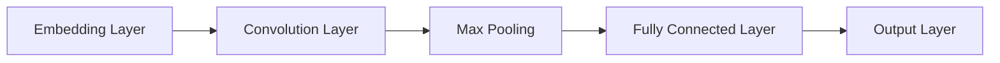
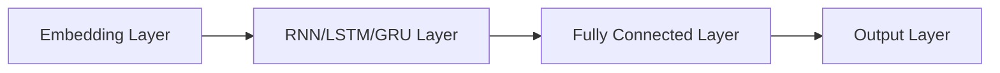
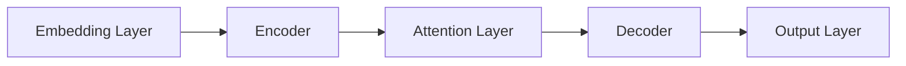
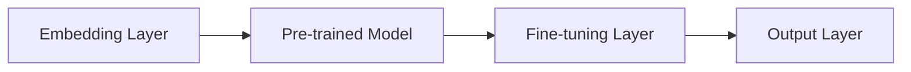

# AI人工智能深度学习算法：在垃圾短信检测中的应用

## 1.背景介绍

### 1.1 垃圾短信的危害

随着移动通信技术的快速发展,短信作为一种便捷的通信方式被广泛使用。然而,垃圾短信的泛滥也给人们的生活带来了诸多困扰。垃圾短信不仅骚扰用户,还可能传播病毒、诈骗信息,严重者甚至威胁到用户的隐私和财产安全。因此,有效识别和过滤垃圾短信成为当前亟需解决的问题。

### 1.2 传统过滤方法的局限性

传统的垃圾短信过滤方法主要依赖于关键词匹配、发件人黑名单等手段。这些方法虽然简单直观,但存在一些明显缺陷:

1. 无法有效应对变种垃圾短信,如使用同音字、拼写变形等规避关键词检测。
2. 维护黑名单工作量大,难以及时更新。
3. 缺乏上下文语义理解能力,过滤准确率不高。

因此,需要一种更智能、更高效的垃圾短信检测方法来应对日益复杂的垃圾短信形式。

## 2.核心概念与联系

### 2.1 深度学习概述

深度学习(Deep Learning)是机器学习的一个新的研究热点,它模仿人脑的机制来解释数据,如图像、声音和文本等。深度学习可以从原始数据中自动学习特征表示,无需人工设计特征,从而在许多领域展现出优于传统机器学习方法的性能。

### 2.2 文本分类任务

垃圾短信检测本质上是一个文本分类任务,即根据短信文本内容将其分为垃圾短信和正常短信两类。文本分类一直是自然语言处理领域的一个核心问题,传统方法主要基于统计特征和机器学习算法,如朴素贝叶斯、支持向量机等。

### 2.3 深度学习在文本分类中的应用

近年来,深度学习在文本分类任务中取得了卓越的成绩。与传统方法相比,深度学习模型能够自动学习文本的语义表示,捕捉更高层次的上下文特征,从而提高分类性能。常用的深度学习文本分类模型包括:

- 卷积神经网络(CNN)
- 循环神经网络(RNN)
- 长短期记忆网络(LSTM)
- 门控循环单元(GRU)
- 注意力机制(Attention)
- 预训练语言模型(ELMo、BERT等)

这些模型在垃圾短信检测任务中也有广泛的应用。

## 3.核心算法原理具体操作步骤

### 3.1 数据预处理

在应用深度学习模型之前,需要对原始短信文本数据进行适当的预处理,主要包括以下步骤:

1. **去除无用字符**:移除短信中的标点符号、数字、特殊字符等无用信息。
2. **分词**:将短信文本按字、词或字符序列等粒度进行分词,得到分词序列。
3. **建立词表**:统计语料库中的词频,构建词表(vocabulary),将每个词映射为一个唯一的数字索引。
4. **填充和截断**:由于深度学习模型要求输入序列长度固定,需要对过长的序列进行截断,对过短的序列进行填充。
5. **编码**:将分词序列转换为数字索引序列,作为深度学习模型的输入。

### 3.2 词向量表示

在深度学习中,通常将词映射为连续的低维密集向量,即词向量(Word Embedding),而不是传统的离散的一热编码表示。常用的词向量表示方法有:

1. **Word2Vec**(CBOW和Skip-gram)
2. **GloVe**(Global Vectors for Word Representation)
3. **FastText**

这些方法能够捕捉词与词之间的语义和句法关系,为深度学习模型提供更好的词表示形式。

### 3.3 模型架构

根据任务需求,可以选择不同的深度学习模型架构。以下是一些常用的文本分类模型:

1. **CNN文本分类模型**

CNN模型能够有效捕捉局部特征,常用于短文本分类任务。

2. **RNN/LSTM/GRU文本分类模型**

RNN及其变体能够捕捉序列数据的长期依赖关系,适用于长文本分类。

3. **Attention文本分类模型**

Attention机制能够自动学习文本中重要特征的权重分布,提高模型性能。

4. **BERT等预训练语言模型**

基于大规模语料预训练的语言模型(如BERT)能够捕捉更丰富的语义信息,在下游任务中通过微调获得优异性能。

### 3.4 模型训练

对于监督学习任务,通常将数据集分为训练集、验证集和测试集。在训练阶段,模型根据训练数据不断更新参数,目标是最小化损失函数(如交叉熵损失)。常用的优化算法包括SGD、Adam等。同时,需要对模型进行正则化(如L1/L2正则、Dropout等)以防止过拟合。验证集用于模型选择和超参数调优,测试集用于评估最终模型的泛化性能。

### 3.5 模型评估

评估指标是衡量模型性能的重要标准。对于垃圾短信检测这一二分类任务,常用的评估指标包括:

- 准确率(Accuracy)
- 精确率(Precision)
- 召回率(Recall)
- F1分数

此外,也可以绘制ROC曲线和计算AUC值,综合考虑模型的分类能力。

## 4.数学模型和公式详细讲解举例说明

### 4.1 词向量表示

词向量是将词映射到低维连续向量空间的分布式表示方法。常用的词向量表示模型是Word2Vec,包括两种训练方法:CBOW和Skip-gram。

1. **CBOW**(Continuous Bag-of-Words)

CBOW模型的目标是基于上下文词预测目标词。给定上下文词集合$C=\{w_{t-n},...,w_{t-1},w_{t+1},...,w_{t+n}\}$,模型需要最大化目标词$w_t$的条件概率:

$$P(w_t|C)=\frac{e^{v_{w_t}^{\top}v_C}}{\sum_{w\in V}e^{v_w^{\top}v_C}}$$

其中$v_w$和$v_C$分别表示词$w$和上下文$C$的向量表示,$V$是词表。

2. **Skip-gram**

与CBOW相反,Skip-gram模型的目标是基于目标词预测上下文词。给定目标词$w_t$,模型需要最大化上下文词$w_{t+j}$的条件概率:

$$P(w_{t+j}|w_t)=\frac{e^{v_{w_{t+j}}^{\top}v_{w_t}}}{\sum_{w\in V}e^{v_w^{\top}v_{w_t}}}$$

其中$j$是上下文窗口大小。

上述两种模型通过梯度下降算法和负采样技术进行参数估计,得到词向量表示。

### 4.2 卷积神经网络

卷积神经网络(CNN)是一种常用的深度学习模型,在计算机视觉领域表现出色。CNN也可以应用于文本分类任务,能够有效捕捉局部特征。

对于一个长度为$n$的句子$S=\{w_1,w_2,...,w_n\}$,我们首先将每个词$w_i$映射为词向量$x_i\in\mathbb{R}^k$,得到词向量矩阵$X\in\mathbb{R}^{n\times k}$。然后,卷积层对$X$进行卷积操作:

$$c_i=f(W\cdot x_{i:i+h-1}+b)$$

其中$W\in\mathbb{R}^{hk}$是卷积核权重,$b\in\mathbb{R}$是偏置项,$f$是非线性激活函数(如ReLU),$h$是卷积核大小。通过对$X$进行多个卷积核的卷积操作,可以捕捉不同尺度的特征。

卷积后,通常使用最大池化层对卷积特征进行下采样,得到固定长度的特征向量。最后,将这些特征向量输入到全连接层,经过非线性变换和softmax归一化,即可得到文本的类别概率输出。

### 4.3 长短期记忆网络

长短期记忆网络(LSTM)是一种常用的循环神经网络(RNN)变体,能够有效捕捉长期依赖关系,在序列建模任务中表现优异。LSTM通过设计特殊的门控机制,解决了传统RNN存在的梯度消失和梯度爆炸问题。

对于一个长度为$n$的句子$S=\{x_1,x_2,...,x_n\}$,其中$x_t$是第$t$个词的词向量表示,LSTM在时间步$t$的计算过程为:

$$\begin{aligned}
f_t&=\sigma(W_f\cdot[h_{t-1},x_t]+b_f)&&\text{(forget gate)}\\
i_t&=\sigma(W_i\cdot[h_{t-1},x_t]+b_i)&&\text{(input gate)}\\
o_t&=\sigma(W_o\cdot[h_{t-1},x_t]+b_o)&&\text{(output gate)}\\
c_t&=f_t\odot c_{t-1}+i_t\odot\tanh(W_c\cdot[h_{t-1},x_t]+b_c)&&\text{(cell state)}\\
h_t&=o_t\odot\tanh(c_t)&&\text{(hidden state)}
\end{aligned}$$

其中$\sigma$是sigmoid函数,$\odot$是元素wise乘积,${f_t,i_t,o_t}$分别是遗忘门、输入门和输出门,控制着信息的流动。${c_t,h_t}$分别是单元状态和隐藏状态。通过门控机制,LSTM能够很好地捕捉长期依赖关系,同时避免梯度消失或爆炸。

在文本分类任务中,我们可以将LSTM的最终隐藏状态$h_n$输入到全连接层,得到文本的类别概率输出。

### 4.4 注意力机制

注意力机制(Attention)是一种重要的深度学习模型组件,能够自动学习输入序列中不同位置特征的重要性权重,从而提高模型性能。

对于一个长度为$n$的句子$S=\{x_1,x_2,...,x_n\}$,其中$x_t$是第$t$个词的词向量表示,注意力机制首先计算注意力权重:

$$\alpha_t=\frac{\exp(e_t)}{\sum_{j=1}^n\exp(e_j)},\quad e_t=\text{score}(h_t,q)$$

其中$h_t$是第$t$个位置的隐藏状态(可以是RNN、LSTM等模型的隐藏状态),$q$是查询向量,score函数可以是加性或乘性形式。

然后,根据注意力权重$\alpha_t$对隐藏状态进行加权求和,得到句子的表示向量:

$$s=\sum_{t=1}^n\alpha_th_t$$

最后,将$s$输入到全连接层,即可得到文本的类别概率输出。

注意力机制能够自动分配不同位置特征的权重,使模型更加关注重要的部分,提高了模型的表达能力和解释性。

## 5.项目实践:代码实例和详细解释说明

在这一部分,我们将通过一个基于Pytorch的实例项目,演示如何使用深度学习模型进行垃圾短信检测。完整的代码可以在[这里](https://github.com/username/spam-detection)找到。

### 