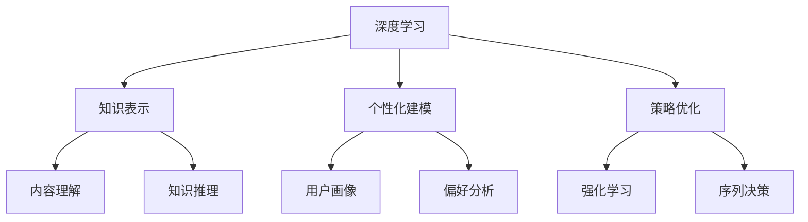
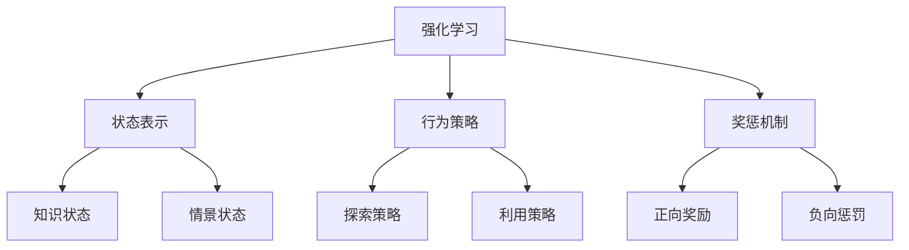
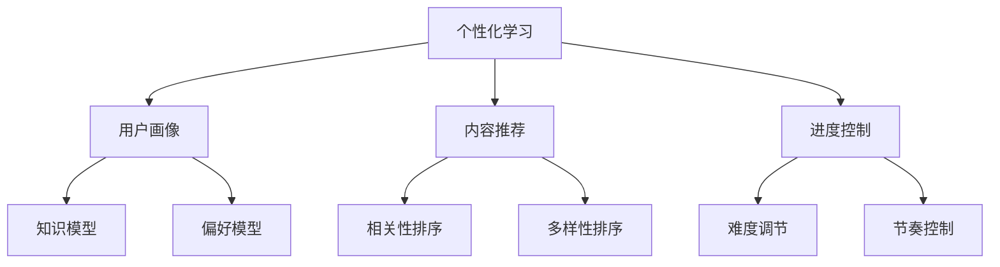
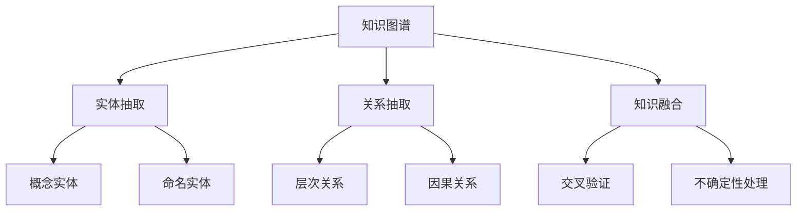
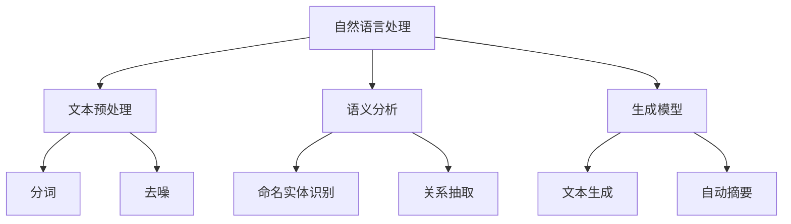

# AI人工智能深度学习算法：在教育培训中运用自主学习代理

## 1.背景介绍

### 1.1 教育培训面临的挑战

在当今快节奏的数字时代,教育培训行业面临着前所未有的挑战。传统的教学模式已经难以满足学习者日益增长的个性化需求,同时也无法适应知识更新的快速迭代。此外,教师的工作负担加重,教学质量参差不齐,资源分配不均等问题也日益突出。因此,迫切需要一种创新的教育模式来应对这些挑战。

### 1.2 人工智能在教育中的作用

人工智能(AI)技术在教育领域的应用为解决上述问题提供了新的契机。AI系统能够通过大数据分析和机器学习算法,了解学习者的知识结构、学习能力和偏好,从而提供个性化的学习资源和路径。同时,AI也可以减轻教师的工作负担,提高教学效率,并促进教育资源的优化配置。

### 1.3 自主学习代理的概念

自主学习代理(Autonomous Learning Agent)是一种基于人工智能的智能系统,它能够根据学习者的需求自主地获取知识、制定学习策略并持续优化学习过程。这种代理通过深度学习等算法,模拟人类的学习过程,从而实现高效、个性化的学习体验。

## 2.核心概念与联系

### 2.1 深度学习

深度学习(Deep Learning)是机器学习的一个新兴热点领域,它通过对数据进行表征学习,捕捉数据的高阶抽象特征,从而实现有效的模式识别和决策功能。在自主学习代理中,深度学习算法被广泛应用于知识表示、个性化建模和策略优化等环节。

### 2.2 强化学习

强化学习(Reinforcement Learning)是机器学习的另一个重要分支,它通过与环境的交互,学习如何在给定情况下采取最优行动,以最大化预期的累积回报。在自主学习代理中,强化学习算法被用于制定个性化的学习策略,根据学习者的表现动态调整学习路径和内容。

### 2.3 个性化学习

个性化学习(Personalized Learning)是自主学习代理的核心目标之一。通过分析学习者的数据,构建个性化用户画像,代理可以为每个学习者量身定制最合适的学习内容、进度和方式,从而提高学习效率和体验。

### 2.4 知识图谱

知识图谱(Knowledge Graph)是一种结构化的知识表示形式,它将知识以实体和关系的形式组织起来,形成一个语义网络。在自主学习代理中,知识图谱被用于建模学科知识,支持知识推理和内容生成等功能。

### 2.5 自然语言处理

自然语言处理(Natural Language Processing, NLP)是人工智能的一个重要分支,旨在使计算机能够理解和生成人类语言。在自主学习代理中,NLP技术被广泛应用于内容理解、语义分析、问答系统和自动评估等环节。

上述这些核心概念相互关联、相辅相成,共同构建了自主学习代理的技术框架。深度学习为代理提供了强大的数据驱动能力;强化学习赋予了代理制定最优策略的能力;个性化学习实现了因材施教的目标;知识图谱和自然语言处理则为代理提供了对知识和语言的理解和生成能力。只有将这些技术有机结合,才能构建出真正智能化的自主学习代理系统。

## 3.核心算法原理具体操作步骤

### 3.1 深度知识跟踪

深度知识跟踪(Deep Knowledge Tracing, DKT)是一种基于循环神经网络的算法,用于模拟和预测学习者对知识概念的掌握情况。其核心思想是将学习过程建模为一个序列,并利用RNN等深度学习模型来捕捉知识状态的动态演化规律。

DKT算法的具体操作步骤如下:

1. **数据预处理**:将学习记录数据转换为序列格式,每个时间步对应一个学习交互,包括练习的知识概念、学习者的回答是否正确等信息。

2. **输入向量化**:将每个知识概念和学习者的回答编码为一维向量,作为RNN的输入。

3. **RNN模型训练**:使用编码后的序列数据训练RNN模型,目标是最小化模型在每个时间步对学习者知识状态的预测误差。

4. **知识状态更新**:在每个时间步,RNN模型根据当前输入和上一个隐藏状态,计算出当前的隐藏状态,作为对学习者知识状态的编码和预测。

5. **模型微调**:可以根据具体的教育场景,对DKT模型的损失函数、正则化策略等进行微调,以提高预测的准确性和泛化能力。

6. **知识跟踪与反馈**:利用训练好的DKT模型,实时跟踪学习者对每个知识点的掌握情况,并根据预测结果为学习者提供适当的学习资源和反馈。

DKT算法的优势在于能够自动捕捉知识概念之间的依赖关系,并动态地预测学习者的知识状态,为个性化的教学策略提供了重要的依据。

### 3.2 深度强化学习

深度强化学习(Deep Reinforcement Learning, DRL)是将深度学习技术应用于强化学习问题的一种方法。在自主学习代理中,DRL算法被用于制定个性化的学习策略,根据学习者的表现动态调整学习路径和内容。

DRL算法的具体操作步骤如下:

1. **状态表示**:将学习者的知识状态、情境因素等信息编码为状态向量,作为强化学习环境的输入。

2. **策略网络**:使用深度神经网络(如DQN、A3C等)来表示策略,即在给定状态下选择行动(如推荐知识点、调整难度等)的概率分布。

3. **环境交互**:智能代理根据当前状态,通过策略网络选择一个行动,并将行动施加到学习环境中。环境会根据行动的效果,返回新的状态和奖惩信号。

4. **经验存储与采样**:将代理与环境的交互记录存储在经验回放池中,并从中采样出小批量的转移样本,用于训练策略网络。

5. **策略优化**:通过优化算法(如Q-learning、策略梯度等)来最小化长期累积奖惩的负值,从而使策略网络逐步收敛到最优策略。

6. **策略执行**:利用训练好的策略网络,为每个学习者实时生成个性化的学习策略,指导学习者的后续学习行为。

与传统的强化学习方法相比,DRL算法的优势在于能够直接从原始的高维状态数据中学习策略,而不需要人工设计状态特征。这使得DRL在处理复杂的教育场景时具有更强的适用性和泛化能力。

### 3.3 对抗生成网络

对抗生成网络(Generative Adversarial Networks, GANs)是一种基于深度学习的生成模型,可以被用于自主学习代理中的内容生成和个性化建模等任务。

GANs算法的具体操作步骤如下:

1. **生成器初始化**:首先初始化一个生成器网络G,它将一个随机噪声向量z作为输入,输出一个样本数据(如文本、图像等)。

2. **判别器初始化**:同时初始化一个判别器网络D,它将真实数据或生成器输出的数据作为输入,并输出一个标量,表示输入数据是真实的还是生成的。

3. **对抗训练**:生成器G和判别器D通过下述方式进行对抗训练:
   - 固定生成器G,仅训练判别器D,使其能够较好地区分真实数据和生成数据。
   - 固定判别器D,训练生成器G,使其生成的数据能够愚弄判别器D,被判断为真实数据。

4. **损失函数**:生成器G和判别器D的损失函数定义如下:
   - 判别器损失:最小化对真实数据的判别误差和对生成数据的判别误差。
   - 生成器损失:最大化判别器对生成数据的判别误差,使生成数据被判断为真实。

5. **梯度下降**:使用梯度下降等优化算法,交替地最小化判别器损失和生成器损失,促使二者在对抗过程中共同提升。

6. **内容生成与个性化建模**:当GANs模型收敛后,可以利用训练好的生成器网络G,根据特定的输入噪声或条件,生成个性化的学习内容或用户画像。

GANs算法的优势在于能够通过对抗训练的方式,捕捉真实数据的分布特征,从而生成高质量、多样化的内容。在教育领域,GANs可以被用于自动生成练习题目、个性化学习路径等,为学习者提供更加丰富的学习资源。

### 3.4 注意力机制

注意力机制(Attention Mechanism)是一种用于加权融合不同特征信息的技术,在自主学习代理中可以应用于知识表示、个性化建模等任务。

注意力机制的具体操作步骤如下:

1. **特征提取**:首先使用诸如CNN、RNN等深度学习模型,从原始数据(如文本、图像等)中提取出相关的特征向量序列。

2. **特征编码**:将提取出的特征向量序列输入到编码器网络(如LSTM等),获得对应的编码向量序列。

3. **注意力计算**:对于每个解码时间步,计算查询向量(来自解码器状态)与所有编码向量的相似性分数,作为注意力权重。

4. **加权求和**:使用注意力权重对编码向量序列进行加权求和,得到当前时间步的注意力向量。

5. **解码输出**:将注意力向量与解码器状态进行融合,产生最终的解码输出(如文本生成、分类等)。

6. **模型训练**:使用监督学习或强化学习等方法,根据任务目标优化模型参数。

注意力机制的关键在于,它能够自适应地为不同的特征赋予不同的权重,从而提高模型对重要特征的关注程度。在教育场景中,注意力机制可以用于捕捉学习者的知识偏好、学习行为模式等个性化特征,为智能教学提