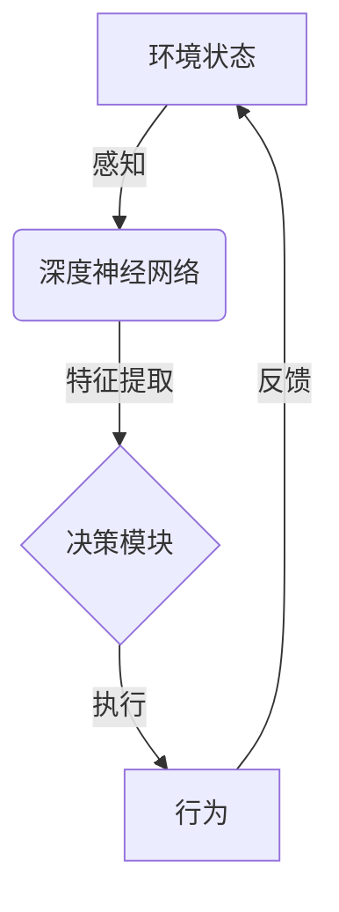

# AI人工智能深度学习算法：智能深度学习代理在电子商务中的应用策略

## 1.背景介绍

### 1.1 电子商务的发展与挑战

随着互联网和移动互联网技术的飞速发展,电子商务已经成为当今社会不可或缺的一部分。根据统计数据显示,2022年全球电子商务市场规模已经超过5万亿美元,预计未来几年将保持两位数的年增长率。电子商务的蓬勃发展为消费者带来了极大的便利,但与此同时也面临着一些新的挑战。

其中最主要的挑战包括:

1. **信息过载**:网上商品种类繁多,消费者很难从海量信息中找到自己真正需要的商品。
2. **个性化推荐**:不同消费者有着不同的需求和偏好,如何为每个用户推荐合适的商品是一个巨大的挑战。
3. **用户体验优化**:优秀的用户体验对于留住用户至关重要,如何优化用户体验以提高用户粘性是电商平台需要解决的难题。

### 1.2 人工智能在电子商务中的应用

为了应对上述挑战,人工智能技术应运而生并在电子商务领域得到了广泛应用。其中,深度学习作为人工智能的一个重要分支,因其强大的数据处理和模式识别能力而备受关注。智能深度学习代理正是将深度学习技术应用于电子商务场景的一种有效方式。

## 2.核心概念与联系

### 2.1 深度学习概述

深度学习(Deep Learning)是机器学习的一个新的研究方向,它模仿人脑的机制来解释数据,例如图像、声音和文本等。深度学习通过对数据的特征进行自动提取和模式分析,从而实现对数据的高效处理和智能决策。

深度学习的核心是由多层神经网络组成的深度神经网络(Deep Neural Network),每一层对数据进行特征提取和转换,并将结果传递给下一层,最终得到高层次的特征表示。常见的深度学习模型包括卷积神经网络(CNN)、递归神经网络(RNN)、长短期记忆网络(LSTM)等。

### 2.2 智能代理概念

智能代理(Intelligent Agent)是人工智能领域的一个重要概念,指能够感知环境,并根据环境状态做出合理行为以完成特定目标的系统。智能代理需要具备以下几个基本功能:

1. **感知能力**:感知环境状态
2. **决策能力**:根据感知到的环境状态做出合理决策
3. **行为能力**:执行决策所确定的行为

智能代理可以应用于各种场景,如机器人控制、游戏AI、个性化推荐等。

### 2.3 智能深度学习代理

智能深度学习代理是将深度学习技术与智能代理理论相结合的产物。它利用深度神经网络对环境状态进行感知和特征提取,并基于提取到的特征做出决策和执行相应的行为。

在电子商务场景中,智能深度学习代理可以对用户行为数据进行分析,感知用户的偏好和需求,并做出个性化的商品推荐、定制营销策略等决策,从而优化用户体验,提高商品销量。



## 3.核心算法原理具体操作步骤  

智能深度学习代理在电子商务中的应用,主要包括以下几个核心步骤:

### 3.1 数据采集与预处理

首先需要收集用户行为数据,包括浏览记录、购买记录、评论数据等。这些原始数据通常是非结构化的,需要进行数据清洗、标注和特征工程等预处理,将其转化为深度学习模型可以接受的结构化数据格式。

### 3.2 构建深度学习模型

根据具体的应用场景,选择合适的深度学习模型架构,如卷积神经网络用于图像识别,循环神经网络用于文本处理等。并根据数据的特点对模型进行调优,设计合理的网络结构、超参数和训练策略。

常用的深度学习框架包括TensorFlow、PyTorch、Keras等。

### 3.3 模型训练

利用预处理后的数据对深度学习模型进行训练,使模型能够从数据中自动提取特征,并学习到用户行为的潜在模式。训练过程中需要进行模型评估,根据评估指标如准确率、损失函数等调整模型参数,使模型达到最优性能。

### 3.4 模型部署与决策

将训练好的深度学习模型集成到智能代理系统中,对用户的实时行为进行感知和特征提取。基于提取到的特征,代理系统通过决策模块做出相应的决策,如个性化商品推荐、营销策略调整等,并将决策执行对应的行为。

### 3.5 系统优化迭代 

通过分析用户对决策行为的反馈,如购买转化率、用户留存率等指标,对模型和决策策略进行持续优化,形成闭环的迭代过程,不断提高系统的决策质量和用户体验。

## 4.数学模型和公式详细讲解举例说明

### 4.1 深度神经网络模型

深度神经网络是深度学习的核心模型,它由多个神经元层组成,每一层对输入数据进行非线性变换,并将结果传递给下一层。最终输出层给出对输入数据的预测或决策结果。

一个典型的全连接神经网络可以用以下数学模型表示:

$$
\begin{aligned}
z^{(l)} &= W^{(l)}a^{(l-1)} + b^{(l)} \\
a^{(l)} &= \sigma(z^{(l)})
\end{aligned}
$$

其中:
- $a^{(l)}$ 表示第 $l$ 层的激活值向量
- $z^{(l)}$ 表示第 $l$ 层的加权输入
- $W^{(l)}$ 表示第 $l$ 层的权重矩阵
- $b^{(l)}$ 表示第 $l$ 层的偏置向量
- $\sigma$ 表示激活函数,如 ReLU、Sigmoid 等

通过反向传播算法,可以计算出每一层权重矩阵 $W^{(l)}$ 和偏置向量 $b^{(l)}$ 的梯度,并使用优化算法如梯度下降法不断调整参数,使模型在训练数据上的损失函数最小化,从而获得最优的模型参数。

### 4.2 推荐系统中的协同过滤算法

协同过滤(Collaborative Filtering)是推荐系统中常用的算法,它利用用户之间的相似性或者物品之间的相似性来进行推荐。以基于用户的协同过滤为例,其核心思想是:对于目标用户 $u$,找到与其兴趣相似的其他用户集合 $N(u)$,然后根据这些相似用户对物品 $i$ 的评分,预测目标用户 $u$ 对物品 $i$ 的评分:

$$
\hat{r}_{ui} = \overline{r}_u + \frac{\sum\limits_{v \in N(u)}(r_{vi} - \overline{r}_v)w(u,v)}{\sum\limits_{v \in N(u)}|w(u,v)|}
$$

其中:
- $\hat{r}_{ui}$ 表示对用户 $u$ 对物品 $i$ 的预测评分
- $\overline{r}_u$ 表示用户 $u$ 的平均评分
- $r_{vi}$ 表示相似用户 $v$ 对物品 $i$ 的评分
- $\overline{r}_v$ 表示相似用户 $v$ 的平均评分
- $w(u,v)$ 表示用户 $u$ 和 $v$ 之间的相似度权重

通过计算目标用户对所有物品的预测评分,可以得到一个排序的推荐列表。

### 4.3 深度学习在推荐系统中的应用

传统的协同过滤算法只利用了用户对物品的评分数据,而深度学习模型可以同时利用用户的其他行为数据,如浏览记录、购买记录等,从而提高推荐的准确性。

以基于神经协同过滤(Neural Collaborative Filtering, NCF)模型为例,它将用户 $u$ 和物品 $i$ 的一维ID嵌入到低维的向量空间中,得到用户向量 $\vec{u}$ 和物品向量 $\vec{i}$,然后通过神经网络对两个向量进行非线性变换,得到预测评分:

$$
\hat{r}_{ui} = f(\vec{u}, \vec{i}; \Theta)
$$

其中 $f$ 表示由多层感知机组成的神经网络,输入为用户向量和物品向量的拼接,输出为预测评分。$\Theta$ 表示网络的所有可训练参数。

在训练过程中,模型将最小化用户的实际评分与预测评分之间的差异,从而学习到最优的嵌入向量和网络参数,进而提高推荐的准确性。

## 5.项目实践:代码实例和详细解释说明

以下是一个使用 TensorFlow 框架实现基于神经协同过滤的推荐系统的简单示例代码,并对关键步骤进行了详细解释。

```python
import tensorflow as tf

# 1. 准备数据
# 用户ID映射为one-hot向量
user_ids = [1, 2, 3, 1, 2]
user_ids_ohe = tf.one_hot(user_ids, depth=4)

# 物品ID映射为one-hot向量
item_ids = [1, 2, 3, 2, 1]  
item_ids_ohe = tf.one_hot(item_ids, depth=4)

# 用户对物品的评分
ratings = [5, 4, 3, 4, 5]

# 2. 构建模型
# 嵌入层将one-hot向量映射为低维密集向量
user_embed = tf.keras.layers.Embedding(input_dim=4, output_dim=2)(user_ids_ohe)
item_embed = tf.keras.layers.Embedding(input_dim=4, output_dim=2)(item_ids_ohe)

# 将用户向量和物品向量拼接
concat = tf.keras.layers.Concatenate()([user_embed, item_embed])

# 全连接层
dense1 = tf.keras.layers.Dense(units=8, activation='relu')(concat)
dense2 = tf.keras.layers.Dense(units=4, activation='relu')(dense1)

# 输出层
outputs = tf.keras.layers.Dense(units=1)(dense2)

# 构建模型
model = tf.keras.Model(inputs=[user_ids_ohe, item_ids_ohe], outputs=outputs)

# 3. 模型训练
# 定义损失函数和优化器
model.compile(optimizer='adam', loss='mse')

# 训练模型
model.fit(x=[user_ids_ohe, item_ids_ohe], y=ratings, epochs=100)

# 4. 模型预测
# 获取用户和物品的嵌入向量
user_embed_weights = model.get_layer('embedding').get_weights()[0]
item_embed_weights = model.get_layer('embedding_1').get_weights()[0]

# 预测给定用户和物品的评分
user_id = 1
item_id = 3
user_vec = user_embed_weights[user_id-1]
item_vec = item_embed_weights[item_id-1]
pred_rating = model.predict([tf.one_hot([user_id], depth=4), 
                             tf.one_hot([item_id], depth=4)])
print(f"Predicted rating for user {user_id} and item {item_id}: {pred_rating[0][0]}")
```

上述代码的关键步骤解释如下:

1. **准备数据**:将用户ID和物品ID映射为one-hot编码的向量表示,并提供对应的评分数据。
2. **构建模型**:使用Embedding层将one-hot向量映射为低维密集向量,分别表示用户向量和物品向量。然后将两个向量拼接,并通过全连接层对其进行非线性变换,最终输出预测评分。
3. **模型训练**:定义均方误差(MSE)为损失函数,使用Adam优化器对模型进行训练,使预测评分与真实评分之间的差异最小化。
4. **模型预测**:获取训练好的用户嵌入向量和物品嵌入向量,对给定的用户和物品,将其对应的嵌入向量输入到模型中,得到预测的评分。

需要注意的是,这只是一个简化的示例