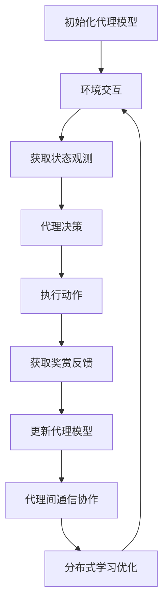

# AI人工智能深度学习算法：智能深度学习代理的分布式与同步

## 1.背景介绍

### 1.1 人工智能的发展历程

人工智能(Artificial Intelligence, AI)是当代科技发展的热点领域之一,它旨在使机器具备人类般的智能,能够模仿人类的认知功能,如学习、推理、规划、感知和语言交互等。人工智能的发展经历了几个关键阶段:

- 1950年代:人工智能的概念被正式提出,主要研究领域包括博弈、逻辑推理和机器学习等。
- 1960-1970年代:专家系统和机器学习算法取得突破,如决策树、支持向量机等。
- 1980-1990年代:神经网络和深度学习理论的发展奠定了基础。
- 2000年后:硬件计算能力的飞速提升、大数据的积累以及算法创新,推动了深度学习在语音识别、图像识别等领域的广泛应用。

### 1.2 深度学习的兴起

深度学习(Deep Learning)是机器学习的一个新的研究热点领域,它模仿人脑的机制来解释数据,通过对数据进行表征学习,获取多层次的分布式特征表示,从而更好地解决实际问题。深度学习的核心思想是通过构建神经网络模型,利用多层非线性变换对输入数据进行特征提取和模式分析。

典型的深度学习模型包括卷积神经网络(CNN)、循环神经网络(RNN)、长短期记忆网络(LSTM)等。这些模型已在计算机视觉、自然语言处理、语音识别等领域取得了卓越的成绩,极大推动了人工智能的发展。

### 1.3 智能代理与分布式系统

智能代理(Intelligent Agent)是人工智能领域的一个重要概念,指能够感知环境、持续规划和执行行动以实现预定目标的自主系统。智能代理需要具备环境感知、知识推理、行为规划、交互沟通等多种能力。

分布式系统(Distributed System)是一种计算机系统,由多个计算机组件通过网络相互协作完成共同的任务。分布式系统具有高可扩展性、高可用性和高容错性等优点,已广泛应用于大规模数据处理、云计算等领域。

将智能代理与分布式系统相结合,可以构建高效、智能且具备协作能力的分布式智能系统,在复杂的环境中完成诸如决策制定、任务规划与调度等高级认知功能。

## 2.核心概念与联系  

### 2.1 深度学习代理

深度学习代理(Deep Learning Agent)是指基于深度学习技术构建的智能代理系统。它利用深度神经网络对环境状态进行建模和决策,通过持续学习优化网络参数,实现对复杂环境的感知、决策和行为控制。

深度学习代理通常由以下几个核心模块组成:

1. **感知模块**:利用深度神经网络对环境状态进行编码,获取状态的特征表示。
2. **决策模块**:基于状态特征表示,通过深度强化学习或其他决策算法选择最优行为。
3. **执行模块**:将决策指令转化为具体的行为动作,并执行相应的操作。
4. **反馈模块**:根据行为结果获得奖赏信号,用于指导决策模块进行参数更新。

深度学习代理可以通过不断的试错与学习,逐步优化决策策略,最终实现高效的环境交互和任务完成。

### 2.2 分布式智能系统

分布式智能系统(Distributed Intelligent System)是指由多个智能代理组成的分布式系统,各代理通过网络协作完成复杂任务。分布式智能系统具有以下几个关键特征:

1. **分布式感知**:系统中的代理分布在不同位置,可以获取局部环境信息。
2. **分布式决策**:每个代理根据局部信息做出决策,并与其他代理协调行为。
3. **分布式执行**:系统中的行为由多个代理分散执行,实现任务的分工协作。
4. **分布式学习**:各代理可以相互交换经验和知识,实现系统整体的持续学习和优化。

分布式智能系统可以有效解决单一代理难以处理的大规模、复杂、动态的问题,提高系统的鲁棒性、可扩展性和智能化水平。

### 2.3 分布式深度学习代理

分布式深度学习代理(Distributed Deep Learning Agent)是指由多个深度学习代理组成的分布式智能系统。这种系统结合了深度学习和分布式系统的优势,可以高效地解决大规模、复杂的任务。

在分布式深度学习代理系统中,每个代理都是一个深度学习模型,能够根据局部环境状态做出决策和行为。同时,代理之间通过网络进行通信和协作,实现以下目标:

1. **分布式感知**:各代理共享局部观测,获取全局环境信息。
2. **分布式决策**:代理协调决策,实现行为的一致性和高效性。
3. **分布式执行**:将复杂任务分解为多个子任务,由不同代理协作完成。
4. **分布式学习**:代理之间交换经验和知识,实现系统整体的持续学习和优化。

分布式深度学习代理系统具有良好的可扩展性和容错性,可以应对动态、复杂的环境,在诸如多智能体协作、大规模决策优化等领域具有广阔的应用前景。

## 3.核心算法原理具体操作步骤

构建分布式深度学习代理系统需要结合深度学习和分布式系统的理论与算法,主要包括以下几个核心步骤:

### 3.1 构建深度学习代理模型

第一步是为每个智能代理构建深度学习模型,用于对环境状态进行感知和决策。常用的模型包括:

1. **深度Q网络(DQN)**:利用深度神经网络近似Q值函数,用于离散动作空间的强化学习决策。
2. **策略梯度(Policy Gradient)**:直接学习策略函数,用于连续动作空间的强化学习决策。
3. **Actor-Critic**:结合价值函数(Critic)和策略函数(Actor),实现更稳定的强化学习。
4. **其他模型**:如深度自编码器、生成对抗网络等,用于状态特征提取和建模。

模型的具体结构和算法取决于任务需求和环境复杂程度。通常需要进行大量的试验和调参,以获得良好的性能。

### 3.2 实现分布式通信与协作

在分布式系统中,各代理需要通过网络进行通信和协作。常用的通信方式包括:

1. **中心节点通信**:所有代理与中心节点进行通信,中心节点负责信息汇总和分发。
2. **P2P通信**:代理之间进行点对点通信,形成去中心化的网络拓扑结构。
3. **基于区块链的通信**:利用区块链技术实现安全、可靠的去中心化通信。

协作策略则需要根据具体任务而定,常见方法包括:

- **多智能体协作**:代理通过交换局部观测和决策,实现协同行为。
- **分布式优化**:将复杂优化问题分解为多个子问题,由各代理并行求解。
- **异构智能体协作**:不同类型的代理互补协作,发挥各自的优势。

### 3.3 实现分布式学习与优化

为了使分布式系统持续学习和优化,需要设计高效的分布式学习算法,主要包括:

1. **分布式参数服务器**:代理将梯度更新发送到参数服务器,服务器汇总并更新全局模型参数。
2. **去中心化分布式优化**:代理之间直接交换梯度或模型参数,实现去中心化的分布式优化。
3. **联邦学习**:代理在本地进行模型训练,并定期将模型参数上传到中心服务器进行聚合。
4. **知识蒸馏**:利用教师-学生网络结构,将多个代理模型的知识融合到单个学生模型中。

此外,还需要设计有效的奖励机制、探索策略等,以确保系统的收敛性和性能。

### 3.4 核心算法流程图

以下是分布式深度学习代理系统的核心算法流程:

上述流程可以概括为以下几个关键步骤:

1. 初始化代理模型,通常使用深度神经网络。
2. 代理与环境交互,获取状态观测和奖赏反馈。
3. 代理根据状态观测做出决策,并执行相应动作。
4. 根据奖赏反馈更新代理模型参数。
5. 代理之间进行通信协作,交换信息和决策。
6. 基于代理间协作,实现分布式学习和优化。
7. 重复上述过程,直至模型收敛或任务完成。

## 4.数学模型和公式详细讲解举例说明

分布式深度学习代理系统涉及多个数学模型和算法,下面对其中的几个核心模型进行详细讲解。

### 4.1 深度Q网络(DQN)

深度Q网络是一种结合深度学习和Q学习的强化学习算法,用于求解离散动作空间的决策问题。它的目标是学习一个Q函数 $Q(s, a)$,表示在状态 $s$ 下执行动作 $a$ 的长期回报期望。

Q函数由深度神经网络 $Q(s, a; \theta)$ 来近似,其中 $\theta$ 为网络参数。训练过程使用以下损失函数:

$$J(\theta) = \mathbb{E}_{(s, a, r, s')\sim D}\left[\left(r + \gamma\max_{a'}Q(s', a'; \theta^-) - Q(s, a; \theta)\right)^2\right]$$

其中:
- $D$ 为经验回放池,用于存储过往的 $(s, a, r, s')$ 转移样本
- $r$ 为立即奖赏, $\gamma$ 为折现因子
- $\theta^-$ 为目标网络参数,用于估计 $\max_{a'}Q(s', a')$ 的值

通过最小化损失函数,可以使 $Q(s, a; \theta)$ 逼近真实的Q值函数。在决策时,代理选择具有最大Q值的动作:

$$a^* = \arg\max_a Q(s, a; \theta)$$

DQN算法通过经验回放和目标网络的引入,提高了训练的稳定性和效率。

### 4.2 策略梯度算法(Policy Gradient)

策略梯度算法是一种用于连续动作空间的强化学习方法,它直接学习一个策略函数 $\pi_\theta(a|s)$,表示在状态 $s$ 下选择动作 $a$ 的概率。

策略函数由参数化的深度神经网络表示,目标是最大化期望回报:

$$J(\theta) = \mathbb{E}_{\tau\sim\pi_\theta}\left[\sum_{t=0}^{T}r(s_t, a_t)\right]$$

其中 $\tau = (s_0, a_0, s_1, a_1, \dots, s_T)$ 为一个轨迹序列。

通过策略梯度定理,我们可以计算目标函数的梯度:

$$\nabla_\theta J(\theta) = \mathbb{E}_{\tau\sim\pi_\theta}\left[\sum_{t=0}^{T}\nabla_\theta\log\pi_\theta(a_t|s_t)Q^{\pi_\theta}(s_t, a_t)\right]$$

其中 $Q^{\pi_\theta}(s_t, a_t)$ 为在策略 $\pi_\theta$ 下的状态-动作值函数。

通过梯度上升法更新策略参数 $\theta$,可以使策略函数 $\pi_\theta$ 逐渐收敛到最优策略。

### 4.3 Actor-Critic算法

Actor-Critic算法是一种结合价值函数(Critic)和策略函数(Actor)的强化学习