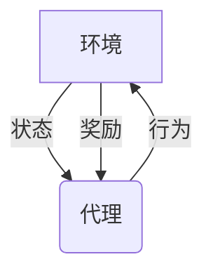
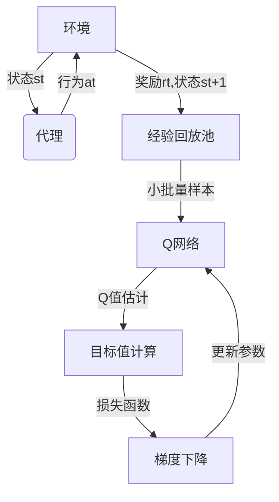

# AI人工智能深度学习算法：智能深度学习代理的动态调整与情境智能

## 1.背景介绍

### 1.1 人工智能的发展历程
人工智能(Artificial Intelligence, AI)是当代科技发展的热点领域之一。自20世纪50年代AI概念被正式提出以来,经历了几个重要的发展阶段。

- **初期阶段(1956-1974年)**: 人工智能研究集中在问题求解、博弈、机器证明等领域,主要采用符号主义方法,探索规则推理和知识表示。
- **知识陷阱时期(1974-1980年)**: AI研究进入低谷期,遇到知识获取、组织和表示的瓶颈,资金短缺,发展缓慢。
- **知识工程时期(1980-1987年)**: 专家系统和知识库的兴起,推动AI从理论向实用化发展。
- **神经网络时期(1986-现在)**: 连接主义方法的兴起,神经网络、机器学习、深度学习等技术快速发展。
- **大数据时代(2006-现在)**: 互联网、物联网、云计算等技术的兴起,为AI提供了大量的数据资源。

### 1.2 深度学习的崛起
深度学习(Deep Learning)是机器学习的一种新技术,模拟人脑神经网络结构和工作原理,通过构建多层神经网络模型对输入数据进行特征提取和模式分析。相比传统的机器学习算法,深度学习具有自动学习特征的能力,在计算机视觉、自然语言处理、语音识别等领域展现出卓越的性能。

深度学习的发展主要经历了以下几个阶段:

- **20世纪80年代**: 多层感知器(Multilayer Perceptron)被提出,但由于训练算法的局限性,实际应用受到限制。
- **20世纪90年代**: 卷积神经网络(Convolutional Neural Network, CNN)在图像识别领域取得突破。
- **2006年**: 受限玻尔兹曼机(Restricted Boltzmann Machine, RBM)的提出,为训练深层网络提供了新的思路。
- **2012年**: AlexNet在ImageNet竞赛中大获全胜,深度学习在计算机视觉领域的优势得到验证。
- **2015年后**: 深度学习技术在自然语言处理、语音识别等领域取得重大进展,开始广泛应用于工业界。

### 1.3 深度学习代理的重要性
在当前的人工智能系统中,深度学习代理(Deep Learning Agent)扮演着至关重要的角色。深度学习代理是指基于深度神经网络构建的智能体,能够根据环境状态做出合理决策和行为。它们具有以下优势:

1. **强大的模式识别能力**: 深度学习代理能够从海量数据中自动学习特征,捕捉复杂的模式和规律。
2. **端到端的学习能力**: 深度学习代理可以直接从原始输入数据(如图像、语音等)学习,无需人工提取特征。
3. **泛化能力强**: 经过训练的深度学习代理能够很好地推广到新的、未见过的数据上。
4. **持续学习能力**: 深度学习代理可以通过不断学习新数据来更新和改进自身,具有自我完善的能力。

然而,现有的深度学习代理往往是在特定任务和环境下训练的,当环境发生变化时,它们的性能可能会受到影响。因此,赋予深度学习代理动态调整和情境智能的能力,使其能够根据环境变化自主适应,是提高人工智能系统鲁棒性和通用性的关键。

## 2.核心概念与联系

### 2.1 深度强化学习
深度强化学习(Deep Reinforcement Learning)是将深度学习与强化学习(Reinforcement Learning)相结合的技术,旨在训练出能够根据环境状态做出最优决策的智能代理。

在强化学习中,代理与环境进行交互,根据当前状态选择行为,环境会给出相应的奖励反馈。代理的目标是通过不断尝试,学习一种策略(Policy),使得在给定状态下选择的行为序列能够maximizeize获得的累积奖励。传统的强化学习算法需要人工设计状态特征,而深度强化学习则利用深度神经网络自动从原始输入数据(如图像)中提取特征,从而避免了手工特征工程的过程。

常见的深度强化学习算法包括:深度Q网络(Deep Q-Network, DQN)、策略梯度(Policy Gradient)、Actor-Critic等。这些算法已经在游戏AI、机器人控制、自动驾驶等领域取得了重大进展。

### 2.2 元学习
元学习(Meta Learning)旨在提高机器学习系统的学习能力,使其能够快速适应新的任务和环境。传统的机器学习算法往往需要在每个新任务上重新训练模型,而元学习则通过学习任务之间的共性知识,使模型能够在新任务上快速适应,减少训练样本需求。

在深度学习领域,常见的元学习方法包括:

- **优化器学习**: 学习一个有效的优化器,使其能够快速找到不同任务的最优解。
- **度量学习**: 学习一个合适的相似性度量,使相似的任务具有相似的解。
- **模型学习**: 直接学习一个能够快速适应新任务的模型。

元学习为构建通用的人工智能系统奠定了基础,使得智能代理能够快速习得新知识和技能,提高了其适应性和鲁棒性。

### 2.3 多智能体系统
多智能体系统(Multi-Agent System)是由多个智能代理组成的分布式系统,代理之间可以相互协作或竞争以完成复杂任务。与单一代理相比,多智能体系统具有以下优势:

1. **任务分解**: 将复杂任务分解为多个子任务,由不同代理分工协作完成。
2. **并行处理**: 多个代理可以并行工作,提高系统效率。
3. **鲁棒性**: 单个代理出现故障不会导致整个系统瘫痪。
4. **扩展性**: 可以灵活地增减代理数量,满足不同需求。

在多智能体系统中,每个代理都需要根据自身状态和其他代理的行为做出决策,因此代理之间的协调与通信机制至关重要。常见的方法包括协作过滤(Collaborative Filtering)、契约网络(Contract Net)、拍卖机制(Auction Mechanism)等。

多智能体系统在物流调度、交通控制、机器人协作等领域有着广泛的应用前景。

### 2.4 情境智能
情境智能(Context Intelligence)是指智能系统能够理解和适应不同的环境和情境。具备情境智能的智能代理需要具备以下能力:

1. **情境感知**: 感知和理解当前的环境情况,包括物理环境、用户需求、任务目标等。
2. **情境建模**: 构建情境模型,表示环境中的各种实体及其相互关系。
3. **情境推理**: 基于情境模型推理出合理的决策和行为。
4. **情境适应**: 根据情境变化动态调整策略和行为。

赋予深度学习代理情境智能,使其能够根据环境变化自主调整策略,是提高人工智能系统鲁棒性和通用性的关键。情境智能涉及知识表示、推理、规划、决策等多个领域,是人工智能研究的重要方向之一。

## 3.核心算法原理具体操作步骤

### 3.1 深度强化学习算法
深度强化学习算法的核心思想是利用深度神经网络来近似强化学习中的策略函数或值函数,从而避免了手工设计状态特征的过程。下面以Deep Q-Network(DQN)算法为例,介绍其具体操作步骤。

DQN算法的目标是学习一个近似的动作值函数 $Q(s,a;\theta)$,其中 $s$ 表示状态, $a$ 表示行为, $\theta$ 为神经网络的参数。算法过程如下:

1. **初始化经验回放池(Experience Replay Buffer)**: 用于存储代理与环境交互过程中的转换样本 $(s_t,a_t,r_t,s_{t+1})$。
2. **初始化神经网络**: 构建一个深度神经网络作为 $Q$ 函数的近似,网络参数为 $\theta$。
3. **采样并存储转换样本**: 代理与环境交互,根据 $\epsilon$-贪婪策略选择行为 $a_t$,观测到下一状态 $s_{t+1}$ 和奖励 $r_t$,将转换样本 $(s_t,a_t,r_t,s_{t+1})$ 存入经验回放池。
4. **采样小批量数据**: 从经验回放池中随机采样一个小批量的转换样本 $(s_j,a_j,r_j,s_{j+1})$。
5. **计算目标值**: 对每个样本,计算目标值 $y_j$:
   $$y_j = r_j + \gamma \max_{a'} Q(s_{j+1},a';\theta^-)$$
   其中 $\gamma$ 为折扣因子, $\theta^-$ 为目标网络的参数(固定不变)。
6. **计算损失函数**: 计算当前 $Q$ 网络输出值与目标值之间的均方差损失:
   $$L(\theta) = \mathbb{E}_{(s,a,r,s')\sim D}\left[(y - Q(s,a;\theta))^2\right]$$
   其中 $D$ 为经验回放池。
7. **梯度下降更新**: 使用优化算法(如RMSProp)根据损失函数的梯度,更新 $Q$ 网络的参数 $\theta$。
8. **目标网络更新**: 每隔一定步数,将 $Q$ 网络的参数 $\theta$ 复制到目标网络参数 $\theta^-$。
9. **重复3-8步骤**: 直到算法收敛或达到最大训练步数。

DQN算法的关键点在于:

1. 引入经验回放池,打破样本独立同分布假设,提高数据利用效率。
2. 目标网络的设计,保证目标值相对稳定,提高训练稳定性。
3. 采用深度神经网络近似 $Q$ 函数,无需手工设计状态特征。

### 3.2 元学习算法
元学习算法的核心思想是在多个不同任务上训练模型,使其能够从任务之间的共性中学习泛化能力,从而在新任务上快速适应。下面以模型无关的元学习(Model-Agnostic Meta-Learning, MAML)算法为例,介绍其具体操作步骤。

MAML算法的目标是学习一个有效的初始化参数 $\theta$,使得在新任务上通过几步梯度更新,就能得到一个有效的模型。算法过程如下:

1. **采样任务批次**: 从任务分布 $p(\mathcal{T})$ 中采样一个任务批次 $\mathcal{T}_i$。
2. **任务数据划分**: 对每个任务 $\mathcal{T}_i$,将其数据 $D_i$ 划分为支持集(Support Set) $D_i^{tr}$ 和查询集(Query Set) $D_i^{qr}$。
3. **内循环**: 对每个任务 $\mathcal{T}_i$,在支持集 $D_i^{tr}$ 上进行 $k$ 步梯度更新:
   $$\theta_i' = \theta - \alpha \nabla_\theta \mathcal{L}_{\mathcal{T}_i}(f_\theta, D_i^{tr})$$
   其中 $\alpha$ 为内循环学习率, $\mathcal{L}_{\mathcal{T}_i}$ 为任务 $\mathcal{T}_i$ 的损失函数, $f_\theta$ 为模型。
4. **外循环损失计算**: 在查询集 $D_i^{qr}$ 上计算外循环损失