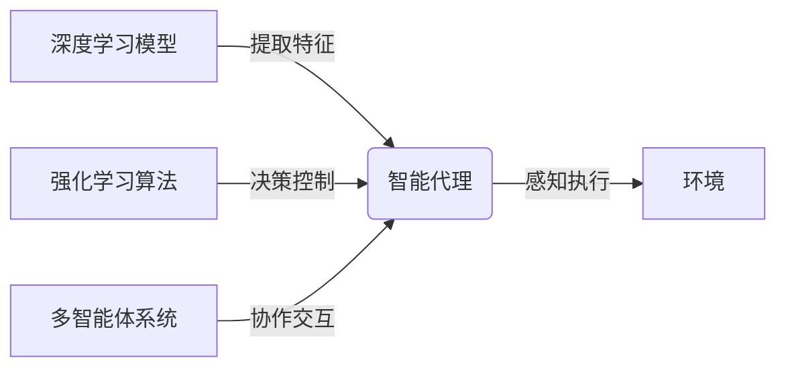

# AI人工智能深度学习算法：智能深度学习代理的构建基础

## 1.背景介绍

### 1.1 人工智能的兴起

人工智能(Artificial Intelligence, AI)是当代科技发展的前沿领域,其影响力已经渗透到了我们生活的方方面面。从语音助手到自动驾驶汽车,从推荐系统到医疗诊断,AI技术正在彻底改变着人类的生活方式和工作模式。

### 1.2 深度学习的崛起

深度学习(Deep Learning)作为AI的核心技术之一,近年来取得了令人瞩目的进展。借助强大的计算能力和海量数据,深度学习能够自主学习特征表示,并在计算机视觉、自然语言处理、决策控制等领域展现出超人的能力。

### 1.3 智能代理的需求

随着AI技术的不断发展,构建具有一定智能水平的代理(Agent)成为了当前研究的热点。智能代理需要具备感知环境、学习决策和行为控制等多重能力,以便在复杂的环境中自主完成特定任务。

## 2.核心概念与联系  

### 2.1 深度学习模型

深度学习模型是构建智能代理的核心,主要包括:

- 前馈神经网络(Feedforward Neural Networks)
- 卷积神经网络(Convolutional Neural Networks, CNNs) 
- 循环神经网络(Recurrent Neural Networks, RNNs)
- 生成对抗网络(Generative Adversarial Networks, GANs)
- transformer等

这些模型通过端到端的训练,可以自动从数据中学习特征表示,并对输入进行预测或生成。

### 2.2 强化学习

强化学习(Reinforcement Learning, RL)是构建智能代理的另一核心技术。它通过与环境的交互,根据获得的奖赏信号来优化代理的决策策略,使其能够在未知环境中自主学习并作出最优决策。

常见的强化学习算法包括:Q-Learning、Sarsa、Policy Gradient等。结合深度学习,可以构建出深度强化学习(Deep RL)算法,如深度Q网络(Deep Q-Network, DQN)、策略梯度(Policy Gradient)等。

### 2.3 多智能体系统

在复杂环境中,往往需要多个智能代理协同工作,形成一个多智能体系统(Multi-Agent System, MAS)。多智能体系统需要解决代理间的协作、竞争、通信等问题,涉及到博弈论、协作算法等领域的知识。



## 3.核心算法原理具体操作步骤

### 3.1 深度学习模型训练

以卷积神经网络为例,典型的训练过程包括:

1. **数据预处理**: 对输入数据(如图像)进行标准化、增广等预处理,以提高模型的泛化能力。

2. **网络构建**: 根据任务需求设计合适的网络结构,包括卷积层、池化层、全连接层等。

3. **损失函数定义**: 根据任务类型(如分类、回归等)选择合适的损失函数,例如交叉熵损失、均方误差等。

4. **优化器选择**: 常用的优化器有SGD、Adam等,用于根据损失函数的梯度更新网络参数。

5. **模型训练**: 将数据输入网络,前向计算得到预测结果,与真实标签计算损失,反向传播梯度并更新参数。重复此过程直至模型收敛。

6. **模型评估**: 在验证集或测试集上评估模型的性能指标,如准确率、F1分数等。

### 3.2 强化学习算法训练

以Q-Learning为例,算法步骤如下:

1. **初始化Q表**: 为每个状态-动作对分配一个初始Q值。

2. **选择动作**: 根据当前状态,利用$\epsilon$-贪婪策略选择一个动作执行。

3. **获取奖赏**: 执行选定动作,获得环境反馈的即时奖赏。

4. **更新Q值**: 根据下式更新相应状态-动作对的Q值:

$$Q(s_t, a_t) \leftarrow Q(s_t, a_t) + \alpha[r_t + \gamma\max_aQ(s_{t+1}, a) - Q(s_t, a_t)]$$

其中,$\alpha$为学习率,$\gamma$为折扣因子,用于权衡即时奖赏和未来奖赏。

5. **重复训练**: 重复2-4步,直至策略收敛。

### 3.3 多智能体算法

多智能体算法需要解决代理间的协作问题,例如通过信任区域技术进行分布式Q-Learning:

1. **初始化Q表**: 为每个代理初始化独立的Q表。

2. **选择动作**: 每个代理根据自身Q表选择动作。

3. **执行动作**: 所有代理同步执行选定动作。

4. **获取奖赏**: 每个代理获得相应的即时奖赏。

5. **更新Q表**: 每个代理根据自身经验更新Q表,并与其他代理交换Q值。

6. **重复训练**: 重复2-5步,直至所有代理的策略收敛。

## 4.数学模型和公式详细讲解举例说明

### 4.1 神经网络模型

神经网络模型的核心是通过非线性变换来逼近任意函数。以前馈神经网络为例,给定输入$\boldsymbol{x}$,单层神经网络的计算过程为:

$$\boldsymbol{y} = \phi(\boldsymbol{W}\boldsymbol{x} + \boldsymbol{b})$$

其中,$\boldsymbol{W}$为权重矩阵,$\boldsymbol{b}$为偏置向量,$\phi$为非线性激活函数(如ReLU、Sigmoid等)。

通过堆叠多层神经网络,可以逼近任意连续函数:

$$\boldsymbol{y} = \phi_L(\boldsymbol{W}_L\phi_{L-1}(\boldsymbol{W}_{L-1}\cdots\phi_1(\boldsymbol{W}_1\boldsymbol{x} + \boldsymbol{b}_1) + \boldsymbol{b}_{L-1}) + \boldsymbol{b}_L)$$

在训练过程中,通过反向传播算法计算损失函数关于每个权重的梯度,并使用优化算法(如SGD)迭代更新权重,从而最小化损失函数。

### 4.2 强化学习模型

强化学习的核心是通过与环境交互来学习一个最优策略$\pi^*$,使得在遵循该策略时,代理能够获得最大的期望累积奖赏。

对于有限马尔可夫决策过程(Markov Decision Process, MDP),存在一个最优的行为值函数$Q^*(s,a)$,表示在状态$s$执行动作$a$后,能够获得的最大期望累积奖赏:

$$Q^*(s,a) = \mathbb{E}_\pi\left[R_t + \gamma R_{t+1} + \gamma^2R_{t+2} + \cdots | s_t = s, a_t = a, \pi\right]$$

其中,$R_t$为时刻$t$获得的即时奖赏,$\gamma$为折扣因子。

Q-Learning算法通过不断更新Q值表,逐步逼近$Q^*$函数。对于任意状态$s$,执行贪婪策略$\pi^*(s) = \arg\max_aQ^*(s,a)$即可获得最优行为序列。

### 4.3 多智能体模型

在多智能体系统中,每个代理的行为不仅影响自身,还会影响其他代理。因此,需要考虑代理间的相互影响,将问题建模为一个马尔可夫博弈(Markov Game)。

设$n$个代理,状态向量为$\boldsymbol{s}$,第$i$个代理的动作为$a_i$,获得的即时奖赏为$r_i$。那么,第$i$个代理的行为值函数为:

$$Q_i^*(\boldsymbol{s}, \boldsymbol{a}) = \mathbb{E}\left[r_i + \gamma\max_{\boldsymbol{a}'}Q_i^*(\boldsymbol{s}', \boldsymbol{a}')\right]$$

其中,$\boldsymbol{a} = (a_1, \cdots, a_n)$为所有代理的联合动作,$\boldsymbol{s}'$为执行$\boldsymbol{a}$后转移到的新状态。

通过不同的算法(如独立Q-Learning、友好Q-Learning等),可以求解出一个纳什均衡解,使得每个代理的策略都是相对于其他代理的最优策略。

## 5.项目实践:代码实例和详细解释说明

以下是一个使用PyTorch实现的简单DQN算法,用于训练一个智能体在经典的CartPole环境中平衡杆子:

```python
import torch
import torch.nn as nn
import torch.optim as optim
import gym

# 定义DQN网络
class DQN(nn.Module):
    def __init__(self, state_dim, action_dim):
        super(DQN, self).__init__()
        self.fc1 = nn.Linear(state_dim, 64)
        self.fc2 = nn.Linear(64, action_dim)

    def forward(self, x):
        x = torch.relu(self.fc1(x))
        return self.fc2(x)

# 定义经验回放池
class ReplayBuffer:
    def __init__(self, capacity):
        self.buffer = []
        self.capacity = capacity
        self.position = 0

    def push(self, transition):
        if len(self.buffer) < self.capacity:
            self.buffer.append(None)
        self.buffer[self.position] = transition
        self.position = (self.position + 1) % self.capacity

    def sample(self, batch_size):
        return random.sample(self.buffer, batch_size)

    def __len__(self):
        return len(self.buffer)

# 定义DQN agent
class DQNAgent:
    def __init__(self, state_dim, action_dim):
        self.device = torch.device("cuda" if torch.cuda.is_available() else "cpu")
        self.policy_net = DQN(state_dim, action_dim).to(self.device)
        self.target_net = DQN(state_dim, action_dim).to(self.device)
        self.target_net.load_state_dict(self.policy_net.state_dict())
        self.optimizer = optim.Adam(self.policy_net.parameters())
        self.replay_buffer = ReplayBuffer(1000)
        self.batch_size = 32
        self.gamma = 0.99

    def select_action(self, state, epsilon):
        if random.random() < epsilon:
            return env.action_space.sample()
        else:
            with torch.no_grad():
                state = torch.tensor(state, dtype=torch.float32, device=self.device).unsqueeze(0)
                q_values = self.policy_net(state)
                return q_values.max(1)[1].item()

    def optimize_model(self):
        if len(self.replay_buffer) < self.batch_size:
            return
        transitions = self.replay_buffer.sample(self.batch_size)
        batch = tuple(zip(*transitions))

        state_batch = torch.cat(batch[0]).to(self.device)
        action_batch = torch.cat(batch[1]).to(self.device)
        reward_batch = torch.cat(batch[2]).to(self.device)
        next_state_batch = torch.cat(batch[3]).to(self.device)
        done_batch = torch.cat(batch[4]).to(self.device)

        q_values = self.policy_net(state_batch).gather(1, action_batch.unsqueeze(1))
        next_q_values = self.target_net(next_state_batch).max(1)[0].detach()
        expected_q_values = reward_batch + self.gamma * next_q_values * (1 - done_batch)

        loss = nn.MSELoss()(q_values, expected_q_values.unsqueeze(1))
        self.optimizer.zero_grad()
        loss.backward()
        self.optimizer.step()

    def train(self, num_episodes):
        for episode in range(num_episodes):
            state = env.reset()
            epsilon = max(0.01, 0.08 - 0.01*(episode/200))
            total_reward = 0

            while True:
                action = self.select_action(state, epsilon)
                next_state, reward, done, _ = env.step(action)
                self.replay_buffer.push((state, action, reward, next_state, done))
                self.optimize_model()
                self.target_net.load_state_dict(self.policy_net.state_dict())

                state = next_state
                total_reward += reward

                if done:
                    break

            print(f"Episode {episode}, Total Reward: {total_reward}")

# 创建环境和agent
env = gym.make('CartPole-v1')
state_dim = env.observation_space.shape[0]
action_dim = env.action_space.n
agent = DQNAgent(state_dim, action_dim)

# 训练agent
agent.