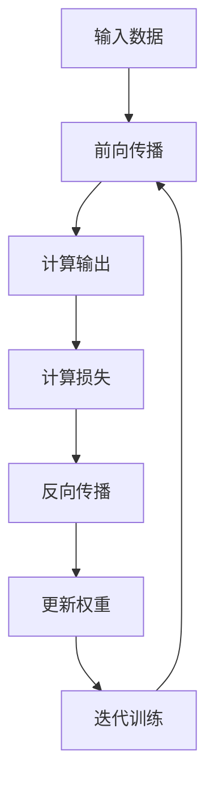
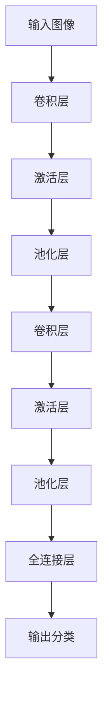
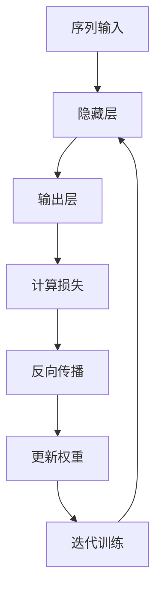
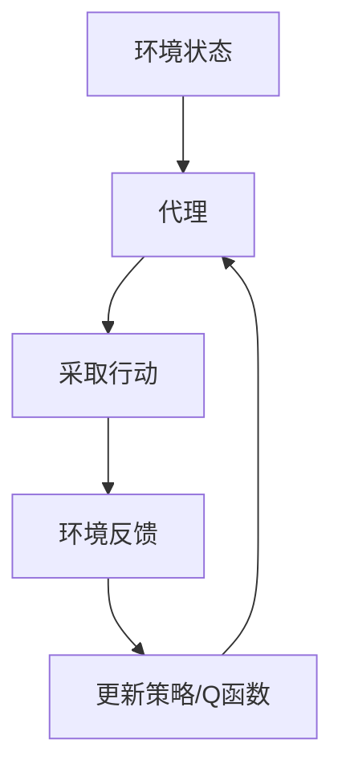
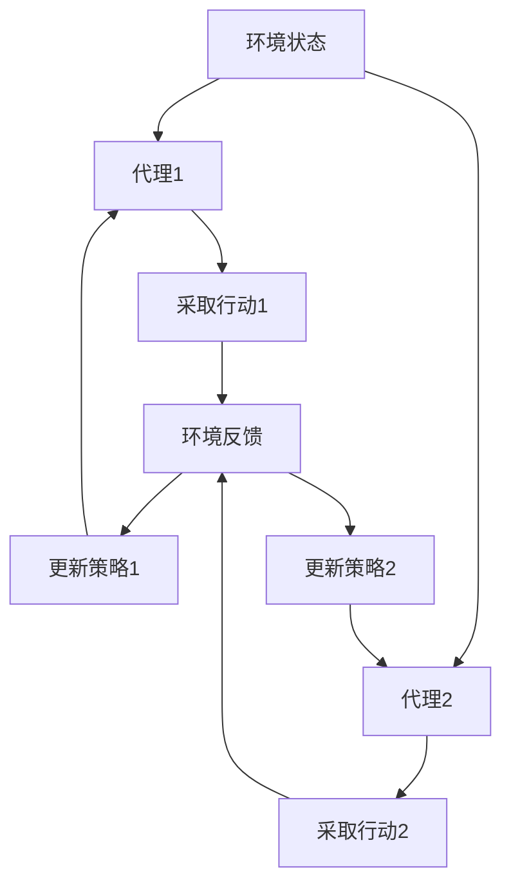

# AI人工智能深度学习算法：智能深度学习代理的深度学习技术

## 1.背景介绍

### 1.1 人工智能的兴起

人工智能(Artificial Intelligence, AI)是当代科技发展的前沿领域,近年来受到了前所未有的关注和投入。AI技术的快速发展正在深刻影响和改变着我们的生活、工作和社会。从语音助手到自动驾驶汽车,从医疗诊断到金融风险评估,AI系统正在广泛应用于各个领域,显示出巨大的潜力和价值。

### 1.2 深度学习的关键作用  

深度学习(Deep Learning)是AI领域的核心驱动力量,它是一种模仿人脑神经网络结构和工作机制的算法模型。通过对大量数据的学习,深度学习能够自主获取知识,并用于解决复杂的问题,如图像识别、自然语言处理、决策优化等。凭借其强大的数据处理和模式识别能力,深度学习已成为AI系统的"大脑"和基础。

### 1.3 智能代理的需求

随着AI系统的不断演进,人们对智能代理(Intelligent Agent)的需求与日俱增。智能代理是指能够感知环境、思考决策并采取行动的自主系统,它们可被视为AI的终极体现。构建高度智能化的代理需要将深度学习与其他AI技术相结合,形成复杂而强大的系统。本文将重点探讨应用于智能代理的深度学习算法及相关技术。

## 2.核心概念与联系

### 2.1 深度学习的核心概念

深度学习的核心思想是通过构建神经网络模型,对大量数据进行训练,使模型能够自主学习特征模式,并对新数据做出预测或决策。其中涉及以下关键概念:

1. **神经网络(Neural Network)**: 深度学习模型的基本结构,由多层神经元相互连接而成,模仿生物神经系统的工作原理。
2. **前馈神经网络(Feedforward Neural Network)**: 信息只从输入层单向传播到输出层的神经网络。
3. **卷积神经网络(Convolutional Neural Network, CNN)**: 专门用于处理图像等高维数据的神经网络。
4. **循环神经网络(Recurrent Neural Network, RNN)**: 能够处理序列数据(如文本、语音)的神经网络。
5. **长短期记忆网络(Long Short-Term Memory, LSTM)**: 一种特殊的RNN,解决了普通RNN存在的长期依赖问题。

### 2.2 深度强化学习

深度强化学习(Deep Reinforcement Learning)是将深度学习应用于强化学习领域的方法,常用于构建智能代理系统。其核心思想是:

1. **代理(Agent)**: 能够与环境交互的智能体,通过观察环境状态并采取行动来获取奖励。
2. **环境(Environment)**: 代理所处的外部世界,代理的行动将导致环境发生状态转移。
3. **策略(Policy)**: 代理根据当前状态选择采取行动的策略函数。
4. **奖励(Reward)**: 环境给予代理的反馈,代理的目标是最大化预期的长期奖励。

通过深度神经网络近似策略函数或价值函数,代理可以学习出优化的决策策略,实现高度智能化。

### 2.3 多智能体系统

多智能体系统(Multi-Agent System)是由多个智能代理组成的复杂系统,代理之间存在竞争或合作关系。这种系统更加贴近真实世界的复杂环境,对代理的学习能力提出了更高的要求。相关概念包括:

1. **马尔可夫博弈(Markov Game)**: 多个代理在同一环境中互相影响的序贯决策过程。
2. **多智能体深度强化学习(Multi-Agent Deep Reinforcement Learning)**: 将深度学习与多智能体强化学习相结合。

## 3.核心算法原理具体操作步骤

### 3.1 深度前馈神经网络

深度前馈神经网络是深度学习的基础模型,通过对大量数据的训练,可以学习到输入和输出之间的复杂映射关系。其核心算法为反向传播(Back Propagation)算法,具体步骤如下:

1. **前向传播**: 将输入数据通过神经网络层层传递,计算出输出值。
2. **计算损失**: 将输出值与真实标签计算损失函数(如均方误差)。
3. **反向传播**: 根据损失函数对网络权重进行梯度计算。
4. **权重更新**: 使用优化算法(如梯度下降)更新网络权重。
5. **迭代训练**: 重复上述过程,直至网络收敛或达到指定迭代次数。

通过以上步骤,神经网络可以不断减小损失函数,从而学习到最优的权重参数,实现对新数据的预测。

### 3.2 卷积神经网络

卷积神经网络(CNN)是深度学习在计算机视觉领域的杰出应用,擅长从图像等高维数据中自动提取特征。CNN的核心思想是使用卷积操作对局部区域进行特征提取,并通过池化操作对特征进行下采样,从而获得对平移、缩放等变换的鲁棒性。CNN的训练过程包括以下步骤:

1. **卷积层(Convolution Layer)**: 使用多个滤波器(Filter)对输入数据进行卷积操作,提取局部特征。
2. **激活层(Activation Layer)**: 对卷积结果应用非线性激活函数(如ReLU),增强特征表达能力。
3. **池化层(Pooling Layer)**: 对特征图进行下采样,减少数据量并提高空间不变性。
4. **全连接层(Fully Connected Layer)**: 将特征数据展平,并通过全连接层对特征进行高层次组合和分类。
5. **损失计算与反向传播**: 与普通神经网络相同,计算损失并通过反向传播算法更新网络参数。

CNN模型通过交替使用卷积层和池化层,可以高效地从原始数据中提取出多层次的抽象特征,从而完成复杂的视觉任务。

### 3.3 循环神经网络

循环神经网络(RNN)是一种能够处理序列数据(如文本、语音)的深度学习模型。与前馈神经网络不同,RNN在隐藏层之间存在循环连接,使得网络能够捕捉序列数据中的时间依赖关系。RNN的核心算法为反向传播through Time(BPTT),具体步骤如下:

1. **正向传播**: 将序列数据一个时间步一个时间步地输入到RNN中,计算每个时间步的隐藏状态和输出。
2. **计算损失**: 将最后一个时间步的输出与真实标签计算损失函数。
3. **反向传播**: 从最后一个时间步开始,沿时间反向传播误差梯度,计算每个时间步的参数梯度。
4. **权重更新**: 使用优化算法(如Adam)更新网络权重。
5. **迭代训练**: 重复上述过程,直至网络收敛或达到指定迭代次数。

RNN能够有效地处理变长序列数据,但存在梯度消失或爆炸的问题。为解决这一问题,提出了长短期记忆网络(LSTM)和门控循环单元(GRU)等改进模型。

### 3.4 深度强化学习算法

深度强化学习算法旨在使智能代理通过与环境的交互来学习最优策略,实现给定目标。其核心算法包括:

1. **深度Q网络(Deep Q-Network, DQN)**: 使用深度神经网络近似Q函数,通过Q-Learning算法学习状态-行为价值函数。
2. **策略梯度(Policy Gradient)**: 直接使用神经网络表示策略函数,通过策略梯度算法优化策略参数。
3. **Actor-Critic算法**: 将策略函数(Actor)和价值函数(Critic)分开训练,实现策略评估和策略改进。
4. **深度确定性策略梯度(Deep Deterministic Policy Gradient, DDPG)**: 将确定性策略梯度算法与深度学习相结合,用于连续动作空间的强化学习问题。

这些算法通过引入深度神经网络,显著提高了强化学习的表现能力,能够应对高维状态空间和连续动作空间的复杂问题。同时,也存在样本低效利用、收敛性差等挑战需要解决。

### 3.5 多智能体深度强化学习

在多智能体系统中,每个代理都需要根据其他代理的行为作出决策,这使得学习过程变得更加复杂。多智能体深度强化学习算法旨在解决这一挑战,主要有以下方法:

1. **独立学习(Independent Learning)**: 每个代理独立地与环境交互,忽略其他代理的存在,使用单智能体算法进行学习。
2. **联合动作学习(Joint Action Learners, JAL)**: 将所有代理的动作组合作为联合动作,直接对联合状态-动作值函数进行学习。
3. **计数策略梯度(Counterfactual Multi-Agent Policy Gradients, COMA)**: 引入反事实基线,使得每个代理的梯度只包含其自身行为的影响。
4. **多智能体演员-评论家(Multi-Agent Actor-Critic, MAAC)**: 将演员-评论家算法扩展到多智能体场景,使用集中式训练和分布式执行的方式。

这些算法通过建模代理间的交互关系,实现了高效的多智能体策略学习。但仍然存在非平稳环境、信息不对称、可扩展性等挑战有待解决。

## 4.数学模型和公式详细讲解举例说明

### 4.1 神经网络模型

神经网络是深度学习的基础模型,其数学表示形式如下:

设输入为 $\boldsymbol{x} = (x_1, x_2, \ldots, x_n)$,第 $l$ 层的权重矩阵为 $\boldsymbol{W}^{(l)}$,偏置向量为 $\boldsymbol{b}^{(l)}$,激活函数为 $\phi(\cdot)$,则第 $l$ 层的输出 $\boldsymbol{a}^{(l)}$ 可表示为:

$$\boldsymbol{a}^{(l)} = \phi\left(\boldsymbol{W}^{(l)}\boldsymbol{a}^{(l-1)} + \boldsymbol{b}^{(l)}\right)$$

对于输出层,可以使用不同的激活函数(如Softmax)来实现分类或回归任务。

在训练过程中,通过最小化损失函数 $J(\boldsymbol{\theta})$ 来优化网络参数 $\boldsymbol{\theta} = \{\boldsymbol{W}^{(l)}, \boldsymbol{b}^{(l)}\}$,常用的优化算法包括梯度下降、Adam等。

### 4.2 卷积神经网络模型

卷积神经网络(CNN)中的卷积操作可以数学表