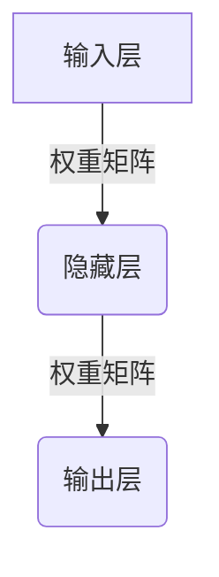
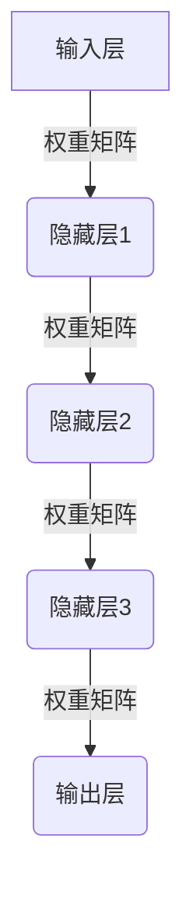
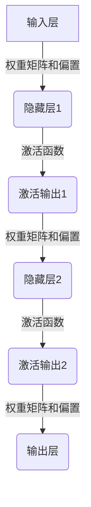
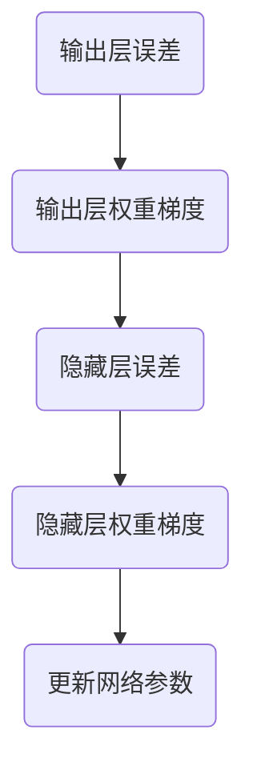

# AI人工智能深度学习算法：深度学习的挑战与前景

## 1.背景介绍

### 1.1 人工智能的兴起

人工智能(Artificial Intelligence, AI)是当代科技发展的热点领域,近年来受到了前所未有的关注和投资。AI的发展离不开机器学习(Machine Learning)和深度学习(Deep Learning)等核心技术的突破,尤其是深度学习在图像识别、自然语言处理、推荐系统等领域取得了令人瞩目的成就。

### 1.2 深度学习的重要性

深度学习是机器学习的一个新的研究热点,它模仿人脑的机制来解释数据,能够捕捉数据的高阶特征。与传统的机器学习算法相比,深度学习具有自动学习数据特征的能力,不需要人工设计特征,从而大大降低了特征工程的工作量。深度学习在计算机视觉、自然语言处理、语音识别等领域展现出了强大的能力。

### 1.3 深度学习面临的挑战

尽管深度学习取得了令人瞩目的成就,但它也面临着一些重大挑战,例如需要大量的数据和计算资源、缺乏可解释性、存在安全隐患等。这些挑战限制了深度学习在一些关键领域的应用,亟需研究人员继续努力,推动深度学习技术的发展和完善。

## 2.核心概念与联系

### 2.1 人工神经网络

人工神经网络(Artificial Neural Network, ANN)是深度学习的核心概念和基础模型。它是一种受生物神经网络启发而设计的数学模型,由大量的人工神经元互相连接而成。每个神经元接收输入信号,经过激活函数处理后,将输出信号传递给下一层神经元。



### 2.2 深度神经网络

深度神经网络(Deep Neural Network, DNN)是一种包含多个隐藏层的人工神经网络。与传统的浅层神经网络相比,深度神经网络能够学习到更复杂的数据特征,从而在许多任务上取得了更好的性能。常见的深度神经网络包括卷积神经网络(CNN)、循环神经网络(RNN)等。



### 2.3 深度学习与机器学习的关系

深度学习是机器学习的一个子领域,它利用深度神经网络作为模型,通过大量数据的训练来学习数据的特征表示。与传统的机器学习算法相比,深度学习不需要人工设计特征,能够自动从数据中学习到有效的特征表示,从而在许多任务上取得了更好的性能。

## 3.核心算法原理具体操作步骤

### 3.1 前向传播

前向传播(Forward Propagation)是深度神经网络的基本运算过程。它将输入数据通过一系列的线性变换和非线性激活函数,逐层传递到输出层,得到网络的预测结果。具体步骤如下:

1. 初始化网络权重和偏置
2. 对输入数据进行归一化处理
3. 计算第一层隐藏层的输出
4. 重复计算后续隐藏层的输出
5. 计算输出层的输出



### 3.2 反向传播

反向传播(Backpropagation)是深度神经网络的核心训练算法,它通过计算损失函数对网络参数的梯度,并使用优化算法(如梯度下降)来更新网络参数,从而最小化损失函数。具体步骤如下:

1. 计算输出层的误差
2. 计算输出层权重的梯度
3. 反向传播计算隐藏层的误差
4. 计算隐藏层权重的梯度
5. 使用优化算法更新网络参数



### 3.3 优化算法

优化算法在深度学习中扮演着重要的角色,它决定了网络参数如何被更新。常见的优化算法包括:

- 梯度下降(Gradient Descent)
- 动量优化(Momentum Optimization)
- RMSProp
- Adam

不同的优化算法在收敛速度、鲁棒性等方面有所不同,需要根据具体任务进行选择和调参。

## 4.数学模型和公式详细讲解举例说明

### 4.1 神经元模型

神经元是深度神经网络的基本计算单元,它接收多个输入信号,经过加权求和和非线性激活函数的处理,产生输出信号。数学模型如下:

$$
y = f\left(\sum_{i=1}^{n}w_ix_i + b\right)
$$

其中:
- $x_i$是第$i$个输入
- $w_i$是第$i$个输入对应的权重
- $b$是偏置项
- $f$是非线性激活函数,如Sigmoid、ReLU等

### 4.2 损失函数

损失函数(Loss Function)用于衡量模型预测结果与真实值之间的差异,是深度学习模型优化的目标函数。常见的损失函数包括:

- 均方误差(Mean Squared Error, MSE)

$$
\text{MSE} = \frac{1}{n}\sum_{i=1}^{n}(y_i - \hat{y}_i)^2
$$

- 交叉熵损失(Cross-Entropy Loss)

$$
\text{CE} = -\frac{1}{n}\sum_{i=1}^{n}\left[y_i\log(\hat{y}_i) + (1 - y_i)\log(1 - \hat{y}_i)\right]
$$

其中$y_i$是真实值,$\hat{y}_i$是模型预测值。

### 4.3 权重更新

在反向传播过程中,需要根据损失函数对网络参数(权重和偏置)计算梯度,并使用优化算法进行更新。以梯度下降为例,权重更新公式如下:

$$
w_{t+1} = w_t - \eta\frac{\partial L}{\partial w_t}
$$

其中:
- $w_t$是当前权重
- $\eta$是学习率
- $\frac{\partial L}{\partial w_t}$是损失函数对权重的梯度

## 5.项目实践:代码实例和详细解释说明

以下是一个使用PyTorch构建和训练简单全连接神经网络的示例代码:

```python
import torch
import torch.nn as nn
import torch.optim as optim

# 定义网络结构
class Net(nn.Module):
    def __init__(self, input_size, hidden_size, output_size):
        super(Net, self).__init__()
        self.fc1 = nn.Linear(input_size, hidden_size)
        self.relu = nn.ReLU()
        self.fc2 = nn.Linear(hidden_size, output_size)

    def forward(self, x):
        out = self.fc1(x)
        out = self.relu(out)
        out = self.fc2(out)
        return out

# 创建网络实例
net = Net(input_size=10, hidden_size=20, output_size=2)

# 定义损失函数和优化器
criterion = nn.CrossEntropyLoss()
optimizer = optim.SGD(net.parameters(), lr=0.01)

# 训练循环
for epoch in range(100):
    # 获取输入数据和标签
    inputs, labels = ...

    # 前向传播
    outputs = net(inputs)

    # 计算损失
    loss = criterion(outputs, labels)

    # 反向传播
    optimizer.zero_grad()
    loss.backward()
    optimizer.step()

    # 打印损失
    if epoch % 10 == 0:
        print(f'Epoch {epoch}, Loss: {loss.item()}')
```

代码解释:

1. 定义网络结构:使用PyTorch的`nn.Module`定义一个全连接神经网络,包含一个输入层、一个隐藏层和一个输出层。
2. 创建网络实例:实例化定义好的网络结构,指定输入尺寸、隐藏层尺寸和输出尺寸。
3. 定义损失函数和优化器:使用交叉熵损失函数和随机梯度下降优化器。
4. 训练循环:
   - 获取输入数据和标签
   - 前向传播计算输出
   - 计算损失
   - 反向传播计算梯度
   - 使用优化器更新网络参数
   - 打印损失

这个示例展示了如何使用PyTorch构建和训练一个简单的全连接神经网络。在实际应用中,您可以根据具体任务调整网络结构、损失函数和优化器等参数。

## 6.实际应用场景

深度学习在许多领域展现出了强大的能力,下面列举了一些典型的应用场景:

### 6.1 计算机视觉

- 图像分类:使用卷积神经网络(CNN)对图像进行分类,如识别猫狗、手写数字等。
- 目标检测:在图像中定位并识别出特定目标的位置和类别。
- 语义分割:对图像中的每个像素进行分类,将图像分割成不同的语义区域。

### 6.2 自然语言处理

- 机器翻译:使用序列到序列模型(Seq2Seq)实现不同语言之间的自动翻译。
- 文本分类:根据文本内容对其进行分类,如情感分析、新闻分类等。
- 问答系统:基于知识库和上下文信息回答用户提出的问题。

### 6.3 语音识别

使用递归神经网络(RNN)或卷积神经网络(CNN)从语音信号中识别出对应的文本内容,广泛应用于智能助手、语音输入等场景。

### 6.4 推荐系统

利用深度学习模型从用户历史行为数据中学习用户偏好,为用户推荐感兴趣的商品、新闻、视频等内容。

### 6.5 游戏AI

使用深度强化学习算法训练AI代理,使其能够在复杂的游戏环境中做出明智的决策,如AlphaGo在围棋领域的成就。

## 7.工具和资源推荐

### 7.1 深度学习框架

- PyTorch: https://pytorch.org/
- TensorFlow: https://www.tensorflow.org/
- Keras: https://keras.io/

这些框架提供了构建、训练和部署深度学习模型的工具和API,大大降低了深度学习的入门门槛。

### 7.2 开源项目

- OpenAI Gym: https://gym.openai.com/
- NLTK: https://www.nltk.org/
- OpenCV: https://opencv.org/

这些开源项目提供了丰富的资源和示例,可以帮助您快速入门和学习深度学习在不同领域的应用。

### 7.3 在线课程

- Deep Learning Specialization (Coursera)
- Deep Learning (fast.ai)
- MIT Deep Learning (OpenCourseWare)

这些在线课程由知名机构和教师提供,内容全面且权威,适合初学者和进阶学习者。

### 7.4 书籍

- Deep Learning Book (Ian Goodfellow等)
- Pattern Recognition and Machine Learning (Christopher Bishop)
- Neural Networks and Deep Learning (Michael Nielsen)

这些经典书籍深入探讨了深度学习的理论基础和实践技巧,是深入学习深度学习的绝佳资源。

## 8.总结:未来发展趋势与挑战

### 8.1 发展趋势

- 模型规模持续增长:随着计算能力的提升,更大规模的深度学习模型将被训练和应用,以获取更强的表现力。
- 注意力机制的广泛应用:注意力机制在自然语言处理、计算机视觉等领域展现出了优异的性能,未来将被更广泛地应用。
- 多模态学习:将不同模态(如图像、文本、语音等)的信息融合,实现更智能的多模态学习系统。
- 可解释性提升