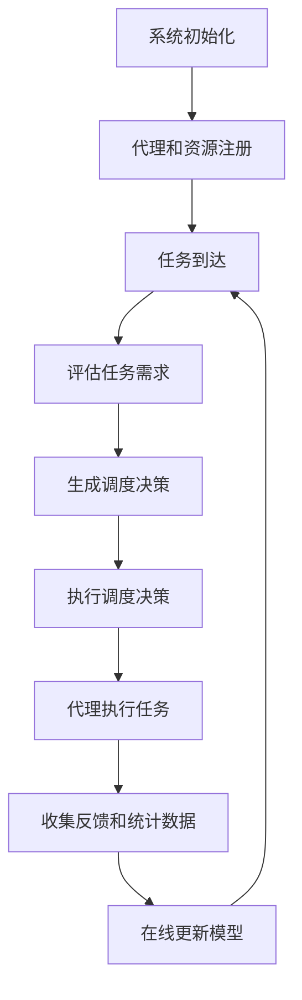

# AI人工智能深度学习算法：自适应深度学习代理的调度策略

## 1.背景介绍

### 1.1 人工智能和深度学习的发展

人工智能(AI)是当代科技发展的核心领域之一,其中深度学习作为机器学习的一个新兴热门方向,已经在计算机视觉、自然语言处理、决策系统等多个领域取得了突破性的进展。传统的机器学习算法主要依赖于人工设计的特征,而深度学习则可以自动从原始数据中学习特征表示,从而克服了人工设计特征的瓶颈。

### 1.2 深度学习模型的复杂性

随着深度学习模型的不断发展,模型的规模和复杂度也在不断增加。大型深度神经网络模型通常包含数十亿甚至上千亿个参数,训练和推理这些庞大模型需要消耗大量的计算资源。此外,不同任务对模型的要求也存在差异,需要针对具体任务进行模型设计和优化。

### 1.3 资源受限环境下的挑战

在资源受限的环境中(如移动设备、边缘计算等),如何高效地部署和运行深度学习模型是一个巨大的挑战。受限于计算能力、内存和能源等因素,我们需要在模型精度、计算复杂度和资源消耗之间寻求平衡。此外,动态变化的环境和任务需求也要求深度学习系统具有自适应性和灵活性。

## 2.核心概念与联系

### 2.1 深度学习代理(Deep Learning Agent)

深度学习代理是一种融合了深度学习模型和智能体架构的新型人工智能系统。它不仅包含用于感知和决策的深度神经网络,还具有与环境交互、学习和自主决策的能力。深度学习代理可以根据当前状态和目标,选择合适的行为,并通过反馈信号不断优化自身。

### 2.2 自适应深度学习(Adaptive Deep Learning)

自适应深度学习旨在构建能够根据环境变化和任务需求动态调整模型结构、计算资源分配和决策策略的智能系统。它包括以下几个关键概念:

1. **模型压缩与加速(Model Compression and Acceleration)**: 通过剪枝、量化、知识蒸馏等技术,在保持模型精度的同时减小模型大小和计算复杂度。

2. **自适应资源分配(Adaptive Resource Allocation)**: 根据任务需求和资源约束动态调整计算资源(如CPU/GPU利用率、内存占用等)在不同模型组件之间的分配。

3. **在线学习(Online Learning)**: 在部署后,通过持续学习新数据来增量更新模型参数,提高模型的泛化能力和适应性。

4. **元学习(Meta-Learning)**: 通过学习不同任务之间的共性,快速适应新任务并生成合适的模型。

5. **自主决策(Autonomous Decision Making)**: 代理能够根据当前状态和目标,自主选择最优的行为和策略。

### 2.3 自适应深度学习代理调度(Scheduling of Adaptive Deep Learning Agents)

自适应深度学习代理调度是指在资源受限的环境中,合理分配和协调多个深度学习代理的计算资源,以最大限度地发挥整体系统的性能。它需要考虑代理的优先级、任务要求、资源约束等多个因素,并动态调整代理的部署策略、模型配置和资源分配。

该问题涉及多个研究领域,包括任务规划与调度、资源管理、在线学习和元学习等。解决这一问题有助于在资源受限场景下高效部署和运行复杂的人工智能系统。

## 3.核心算法原理具体操作步骤

自适应深度学习代理调度的核心算法可以概括为以下几个步骤:



### 3.1 系统初始化

在系统启动时,需要初始化调度器、资源管理器和可用的深度学习代理池。同时加载预训练的模型和元学习器。

### 3.2 代理和资源注册

深度学习代理和可用的计算资源(如CPU、GPU、FPGA等)向系统注册,提供相关的元数据信息,包括代理的功能、模型大小、计算能力等。

### 3.3 任务到达

当新的任务到达时,系统需要对任务进行分类和优先级评估。

### 3.4 评估任务需求

根据任务的类型、输入数据和期望的响应时间等,评估完成该任务所需的计算资源和模型精度要求。

### 3.5 生成调度决策

基于当前的资源状态、代理池状态和任务需求,调度算法生成调度决策,包括:

1. 选择合适的代理执行该任务
2. 为代理分配所需的计算资源
3. 根据需要对代理模型进行压缩、剪枝或微调

此步骤可能需要利用元学习和在线学习技术,快速生成或调整模型。

### 3.6 执行调度决策

根据调度决策,部署或调整选定的代理,分配计算资源。

### 3.7 代理执行任务

选定的代理利用分配的资源执行任务,持续输出结果。

### 3.8 收集反馈和统计数据

收集任务执行过程中的反馈(如准确率、时延等)和资源利用统计数据,用于后续的模型优化和调度策略改进。

### 3.9 在线更新模型

根据收集到的反馈和新数据,利用在线学习算法增量更新代理模型,提高其精度和泛化能力。

该过程是循环的,新的任务到达时重复上述步骤。同时,系统会根据长期的统计数据,定期优化调度策略。

## 4.数学模型和公式详细讲解举例说明

### 4.1 代理调度建模

我们可以将自适应深度学习代理调度问题建模为一个约束优化问题。令:

- $\mathcal{A} = \{a_1, a_2, \dots, a_M\}$ 表示可用的 $M$ 个深度学习代理
- $\mathcal{R} = \{r_1, r_2, \dots, r_N\}$ 表示可用的 $N$ 种计算资源(如CPU、GPU等)
- $\mathcal{T} = \{t_1, t_2, \dots, t_K\}$ 表示 $K$ 个待执行的任务

我们的目标是最大化整体系统的效用函数 $U$:

$$\max_{x, y} U(x, y)$$

其中:

- $x = (x_{ij})$ 是一个 $M \times K$ 的0-1矩阵,表示代理与任务的分配关系
- $y = (y_{ik})$ 是一个 $N \times K$ 的资源分配矩阵,表示每个任务分配到的资源量

该优化问题需要满足以下约束条件:

- 每个任务只能被分配给一个代理:

$$\sum_{i=1}^M x_{ij} = 1, \quad \forall j \in \{1, 2, \dots, K\}$$

- 每个代理的资源使用不能超过可用资源总量:

$$\sum_{j=1}^K y_{ij} \leq r_i, \quad \forall i \in \{1, 2, \dots, N\}$$

- 每个任务的资源需求必须得到满足:

$$g_j(y_j) \leq 0, \quad \forall j \in \{1, 2, \dots, K\}$$

其中 $g_j$ 是任务 $j$ 对资源的需求函数。

- 其他一些实际约束,如优先级、时延要求等。

### 4.2 效用函数设计

效用函数 $U$ 用于度量整体系统的性能,通常需要权衡多个目标,如:

- 任务完成率: 希望尽可能多的任务得到执行
- 平均时延: 希望任务的平均响应时间尽可能短
- 资源利用率: 希望充分利用可用的计算资源
- 能耗: 在资源受限环境下,需要考虑系统的能耗

我们可以将这些目标线性组合为效用函数:

$$U(x, y) = \sum_{j=1}^K w_j x_{ij} f_j(y_j) - \lambda_1 \sum_{i=1}^N \sum_{j=1}^K y_{ij} - \lambda_2 \sum_{j=1}^K \tau_j(y_j)$$

其中:

- $w_j$ 是任务 $j$ 的权重(优先级)
- $f_j(y_j)$ 是任务 $j$ 在给定资源 $y_j$ 下的性能评分函数(如准确率)
- $\lambda_1, \lambda_2$ 是资源利用和时延的权重系数
- $\tau_j(y_j)$ 是任务 $j$ 在给定资源 $y_j$ 下的预计时延

该效用函数的前两项体现了完成率和平均性能,后两项则体现了资源利用和时延。通过调节权重系数,我们可以在不同目标之间进行权衡。

### 4.3 求解方法

由于该优化问题包含离散变量(代理分配)和连续变量(资源分配),且存在多个非线性约束,因此是一个混合整数非线性规划(MINLP)问题,属于 NP-Hard 问题。

对于这类问题,我们可以采用以下几种方法进行求解:

1. **精确算法**: 利用分支定界、切平面等技术求解 MINLP 问题。但计算代价较高,只适用于小规模问题。

2. **启发式算法**: 使用遗传算法、模拟退火等启发式优化算法寻找近似解。这类算法通常计算速度更快,但无法保证全局最优性。

3. **在线策略**: 将优化问题分解为一系列在线决策,利用强化学习等技术实时生成调度策略。这种方法具有很强的灵活性和可扩展性。

4. **松弛和分解**: 通过松弛或分解原问题,将其转化为更易求解的形式,如拉格朗日松弛、Benders分解等。

在实际应用中,我们可以结合上述多种方法,根据问题规模、实时性要求等因素选择合适的求解策略。同时,利用历史数据对求解过程进行指导,可以进一步提高效率。

## 5.项目实践: 代码实例和详细解释说明

为了更好地理解自适应深度学习代理调度的实现细节,我们提供了一个基于 Python 的简化示例项目。该项目包括以下几个核心模块:

### 5.1 Agent 模块

该模块定义了深度学习代理的基类 `Agent`。每个具体的代理都需要继承该基类并实现以下方法:

- `__init__`: 初始化代理,加载预训练模型等
- `forward`: 对输入数据进行前向计算,输出结果
- `update`: 根据反馈信号更新模型参数
- `compress`: 对模型进行压缩,减小计算复杂度
- `get_resource_req`: 获取代理在给定精度要求下的资源需求

```python
class Agent:
    def __init__(self, model_path):
        # 加载预训练模型
        pass

    def forward(self, inputs):
        # 前向计算
        outputs = self.model(inputs)
        return outputs

    def update(self, inputs, labels):
        # 根据反馈更新模型
        loss = self.loss_fn(self.forward(inputs), labels)
        loss.backward()
        self.optimizer.step()

    def compress(self, target_size):
        # 压缩模型到目标大小
        pass

    def get_resource_req(self, acc_target):
        # 获取给定精度要求下的资源需求
        pass
```

### 5.2 ResourceManager 模块

该模块管理可用的计算资源,提供资源分配和回收功能。

```python
class ResourceManager:
    def __init__(self, cpu_res, gpu_res):
        self.cpu_res = cpu_res
        self.gpu_res = gpu_res
        self.allocated_cpu = 0
        self.allocated_gpu = 0

    def allocate(self, cpu_req, gpu_req):
        # 分配CPU和GPU资源
        if cpu_req <= self.cpu_res - self.allocated_cpu and gpu_req <= self.gpu_