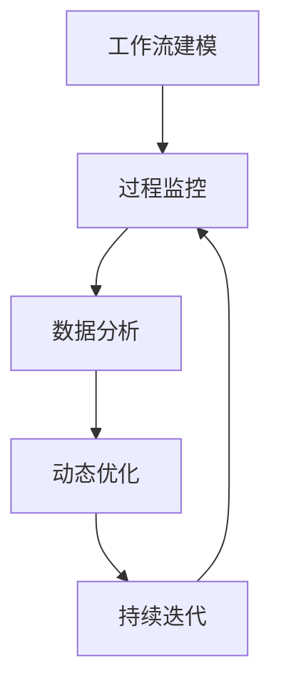
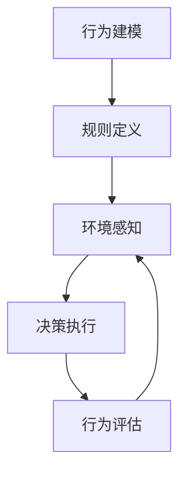

# AI代理在教育技术中的适应性工作流案例

## 1.背景介绍

### 1.1 教育技术的重要性

在当今快节奏的数字时代,教育技术(EdTech)已成为推动教育创新和提高教学质量的关键驱动力。通过将先进的技术与教学实践相结合,EdTech为教师和学生提供了更加互动、个性化和高效的学习体验。随着人工智能(AI)技术的不断进步,AI代理系统正在教育领域发挥越来越重要的作用。

### 1.2 AI代理在教育中的作用

AI代理是指能够根据特定目标自主执行任务的智能软件系统。在教育环境中,AI代理可以扮演多种角色,如智能教学助手、个性化学习导师、自动评分系统等。它们利用机器学习、自然语言处理和数据分析等技术,为学生提供个性化的学习体验,并协助教师优化教学流程。

### 1.3 适应性工作流的重要性

然而,要充分发挥AI代理在教育中的潜力,需要设计出高效、灵活的工作流程。适应性工作流能够根据不同的学习情景和需求动态调整AI代理的行为,从而提供更加贴合实际的解决方案。这种工作流不仅可以优化AI代理的性能,还能增强其与教师和学生的互动,提高教育效率。

## 2.核心概念与联系

### 2.1 AI代理

AI代理是一种能够感知环境、处理信息并采取行动以实现特定目标的智能系统。在教育领域,AI代理可以扮演多种角色,如:

- 智能教学助手:通过自然语言处理技术与学生进行对话,解答问题并提供个性化指导。
- 自动评分系统:利用机器学习算法对学生的作业、测试等进行自动评分和反馈。
- 个性化学习导师:根据学生的学习风格、兴趣和能力水平,提供定制化的学习资源和路径。

### 2.2 适应性工作流

适应性工作流(Adaptive Workflow)是一种能够根据环境变化动态调整执行流程的工作流管理系统。它通过持续监控工作流的执行情况,并根据预定义的规则或机器学习模型进行实时优化,从而提高工作流的效率和灵活性。

在教育技术中,适应性工作流可用于管理AI代理的行为,使其能够根据学生的反馈、学习进度和环境变化进行动态调整。这种灵活性有助于提供更加个性化和高效的学习体验。

### 2.3 AI代理与适应性工作流的结合

将AI代理与适应性工作流相结合,可以创建一个智能且灵活的教育系统。AI代理负责执行具体的教学任务,如提供个性化指导、自动评分等;而适应性工作流则管理和优化AI代理的行为,确保其能够根据实际情况做出适当的调整。

这种结合不仅可以提高AI代理的性能和效率,还能增强其与学生和教师的互动,从而提供更加贴合实际需求的教育解决方案。

## 3.核心算法原理具体操作步骤

### 3.1 适应性工作流管理

适应性工作流管理是实现AI代理适应性行为的关键。它包括以下几个核心步骤:

1. **工作流建模**:根据教学目标和场景,设计出初始的工作流模型,定义AI代理的行为和执行顺序。

2. **过程监控**:持续监控工作流的执行情况,收集相关数据,如学生反馈、学习进度等。

3. **数据分析**:利用机器学习算法和规则引擎对收集的数据进行分析,评估当前工作流的效率和合理性。

4. **动态优化**:根据分析结果,对工作流进行动态调整和优化,如改变AI代理的行为、调整执行顺序等。

5. **持续迭代**:重复上述步骤,不断优化工作流,以适应不断变化的教学环境和需求。

这个过程可以用下面的流程图来表示:



### 3.2 AI代理行为控制

适应性工作流的核心目标是控制AI代理的行为,使其能够根据实际情况做出合理的调整。这通常涉及以下几个步骤:

1. **行为建模**:为AI代理定义一系列可能的行为,如提供个性化反馈、调整教学难度等。

2. **规则定义**:根据教学目标和场景,制定一套规则,指导AI代理在特定条件下选择合适的行为。

3. **环境感知**:AI代理需要持续感知教学环境的变化,如学生的反馈、学习进度等。

4. **决策执行**:根据感知到的环境信息和预定义的规则,AI代理选择合适的行为并执行。

5. **行为评估**:评估AI代理的行为是否达到预期效果,作为下一次优化的依据。

这个过程可以用下面的流程图来表示:



通过上述步骤,AI代理可以根据实际教学情况动态调整自身行为,从而提供更加个性化和高效的学习体验。

## 4.数学模型和公式详细讲解举例说明

在适应性工作流和AI代理行为控制中,数学模型和算法扮演着重要角色。以下是一些常用的模型和公式:

### 4.1 马尔可夫决策过程(MDP)

马尔可夫决策过程(Markov Decision Process, MDP)是一种用于建模决策过程的数学框架。在教育技术中,MDP可用于描述AI代理在不同状态下采取行动的过程。

MDP由以下四个要素组成:

- 状态集合 $S$
- 行动集合 $A$
- 转移概率 $P(s'|s,a)$,表示在状态 $s$ 下执行行动 $a$ 后,转移到状态 $s'$ 的概率
- 奖励函数 $R(s,a)$,表示在状态 $s$ 下执行行动 $a$ 所获得的即时奖励

目标是找到一个策略 $\pi: S \rightarrow A$,使得期望的累积奖励最大化:

$$
\max_\pi \mathbb{E}\left[\sum_{t=0}^\infty \gamma^t R(s_t, a_t)\right]
$$

其中 $\gamma \in [0,1]$ 是折现因子,用于权衡即时奖励和长期奖励的重要性。

通过强化学习算法(如 Q-Learning、策略梯度等),AI代理可以学习到一个最优策略,指导其在不同教学情况下采取合适的行动。

### 4.2 协同过滤

协同过滤(Collaborative Filtering)是一种常用的推荐系统技术,可用于为学生推荐个性化的学习资源。基于学生的历史行为和其他学生的偏好,协同过滤可以预测某个学生对特定资源的兴趣程度。

常见的协同过滤算法包括基于用户的协同过滤和基于项目的协同过滤。以基于用户的协同过滤为例,其核心思想是找到与目标用户 $u$ 具有相似兴趣的其他用户集合 $N(u)$,然后根据这些相似用户对项目 $i$ 的评分,预测 $u$ 对 $i$ 的兴趣程度:

$$
\hat{r}_{u,i} = \overline{r}_u + \frac{\sum_{v \in N(u)}(r_{v,i} - \overline{r}_v)w(u,v)}{\sum_{v \in N(u)}|w(u,v)|}
$$

其中 $\overline{r}_u$ 和 $\overline{r}_v$ 分别表示用户 $u$ 和 $v$ 的平均评分, $w(u,v)$ 表示 $u$ 和 $v$ 的相似度。

通过协同过滤算法,AI代理可以为每个学生推荐最合适的学习资源,提供个性化的学习体验。

### 4.3 知识追踪

知识追踪(Knowledge Tracing)是一种用于评估学生对知识点掌握程度的技术。它可以帮助AI代理动态调整教学难度和内容,确保学生获得最佳的学习体验。

常用的知识追踪模型包括贝叶斯知识追踪(Bayesian Knowledge Tracing, BKT)和深度知识追踪(Deep Knowledge Tracing, DKT)等。以 BKT 为例,它将学生对知识点的掌握情况建模为一个隐马尔可夫模型:

$$
P(L_t = l_t | L_{t-1} = l_{t-1}, O_t = o_t) = P(L_t = l_t | L_{t-1} = l_{t-1}, O_t = o_t, \theta)
$$

其中 $L_t$ 表示时间步 $t$ 时学生对知识点的掌握情况(掌握或未掌握), $O_t$ 表示学生在时间步 $t$ 的观测结果(正确或错误)。通过估计模型参数 $\theta$,我们可以计算出学生掌握知识点的概率,从而指导AI代理的教学决策。

利用这些数学模型和算法,AI代理可以更好地感知学生的学习状态,并做出合理的行为调整,从而提供更加个性化和高效的教育服务。

## 5.项目实践:代码实例和详细解释说明

为了更好地理解适应性工作流和AI代理在教育技术中的应用,我们提供了一个基于 Python 的示例项目。该项目模拟了一个智能教学助手,它可以根据学生的反馈动态调整教学策略。

### 5.1 项目结构

```
adaptive-edtech-agent/
├── agent.py
├── environment.py
├── models/
│   ├── __init__.py
│   ├── bkt.py
│   └── mdp.py
├── utils.py
└── main.py
```

- `agent.py`: 定义了智能教学助手的行为和决策逻辑。
- `environment.py`: 模拟教学环境,包括学生、知识点等。
- `models/`: 包含了项目中使用的数学模型,如 BKT 和 MDP。
- `utils.py`: 一些实用程序函数。
- `main.py`: 项目入口点。

### 5.2 核心代码解释

#### 5.2.1 智能教学助手 (agent.py)

```python
class AdaptiveTeachingAgent:
    def __init__(self, env, bkt_model, mdp_model):
        self.env = env
        self.bkt_model = bkt_model
        self.mdp_model = mdp_model
        self.policy = self.mdp_model.get_optimal_policy()

    def teach(self, student, topic):
        state = self.env.get_state(student, topic)
        action = self.policy[state]
        self.env.take_action(action)
        observation = self.env.get_observation(student, topic)
        self.bkt_model.update(student, topic, observation)
        reward = self.env.get_reward(student, topic)
        self.mdp_model.update(state, action, reward)
```

智能教学助手利用 BKT 模型跟踪学生对知识点的掌握情况,并使用 MDP 模型决定采取何种教学行动。具体流程如下:

1. 获取当前教学状态 `state`。
2. 根据 MDP 模型的最优策略 `policy` 选择合适的教学行动 `action`。
3. 在教学环境中执行该行动,获取观测结果 `observation`。
4. 使用 `observation` 更新 BKT 模型,估计学生对知识点的掌握程度。
5. 获取该行动的即时奖励 `reward`,并用于更新 MDP 模型。

通过不断迭代上述过程,智能教学助手可以动态调整教学策略,提供个性化的学习体验。

#### 5.2.2 贝叶斯知识追踪 (models/bkt.py)

```python
class BKT:
    def __init__(self, num_knowledge, prior):
        self.num_knowledge = num_knowledge
        self.prior = prior
        self.mastery = np.zeros(num_knowledge)
        self.transition = np.zeros((num_knowledge, 2, 2))

    def update(self, student, topic, observation):
        mastered = self.mastery[topic]
        correct = observation == 1