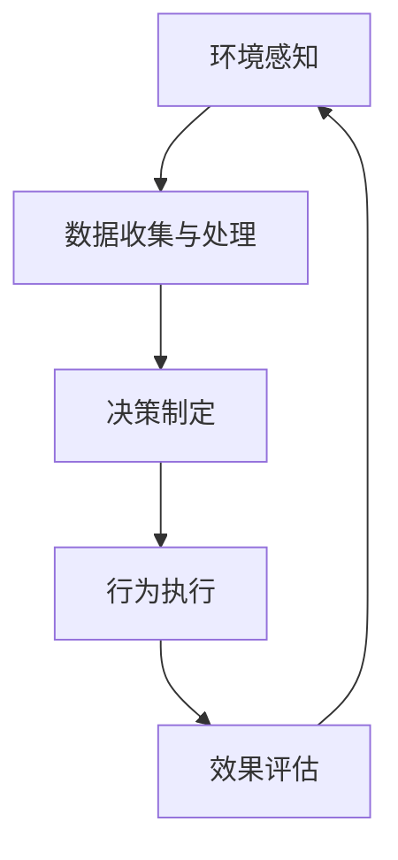
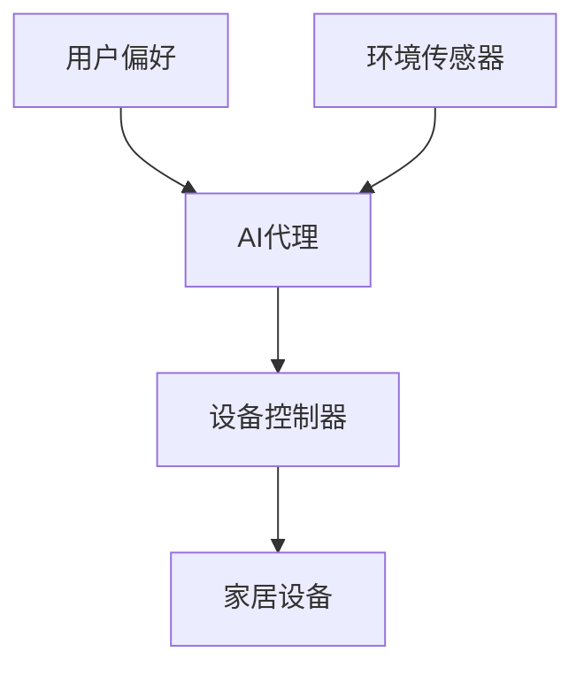

# AI代理在物联网(IoT)系统中的工作流设计

## 1.背景介绍

在当今快速发展的数字时代,物联网(IoT)技术正在改变我们的生活和工作方式。物联网系统通过将各种物理设备连接到互联网,实现了人与物、物与物之间的无缝通信和数据交换。随着物联网设备数量的激增,管理和协调这些设备的复杂性也与日俱增。这就为人工智能(AI)代理在物联网系统中的应用带来了巨大的机遇。

AI代理是一种软件实体,能够根据预定义的规则和算法自主地执行任务、做出决策并与环境进行交互。在物联网系统中,AI代理可以充当中介,协调和管理大量的物联网设备,提高系统的效率、可靠性和安全性。

## 2.核心概念与联系

### 2.1 物联网(IoT)

物联网是一个由互联网、传统telecommunication网络等多种信息承载体组成的信息平台,通过这个平台可以实现对物品的智能化识别、定位、跟踪、监控和管理。物联网将物理世界与虚拟世界相连接,实现了万物互联。

### 2.2 人工智能(AI)代理

人工智能代理是一种软件实体,能够感知环境,根据预定义的规则和算法做出决策,并在环境中执行相应的行为。AI代理具有自主性、响应性、主动性和社会性等特点。

在物联网系统中,AI代理可以扮演以下角色:

- **设备管理代理**: 管理和协调大量的物联网设备,实现设备的自动化配置、监控和故障排除。
- **数据处理代理**: 收集、过滤和处理来自物联网设备的大量数据,提取有价值的信息。
- **决策代理**: 基于预定义的规则和算法,对收集到的数据进行分析并做出相应的决策,如控制设备行为或触发特定操作。
- **安全代理**: 监控系统的安全状况,检测和防御潜在的威胁,保护物联网系统的安全和隐私。

### 2.3 AI代理与物联网系统的关系

AI代理在物联网系统中扮演着关键的角色,它们通过协调和管理大量的物联网设备,提高了系统的效率、可靠性和安全性。AI代理可以自主地执行任务,做出决策并与环境进行交互,从而减轻了人工干预的需求,提高了系统的自动化水平。

## 3.核心算法原理具体操作步骤

AI代理在物联网系统中的工作流程可以概括为以下几个主要步骤:



### 3.1 环境感知

AI代理首先需要感知物联网系统的环境,包括收集来自各种物联网设备的数据,如传感器数据、设备状态等。这一步骤通常涉及数据采集和预处理技术。

### 3.2 数据收集与处理

收集到的原始数据通常是海量的、异构的和不完整的。AI代理需要对这些数据进行过滤、清洗和转换,以提取有价值的信息。常用的数据处理技术包括数据融合、特征提取和降维等。

### 3.3 决策制定

基于处理后的数据,AI代理需要根据预定义的规则和算法做出相应的决策。这一步骤涉及各种机器学习和决策理论算法,如规则引擎、决策树、贝叶斯网络等。

### 3.4 行为执行

AI代理根据所做的决策,执行相应的行为,如控制物联网设备的操作、触发特定的事件或流程等。这一步骤需要与物联网设备进行交互和通信。

### 3.5 效果评估

AI代理需要评估其行为的效果,并根据反馈调整决策规则和算法,以优化未来的决策过程。这一步骤涉及反馈机制和强化学习等技术。

## 4.数学模型和公式详细讲解举例说明

在AI代理的工作流程中,数学模型和算法扮演着重要的角色。下面将介绍一些常用的数学模型和公式。

### 4.1 贝叶斯决策理论

贝叶斯决策理论是一种基于概率论的决策框架,它通过计算不同行为的期望效用,选择期望效用最大的行为作为最优决策。

设 $A$ 为代理可选的行为集合, $E$ 为环境状态集合, $P(e|a)$ 为在执行行为 $a$ 后环境转移到状态 $e$ 的概率, $U(e,a)$ 为在状态 $e$ 执行行为 $a$ 的效用函数,则代理的目标是找到一个行为 $a^*$,使期望效用 $EU(a)$ 最大化:

$$
a^* = \arg\max_{a \in A} EU(a) = \arg\max_{a \in A} \sum_{e \in E} P(e|a)U(e,a)
$$

### 4.2 马尔可夫决策过程(MDP)

马尔可夫决策过程是一种描述序列决策问题的数学框架,它假设环境的转移具有马尔可夫性,即下一状态只依赖于当前状态和行为,与过去的历史无关。

MDP可以用一个元组 $(S, A, P, R, \gamma)$ 来表示,其中:

- $S$ 是状态集合
- $A$ 是行为集合
- $P(s'|s,a)$ 是状态转移概率,表示在状态 $s$ 执行行为 $a$ 后转移到状态 $s'$ 的概率
- $R(s,a)$ 是即时奖励函数,表示在状态 $s$ 执行行为 $a$ 获得的即时奖励
- $\gamma \in [0,1)$ 是折现因子,用于权衡即时奖励和长期奖励的重要性

基于MDP,可以使用各种强化学习算法(如Q-Learning、策略梯度等)来求解最优策略 $\pi^*(s)$,使得期望累积奖励最大化:

$$
\pi^* = \arg\max_\pi \mathbb{E}\left[\sum_{t=0}^\infty \gamma^t R(s_t, a_t) | a_t = \pi(s_t)\right]
$$

### 4.3 多智能体系统

在复杂的物联网系统中,往往需要多个AI代理协同工作。这种情况可以用多智能体系统(Multi-Agent System, MAS)来建模。

在MAS中,每个代理都有自己的观察、行为和目标,但它们需要相互协作以实现共同的目标。常用的协作策略包括协商、竞争、合作等。

设有 $N$ 个代理,第 $i$ 个代理的策略为 $\pi_i$,环境状态为 $s$,则代理们的目标是找到一组策略 $\{\pi_1^*, \pi_2^*, \ldots, \pi_N^*\}$,使得全局奖励函数 $G(\pi_1, \pi_2, \ldots, \pi_N, s)$ 最大化:

$$
\{\pi_1^*, \pi_2^*, \ldots, \pi_N^*\} = \arg\max_{\pi_1, \pi_2, \ldots, \pi_N} G(\pi_1, \pi_2, \ldots, \pi_N, s)
$$

## 5.项目实践:代码实例和详细解释说明

为了更好地理解AI代理在物联网系统中的应用,我们将通过一个具体的项目实践来演示其工作流程。

### 5.1 项目概述

在这个项目中,我们将构建一个智能家居系统,其中包括多个物联网设备(如灯光、温度计、安全摄像头等)和一个AI代理。AI代理的任务是根据用户的偏好和环境状态,自动控制这些设备的行为,以提高家居环境的舒适性和安全性。

### 5.2 系统架构



1. 用户通过界面输入自己的偏好,如期望的室温、照明水平等。
2. 环境传感器(如温度计、光线传感器等)持续监测家居环境的状态。
3. AI代理根据用户偏好和环境状态,决定对哪些设备执行何种操作。
4. 设备控制器接收AI代理的指令,并控制相应的家居设备(如调节空调温度、开关灯光等)。
5. 家居设备的状态变化将反馈到环境传感器,形成闭环控制。

### 5.3 AI代理实现

我们将使用Python语言和PyTorch深度学习框架来实现AI代理。代码如下:

```python
import torch
import torch.nn as nn

# 定义环境状态和用户偏好的特征
state_features = ['temperature', 'light', 'humidity', 'time']
pref_features = ['target_temp', 'target_light']

# 定义设备操作
actions = ['adjust_ac', 'switch_light', 'no_op']

# 定义神经网络模型
class AgentModel(nn.Module):
    def __init__(self, state_dim, pref_dim, action_dim):
        super(AgentModel, self).__init__()
        self.fc1 = nn.Linear(state_dim + pref_dim, 64)
        self.fc2 = nn.Linear(64, action_dim)

    def forward(self, state, pref):
        x = torch.cat([state, pref], dim=1)
        x = torch.relu(self.fc1(x))
        x = self.fc2(x)
        return x

# 初始化模型
model = AgentModel(len(state_features), len(pref_features), len(actions))

# 训练模型
# ...

# 推理和决策
def agent(state, pref):
    state_tensor = torch.tensor(state, dtype=torch.float32)
    pref_tensor = torch.tensor(pref, dtype=torch.float32)
    action_scores = model(state_tensor, pref_tensor)
    action_idx = torch.argmax(action_scores).item()
    return actions[action_idx]
```

在这个示例中,我们使用一个简单的前馱神经网络作为AI代理的决策模型。该模型接受环境状态和用户偏好作为输入,输出每个可能操作的分数,代理选择分数最高的操作执行。

在实际应用中,您可以使用更复杂的模型(如递归神经网络、强化学习模型等)来提高决策的准确性和鲁棒性。

## 6.实际应用场景

AI代理在物联网系统中的应用场景非常广泛,包括但不限于:

### 6.1 智能家居

如前面的项目实践所示,AI代理可以用于智能家居系统,根据用户偏好和环境状态自动控制家居设备,提高生活舒适度和能源利用效率。

### 6.2 智能城市

在智能城市中,AI代理可以管理交通信号灯、街灯、安防监控等城市基础设施,优化城市运行效率、节约能源并提高公共安全。

### 6.3 智能制造

在智能工厂中,AI代理可以监控生产设备的运行状态,预测故障并进行预防性维护,提高生产效率和产品质量。

### 6.4 智能农业

AI代理可以根据气象数据、土壤数据等信息,自动控制温室大棚的环境条件(如温度、湿度、光照等),优化作物生长环境。

### 6.5 智能医疗

AI代理可以监测病人的生理数据,协助医生进行诊断和治疗决策,并自动调节医疗设备的工作状态。

### 6.6 智能供应链

在供应链管理中,AI代理可以协调物流、库存等环节,优化运输路线、节约成本并提高效率。

## 7.工具和资源推荐

在开发和部署AI代理应用于物联网系统时,以下工具和资源可能会有所帮助:

### 7.1 开发框架

- **TensorFlow**: Google开源的端到端机器学习平台,支持构建和部署AI模型。
- **PyTorch**: Facebook开源的机器学习框架,具有Python接口和动态计算图。
- **Apache MXNet**: 支持多种编程语言的开源深度学习框架。
- **Microsoft Cognitive Toolkit (CNTK)**: Microsoft开源的深度学习工具包。

### 7.2 物联网平台

- **AWS IoT**: Amazon Web Services提供的物联网平台,支持设备连接、数据处