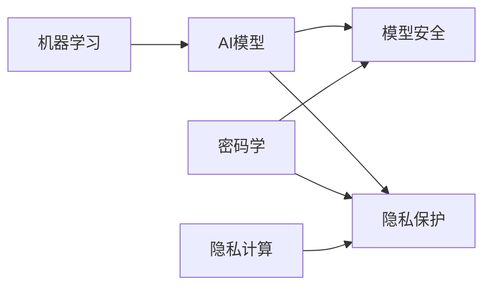

# AI模型安全与隐私保护原理与代码实战案例讲解

## 1. 背景介绍
### 1.1 AI模型安全与隐私保护的重要性
在人工智能快速发展的今天,AI模型已广泛应用于各个领域。然而,AI模型的安全与隐私问题也日益凸显。恶意攻击者可能会窃取模型参数、植入后门、投毒训练数据等方式破坏模型,造成严重后果。此外,AI模型训练过程中使用的数据可能包含敏感隐私信息,如果保护不当,将对个人隐私造成侵害。因此,AI模型安全与隐私保护已成为亟待解决的关键问题。

### 1.2 AI模型面临的安全隐私风险
AI模型主要面临以下几类安全隐私风险:

1. 模型窃取:攻击者通过访问API接口,推测出模型结构与参数,复制模型。
2. 数据中毒:攻击者操纵训练数据,使模型产生错误输出。 
3. 对抗样本攻击:攻击者构造特殊的输入,欺骗模型做出错误判断。
4. 模型逆向:攻击者根据模型输出,推测原始训练数据,窃取隐私。
5. 隐私泄露:模型训练数据、参数等包含个人隐私信息,有泄露风险。

### 1.3 AI模型安全隐私保护的目标
AI模型安全隐私保护主要有以下目标:

1. 保护模型机密性,防止模型结构、参数被窃取。
2. 保证模型完整性,防止模型被篡改、破坏。
3. 确保模型可用性,抵御各类攻击,保证模型正常工作。
4. 保护数据隐私,防止原始数据、用户隐私信息泄露。
5. 支持模型审计,记录模型生命周期各环节日志,供事后审计。

## 2. 核心概念与联系
### 2.1 机器学习基础
机器学习是AI的核心,其基本过程是:

1. 收集数据:收集大量有标签或无标签的原始数据。
2. 特征工程:对原始数据进行预处理,提取特征。 
3. 模型训练:用训练数据集训练机器学习模型。
4. 模型评估:用测试集评估模型性能,改进模型。
5. 模型应用:将训练好的模型部署应用。

### 2.2 AI模型分类
常见的AI模型可分为以下几类:

1. 监督学习:需要标注数据训练,如分类、回归模型。
2. 无监督学习:不需要标注数据,如聚类、降维模型。
3. 强化学习:通过与环境交互学习,如AlphaGo。
4. 迁移学习:利用已训练好的模型,快速适应新任务。
5. 联邦学习:多方协作训练模型,数据不出本地。

### 2.3 模型安全
模型安全主要关注模型自身的机密性、完整性、可用性,常用技术有:

1. 模型加密:同态加密、安全多方计算等,在加密状态下训练和推理。
2. 模型水印:在模型中嵌入水印,鉴别模型版权。
3. 模型混淆:将模型转换为难以理解的形式,防止逆向。
4. 模型剪枝:去除模型中的冗余结构,减小模型体积。
5. 对抗训练:加入对抗样本训练模型,提高鲁棒性。

### 2.4 隐私保护
隐私保护主要关注训练数据、用户隐私等信息不被泄露,常用技术有:

1. 差分隐私:在数据统计信息中加入随机噪声,保护个体隐私。
2. 同态加密:在加密状态下计算,保护数据隐私。
3. 安全多方计算:多方在不泄露隐私的前提下联合计算。
4. 联邦学习:数据存储在本地,模型参数多方聚合更新。
5. 可解释性:让模型决策过程可解释,增强用户信任。

### 2.5 技术关联
AI模型安全与隐私保护涉及机器学习、密码学、隐私计算等多个技术领域。它们相辅相成,共同保障AI模型的安全与隐私。



## 3. 核心算法原理具体操作步骤
本节介绍几种核心的AI模型安全与隐私保护算法。

### 3.1 同态加密
同态加密允许在密文上进行计算,得到加密后的计算结果,解密后与明文计算结果一致。常见算法有:

1. 半同态加密:只支持同态加法(Paillier)或同态乘法(ElGamal)运算。
2. 全同态加密:既支持同态加法也支持同态乘法运算,如BGV、CKKS等。

以CKKS为例,其主要步骤如下:

1. 生成公私钥对(pk,sk)。
2. 对明文数据m加密,得到密文ct。
3. 对密文进行同态计算,如加法ct1+ct2,乘法ct1×ct2。
4. 用私钥sk解密密文,得到明文计算结果。

### 3.2 差分隐私
差分隐私通过在数据发布时注入噪声,保证恶意者无法判断某个个体是否在数据集中。常见算法有:

1. Laplace机制:对数值型数据添加Laplace噪声。
2. 指数机制:对类别型数据进行指数化采样。

以Laplace机制为例,其主要步骤如下:

1. 设置隐私预算ε,噪声幅度与ε成反比。
2. 根据数据全局敏感度Δf,生成Laplace噪声Lap(Δf/ε)。
3. 将原始统计值f(x)与噪声相加,得到隐私化结果f(x)+Lap(Δf/ε)。

### 3.3 安全多方计算
安全多方计算允许多方在不泄露隐私的前提下进行联合计算。常见协议有:

1. 不经意传输(OT):发送方发送多项,接收方选择获取其中一项,双方均不知对方选择。
2. 秘密分享(SS):将秘密分割为多个子秘密,单独无法恢复,需共同参与才能还原。
3. Yao's 电路:将计算问题转换为电路求解,通过OT实现。

以秘密分享为例,其主要步骤如下:

1. 秘密拥有方将秘密s切分为n个子秘密s1,s2,...,sn。
2. 将子秘密分发给其他n-1个参与方。 
3. 参与方进行计算,中间结果以秘密分享形式流通。
4. 各方将计算结果的子秘密聚合,还原出最终结果。

### 3.4 联邦学习
联邦学习使各参与方在本地训练模型,通过交换模型参数而非原始数据来实现协作学习。以横向联邦学习为例,其主要步骤如下:

1. 各参与方在本地用自己的数据训练模型,得到本地模型参数。
2. 各方上传本地模型参数到服务器。
3. 服务器聚合各方模型参数,得到全局模型,下发给各方。
4. 各方用全局模型作为新的初始化模型,重复以上过程,直到模型收敛。

## 4. 数学模型和公式详细讲解举例说明
本节对几个关键的数学模型和公式进行详细讲解。

### 4.1 同态加密中的CKKS方案
CKKS全同态加密方案的核心是环上的学习与错误(RLWE)问题,其数学定义为:

$RLWE_{n,q,\chi}$
给定多项式环$R_q=\mathbb{Z}_q[X]/(X^n+1)$,其中n为2的幂次,q为模数。错误分布$\chi$在$R_q$上。已知$m$对RLWE样本 $(a_i,b_i)$,其中$a_i$在$R_q$上均匀随机取样,$b_i=a_i\cdot s+e_i$,错误项$e_i$根据$\chi$取样。则求解密钥$s$在计算上是困难的。

基于RLWE问题,CKKS方案的同态运算可表示为:

加法:$Enc(m_1)+Enc(m_2)=Enc(m_1+m_2)$
乘法:$Enc(m_1)\times Enc(m_2)=Enc(m_1\times m_2)$

其中$Enc()$表示CKKS加密算法。通过同态运算,可以在加密状态下直接计算密文,得到加密后的计算结果。

### 4.2 差分隐私中的Laplace机制
Laplace机制引入Laplace噪声实现差分隐私,其数学定义为:

给定函数$f:\mathbb{N}^{|X|}\to\mathbb{R}^k$,数据集$D\in\mathbb{N}^{|X|}$。函数$f$的全局敏感度为:
$$\Delta f=\max_{D,D'}\lVert f(D)-f(D')\rVert_1$$
其中$D$和$D'$为任意相邻数据集,即只相差一条记录。

定义$k$维Laplace分布$Lap(b)^k$的概率密度函数为:
$$Lap(x|b)=\frac{1}{2b}\exp(-\frac{|x|}{b})$$
其中$x\in\mathbb{R},b>0$为尺度参数。

Laplace机制$\mathcal{M}_L$在给定数据集$D$上定义为:
$$\mathcal{M}_L(D)=f(D)+(Y_1,\cdots,Y_k)$$
其中$Y_i$是独立同分布的随机变量,服从$Lap(\Delta f/\epsilon)$分布。

根据差分隐私定义,Laplace机制$\mathcal{M}_L$满足$\epsilon$-差分隐私。直观地看,敏感度$\Delta f$度量了函数$f$对单条记录变化的敏感程度,噪声幅度与$\Delta f$成正比,与隐私预算$\epsilon$成反比。$\epsilon$越小,隐私保护强度越大。

### 4.3 安全多方计算中的秘密分享方案
秘密分享(SS)允许将一个秘密分割成多个子秘密,单个子秘密不泄露任何信息,需要至少一定数量的子秘密才能还原原秘密。

以Shamir秘密分享方案为例,假设有$n$个参与方,秘密为$s$,阈值为$t$。秘密分享步骤如下:

1. 在有限域$GF(p)$上选择$t-1$个随机系数$a_1,\cdots,a_{t-1}$,定义$t-1$次多项式:
$$f(x)=a_0+a_1x+a_2x^2+\cdots+a_{t-1}x^{t-1} \mod p$$
其中$a_0=s$为待分享的秘密。

2. 选择$n$个不同的值$x_1,\cdots,x_n$,计算$y_i=f(x_i),i=1,2,\cdots,n$。

3. 将子秘密$(x_i,y_i)$分发给参与方$i,i=1,2,\cdots,n$。

秘密恢复步骤如下:

1. 收集任意$t$个子秘密$(x_i,y_i),i=1,2,\cdots,t$。

2. 利用Lagrange插值公式还原出多项式$f(x)$:

$$f(x)=\sum_{i=1}^ty_i\prod_{j=1,j\neq i}^t\frac{x-x_j}{x_i-x_j}$$

3. 计算$s=f(0)$即为原始秘密。

Shamir秘密分享方案的安全性基于多项式插值问题的难度。只有收集到至少$t$个点才能还原出次数为$t-1$的多项式,从而恢复秘密$s$。

## 5. 项目实践:代码实例和详细解释说明
本节通过Python代码实例,演示几种关键技术的实现。

### 5.1 同态加密实例
以下代码使用了微软的SEAL库实现了一个简单的CKKS同态加密计算过程。

```python
from seal import *

# 设置CKKS{"msg_type":"generate_answer_finish","data":"","from_module":null,"from_unit":null}