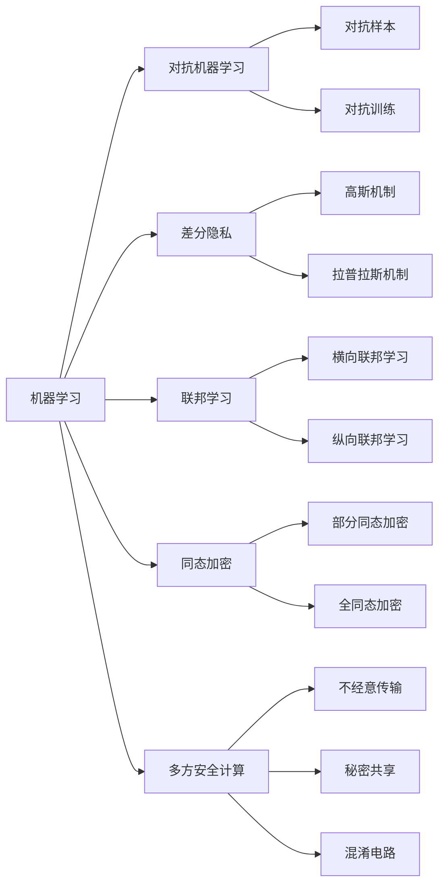

# AI模型安全与隐私保护原理与代码实战案例讲解

## 1.背景介绍

随着人工智能技术的飞速发展,AI模型在各个领域得到了广泛应用。然而,AI模型的安全性和隐私性问题日益凸显。恶意攻击者可能会窃取模型参数、植入后门、投毒训练数据等方式破坏模型的完整性和可用性。同时,AI模型训练和推理过程中涉及大量隐私数据,如何保护用户隐私不被泄露和滥用也成为亟待解决的问题。本文将深入探讨AI模型安全与隐私保护的原理,并结合代码实战案例进行详细讲解。

### 1.1 AI模型面临的安全威胁
#### 1.1.1 模型窃取
#### 1.1.2 数据中毒攻击  
#### 1.1.3 对抗样本攻击
#### 1.1.4 模型后门攻击

### 1.2 AI系统隐私泄露风险
#### 1.2.1 训练数据隐私泄露
#### 1.2.2 模型反向推理隐私数据
#### 1.2.3 推理结果隐私泄露

### 1.3 AI安全隐私保护的重要性
#### 1.3.1 保障AI系统的可靠性和鲁棒性
#### 1.3.2 保护用户隐私权益
#### 1.3.3 促进AI技术健康可持续发展

## 2.核心概念与联系

本节将介绍AI模型安全与隐私保护涉及的一些核心概念,并阐述它们之间的内在联系。

### 2.1 机器学习基础
#### 2.1.1 有监督学习与无监督学习  
#### 2.1.2 经验风险最小化
#### 2.1.3 损失函数与优化算法

### 2.2 对抗机器学习
#### 2.2.1 对抗样本的定义与分类
#### 2.2.2 对抗训练 
#### 2.2.3 对抗检测

### 2.3 差分隐私
#### 2.3.1 差分隐私的定义
#### 2.3.2 高斯机制与拉普拉斯机制
#### 2.3.3 差分隐私在机器学习中的应用

### 2.4 联邦学习
#### 2.4.1 联邦学习的概念与分类
#### 2.4.2 横向联邦学习与纵向联邦学习
#### 2.4.3 联邦学习中的隐私保护机制

### 2.5 同态加密
#### 2.5.1 部分同态加密与全同态加密
#### 2.5.2 同态加密在机器学习中的应用

### 2.6 多方安全计算
#### 2.6.1 不经意传输协议
#### 2.6.2 秘密共享
#### 2.6.3 混淆电路

下图展示了上述核心概念之间的联系:

## 3.核心算法原理具体操作步骤

本节将详细介绍几种AI模型安全与隐私保护的核心算法原理,并给出具体操作步骤。

### 3.1 DPSGD算法
DPSGD(Differentially Private Stochastic Gradient Descent)是一种在机器学习训练过程中实现差分隐私保护的优化算法。其基本思想是在每轮迭代计算梯度时,对梯度添加随机噪声,以保护训练数据隐私不被泄露。

#### 3.1.1 算法步骤
1) 设置隐私预算 $\epsilon$ 和迭代次数 $T$
2) 初始化模型参数 $\theta_0$
3) for $t=1$ to $T$ do:
   - 从训练集 $D$ 中采样小批量数据 $B_t$
   - 计算 $B_t$ 上的梯度 $g_t=\frac{1}{|B_t|}\sum_{i \in B_t}\triangledown_{\theta}L(\theta_{t-1},x_i)$
   - 梯度裁剪: $\bar{g}_t = g_t/max(1,\frac{\Vert g_t \Vert_2}{C})$
   - 添加高斯噪声: $\tilde{g}_t = \bar{g}_t + \mathcal{N}(0,\sigma^2C^2\mathbf{I})$, 其中 $\sigma=\sqrt{2\ln(1.25/\delta)}/\epsilon$
   - 更新模型参数: $\theta_t=\theta_{t-1}-\eta_t\tilde{g}_t$
4) 输出最终模型参数 $\theta_T$

其中, $L$ 为损失函数, $C$ 为梯度范数裁剪阈值, $\mathbf{I}$ 为单位矩阵, $\eta_t$ 为学习率。

### 3.2 FedAvg算法
FedAvg(Federated Averaging)是联邦学习中最常用的聚合算法,可以在参与方之间交换模型参数,同时不泄露本地数据隐私。

#### 3.2.1 算法步骤
1) 服务器初始化全局模型参数 $\theta_0$,发送给所有参与方
2) for each round $t=1,2,...$ do:
   - 服务器从参与方集合中选择一个子集 $S_t$,发送当前全局模型参数 $\theta_{t-1}$
   - 每个选中的参与方 $k \in S_t$ 在本地数据 $D_k$ 上进行如下操作:
     - 用全局模型参数 $\theta_{t-1}$ 初始化本地模型参数 $\theta_t^k$
     - for each local epoch $i$ from 1 to $E$ do:
       - 从 $D_k$ 中采样小批量数据 $b$
       - 在 $b$ 上计算梯度 $g_i^k=\triangledown_{\theta}L_k(\theta_{t,i-1}^k,b)$  
       - 更新本地模型参数 $\theta_{t,i}^k=\theta_{t,i-1}^k-\eta g_i^k$
     - 发送本地模型参数 $\theta_{t}^k$ 给服务器
   - 服务器聚合收到的本地模型参数,更新全局模型参数:
     $\theta_t=\sum_{k \in S_t}\frac{n_k}{n}\theta_t^k$ 
   - 服务器将更新后的全局模型参数 $\theta_t$ 发送给所有参与方

其中, $L_k$ 为参与方 $k$ 的本地目标函数, $n_k$ 为参与方 $k$ 的样本数量, $n$ 为所有参与方样本数量之和, $\eta$ 为学习率。

### 3.3 SecureML协议
SecureML是一种基于多方安全计算的隐私保护机器学习协议,可以在不泄露各方数据的情况下,联合训练机器学习模型。

#### 3.3.1 协议步骤
1) 各参与方 $P_1,P_2,...,P_m$ 将本地数据 $X_i$ 加密为 $[[X_i]]$,发送给其他参与方
2) 各参与方 $P_i$ 在密文域中计算 $[[\sum_{i=1}^m X_i]]$,得到加密的全局数据集
3) 各参与方 $P_i$ 在密文域中进行以下迭代,直到模型收敛:
   - 计算加密的梯度 $[[\triangledown f(\theta;X)]]$ 
   - 解密梯度 $\triangledown f(\theta;X)$ 并更新模型参数 $\theta$
   - 加密更新后的模型参数 $[[\theta]]$ 并发送给其他参与方
4) 输出最终的模型参数 $\theta$

其中, $f$ 为模型的目标函数, $\theta$ 为模型参数, $[[·]]$ 表示对数据进行加密。

## 4.数学模型和公式详细讲解举例说明

本节将详细讲解AI模型安全与隐私保护中涉及的几个关键数学模型和公式,并给出具体的举例说明。

### 4.1 差分隐私的数学定义
差分隐私是一种隐私保护模型,其核心思想是在统计查询的结果中引入随机噪声,使得攻击者无法从结果中推断出单个样本的隐私信息。形式化地,差分隐私定义如下:

给定两个相邻数据集 $D$ 和 $D'$,它们之间只相差一条记录。一个随机算法 $\mathcal{M}$ 满足 $(\epsilon,\delta)$-差分隐私,当且仅当对任意相邻数据集 $D,D'$ 和任意输出集合 $S \subseteq Range(\mathcal{M})$,有:

$$
\Pr[\mathcal{M}(D) \in S] \leq e^{\epsilon} \cdot \Pr[\mathcal{M}(D') \in S] + \delta
$$

其中, $\epsilon$ 为隐私预算, $\delta$ 为松弛项。 $\epsilon$ 越小,隐私保护程度越高, $\delta$ 一般取很小的值如 $10^{-5}$。

举例说明:假设一个数据分析师想要统计某个敏感数据集中样本的平均年龄。为了保护个人隐私,分析师在真实平均年龄上加入了均值为0、标准差为 $\sigma$ 的高斯噪声。那么,这个加噪算法 $\mathcal{M}$ 满足 $(\epsilon,\delta)$-差分隐私,其中 $\epsilon=\frac{1}{\sigma}$。直观地,噪声标准差 $\sigma$ 越大,隐私保护强度 $\epsilon$ 越小。

### 4.2 高斯机制与拉普拉斯机制
高斯机制和拉普拉斯机制是实现差分隐私的两种常用方法,分别适用于不同的查询函数类型。

高斯机制适用于对数值型查询函数进行差分隐私保护。对于查询函数 $f:D \to \mathbb{R}^d$,高斯机制定义为:

$$
\mathcal{M}_G(D,f,\epsilon)=f(D)+\mathcal{N}(0,\sigma^2\mathbf{I}_d)
$$

其中, $\mathcal{N}(0,\sigma^2\mathbf{I}_d)$ 为 $d$ 维均值为0、协方差矩阵为 $\sigma^2\mathbf{I}_d$ 的高斯分布, $\sigma=\frac{\Delta_2 f}{\epsilon}$, $\Delta_2 f$ 为 $f$ 的 $L_2$ 敏感度。

拉普拉斯机制适用于对数值型或类别型查询函数进行差分隐私保护。对于查询函数 $f:D \to \mathbb{R}^d$,拉普拉斯机制定义为:

$$
\mathcal{M}_L(D,f,\epsilon)=f(D)+Lap(\frac{\Delta_1 f}{\epsilon})^d
$$

其中, $Lap(\frac{\Delta_1 f}{\epsilon})$ 为尺度参数为 $\frac{\Delta_1 f}{\epsilon}$ 的拉普拉斯分布, $\Delta_1 f$ 为 $f$ 的 $L_1$ 敏感度。

举例说明:假设要对一个敏感数据集的年龄列进行均值查询,真实均值为50岁。为了满足差分隐私,可以使用高斯机制,设置隐私预算 $\epsilon=0.1$,年龄最大值为120,则 $L_2$ 敏感度 $\Delta_2 f=120$。那么,噪声标准差 $\sigma=\frac{120}{0.1}=1200$,加噪后的年龄均值为 $50+\mathcal{N}(0,1200^2)$。

### 4.3 梯度范数裁剪
梯度范数裁剪是一种常用的梯度处理技术,通过限制梯度的 $L_2$ 范数不超过某个阈值,可以防止梯度爆炸,提高训练稳定性。同时,它也是实现差分隐私随机梯度下降(DP-SGD)的关键步骤之一。

给定梯度 $\mathbf{