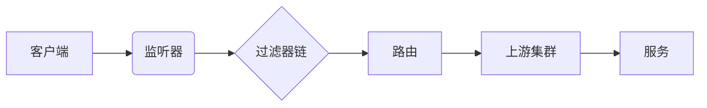

## 1.背景介绍

Envoy是一个开源的边缘和服务代理，专为云原生应用设计。它是一种高性能、可扩展的、分布式的代理，可以用于任何服务网格，包括Istio, Consul Connect等。Envoy的主要特点是其对HTTP/2和gRPC的一流支持，以及其可观察性，这些都是现代云原生应用程序的必备特性。

## 2.核心概念与联系

Envoy的核心概念包括：监听器（Listeners）、过滤器链（Filter Chains）、路由（Routes）和上游集群（Upstreams）。监听器是Envoy代理的入口点，它定义了代理如何接收连接。过滤器链是一组过滤器，用于处理和转换进入和离开Envoy代理的流量。路由是确定请求如何路由到上游集群的规则。上游集群是Envoy代理可以转发请求的服务集群。

这些概念之间的联系可以用下面的Mermaid流程图表示：



## 3.核心算法原理具体操作步骤

Envoy的核心算法原理包括：连接处理、流量处理和路由决策。连接处理是由监听器完成的，它接收来自客户端的连接，并根据过滤器链进行处理。流量处理是由过滤器链完成的，它负责处理和转换进入和离开Envoy代理的流量。路由决策是由路由完成的，它根据请求的属性（如URL、头信息等）决定将请求转发到哪个上游集群。

## 4.数学模型和公式详细讲解举例说明

Envoy的路由决策是基于权重的，这是一个典型的概率模型问题。假设我们有n个上游集群，每个集群的权重为$w_i$，那么一个请求被路由到第i个集群的概率$p_i$可以用以下公式表示：

$$
p_i = \frac{w_i}{\sum_{j=1}^{n} w_j}
$$

这个公式说明，一个集群被选中的概率与其权重成正比，与所有集群权重之和成反比。

## 5.项目实践：代码实例和详细解释说明

接下来，我们将通过一个简单的例子来说明如何在项目中使用Envoy。我们将创建一个简单的HTTP服务，并使用Envoy代理来路由请求。

首先，我们需要创建一个Envoy配置文件，定义监听器、过滤器链和上游集群。配置文件可能如下所示：

```yaml
admin:
  access_log_path: /tmp/admin_access.log
  address:
    socket_address: { address: 0.0.0.0, port_value: 9901 }

static_resources:
  listeners:
  - name: listener_0
    address:
      socket_address: { address: 0.0.0.0, port_value: 10000 }
    filter_chains:
    - filters:
      - name: envoy.http_connection_manager
        typed_config:
          "@type": type.googleapis.com/envoy.config.filter.network.http_connection_manager.v2.HttpConnectionManager
          stat_prefix: ingress_http
          route_config:
            name: local_route
            virtual_hosts:
            - name: local_service
              domains: ["*"]
              routes:
              - match: { prefix: "/" }
                route: { cluster: service_cluster }
          http_filters:
          - name: envoy.router
  clusters:
  - name: service_cluster
    connect_timeout: 0.25s
    type: STRICT_DNS
    lb_policy: ROUND_ROBIN
    load_assignment:
      cluster_name: service_cluster
      endpoints:
      - lb_endpoints:
        - endpoint:
            address:
              socket_address:
                address: service
                port_value: 8080
```

然后，我们可以启动Envoy代理，并将请求发送到代理：

```bash
$ envoy -c envoy.yaml
$ curl http://localhost:10000
```

这个例子显示了如何使用Envoy代理来路由请求到一个HTTP服务。

## 6.实际应用场景

Envoy广泛用于微服务架构中，作为服务间通信的代理。它可以提供负载均衡、服务发现、流量转移、熔断、重试、超时、请求/响应转换等功能。

此外，Envoy还可以用于API网关，处理进入和离开服务网格的流量。它可以提供路由、认证、授权、限流、日志、监控等功能。

## 7.工具和资源推荐

如果你想深入学习Env