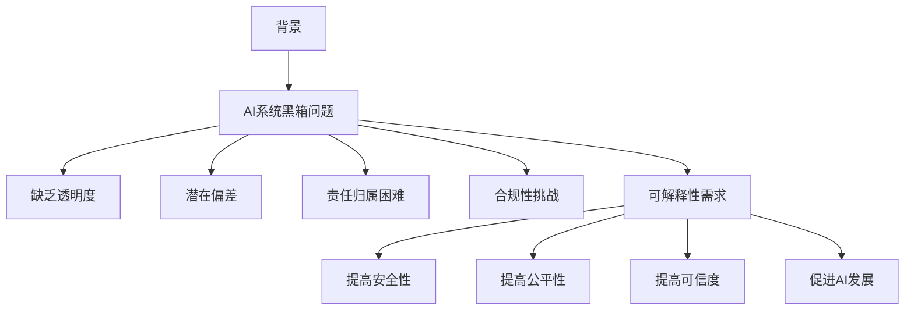
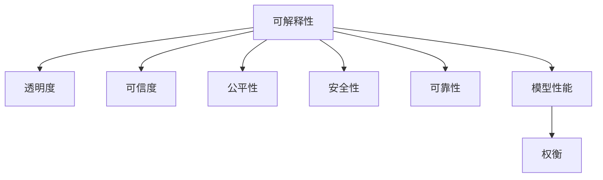
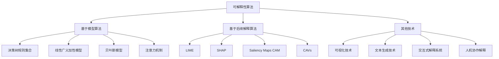

# AI系统可解释性原理与代码实战案例讲解

## 1.背景介绍

随着人工智能系统在各个领域的广泛应用,AI系统的可解释性(Explainable AI, XAI)成为了一个越来越受关注的重要课题。可解释性旨在使AI系统的决策过程和结果更加透明、可理解和可解释,从而提高人们对AI系统的信任和可控性。

在现实世界中,AI系统常常需要处理复杂的、高维度的数据,并基于这些数据做出决策或预测。然而,这些系统的内部工作机制通常是一个黑箱,很难让人类直观地理解其决策的原因和过程。这可能会导致一些潜在的风险和问题,例如:

1. **缺乏透明度**: AI系统的决策过程缺乏透明度,无法追溯其决策的依据和推理过程,从而降低了人们对系统的信任度。

2. **潜在偏差**: AI系统可能存在潜在的偏差或歧视,但由于缺乏可解释性,很难发现和纠正这些问题。

3. **责任归属困难**: 当AI系统出现错误或不当行为时,由于缺乏可解释性,很难确定错误的根源和相关责任人。

4. **合规性挑战**: 在一些需要高度透明度和可解释性的领域(如金融、医疗等),传统的黑箱AI系统可能无法满足法规要求。

因此,提高AI系统的可解释性对于保证系统的安全性、公平性和可信度至关重要。可解释性不仅有助于人类更好地理解和监督AI系统,还可以促进人工智能的发展,使AI系统更加可靠、透明和有益。

### Mermaid流程图:

## 2.核心概念与联系

在探讨AI系统可解释性的原理和方法之前,我们需要先了解一些核心概念及其相互关系。

### 2.1 可解释性(Explainability)

可解释性是指AI系统能够以人类可理解的方式解释其决策过程和结果的能力。一个具有良好可解释性的AI系统应当能够回答以下几个关键问题:

1. **为什么做出这个决策?** 系统应该能够解释其决策背后的原因和依据。

2. **是如何做出这个决策的?** 系统应该能够解释其内部的决策过程和推理机制。

3. **决策的强度和确信度如何?** 系统应该能够量化其决策的置信度或不确定性程度。

4. **决策是否存在偏差?** 系统应该能够识别和解释其决策中可能存在的偏差或歧视。

5. **如何改进或纠正决策?** 系统应该能够提供反馈和建议,以改进或纠正不当的决策。

### 2.2 可解释性与其他AI属性的关系

可解释性与AI系统的其他重要属性密切相关,例如:

- **透明度(Transparency)**: 透明度是可解释性的基础,指AI系统的内部机制和决策过程对外部可见和可审计。

- **可信度(Trustworthiness)**: 可解释性有助于提高人们对AI系统的信任度,从而增强系统的可信度。

- **公平性(Fairness)**: 可解释性有助于发现和纠正AI系统中存在的偏差和歧视,从而提高系统的公平性。

- **安全性(Safety)**: 通过可解释性,我们可以更好地监控和控制AI系统的行为,从而提高系统的安全性。

- **可靠性(Reliability)**: 可解释性有助于我们理解AI系统的局限性和不确定性,从而提高系统的可靠性。

- **可解释性与模型性能之间的权衡**: 在某些情况下,提高模型的可解释性可能会牺牲一定的性能表现。我们需要在两者之间寻求合理的平衡。

### Mermaid流程图:

## 3.核心算法原理具体操作步骤

提高AI系统的可解释性需要采用一些专门的算法和技术。这些算法通常分为以下几类:

### 3.1 基于模型的可解释性算法

这类算法旨在设计具有内在可解释性的机器学习模型,使得模型的决策过程和推理机制本身就具有一定的可解释性。常见的算法包括:

1. **决策树(Decision Tree)和规则集合(Rule Ensemble)**: 决策树和规则集合模型的决策过程可以用一系列易于理解的 "if-then" 规则来表示,因此具有很好的可解释性。

2. **线性模型(Linear Models)和广义加性模型(Generalized Additive Models, GAM)**: 这些模型的预测结果可以表示为输入特征的加权线性组合,因此具有较好的可解释性。

3. **贝叶斯模型(Bayesian Models)**: 贝叶斯模型可以通过概率推理来解释其决策过程,并量化决策的不确定性。

4. **注意力机制(Attention Mechanism)**: 在深度学习模型中,注意力机制可以显式地捕捉输入特征对模型决策的贡献,从而提高可解释性。

### 3.2 基于后续解释的算法

这类算法旨在为现有的黑箱模型(如深度神经网络)提供解释,通过分析模型的输入、输出和内部状态来推断模型的决策过程。常见的算法包括:

1. **LIME(Local Interpretable Model-Agnostic Explanations)**: LIME通过训练一个局部的可解释模型来近似拟合黑箱模型在局部区域的行为,从而解释黑箱模型的决策。

2. **SHAP(SHapley Additive exPlanations)**: SHAP基于合作游戏理论中的夏普利值(Shapley value)来量化每个输入特征对模型预测结果的贡献,从而解释模型的决策过程。

3. **Saliency Maps和类激活映射(Class Activation Mapping, CAM)**: 这些技术通过可视化神经网络中不同层的激活值,来解释网络对输入数据的响应和注意力分布。

4. **概念激活向量(Concept Activation Vectors, CAVs)**: CAVs通过将人类可解释的概念(如颜色、形状等)编码为向量,并测量这些概念向量与神经网络激活模式之间的相似性,从而解释网络的决策过程。

### 3.3 其他可解释性技术

除了上述算法,还有一些其他技术可以提高AI系统的可解释性,例如:

1. **可视化技术**: 通过各种可视化手段(如热力图、saliency maps等)直观地展示模型的决策过程和注意力分布。

2. **文本生成技术**: 通过自然语言生成技术,使AI系统能够用自然语言解释其决策过程和推理逻辑。

3. **交互式解释系统**: 设计交互式界面,让用户能够与AI系统进行对话,提出问题并获得解释。

4. **人机协作解释**: 结合人工和机器的优势,通过人机协作的方式生成更加全面和可解释的决策解释。

### Mermaid流程图:

## 4.数学模型和公式详细讲解举例说明

在探讨可解释性算法的数学原理时,我们需要涉及一些重要的概念和公式。下面将对其中一些核心内容进行详细讲解和举例说明。

### 4.1 SHAP(SHapley Additive exPlanations)

SHAP是一种广泛使用的可解释性算法,它基于合作游戏理论中的夏普利值(Shapley value)来量化每个输入特征对模型预测结果的贡献。

在合作游戏理论中,夏普利值用于公平分配游戏中的收益。对于一个机器学习模型,我们可以将其预测结果视为一个合作游戏,输入特征就是游戏中的参与者,模型的预测结果就是游戏的收益。夏普利值则用于量化每个输入特征对预测结果的贡献。

具体来说,对于一个给定的预测实例 $x$,模型的预测结果可以表示为:

$$f(x) = \phi_0 + \sum_{i=1}^M \phi_i$$

其中 $\phi_0$ 是一个常数项,表示在没有任何输入特征的情况下模型的平均预测值; $\phi_i$ 则表示第 $i$ 个输入特征对预测结果的贡献。

SHAP 算法的目标是计算每个 $\phi_i$,即每个输入特征的 Shapley 值。Shapley 值的计算公式如下:

$$\phi_i = \sum_{S \subseteq N \backslash \{i\}} \frac{|S|!(M-|S|-1)!}{M!}[f_{x}(S \cup \{i\}) - f_{x}(S)]$$

其中 $N$ 是所有输入特征的集合, $|S|$ 表示集合 $S$ 的基数, $f_x(S)$ 表示在只考虑输入特征集合 $S$ 的情况下模型对实例 $x$ 的预测值。

这个公式的含义是,对于每个输入特征 $i$,我们计算它在所有可能的特征组合中对预测结果的平均边际贡献,并将这些贡献加权平均,就得到了该特征的 Shapley 值。

需要注意的是,直接计算 Shapley 值是非常耗时的,因为它需要遍历所有可能的特征组合。因此,SHAP 提出了一些近似计算方法,如 Kernel SHAP 和 Tree SHAP 等,以提高计算效率。

### 4.2 LIME(Local Interpretable Model-Agnostic Explanations)

LIME 是另一种常用的可解释性算法,它通过训练一个局部的可解释模型来近似拟合黑箱模型在局部区域的行为,从而解释黑箱模型的决策。

具体来说,对于一个给定的预测实例 $x$,LIME 算法的步骤如下:

1. 在 $x$ 的邻域内采样一些新的实例 $x'$,并获取黑箱模型对这些实例的预测结果 $f(x')$。

2. 衡量每个新实例 $x'$ 与原始实例 $x$ 之间的相似性,计算一个相似性权重 $\pi_{x}(x')$。

3. 使用加权最小二乘法训练一个局部的可解释模型 $g$,使得它能够很好地近似拟合黑箱模型在局部区域的行为,即最小化以下目标函数:

$$\xi(x) = \arg\min_{g \in \mathcal{G}} \sum_{x' \in X'} \pi_{x}(x')(g(x') - f(x'))^2$$

其中 $\mathcal{G}$ 是一个可解释模型的集合,如线性模型或决策树等。

4. 使用训练好的局部可解释模型 $g$ 来解释黑箱模型对实例 $x$ 的预测结果。由于 $g$ 是一个可解释的模型,我们可以分析它的结构和参数来理解黑箱模型的决策过程。

LIME 算法的关键在于,它只需要在局部区域内近似拟合黑箱模型的行为,而不需要完全解释整个模