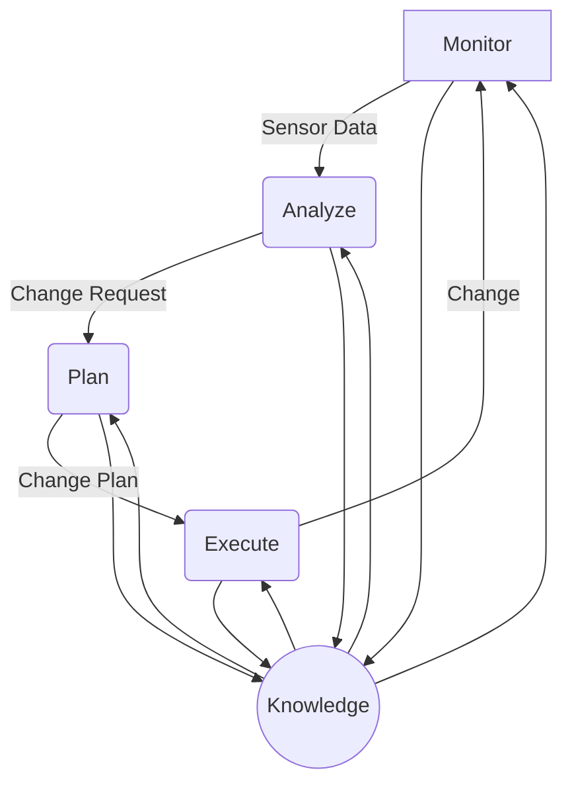

# AI系统故障自愈原理与代码实战案例讲解

## 1.背景介绍

### 1.1 系统故障的重要性

在当今的数字化时代,人工智能(AI)系统无处不在,从智能助手到自动驾驶汽车,再到医疗诊断和金融分析等领域。然而,随着这些系统越来越复杂,确保它们的可靠性和健壮性变得至关重要。即使是最小的故障也可能导致严重的后果,例如财务损失、安全隐患或信任度下降。因此,建立有效的故障自愈机制对于AI系统的长期可持续发展至关重要。

### 1.2 故障自愈的挑战

实现AI系统的故障自愈并非一蹴而就。这需要解决多个复杂的挑战,包括:

- **故障检测**: 及时准确地检测系统中的故障是第一步,这需要对系统进行持续监控并建立合适的异常检测模型。

- **根本原因分析**: 仅仅检测到故障是不够的,还需要深入分析故障的根本原因,以便采取有效的纠正措施。

- **自动恢复**: 一旦确定了故障原因,系统需要能够自动执行必要的恢复操作,将系统恢复到正常运行状态。

- **动态调整**: 在恢复过程中,系统可能需要动态调整资源分配、模型参数等,以适应变化的环境和需求。

- **持续学习**: 通过记录和分析历史故障数据,系统应该能够不断学习和改进其故障自愈能力。

### 1.3 本文概述

本文将深入探讨AI系统故障自愈的原理和实践。我们将介绍核心概念、算法原理、数学模型,并通过实际案例和代码示例,帮助读者全面了解如何构建具有自我修复能力的AI系统。最后,我们将讨论未来发展趋势和挑战,为读者提供更广阔的视野。

## 2.核心概念与联系

### 2.1 自主计算

自主计算(Autonomic Computing)是故障自愈系统的核心理念。它源于生物系统的自我管理和自我修复能力,旨在赋予计算机系统类似的自主能力。自主计算系统能够自我配置、自我优化、自我修复和自我保护,从而减轻人工管理的负担,提高系统的可靠性和可用性。

### 2.2 MAPE-K 控制循环

MAPE-K控制循环是自主计算系统的关键组成部分,它描述了系统如何持续监控、分析、规划和执行自我管理操作。



1. **Monitor(监控)**: 持续收集系统的运行数据,包括性能指标、日志信息等。
2. **Analyze(分析)**: 基于监控数据,检测系统中的异常情况并确定故障的根本原因。
3. **Plan(规划)**: 根据分析结果,制定恢复策略和行动计划。
4. **Execute(执行)**: 执行规划好的恢复操作,将系统恢复到正常状态。
5. **Knowledge(知识库)**: 存储系统的配置信息、策略规则、历史数据等,为控制循环的各个环节提供支持。

### 2.3 故障自愈的层次

故障自愈可以在不同的层次上实现,从底层的硬件和操作系统,到中间层的中间件和应用程序,再到顶层的整体系统和服务。不同层次的故障自愈机制通常是相互关联和协同工作的。

## 3.核心算法原理具体操作步骤 

### 3.1 故障检测算法

#### 3.1.1 基于阈值的异常检测

最简单的故障检测方法是基于阈值的异常检测。我们可以为系统中的关键指标(如CPU利用率、内存使用量等)设置合理的阈值范围。当指标值超出该范围时,就会触发异常警报。

$$
异常 = \begin{cases}
    真, & \text{if } x < 阈值_{下限} \text{ or } x > 阈值_{上限}\\
    假, & \text{otherwise}
\end{cases}
$$

其中$x$表示被监控的指标值。

虽然简单直观,但这种方法存在一些局限性:

- 难以为所有指标设置合适的阈值范围
- 无法检测微妙的异常模式
- 可能产生大量误报或漏报

#### 3.1.2 基于统计的异常检测

另一种常见的方法是基于统计的异常检测。我们可以建立系统指标的正常行为模型,并使用统计技术(如高斯分布、核密度估计等)来检测偏离正常模式的异常情况。

$$
p(x) = \frac{1}{\sqrt{2\pi\sigma^2}}e^{-\frac{(x-\mu)^2}{2\sigma^2}}
$$

其中$p(x)$表示$x$的概率密度函数,$\mu$和$\sigma^2$分别是数据的均值和方差。如果$p(x)$的值较小,则$x$可能是一个异常值。

这种方法的优点是能够自动学习正常模式,并检测出复杂的异常模式。但缺点是需要大量的历史数据进行模型训练,并且对异常数据的敏感度需要仔细调整。

#### 3.1.3 基于机器学习的异常检测

近年来,基于机器学习的异常检测算法也得到了广泛应用。常见的算法包括:

- **隔离森林(Isolation Forest)**: 通过构建隔离树来有效隔离异常点。
- **一类支持向量机(One-Class SVM)**: 将大部分数据点包围在一个紧密的边界内,将离群点视为异常。
- **自编码器(Autoencoder)**: 通过重建误差来检测异常数据点。
- **长短期记忆网络(LSTM)**: 利用序列建模能力来捕捉时序数据中的异常模式。

这些算法通常具有更强的检测能力,能够发现复杂的非线性异常模式。但它们也需要大量的训练数据,并且模型的可解释性较差。

### 3.2 根本原因分析算法

#### 3.2.1 基于规则的原因分析

在已知的故障场景下,我们可以预先定义一系列规则,将检测到的异常与已知故障模式进行匹配,从而推断出可能的根本原因。例如:

```
IF CPU利用率 > 90% AND 内存使用量 > 80% THEN
    原因 = "资源不足"
    建议操作 = "扩容资源"
```

这种方法简单直观,但需要人工编写大量规则,并且难以处理未知场景。

#### 3.2.2 基于案例的原因分析

另一种常见方法是基于案例的原因分析。我们可以构建一个历史故障案例库,并在新的异常情况下,查找与之最相似的历史案例,从而推断出可能的原因。相似度可以通过计算异常指标向量与历史案例向量之间的距离来衡量。

$$
相似度(x, y) = \frac{1}{1 + d(x, y)}
$$

其中$d(x, y)$可以是欧几里得距离、余弦相似度等距离度量。

这种方法的优点是能够利用历史经验,但需要维护一个高质量的案例库,并且对于新出现的未知故障可能无法给出准确的分析。

#### 3.2.3 基于机器学习的原因分析

与异常检测类似,我们也可以使用机器学习技术来自动学习异常与原因之间的映射关系。常见的算法包括:

- **决策树(Decision Tree)**: 通过构建决策树模型来映射异常模式与原因。
- **贝叶斯网络(Bayesian Network)**: 利用概率图模型来表示异常、原因和证据之间的因果关系。
- **神经网络(Neural Network)**: 使用深度学习模型直接从数据中学习异常与原因的映射关系。

这些算法通常需要大量的标注数据进行训练,但能够自动发现复杂的非线性映射关系,并且具有较强的泛化能力。

### 3.3 自动恢复算法

#### 3.3.1 基于规则的恢复策略

与原因分析类似,我们可以预先定义一系列恢复规则,将检测到的异常与对应的恢复操作相关联。例如:

```
IF 原因 = "资源不足" THEN
    操作 = "扩容资源"
    执行 = "调用云服务商API,增加CPU和内存资源"
```

这种方法简单直观,但需要人工编写大量规则,并且难以处理复杂的恢复场景。

#### 3.3.2 基于策略的恢复规划

更通用的方法是基于策略的恢复规划。我们可以将系统的恢复目标、可执行操作和约束条件形式化为一个规划问题,并使用自动规划算法(如启发式搜索、线性规划等)来生成最优的恢复计划。

例如,我们可以将恢复目标定义为最小化系统停机时间和恢复成本,将可执行操作定义为重启服务、扩容资源、回滚版本等,将约束条件定义为资源限制、服务依赖关系等。通过求解这个规划问题,我们就可以得到一系列有序的恢复操作序列。

这种方法更加灵活和通用,但需要对系统进行精确建模,并且规划算法的计算复杂度可能较高。

#### 3.3.3 基于强化学习的自适应恢复

在复杂的动态环境中,我们可以将自动恢复视为一个序列决策问题,并使用强化学习算法来学习最优的恢复策略。

具体来说,我们可以将系统的状态(包括异常指标、资源利用情况等)作为环境状态,将可执行的恢复操作作为动作空间。通过不断与环境交互,并获得相应的奖励信号(如系统可用性、恢复成本等),强化学习算法可以自动学习到一个最优的状态-动作映射策略,从而实现自适应的故障恢复。

常见的强化学习算法包括Q-Learning、策略梯度等。这些算法的优点是能够自主学习并适应复杂动态环境,但需要大量的在线试错数据进行训练,并且策略的可解释性较差。

### 3.4 动态资源调整算法

在故障恢复过程中,我们通常需要动态调整系统资源的分配,以满足变化的需求。常见的资源调度算法包括:

#### 3.4.1 基于规则的资源调度

我们可以预先定义一些资源调度规则,例如:

```
IF CPU利用率 > 80% THEN
    增加CPU资源数量
IF 内存使用量 > 75% THEN
    增加内存资源数量
```

这种方法简单直观,但难以处理复杂的资源约束和优化目标。

#### 3.4.2 基于优化的资源调度

更通用的方法是将资源调度建模为一个优化问题,并使用数学优化算法(如线性规划、整数规划等)来求解最优的资源分配方案。

例如,我们可以将优化目标定义为最小化资源成本,将约束条件定义为应用程序的资源需求、集群的资源容量等,然后使用优化算法求解这个问题。

$$
\begin{array}{ll}
\underset{x}{\text{minimize}} & \sum_{i} c_i x_i \\
\text{subject to} & \sum_{i} r_{ij} x_i \geq d_j, \quad \forall j \\
                  & \sum_{i} x_i \leq C \\
                  & x_i \in \mathbb{Z}^+, \quad \forall i
\end{array}
$$

其中$x_i$表示分配给应用$i$的资源数量,$c_i$表示单位资源成本,$r_{ij}$表示应用$i$对资源$j$的需求,$d_j$表示资源$j$的总需求,$C$表示集群的总资源容量。

这种方法更加精确和通用,但需要对系统进行精确建模,并且优化问题的计算复杂度可能较高。

#### 3.4.3 基于机器学习的资源调度

在某些场景下,我们可以使用机器学习技术来直接学