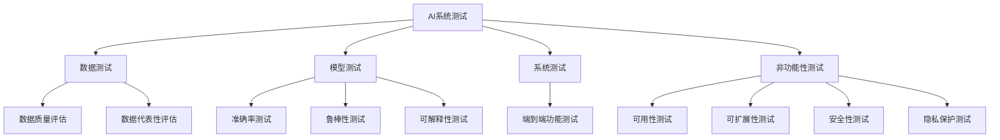
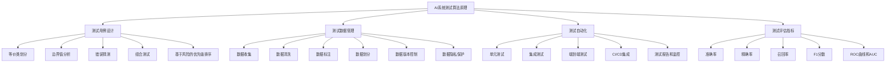

# AI系统测试原理与代码实战案例讲解

## 1.背景介绍

近年来,人工智能(AI)系统在各个领域得到了广泛的应用,从语音识别、图像处理到自然语言处理等,AI系统的性能和可靠性对最终用户体验至关重要。然而,由于AI系统的复杂性和不确定性,对其进行全面测试并确保其正确性和稳定性是一项极具挑战的任务。

传统的软件测试方法往往难以应对AI系统的特殊需求,因为AI系统通常是基于机器学习算法构建的,其行为取决于训练数据和模型参数。此外,AI系统还需要处理大量的非结构化数据,如图像、语音和自然语言等,这使得测试过程更加复杂。

因此,测试AI系统需要采用特定的方法和工具,以确保系统在各种情况下的正确性和稳定性。本文将深入探讨AI系统测试的原理和实践,包括测试策略、测试用例设计、测试数据管理、测试自动化等关键方面,并提供实际的代码示例和案例分析,帮助读者更好地理解和应用AI系统测试技术。

## 2.核心概念与联系

在开始讨论AI系统测试的具体方法之前,我们需要先了解一些核心概念及其相互关系。

### 2.1 AI系统架构

AI系统通常由以下几个主要组件构成:

1. **数据收集和预处理模块**: 负责从各种来源收集原始数据,并对其进行清洗、标注和转换,以便后续的模型训练和推理。
2. **模型训练模块**: 使用预处理后的数据训练机器学习模型,包括特征工程、模型选择、超参数调优等步骤。
3. **模型推理模块**: 将训练好的模型应用于新的输入数据,获取预测结果或决策建议。
4. **后处理模块**: 对模型输出进行解释、可视化或进一步处理,以满足特定的应用需求。

这些组件通常是紧密耦合的,任何一个组件的错误或缺陷都可能导致整个系统的故障或性能下降。因此,AI系统测试需要覆盖所有这些组件及其交互。

### 2.2 AI系统测试类型

根据测试目标和对象的不同,AI系统测试可以分为以下几种类型:

1. **数据测试**: 评估训练数据和测试数据的质量、完整性和代表性,以确保模型的准确性和泛化能力。
2. **模型测试**: 验证模型的性能、稳定性和可解释性,包括准确率、召回率、鲁棒性等指标。
3. **系统测试**: 测试整个AI系统的端到端功能,包括数据输入、模型推理和结果输出等环节。
4. **非功能性测试**: 评估AI系统的可用性、可扩展性、安全性和隐私保护等非功能性需求。

这些测试类型往往是相互关联和补充的,需要综合考虑和应用。

## 3.核心算法原理具体操作步骤

AI系统测试的核心算法和原理主要包括以下几个方面:

### 3.1 测试用例设计

设计高质量的测试用例是AI系统测试的关键步骤之一。常用的测试用例设计技术包括:

1. **等价类划分**: 根据输入数据的特征将其划分为等价类,每个等价类只需要选择一个代表性测试用例。
2. **边界值分析**: 重点测试输入数据的边界值,如最大值、最小值、临界值等,因为这些值往往容易引发错误。
3. **错误猜测**: 基于对系统的理解和经验,猜测可能存在的错误情况,并设计相应的测试用例。
4. **组合测试**: 测试不同输入数据的组合效果,发现潜在的交互错误。
5. **基于风险的测试用例优先级排序**: 根据风险水平对测试用例进行优先级排序,优先执行高风险测试用例。

### 3.2 测试数据管理

AI系统测试需要大量的高质量测试数据,包括代表性数据、边界值数据和异常数据等。测试数据的管理是一项重要且耗时的任务,包括以下步骤:

1. **数据收集**: 从各种来源收集原始数据,如网络爬虫、人工标注等。
2. **数据清洗**: 去除噪声数据、填充缺失值、处理异常值等。
3. **数据标注**: 为训练数据和测试数据添加标签或ground truth。
4. **数据划分**: 将数据划分为训练集、验证集和测试集。
5. **数据版本控制**: 对数据进行版本管理,以便追踪和回溯。
6. **数据隐私保护**: 采取适当的措施保护敏感数据的隐私和安全。

### 3.3 测试自动化

手工测试AI系统是一项耗时且容易出错的工作。因此,测试自动化是提高测试效率和质量的关键。常用的测试自动化技术包括:

1. **单元测试**: 针对AI系统的各个模块进行单元测试,如数据预处理、模型训练、模型推理等。
2. **集成测试**: 测试不同模块之间的集成和交互,确保整体功能的正确性。
3. **端到端测试**: 模拟真实的用户场景,测试整个AI系统的端到端流程。
4. **持续集成和持续部署(CI/CD)**: 将测试自动化集成到软件开发生命周期中,实现持续测试和快速反馈。
5. **测试报告和监控**: 自动生成测试报告,并实时监控AI系统的性能和稳定性。

### 3.4 测试评估指标

评估AI系统测试的效果需要使用适当的指标,常用的指标包括:

1. **准确率(Accuracy)**: 正确预测的比例。
2. **精确率(Precision)**: 正确预测的比例,相对于所有正预测的结果。
3. **召回率(Recall)**: 正确预测的比例,相对于所有实际正确的结果。
4. **F1分数**: 精确率和召回率的加权平均值。
5. **ROC曲线和AUC**: 评估二分类模型的性能。
6. **覆盖率**: 测试用例覆盖的代码行数或功能点的比例。
7. **缺陷密度**: 每千行代码或每个功能点中发现的缺陷数量。

根据具体的应用场景和需求,选择合适的评估指标对于指导测试策略和改进测试效果至关重要。

## 4.数学模型和公式详细讲解举例说明

在AI系统测试中,数学模型和公式扮演着重要的角色,用于量化和评估系统的性能和质量。以下是一些常用的数学模型和公式:

### 4.1 混淆矩阵

混淆矩阵是一种用于评估分类模型性能的工具。对于二分类问题,混淆矩阵如下所示:

$$
\begin{matrix}
& \text{实际正例} & \text{实际负例} \\
\text{预测正例} & TP & FP \\
\text{预测负例} & FN & TN
\end{matrix}
$$

其中:

- $TP$ (True Positive): 正确预测为正例的数量
- $FP$ (False Positive): 错误预测为正例的数量
- $FN$ (False Negative): 错误预测为负例的数量
- $TN$ (True Negative): 正确预测为负例的数量

基于混淆矩阵,我们可以计算出准确率、精确率、召回率和F1分数等评估指标。

### 4.2 ROC曲线和AUC

ROC (Receiver Operating Characteristic) 曲线是一种评估二分类模型性能的图形工具。它绘制了真正例率 (TPR) 和假正例率 (FPR) 在不同阈值下的变化曲线。

$$
TPR = \frac{TP}{TP + FN}, \quad FPR = \frac{FP}{FP + TN}
$$

AUC (Area Under the Curve) 是ROC曲线下的面积,用于量化模型的性能。AUC的取值范围为 $[0, 1]$,值越大表示模型性能越好。

### 4.3 交叉验证

交叉验证是一种评估模型泛化能力的技术,通常用于模型选择和超参数调优。常见的交叉验证方法包括:

1. **K-折交叉验证**: 将数据集划分为 $K$ 个子集,每次使用 $K-1$ 个子集进行训练,剩余的一个子集用于验证,重复 $K$ 次,取平均值作为最终评估指标。
2. **留一交叉验证**: 特殊情况下的 $K$-折交叉验证,其中 $K$ 等于数据集的大小,每次留出一个样本进行验证。
3. **stratified K-折交叉验证**: 在划分子集时,保持每个子集中各类样本的比例与原始数据集中的比例一致。

交叉验证可以减少模型评估的偏差和方差,提高评估结果的可靠性。

### 4.4 统计假设检验

在AI系统测试中,我们常需要比较不同模型或算法的性能差异是否显著。统计假设检验可以帮助我们做出合理的判断。常用的统计假设检验方法包括:

1. **t检验**: 用于比较两个独立样本均值的差异是否显著。
2. **ANOVA**: 用于比较三个或更多独立样本均值的差异是否显著。
3. **卡方检验**: 用于检验两个或更多分类变量之间是否存在关联。
4. **配对t检验**: 用于比较两个相关样本均值的差异是否显著。
5. **非参数检验**: 如 Wilcoxon 秩和检验、Kruskal-Wallis 检验等,适用于数据分布不满足正态性假设的情况。

选择合适的统计检验方法,并正确解释结果,对于得出可靠的结论至关重要。

以上是AI系统测试中常用的一些数学模型和公式,它们为评估系统性能、比较模型差异、选择最优模型等提供了有力的工具支持。在实际应用中,需要根据具体情况选择合适的模型和公式,并结合领域知识进行正确的解释和应用。

## 5.项目实践:代码实例和详细解释说明

为了更好地理解AI系统测试的原理和方法,我们将通过一个实际案例来进行代码实践。在这个案例中,我们将构建一个图像分类系统,并对其进行全面的测试。

### 5.1 系统架构

我们的图像分类系统由以下几个主要模块组成:

1. **数据预处理模块**: 从文件系统读取图像数据,进行缩放、归一化等预处理操作。
2. **模型训练模块**: 使用预处理