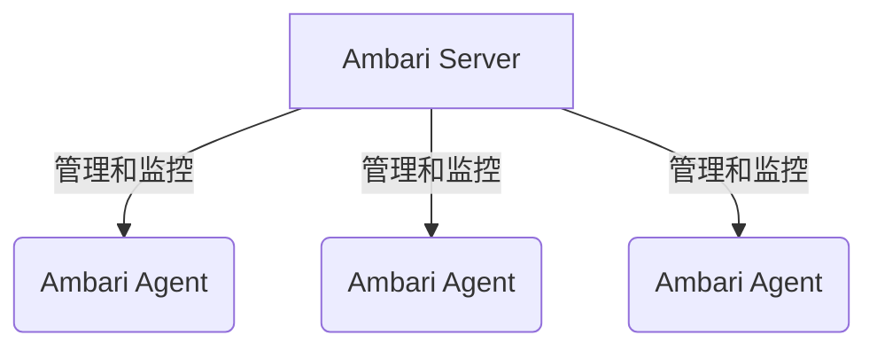
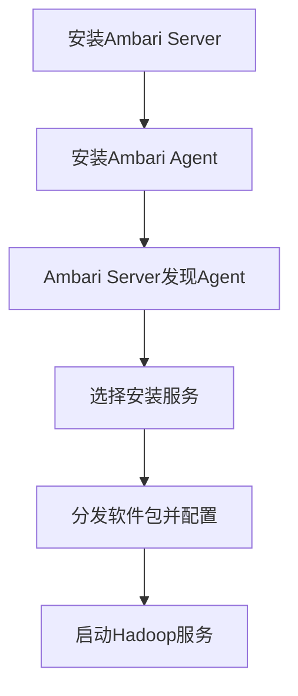
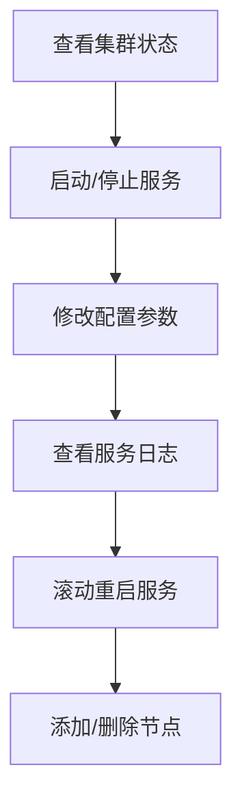
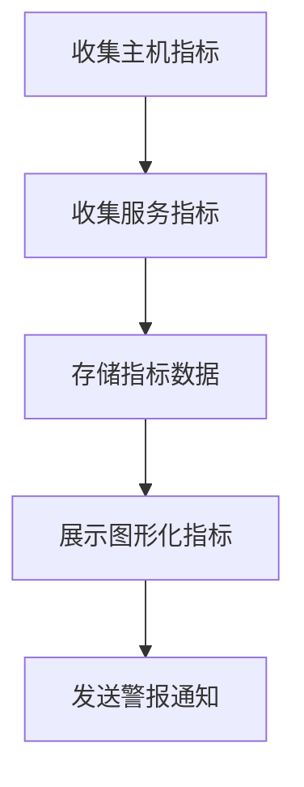

# Ambari原理与代码实例讲解

## 1.背景介绍

随着大数据和云计算技术的快速发展,Apache Hadoop生态系统中的组件也在不断增加和演进。管理和监控这些分布式系统变得越来越复杂。Apache Ambari应运而生,旨在简化Apache Hadoop集群的provisioning、管理和监控。

Ambari是一个开源的系统,用于通过直观的操作界面提供对Hadoop集群的供应、管理和监控功能。它能够在集群中自动化安装、配置和集成Hadoop服务,并提供了一个直观的Web UI界面,用于集群监控和管理。Ambari支持Apache Hadoop生态系统中的多种组件,如HDFS、YARN、Hive、Pig、Zookeeper、HBase等。

## 2.核心概念与联系

### 2.1 Ambari架构

Ambari采用了主从架构设计,包括一个Ambari Server和多个Ambari Agent。



- **Ambari Server**: 作为集中管理节点,负责接收来自Ambari Web UI的请求,并与各个Ambari Agent通信,完成集群的供应、配置、监控等操作。
- **Ambari Agent**: 运行在每个节点上,负责在该节点上启动/停止服务、推送配置以及收集主机级别的指标数据。

### 2.2 Ambari功能

Ambari的主要功能包括:

- **供应(Provisioning)**: 自动化安装Hadoop集群中的各种服务。
- **管理(Management)**: 通过集中Web UI控制启动、停止和配置各种Hadoop服务。
- **监控(Monitoring)**: 收集并展示Hadoop集群各项指标,如主机指标、服务指标等。
- **警报(Alerting)**: 基于预定义的阈值和规则,发出集群健康状态警报。

## 3.核心算法原理具体操作步骤 

### 3.1 Ambari安装流程

1) 在一个节点上安装Ambari Server
2) 在其他节点上安装Ambari Agent
3) Ambari Server通过探测机制发现Ambari Agent
4) 选择要安装的Hadoop服务
5) Ambari自动分发软件包并配置参数
6) Ambari启动Hadoop服务



### 3.2 Ambari管理流程

1) 通过Ambari Web UI查看集群状态
2) 启动/停止Hadoop服务
3) 修改服务配置参数
4) 查看服务日志
5) 执行服务滚动重启以应用配置更改
6) 添加或删除节点



### 3.3 Ambari监控流程

1) Ambari Agent收集主机级指标
2) 各Hadoop服务上报服务级指标
3) Ambari Server存储收集到的指标
4) Ambari Web UI展示图形化指标
5) 基于阈值和规则发送警报通知



## 4.数学模型和公式详细讲解举例说明

在Ambari中,有一些关键的指标需要进行计算和评估,例如:

1) **CPU利用率**

CPU利用率反映了CPU的繁忙程度,是评估系统负载的重要指标。

$$CPU利用率 = \frac{非空闲时间}{总时间} \times 100\%$$

其中非空闲时间是指CPU用于执行用户程序和系统调用的时间。

2) **内存利用率**

内存利用率表示系统内存的使用情况,对于防止内存不足很有帮助。

$$内存利用率 = \frac{已使用内存}{总内存} \times 100\%$$

3) **磁盘利用率**

磁盘利用率反映了磁盘空间的使用情况,对于预防磁盘空间不足很有用。

$$磁盘利用率 = \frac{已使用磁盘空间}{总磁盘空间} \times 100\%$$

4) **网络吞吐量**

网络吞吐量是指单位时间内通过网络的数据量,对于评估网络负载很有帮助。

$$网络吞吐量 = \frac{接收字节数 + 发送字节数}{时间间隔}$$

Ambari会根据这些公式计算相应的指标值,并将它们以图形化的方式展示在Web UI上,方便用户监控和分析。同时,Ambari还会基于这些指标设置阈值,当指标值超过阈值时会触发相应的警报。

## 5.项目实践:代码实例和详细解释说明

### 5.1 Ambari Agent主机监控

Ambari Agent会在每个主机上运行,收集主机级别的指标数据,例如CPU、内存、磁盘和网络利用率等。以下是一个Python代码示例,展示如何使用psutil库收集这些指标:

```python
import psutil
import time

def get_cpu_usage():
    return psutil.cpu_percent(interval=1)

def get_mem_usage():
    mem = psutil.virtual_memory()
    return mem.percent

def get_disk_usage(path):
    disk = psutil.disk_usage(path)
    return disk.percent

def get_net_metrics():
    net_io_counters = psutil.net_io_counters()
    bytes_sent = net_io_counters.bytes_sent
    bytes_recv = net_io_counters.bytes_recv
    return bytes_sent, bytes_recv

if __name__ == "__main__":
    while True:
        cpu_usage = get_cpu_usage()
        mem_usage = get_mem_usage()
        disk_usage = get_disk_usage('/')
        bytes_sent, bytes_recv = get_net_metrics()

        print(f"CPU Usage: {cpu_usage}%")
        print(f"Memory Usage: {mem_usage}%")
        print(f"Disk Usage: {disk_usage}%")
        print(f"Bytes Sent: {bytes_sent}, Bytes Received: {bytes_recv}")

        time.sleep(5)
```

在这个示例中,我们使用psutil库提供的函数来获取CPU、内存、磁盘和网络利用率。get_cpu_usage()函数返回CPU利用率百分比,get_mem_usage()函数返回内存利用率百分比,get_disk_usage()函数返回指定路径的磁盘利用率百分比,get_net_metrics()函数返回发送和接收的字节数。

这些指标数据会被Ambari Agent收集并上报给Ambari Server,以供Web UI展示和监控。

### 5.2 Ambari Server指标存储

Ambari Server需要存储来自各个Ambari Agent上报的指标数据。以下是一个使用InfluxDB时序数据库存储指标数据的示例:

```python
from influxdb import InfluxDBClient

# 连接InfluxDB
client = InfluxDBClient(host='localhost', port=8086)
client.switch_database('ambari_metrics')

# 写入CPU利用率数据
cpu_data = [
    {
        "measurement": "cpu_usage",
        "tags": {
            "host": "host1"
        },
        "fields": {
            "value": 25.6
        }
    }
]
client.write_points(cpu_data)

# 写入内存利用率数据
mem_data = [
    {
        "measurement": "mem_usage",
        "tags": {
            "host": "host2"
        },
        "fields": {
            "value": 80.2
        }
    }
]
client.write_points(mem_data)
```

在这个示例中,我们使用InfluxDB Python客户端连接到InfluxDB数据库,并将CPU利用率和内存利用率数据写入到相应的measurement中。每个数据点都包含了主机名(host)标签和实际的指标值(value)。

Ambari Server可以从InfluxDB中读取这些指标数据,并通过Web UI以图形化的方式展示出来,方便用户监控和分析。

## 6.实际应用场景

Ambari在Apache Hadoop生态系统中得到了广泛的应用,为大数据集群的供应、管理和监控提供了强大的支持。以下是一些典型的应用场景:

1. **大数据平台构建**:使用Ambari可以快速部署和配置Hadoop集群,包括HDFS、YARN、Hive、Spark、HBase等多种大数据组件,从而构建一个完整的大数据平台。

2. **云环境管理**:在云环境中,Ambari可以自动化地供应Hadoop集群,并对集群进行集中管理和监控,简化了大数据应用在云上的部署和运维。

3. **物联网数据处理**:物联网设备会产生大量的数据流,Ambari可以帮助构建和管理用于处理这些数据的Hadoop集群,如Kafka、Storm、Spark Streaming等。

4. **日志分析**:通过Ambari部署Hadoop生态系统中的组件如Logstash、Elasticsearch和Kibana,可以构建一个日志分析平台,用于收集、存储和分析大量的日志数据。

5. **基因组学研究**:在基因组学领域,研究人员需要处理大量的基因序列数据,Ambari可以帮助他们快速构建和管理用于存储和分析这些数据的Hadoop集群。

6. **金融风险分析**:金融机构可以利用Ambari构建大数据平台,对大量的金融交易数据进行实时分析,以发现潜在的风险和欺诈行为。

总的来说,Ambari为Apache Hadoop生态系统提供了一种简单、高效的集群管理解决方案,使得大数据技术的应用变得更加容易和可扩展。

## 7.工具和资源推荐

在使用Ambari时,以下工具和资源可能会很有帮助:

1. **Apache Ambari官方文档**:https://ambari.apache.org/
   这是Ambari的官方文档,包含了安装指南、操作指南、参考手册等内容,是学习和使用Ambari的重要资源。

2. **Ambari Stacks**:https://github.com/apache/ambari/tree/trunk/ambari-server/src/main/resources/stacks
   Ambari Stacks定义了Ambari支持的各种Hadoop服务及其配置,可以帮助理解Ambari是如何管理这些服务的。

3. **Ambari Metrics**:https://github.com/apache/ambari/tree/trunk/ambari-metrics
   Ambari Metrics是Ambari的一个子项目,专门用于收集和存储Hadoop集群的监控指标数据。

4. **Ambari Views**:https://github.com/apache/ambari/tree/trunk/ambari-views
   Ambari Views是一种扩展机制,允许开发者为Ambari Web UI添加自定义视图和功能。

5. **Ambari Blueprints**:https://cwiki.apache.org/confluence/display/AMBARI/Blueprints
   Ambari Blueprints是一种声明式的集群定义方式,可以用于自动化地供应和配置Hadoop集群。

6. **Ambari Mailing Lists**:https://ambari.apache.org/mail-lists.html
   Ambari的邮件列表是一个很好的社区资源,可以在这里提出问题、讨论问题并获取帮助。

7. **Hortonworks Ambari Tutorials**:https://hortonworks.com/tutorials/?tab=ambari-tutorials
   Hortonworks提供了一系列关于Ambari的教程,涵盖了安装、配置、管理和监控等多个方面。

利用这些工具和资源,可以更好地学习和掌握Ambari,从而更高效地管理和监控Apache Hadoop集群。

## 8.总结:未来发展趋势与挑战

Ambari作为Apache Hadoop生态系统中的一个重要项目,在未来仍将持续发展和演进,以满足不断变化的需求。以下是一些可能的发展趋势和面临的挑战:

1. **支持更多大数据组件**:随着新的大数据组件不断出现,Ambari需要持续扩展其支持范围,以便能够管理和监控这些新组件。

2. **提高可扩展性**:随着集群规模的增长,Ambari需要提高其可扩展性,以确保能够高效地管理和监控大规模的Hadoop集群。

3. **增强安全性**:随着大数据应用越来越多地处理敏感数据,Ambari需要提供更强大的安全性功能,如细粒度的访问控制和加密机制。

4. **优化资源利用**:{"msg_type":"generate_answer_finish","data":"","from_module":null,"from_unit":null}