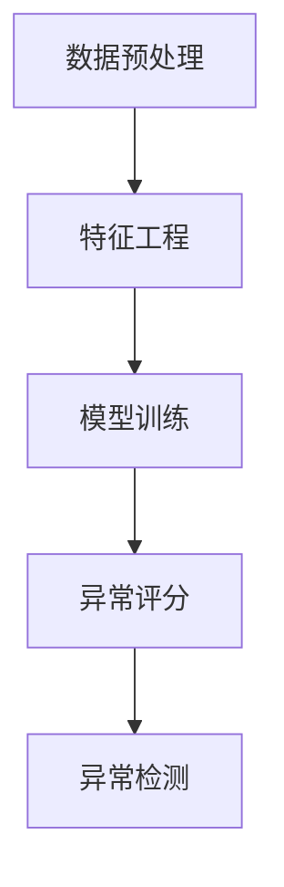

# Anomaly Detection原理与代码实例讲解

## 1.背景介绍

在现代数据驱动的世界中,异常检测(Anomaly Detection)已成为一个非常重要的研究领域。异常检测旨在从数据集中识别出与大多数数据模式显著不同的罕见项或事件,这些异常可能表示有趣的发现,如系统故障、欺诈行为或新的行为模式。

异常检测在诸多领域都有广泛的应用,例如:

- **网络安全**:检测入侵行为、恶意软件活动和非法网络流量。
- **金融领域**:识别金融欺诈、异常交易和洗钱活动。
- **制造业**:监测生产线异常,发现缺陷产品。
- **医疗保健**:发现疾病早期症状、检测医疗保险欺诈。
- **社交媒体**:识别虚假新闻、垃圾邮件和网络欺凌行为。

随着数据量的不断增长和复杂度的提高,异常检测面临着诸多挑战,如高维数据、数据不平衡、概念漂移等。因此,开发有效的异常检测算法和技术变得至关重要。

## 2.核心概念与联系

### 2.1 异常检测的定义

异常检测(Anomaly Detection)是指从数据集中识别出与大多数数据模式显著不同的罕见项或事件的过程。异常通常被视为偏离正常行为的数据点或模式。

### 2.2 异常类型

异常可分为以下几种类型:

1. **点异常(Point Anomalies)**: 单个数据实例与其他数据存在显著差异。

2. **上下文异常(Contextual Anomalies)**: 在特定上下文中,数据实例被视为异常,但在其他上下文中可能是正常的。

3. **集群异常(Collective Anomalies)**: 一组数据实例作为整体被视为异常,尽管单个数据实例可能看起来正常。

### 2.3 异常检测技术

常见的异常检测技术包括:

- **基于统计的方法**:假设正常数据服从某种概率分布,异常被视为偏离该分布的数据点。
- **基于深度学习的方法**:利用深度神经网络从数据中自动学习特征表示,并检测异常。
- **基于距离的方法**:基于数据点与其邻居的距离来检测异常。
- **基于密度的方法**:基于数据点所在区域的密度来检测异常。
- **基于集成的方法**:结合多种技术的优点,提高异常检测性能。

### 2.4 评估指标

常用的异常检测评估指标包括:

- **精确率(Precision)**:正确检测为异常的实例占所有检测为异常实例的比例。
- **召回率(Recall)**:正确检测为异常的实例占所有真实异常实例的比例。
- **F1分数**:精确率和召回率的加权调和平均值。
- **ROC曲线和AUC**:反映模型在不同阈值下的综合性能。

## 3.核心算法原理具体操作步骤

异常检测算法通常分为以下几个步骤:



### 3.1 数据预处理

数据预处理是异常检测的第一步,包括处理缺失值、异常值、数据标准化等,以确保数据的质量和一致性。

### 3.2 特征工程

特征工程对于异常检测至关重要。好的特征能够更好地区分正常数据和异常数据。常用的特征工程技术包括:

- 特征选择:选择与异常检测任务相关的特征子集。
- 特征提取:从原始数据中提取新的特征,如主成分分析(PCA)。
- 特征构造:基于领域知识构造新特征。

### 3.3 模型训练

根据所选算法,使用训练数据训练异常检测模型。常用算法包括:

- **高斯分布模型**:假设正常数据服从高斯分布,异常为偏离该分布的数据点。
- **隔离森林(Isolation Forest)**:基于树的无监督学习算法,将异常隔离为较短路径上的实例。
- **一类支持向量机(One-Class SVM)**:将正常数据映射到高维特征空间,寻找包围大部分数据的最小超球体。
- **自编码器(Autoencoder)**:神经网络模型,训练网络重构输入数据,异常为重构误差较大的数据。

### 3.4 异常评分

对于新的数据实例,计算其异常分数,表示其与正常数据模式的偏离程度。常用的异常评分方法包括:

- **重构误差**:自编码器等生成模型的重构误差。
- **密度估计**:数据点所在区域的密度估计值。
- **距离度量**:数据点与其邻居的距离。

### 3.5 异常检测

根据异常分数和预设阈值,将数据实例划分为正常或异常。阈值的选择需要权衡精确率和召回率。

## 4.数学模型和公式详细讲解举例说明

### 4.1 高斯分布模型

高斯分布模型是一种常用的基于统计的异常检测方法。它假设正常数据服从多元高斯分布,异常为偏离该分布的数据点。

对于 $D$ 维数据 $\boldsymbol{x} = (x_1, x_2, \dots, x_D)$,多元高斯分布的概率密度函数为:

$$
p(\boldsymbol{x};\boldsymbol{\mu},\boldsymbol{\Sigma}) = \frac{1}{(2\pi)^{D/2}|\boldsymbol{\Sigma}|^{1/2}}\exp\left(-\frac{1}{2}(\boldsymbol{x}-\boldsymbol{\mu})^T\boldsymbol{\Sigma}^{-1}(\boldsymbol{x}-\boldsymbol{\mu})\right)
$$

其中 $\boldsymbol{\mu}$ 是均值向量, $\boldsymbol{\Sigma}$ 是协方差矩阵。

在训练阶段,我们使用训练数据估计 $\boldsymbol{\mu}$ 和 $\boldsymbol{\Sigma}$。对于新的数据点 $\boldsymbol{x}$,我们计算其概率密度 $p(\boldsymbol{x};\boldsymbol{\mu},\boldsymbol{\Sigma})$。如果该值低于预设阈值,则将 $\boldsymbol{x}$ 标记为异常。

### 4.2 隔离森林

隔离森林(Isolation Forest)是一种基于树的无监督学习算法,通过随机分割特征空间来隔离异常。

算法的核心思想是:异常数据由于其特征值相对极端,会被更快地隔离。因此,异常数据在隔离树中的路径长度较短。

对于训练数据集 $\mathcal{D}$,隔离森林算法构建 $t$ 棵隔离树。每棵树的构建过程如下:

1. 随机选择一个特征 $q$ 和该特征的随机分割值 $p$。
2. 根据条件 $X_q < p$ 将数据集 $\mathcal{D}$ 分成两个子集。
3. 对每个子集递归执行步骤 1 和 2,直到所有实例被隔离。
4. 计算每个实例的路径长度 $h(x)$,即从根节点到终止节点所需的边数。

对于新的数据点 $x$,我们计算其在所有 $t$ 棵树上的平均路径长度 $\bar{h}(x)$。较小的 $\bar{h}(x)$ 值表示 $x$ 更有可能是异常。

隔离森林的优点是计算高效,无需大量数据预处理,并且对于高维数据也表现良好。

### 4.3 一类支持向量机

一类支持向量机(One-Class SVM)是一种半监督学习算法,用于异常检测。它将训练数据映射到高维特征空间,并寻找包围大部分数据的最小超球体。

假设训练数据为 $\{\boldsymbol{x}_1, \boldsymbol{x}_2, \dots, \boldsymbol{x}_N\}$,其中 $\boldsymbol{x}_i \in \mathbb{R}^D$。一类 SVM 的目标是找到一个超球体,使得大部分训练数据落在该超球体内,同时超球体的半径 $R$ 最小化。

这可以形式化为以下优化问题:

$$
\begin{aligned}
\min_{R,\boldsymbol{a},\boldsymbol{\xi}} &\quad R^2 + \frac{1}{\nu N}\sum_{i=1}^N \xi_i \\
\text{s.t.} &\quad \|\phi(\boldsymbol{x}_i)-\boldsymbol{a}\|^2 \leq R^2 + \xi_i, \quad \xi_i \geq 0, \quad i=1,\dots,N
\end{aligned}
$$

其中 $\phi(\cdot)$ 是将数据映射到高维特征空间的函数, $\boldsymbol{a}$ 是超球体的中心, $\nu \in (0,1)$ 控制训练误差和超球体体积的权衡, $\xi_i$ 是松弛变量。

在测试阶段,对于新的数据点 $\boldsymbol{x}$,我们计算其与超球体中心的距离 $\|\phi(\boldsymbol{x})-\boldsymbol{a}\|$。如果该距离大于 $R$,则将 $\boldsymbol{x}$ 标记为异常。

一类 SVM 的优点是能够处理非线性数据,并且对异常值不太敏感。但是,它对核函数和参数选择较为敏感。

## 5.项目实践:代码实例和详细解释说明

在本节中,我们将使用 Python 和 scikit-learn 库实现一个异常检测项目。我们将在一个合成数据集上训练隔离森林模型,并评估其性能。

### 5.1 导入所需库

```python
import numpy as np
import matplotlib.pyplot as plt
from sklearn.datasets import make_blobs
from sklearn.ensemble import IsolationForest
from sklearn.metrics import precision_score, recall_score, f1_score
```

### 5.2 生成合成数据

我们使用 `make_blobs` 函数生成一个包含两个高斯簇的合成数据集,并添加一些异常点。

```python
# 生成正常数据
X, _ = make_blobs(n_samples=1000, centers=2, n_features=2, random_state=42)

# 添加异常点
X = np.r_[X, np.random.uniform(low=-10, high=10, size=(50, 2))]

# 绘制数据
plt.scatter(X[:, 0], X[:, 1], s=5)
plt.title('Synthetic Dataset')
plt.show()
```

### 5.3 训练隔离森林模型

我们使用 `IsolationForest` 类训练隔离森林模型。

```python
# 初始化模型
model = IsolationForest(contamination=0.05, random_state=42)

# 训练模型
model.fit(X)

# 获取异常分数
scores = model.decision_function(X)

# 根据异常分数标记异常点
threshold = np.percentile(scores, 5)  # 异常分数的 5% 分位数作为阈值
y_pred = np.where(scores >= threshold, 1, 0)
```

### 5.4 评估模型性能

我们使用精确率、召回率和 F1 分数来评估模型性能。

```python
# 计算真实标签
y_true = np.r_[np.zeros(1000), np.ones(50)]

# 计算评估指标
precision = precision_score(y_true, y_pred)
recall = recall_score(y_true, y_pred)
f1 = f1_score(y_true, y_pred)

print(f'Precision: {precision:.3f}')
print(f'Recall: {recall:.3f}')
print(f'F1-score: {f1:.3f}')
```

### 5.5 可视化结果

最后,我们可视化异常检测结果。

```python
# 绘制正常点和异常点
plt.scatter(X[y_pred == 0, 0], X[y_pred == 0, 1], s=5, label='Normal')
plt.scatter(X[y_pred == 1, 0], X[y_pred == 1, 1], s=5, label='Anomaly')
plt.title('Isolation Forest Anomaly Detection')
plt.legend()
plt.show()
```

通过这个示例,您可以了解如何使用 scikit-learn 库实现异常检测算法,并评估其性能。

## 6.实际应用场景

异常检测在许多领域都有广泛的应用,下面是一些典