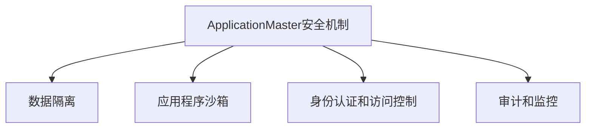
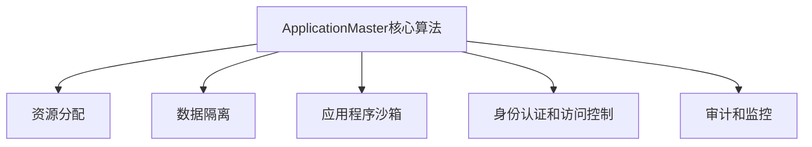

# ApplicationMaster安全机制：保护数据与应用

## 1.背景介绍

随着云计算和大数据技术的快速发展,企业和组织越来越多地将关键数据和应用程序部署在分布式集群环境中。然而,这种分布式环境也带来了新的安全挑战,如何保护敏感数据免受未经授权的访问,防止应用程序遭受恶意攻击,成为了一个亟待解决的问题。ApplicationMaster是一种新兴的安全机制,旨在为分布式环境中的数据和应用程序提供全面的保护。

## 2.核心概念与联系

ApplicationMaster安全机制建立在以下几个核心概念之上:

### 2.1 数据隔离

数据隔离是指将不同的数据集彼此隔离,确保它们不会被其他未经授权的应用程序或用户访问。这可以通过在集群中创建独立的数据空间或使用加密技术来实现。

### 2.2 应用程序沙箱

应用程序沙箱是一种虚拟化技术,它为每个应用程序创建一个隔离的运行环境,限制其对系统资源的访问权限。这样可以防止恶意应用程序对其他应用程序或系统造成干扰。

### 2.3 身份认证和访问控制

身份认证和访问控制确保只有经过授权的用户和应用程序才能访问特定的数据和资源。这通常通过用户名/密码、双因素认证或基于角色的访问控制(RBAC)等机制来实现。

### 2.4 审计和监控

审计和监控功能记录和跟踪对数据和应用程序的所有访问和操作,以便及时发现任何异常活动并采取相应的措施。

这些核心概念相互关联,共同构建了ApplicationMaster安全机制的基础架构。



## 3.核心算法原理具体操作步骤

ApplicationMaster安全机制的核心算法原理包括以下几个关键步骤:

### 3.1 资源分配

在集群中,ApplicationMaster首先需要为每个应用程序分配所需的计算资源,如CPU、内存和存储空间。这个过程通常由资源调度器完成,它根据预定义的策略和应用程序的需求来分配资源。

### 3.2 数据隔离

为了实现数据隔离,ApplicationMaster会为每个应用程序创建一个独立的数据空间。这可以通过以下两种方式实现:

1. **物理隔离**: 在集群中划分出专用的物理节点或存储设备,用于存储特定应用程序的数据。
2. **逻辑隔离**: 使用虚拟化技术或加密技术,在同一物理节点上创建逻辑上隔离的数据空间。

### 3.3 应用程序沙箱

ApplicationMaster利用容器技术(如Docker或Kubernetes)为每个应用程序创建一个沙箱环境。这个沙箱环境限制了应用程序对系统资源的访问权限,并且与其他应用程序的沙箱环境相互隔离。

### 3.4 身份认证和访问控制

ApplicationMaster通过集成身份认证和访问控制机制,确保只有经过授权的用户和应用程序才能访问特定的数据和资源。常见的身份认证方式包括用户名/密码、双因素认证等。访问控制通常基于角色(RBAC)或基于属性(ABAC)的策略来实现。

### 3.5 审计和监控

ApplicationMaster会记录和跟踪对数据和应用程序的所有访问和操作,生成详细的审计日志。这些日志可用于安全分析和异常检测,以便及时发现并响应任何潜在的安全威胁。



## 4.数学模型和公式详细讲解举例说明

在ApplicationMaster安全机制中,数学模型和公式主要应用于以下几个方面:

### 4.1 资源分配模型

资源分配模型旨在优化集群资源的利用率,同时满足应用程序的资源需求。常见的资源分配模型包括:

1. **公平共享模型**

公平共享模型确保所有应用程序都能获得公平的资源份额。假设有 $n$ 个应用程序,集群中有 $R$ 个资源单位,则每个应用程序获得的资源份额为:

$$\text{资源份额} = \frac{R}{n}$$

2. **优先级模型**

优先级模型根据应用程序的优先级分配资源。设应用程序 $i$ 的优先级为 $p_i$,则其获得的资源份额为:

$$\text{资源份额}_i = \frac{p_i}{\sum_{j=1}^n p_j} \times R$$

### 4.2 数据隔离模型

数据隔离模型用于确保不同应用程序的数据不会相互干扰。常见的数据隔离模型包括:

1. **基于散列的数据分区**

基于散列的数据分区将数据根据其键值的散列值划分到不同的分区中。假设有 $m$ 个分区,数据键值为 $k$,则其所属分区为:

$$\text{分区编号} = \text{hash}(k) \bmod m$$

2. **基于范围的数据分区**

基于范围的数据分区将数据根据其键值的范围划分到不同的分区中。假设有 $m$ 个分区,数据键值为 $k$,键值范围为 $[a, b]$,则其所属分区为:

$$\text{分区编号} = \left\lfloor \frac{k - a}{b - a} \times m \right\rfloor$$

### 4.3 访问控制模型

访问控制模型用于确定用户或应用程序对特定资源的访问权限。常见的访问控制模型包括:

1. **基于角色的访问控制 (RBAC)**

在RBAC模型中,用户被分配到不同的角色,每个角色具有特定的权限。设用户 $u$ 属于角色集合 $R_u$,资源 $r$ 的权限集合为 $P_r$,则用户 $u$ 对资源 $r$ 的访问权限为:

$$\text{访问权限}(u, r) = \bigcup_{r_i \in R_u} P_{r_i} \cap P_r$$

2. **基于属性的访问控制 (ABAC)**

在ABAC模型中,访问权限基于用户和资源的属性。设用户 $u$ 的属性集合为 $A_u$,资源 $r$ 的属性集合为 $A_r$,访问策略为 $P(A_u, A_r)$,则用户 $u$ 对资源 $r$ 的访问权限为:

$$\text{访问权限}(u, r) = P(A_u, A_r)$$

这些数学模型和公式为ApplicationMaster安全机制提供了理论基础,并指导了其具体实现。

## 5.项目实践：代码实例和详细解释说明

为了更好地理解ApplicationMaster安全机制的实现,我们将通过一个简单的示例项目来演示其核心功能。

### 5.1 环境准备

在开始之前,我们需要准备以下环境:

- Kubernetes集群
- Docker容器引擎
- Golang编程语言

### 5.2 应用程序沙箱

我们将使用Kubernetes的Pod作为应用程序的沙箱环境。下面是一个简单的Pod定义文件示例:

```yaml
apiVersion: v1
kind: Pod
metadata:
  name: my-app
spec:
  containers:
  - name: my-app-container
    image: my-app:v1
    ports:
    - containerPort: 8080
```

在这个示例中,我们定义了一个名为`my-app`的Pod,其中包含一个容器`my-app-container`。该容器使用`my-app:v1`镜像,并暴露了8080端口。

### 5.3 数据隔离

为了实现数据隔离,我们将使用Kubernetes的PersistentVolume和PersistentVolumeClaim。下面是一个示例:

```yaml
apiVersion: v1
kind: PersistentVolumeClaim
metadata:
  name: my-app-data
spec:
  accessModes:
  - ReadWriteOnce
  resources:
    requests:
      storage: 1Gi
```

在这个示例中,我们定义了一个名为`my-app-data`的PersistentVolumeClaim,请求1GiB的存储空间。我们可以将这个PersistentVolumeClaim挂载到Pod中,从而为应用程序提供隔离的数据存储空间。

### 5.4 身份认证和访问控制

在Kubernetes中,我们可以使用RBAC来控制对资源的访问。下面是一个示例:

```yaml
apiVersion: rbac.authorization.k8s.io/v1
kind: Role
metadata:
  namespace: default
  name: my-app-role
rules:
- apiGroups: [""] # "" indicates the core API group
  resources: ["pods", "persistentvolumeclaims"]
  verbs: ["get", "list", "watch"]
---
apiVersion: rbac.authorization.k8s.io/v1
kind: RoleBinding
metadata:
  name: my-app-rolebinding
  namespace: default
subjects:
- kind: ServiceAccount
  name: my-app-sa
  apiGroup: ""
roleRef:
  kind: Role
  name: my-app-role
  apiGroup: rbac.authorization.k8s.io
```

在这个示例中,我们定义了一个名为`my-app-role`的Role,允许对Pod和PersistentVolumeClaim进行读取操作。然后,我们创建了一个名为`my-app-rolebinding`的RoleBinding,将`my-app-sa`服务账户绑定到`my-app-role`角色。

### 5.5 审计和监控

在Kubernetes中,我们可以使用Audit日志来记录和监控对资源的访问和操作。下面是一个示例:

```yaml
apiVersion: audit.k8s.io/v1
kind: Policy
rules:
- level: RequestResponse
  resources:
  - group: ""
    resources: ["pods", "persistentvolumeclaims"]
```

在这个示例中,我们定义了一个Audit策略,要求记录对Pod和PersistentVolumeClaim的所有请求和响应。生成的Audit日志可以用于安全分析和异常检测。

通过这些示例,我们可以看到ApplicationMaster安全机制在Kubernetes环境中的具体实现。虽然这只是一个简单的示例,但它展示了ApplicationMaster安全机制的核心功能,包括应用程序沙箱、数据隔离、身份认证和访问控制以及审计和监控。

## 6.实际应用场景

ApplicationMaster安全机制可以应用于各种分布式环境,为敏感数据和关键应用程序提供全面的保护。以下是一些典型的应用场景:

### 6.1 金融服务

在金融服务领域,ApplicationMaster可以用于保护客户的账户信息、交易记录和其他敏感数据。通过数据隔离和访问控制机制,只有经过授权的应用程序和用户才能访问这些数据。同时,审计和监控功能可以帮助及时发现任何异常活动,防止数据泄露或金融犯罪。

### 6.2 医疗健康

医疗健康领域对数据隐私和安全性有着严格的要求。ApplicationMaster可以确保患者的电子健康记录和其他敏感信息得到妥善保护,只有相关的医疗应用程序和授权人员能够访问。同时,它还可以防止恶意软件对医疗设备和系统造成干扰,确保医疗服务的连续性和可靠性。

### 6.3 政府机构

政府机构通常处理大量敏感信息,如公民身份信息、国家安全数据等。ApplicationMaster可以为这些数据和相关应用程序提供全面的保护,确保只有经过严格授权的人员和系统才能访问。同时,它还可以帮助政府机构满足各种法律法规和合规性要求。

### 6.4 企业IT基础设施

在企业IT基础设施中,ApplicationMaster可以用于保护企业的知识产权、客户数据和其他商业机密信息。它可以确保这些数据只能被授权的应用程序和员工访问,防止数据泄露或被竞争对手获取。同时,它还可以保护企业的关键应用程序免受恶意软件和网络攻击的影响。

## 7.工具和资源推荐

为了更好地实现和管理ApplicationMaster安