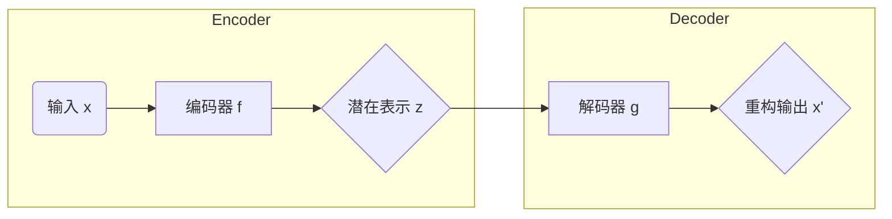

# Autoencoders 原理与代码实战案例讲解

## 1.背景介绍

在深度学习领域,自编码器(Autoencoders)是一种无监督学习技术,主要用于数据编码、降维和生成等任务。自编码器的基本思想是将高维输入数据压缩编码为低维表示,然后再将低维表示解码还原为原始高维输入数据。通过这种编码-解码过程,自编码器能够学习到数据的内在特征表示。

自编码器最初被设计用于降维和特征学习,后来也被广泛应用于异常检测、数据去噪、生成模型等领域。随着深度学习的发展,自编码器也衍生出多种变体,如稀疏自编码器、变分自编码器等,用于解决更加复杂的问题。

## 2.核心概念与联系

### 2.1 自编码器的基本结构

自编码器通常由两部分组成:编码器(Encoder)和解码器(Decoder)。

- 编码器将高维输入数据 $\boldsymbol{x}$ 映射为低维潜在表示 $\boldsymbol{z}$,即 $\boldsymbol{z} = f(\boldsymbol{x})$。
- 解码器则将低维潜在表示 $\boldsymbol{z}$ 重构为与原始输入 $\boldsymbol{x}$ 接近的高维输出 $\boldsymbol{x'}$,即 $\boldsymbol{x'} = g(\boldsymbol{z})$。

编码器和解码器通常由神经网络构成,如多层感知器或卷积神经网络。自编码器的目标是使重构输出 $\boldsymbol{x'}$ 尽可能接近原始输入 $\boldsymbol{x}$,从而学习到输入数据的有效表示。



### 2.2 自编码器的损失函数

自编码器的训练过程是一个无监督学习过程,目标是最小化输入数据 $\boldsymbol{x}$ 与重构输出 $\boldsymbol{x'}$ 之间的重构误差。常用的损失函数包括均方误差(MSE)和交叉熵损失(Cross-Entropy Loss)。

$$J(\boldsymbol{x}, \boldsymbol{x'}) = \frac{1}{n} \sum_{i=1}^{n} L(\boldsymbol{x}^{(i)}, \boldsymbol{x'}^{(i)})$$

其中 $L$ 是per-sample损失函数,如均方误差 $L(\boldsymbol{x}, \boldsymbol{x'}) = \|\boldsymbol{x} - \boldsymbol{x'}\|_2^2$ 或交叉熵损失。通过最小化损失函数,自编码器可以学习到输入数据的紧凑表示。

### 2.3 自编码器的变体

基于基本自编码器,研究人员提出了多种变体以满足不同的需求:

- **稀疏自编码器(Sparse Autoencoder)**: 在隐含层引入稀疏性约束,使得编码更加高效和鲁棒。
- **变分自编码器(Variational Autoencoder, VAE)**: 将编码过程建模为概率分布,用于生成式建模。
- **去噪自编码器(Denoising Autoencoder)**: 对输入数据加入噪声,训练自编码器去除噪声,常用于去噪和数据预处理。
- **卷积自编码器(Convolutional Autoencoder)**: 使用卷积神经网络作为编码器和解码器,常用于图像处理任务。

## 3.核心算法原理具体操作步骤 

自编码器的训练过程可分为以下几个步骤:

1. **初始化**: 初始化编码器和解码器的权重参数。
2. **前向传播**:
    - 将输入数据 $\boldsymbol{x}$ 送入编码器,获得潜在表示 $\boldsymbol{z} = f(\boldsymbol{x})$。
    - 将潜在表示 $\boldsymbol{z}$ 送入解码器,获得重构输出 $\boldsymbol{x'} = g(\boldsymbol{z})$。
3. **计算损失**: 计算输入 $\boldsymbol{x}$ 与重构输出 $\boldsymbol{x'}$ 之间的重构误差,如均方误差或交叉熵损失。
4. **反向传播**: 计算损失相对于编码器和解码器参数的梯度。
5. **参数更新**: 使用优化算法(如梯度下降)更新编码器和解码器的参数,以最小化重构误差。
6. **重复训练**: 重复步骤2-5,直到收敛或达到最大迭代次数。

在训练过程中,自编码器会逐渐学习到输入数据的有效表示,使得重构输出 $\boldsymbol{x'}$ 尽可能接近原始输入 $\boldsymbol{x}$。训练完成后,我们可以使用编码器将高维输入数据映射为低维潜在表示,并利用解码器从低维表示重构出原始数据,实现降维、去噪或生成等目的。

## 4.数学模型和公式详细讲解举例说明

### 4.1 自编码器的数学表示

设输入数据为 $\boldsymbol{x} \in \mathbb{R}^{d}$,编码器为函数 $f: \mathbb{R}^{d} \rightarrow \mathbb{R}^{k}$,解码器为函数 $g: \mathbb{R}^{k} \rightarrow \mathbb{R}^{d}$,其中 $k < d$。自编码器的目标是找到合适的编码函数 $f$ 和解码函数 $g$,使得对于任意输入 $\boldsymbol{x}$,重构输出 $\boldsymbol{x'} = g(f(\boldsymbol{x}))$ 尽可能接近原始输入 $\boldsymbol{x}$。

在实践中,编码器 $f$ 和解码器 $g$ 通常由神经网络参数化,例如对于编码器:

$$f(\boldsymbol{x}) = \sigma(W_2 \sigma(W_1 \boldsymbol{x} + b_1) + b_2)$$

其中 $W_1, W_2, b_1, b_2$ 是神经网络的权重和偏置参数,而 $\sigma$ 是非线性激活函数,如 ReLU 或 Sigmoid。解码器 $g$ 的形式类似。

通过训练,我们可以学习到合适的参数 $W_1, W_2, b_1, b_2$,使得编码器 $f$ 能够将高维输入 $\boldsymbol{x}$ 映射为低维潜在表示 $\boldsymbol{z}$,而解码器 $g$ 能够从低维表示 $\boldsymbol{z}$ 重构出接近原始输入的高维输出 $\boldsymbol{x'}$。

### 4.2 自编码器的损失函数

自编码器的训练目标是最小化输入数据 $\boldsymbol{x}$ 与重构输出 $\boldsymbol{x'}$ 之间的重构误差,即最小化损失函数:

$$J(\boldsymbol{x}, \boldsymbol{x'}) = \frac{1}{n} \sum_{i=1}^{n} L(\boldsymbol{x}^{(i)}, g(f(\boldsymbol{x}^{(i)})))$$

其中 $L$ 是per-sample损失函数,常用的有:

- **均方误差(Mean Squared Error, MSE)**:

$$L(\boldsymbol{x}, \boldsymbol{x'}) = \|\boldsymbol{x} - \boldsymbol{x'}\|_2^2 = \sum_{j=1}^{d} (x_j - x'_j)^2$$

- **交叉熵损失(Cross-Entropy Loss)**:

$$L(\boldsymbol{x}, \boldsymbol{x'}) = -\sum_{j=1}^{d} [x_j \log x'_j + (1 - x_j) \log (1 - x'_j)]$$

均方误差更适用于连续值输入,而交叉熵损失更适用于二值或概率输入。通过最小化损失函数,自编码器可以学习到输入数据的紧凑表示。

### 4.3 正则化策略

为了防止自编码器过拟合,并提高学习到的表示的质量,常采用以下正则化策略:

- **L1/L2正则化**: 在损失函数中加入权重的L1或L2范数惩罚项,促使权重值较小,提高泛化能力。
- **噪声加性正则化**: 在输入数据中加入噪声,迫使自编码器学习鲁棒的表示。
- **稀疏性约束**: 在隐含层激活值上加入稀疏性惩罚项,促使隐含单元的激活值呈稀疏分布,提高表示的高效性。

以稀疏自编码器为例,其损失函数为:

$$J_{\text{sparse}}(\boldsymbol{x}, \boldsymbol{x'}) = J(\boldsymbol{x}, \boldsymbol{x'}) + \lambda \sum_{j=1}^{k} \text{KL}(\rho \| \hat{\rho}_j)$$

其中 $\hat{\rho}_j$ 是第 $j$ 个隐含单元的平均激活值,而 $\rho$ 是期望的稀疏程度,通常取很小的值。$\text{KL}(\rho \| \hat{\rho}_j)$ 是 KL 散度,用于惩罚 $\hat{\rho}_j$ 与期望稀疏程度 $\rho$ 的偏离。 $\lambda$ 是惩罚系数,控制稀疏性约束的强度。

通过这些正则化策略,自编码器能够学习到更加鲁棒、高效的数据表示。

### 4.4 实例解析

假设我们有一个二值图像数据集,每个图像大小为 $28 \times 28$ 像素,因此输入维度为 $d = 784$。我们希望将图像编码为 $k = 30$ 维的潜在表示,以实现降维和去噪。

我们可以构建一个稀疏自编码器,其编码器为:

$$f(\boldsymbol{x}) = s(W_2 \sigma(W_1 \boldsymbol{x} + b_1) + b_2)$$

解码器为:

$$g(\boldsymbol{z}) = \sigma(W_3 \boldsymbol{z} + b_3)$$

其中 $W_1 \in \mathbb{R}^{500 \times 784}, W_2 \in \mathbb{R}^{30 \times 500}, W_3 \in \mathbb{R}^{784 \times 30}$ 为权重矩阵, $b_1 \in \mathbb{R}^{500}, b_2 \in \mathbb{R}^{30}, b_3 \in \mathbb{R}^{784}$ 为偏置向量。$\sigma$ 为 ReLU 激活函数,而 $s$ 为 Sigmoid 激活函数,用于约束隐含层输出在 $[0, 1]$ 范围内。

我们采用稀疏性约束和噪声加性正则化,损失函数为:

$$J_{\text{sparse}}(\boldsymbol{x}, \boldsymbol{x'}) = \frac{1}{n} \sum_{i=1}^{n} \|\tilde{\boldsymbol{x}}^{(i)} - g(f(\tilde{\boldsymbol{x}}^{(i)}))\|_2^2 + \lambda \sum_{j=1}^{30} \text{KL}(\rho \| \hat{\rho}_j)$$

其中 $\tilde{\boldsymbol{x}}$ 是加入高斯噪声的输入图像,而 $\rho$ 是期望的稀疏程度,例如 $\rho = 0.05$。

通过训练,自编码器能够学习到图像数据的稀疏表示,实现降维和去噪的目的。同时,我们也可以利用编码器将新的图像映射为 30 维的潜在表示,用于其他任务如图像分类或生成。

## 5.项目实践:代码实例和详细解释说明

以下是使用 PyTorch 实现一个简单的自编码器的代码示例,用于对 MNIST 手写数字图像进行编码和解码:

```python
import torch
import torch.nn as nn
import torchvision.datasets as datasets
import torchvision.transforms as transforms

# 定义自编码器模型
class Autoencoder(nn.Module):
    def __init__(self):
        super(Autoencoder, self).__init__()
        
        # 编码器
        self.encoder = nn.Sequential(
            nn.Linear(28 * 28, 512),
            nn.ReLU(),
            nn.Linear(512, 256),
            nn.ReLU(),
            