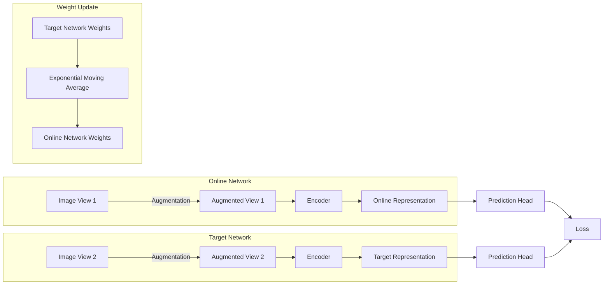

# BYOL在艺术创作中的应用探索

## 1.背景介绍

在当今时代,人工智能(AI)技术的飞速发展正在改变着各个领域,艺术创作也不例外。传统的艺术创作方式正在被新兴技术所挑战和重塑。其中,自监督学习(Self-Supervised Learning)作为一种有前景的人工智能技术,已经在计算机视觉、自然语言处理等领域展现出巨大的潜力。BYOL(Bootstrap Your Own Latent,自举隐变量)作为自监督学习的一种新颖方法,其在艺术创作中的应用也引起了广泛关注。

### 1.1 自监督学习的兴起

自监督学习是机器学习中一种无需人工标注数据的学习方式,它通过从原始数据中自动挖掘监督信号来训练模型。相比于传统的监督学习需要大量人工标注数据,自监督学习可以利用海量未标注数据进行训练,从而降低了数据标注的成本,同时也避免了人工标注过程中可能存在的主观偏差。

### 1.2 BYOL在艺术创作中的潜力

BYOL通过对输入数据进行增强,生成两个不同的视图,然后让模型学习这两个视图之间的不变性表示。这种自监督的训练方式使得BYOL能够从大量未标注的图像数据中学习到丰富的视觉特征表示,为下游任务(如图像分类、目标检测等)提供有力支持。在艺术创作领域,BYOL可以帮助模型从艺术作品中提取出丰富的视觉元素和风格特征,为艺术创作提供新的思路和灵感。

## 2.核心概念与联系  

### 2.1 自监督学习的核心思想

自监督学习的核心思想是从原始数据中自动构建监督信号,而不需要人工标注数据。通过设计合适的预测任务,模型可以从原始数据中学习到有用的表示,这些表示可以用于下游任务。常见的自监督学习方法包括:

- 重构任务(Reconstruction Tasks):模型需要从损坏或遮挡的输入中重构原始输入。
- 对比学习(Contrastive Learning):通过最大化正样本对之间的相似性,最小化正样本与负样本对之间的相似性,来学习有区分性的表示。
- 自编码(Auto-Encoding):通过重构输入数据来学习其潜在表示。

### 2.2 BYOL的核心思想

BYOL是基于对比学习的一种新颖方法,它的核心思想是让模型学习两个不同视图之间的不变性表示。具体来说,BYOL包含以下两个核心组件:

1. **Online网络**:对输入数据进行编码,生成在线表示(online representation)。
2. **Target网络**:产生目标表示(target representation),作为Online网络的训练目标。

在训练过程中,Target网络的参数是Online网络参数的指数移动平均值,目的是使Target网络的参数更加平滑。Online网络的目标是最小化其输出表示与Target网络输出表示之间的差异。通过这种方式,Online网络可以学习到数据的不变性表示,而无需显式的正负样本对。



### 2.3 BYOL与其他自监督方法的联系

BYOL可以看作是对比学习和自编码的结合。与传统对比学习不同,BYOL不需要构造正负样本对,而是通过Online网络和Target网络之间的互相指导来学习表示。与自编码相比,BYOL的目标不是重构输入数据,而是学习数据的不变性表示。

BYOL还与其他一些自监督方法有一定联系,如MoCo、SimCLR等,它们都是基于对比学习的思想,但具体实现方式有所不同。总的来说,BYOL提供了一种新颖且高效的自监督学习方式,为计算机视觉任务提供了有力支持。

## 3.核心算法原理具体操作步骤

BYOL算法的核心在于Online网络和Target网络之间的互相指导,使Online网络学习到数据的不变性表示。具体操作步骤如下:

1. **数据增强**:对输入图像进行数据增强,生成两个不同的视图(View 1和View 2)。常用的数据增强方法包括随机裁剪、水平翻转、颜色抖动等。

2. **编码**:将增强后的两个视图分别输入Online网络和Target网络,通过编码器(Encoder)获得对应的表示(Online Representation和Target Representation)。

3. **预测头(Prediction Head)** :对Online Representation和Target Representation分别通过一个非线性的预测头(Prediction Head)进行变换,得到预测向量。

4. **损失函数**:计算Online网络预测向量与Target网络预测向量之间的负余弦相似度作为损失函数,目标是最小化这个损失。具体地,损失函数可以表示为:

$$\mathcal{L} = -2 \sum_{i=1}^{N} \frac{z_i^{\top} \hat{z}_i}{\|z_i\| \|\hat{z}_i\|}$$

其中,$z_i$和$\hat{z}_i$分别表示Online网络和Target网络的第i个预测向量,$N$是批次大小。

5. **权重更新**:使用反向传播算法更新Online网络的参数,以最小化损失函数。Target网络的参数则通过指数移动平均(Exponential Moving Average)的方式更新,具体为:

$$\theta_t = \alpha \theta_{t-1} + (1 - \alpha) \phi_t$$

其中,$\theta_t$和$\phi_t$分别表示Target网络和Online网络在时刻t的参数,$\alpha$是平滑系数,通常取值为0.99或0.999。

6. **迭代训练**:重复上述步骤,直至模型收敛。

通过这种互相指导的方式,Online网络可以学习到数据的不变性表示,而无需构造正负样本对。同时,Target网络的参数平滑更新有助于训练的稳定性。

## 4.数学模型和公式详细讲解举例说明

在BYOL算法中,有几个关键的数学模型和公式需要详细讲解,以帮助读者更好地理解其原理。

### 4.1 负余弦相似度损失函数

BYOL算法的核心是最小化Online网络预测向量与Target网络预测向量之间的负余弦相似度。具体的损失函数如下:

$$\mathcal{L} = -2 \sum_{i=1}^{N} \frac{z_i^{\top} \hat{z}_i}{\|z_i\| \|\hat{z}_i\|}$$

其中,$z_i$和$\hat{z}_i$分别表示Online网络和Target网络的第i个预测向量,$N$是批次大小。

这个损失函数的目标是最大化Online网络预测向量与Target网络预测向量之间的余弦相似度。由于余弦相似度的取值范围在[-1,1]之间,因此我们取其负值作为损失函数,使得目标是最小化这个损失函数。

通过最小化这个损失函数,Online网络可以学习到与Target网络相似的表示,从而捕获数据的不变性特征。

**举例说明**:

假设我们有一个批次包含两个样本,Online网络的预测向量为$z_1=[0.5,0.2]$和$z_2=[0.3,0.6]$,Target网络的预测向量为$\hat{z}_1=[0.4,0.3]$和$\hat{z}_2=[0.2,0.7]$。那么,损失函数的计算过程如下:

$$\begin{aligned}
\mathcal{L} &= -2 \sum_{i=1}^{2} \frac{z_i^{\top} \hat{z}_i}{\|z_i\| \|\hat{z}_i\|} \\
&= -2 \left( \frac{(0.5 \times 0.4 + 0.2 \times 0.3)}{\sqrt{0.5^2 + 0.2^2} \sqrt{0.4^2 + 0.3^2}} + \frac{(0.3 \times 0.2 + 0.6 \times 0.7)}{\sqrt{0.3^2 + 0.6^2} \sqrt{0.2^2 + 0.7^2}} \right) \\
&\approx -2 \times (0.9165 + 0.8944) \\
&\approx -3.6218
\end{aligned}$$

在训练过程中,我们需要最小化这个损失函数,从而使Online网络的预测向量与Target网络的预测向量越来越相似,捕获数据的不变性特征。

### 4.2 Target网络参数更新

为了提高训练的稳定性,BYOL算法采用了指数移动平均(Exponential Moving Average)的方式来更新Target网络的参数,具体公式如下:

$$\theta_t = \alpha \theta_{t-1} + (1 - \alpha) \phi_t$$

其中,$\theta_t$和$\phi_t$分别表示Target网络和Online网络在时刻t的参数,$\alpha$是平滑系数,通常取值为0.99或0.999。

这种更新方式可以使Target网络的参数更加平滑,避免出现剧烈的参数变化,从而提高了训练的稳定性。同时,由于Target网络的参数是Online网络参数的平滑版本,因此Online网络需要学习的目标也更加稳定,有助于捕获数据的不变性特征。

**举例说明**:

假设Online网络的当前参数为$\phi_t=[0.2,0.3,0.4]$,Target网络的上一时刻参数为$\theta_{t-1}=[0.1,0.2,0.5]$,平滑系数$\alpha=0.99$。那么,Target网络的当前参数更新过程如下:

$$\begin{aligned}
\theta_t &= \alpha \theta_{t-1} + (1 - \alpha) \phi_t \\
&= 0.99 \times [0.1,0.2,0.5] + 0.01 \times [0.2,0.3,0.4] \\
&= [0.101,0.203,0.495]
\end{aligned}$$

可以看到,Target网络的参数是Online网络参数的平滑版本,避免了剧烈的参数变化,有助于提高训练的稳定性。

通过对上述两个关键公式的详细讲解和举例说明,读者应该能够更好地理解BYOL算法的数学原理,为进一步学习和应用BYOL算法打下坚实的基础。

## 5.项目实践:代码实例和详细解释说明

为了帮助读者更好地理解BYOL算法的实现细节,我们将提供一个基于PyTorch的代码实例,并对其中的关键部分进行详细解释说明。

### 5.1 导入所需库

```python
import torch
import torch.nn as nn
import torch.nn.functional as F
from torchvision import transforms
```

我们首先导入PyTorch及其相关库,用于构建神经网络模型和进行数据预处理。

### 5.2 定义网络结构

```python
class Encoder(nn.Module):
    def __init__(self, in_channels=3):
        super(Encoder, self).__init__()
        self.conv1 = nn.Conv2d(in_channels, 32, kernel_size=3, stride=2, padding=1)
        self.conv2 = nn.Conv2d(32, 64, kernel_size=3, stride=2, padding=1)
        self.conv3 = nn.Conv2d(64, 128, kernel_size=3, stride=2, padding=1)
        self.conv4 = nn.Conv2d(128, 256, kernel_size=3, stride=2, padding=1)
        
    def forward(self, x):
        x = F.relu(self.conv1(x))
        x = F.relu(self.conv2(x))
        x = F.relu(self.conv3(x))
        x = F.relu(self.conv4(x))
        return x

class ProjectionHead(nn.Module):
    def __init__(self, in_features=256*4*4, out_features=256):
        super(ProjectionHead, self).__init__()
        self.linear1 = nn.Linear(in_features, in_features)
        self.linear2 = nn.Linear(in_features, out_features)
        
    def forward(self, x):
        x = x.view(x.size(0), -1)
        x = F