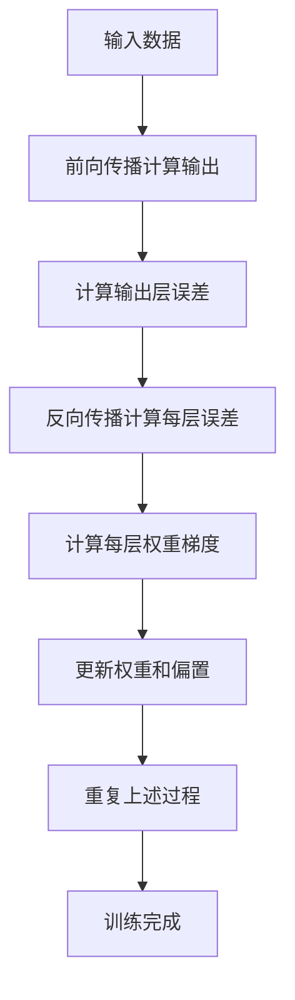

# Backpropagation原理与代码实例讲解

## 1.背景介绍

### 1.1 神经网络简介

神经网络是一种受生物神经系统启发而设计的计算模型,由大量互连的节点(神经元)组成。这些节点接收输入数据,经过加权求和和非线性激活函数的处理,产生输出。神经网络通过对大量数据的学习,自动捕获输入和输出之间的映射关系,从而实现诸如分类、回归等各种任务。

### 1.2 神经网络训练的重要性

为了使神经网络能够学习到有效的映射关系,需要对网络中的参数(权重和偏置)进行训练。训练的目标是找到一组参数值,使得神经网络在训练数据上的误差最小化。这个过程被称为经验风险最小化。

### 1.3 反向传播算法的作用

反向传播(Backpropagation)算法是一种用于训练多层神经网络的监督学习算法。它通过计算损失函数关于网络权重的梯度,并沿着梯度的反方向更新权重,从而最小化网络的损失函数。反向传播算法使得训练深层神经网络成为可能,是当前绝大多数神经网络模型训练的核心算法。

## 2.核心概念与联系

### 2.1 前向传播

前向传播是神经网络计算输出的过程。给定输入数据,通过对每一层的加权求和和激活函数计算,依次向前传播,最终得到输出层的结果。这个过程可以用数学表达式表示为:

$$
\begin{aligned}
z^{(l)} &= W^{(l)}a^{(l-1)} + b^{(l)}\\
a^{(l)} &= \sigma(z^{(l)})
\end{aligned}
$$

其中 $z^{(l)}$ 表示第 $l$ 层的加权输入, $W^{(l)}$ 和 $b^{(l)}$ 分别是该层的权重和偏置, $a^{(l-1)}$ 是上一层的激活值, $\sigma$ 是激活函数。

### 2.2 损失函数

损失函数用于衡量神经网络的输出与期望输出之间的差异。常用的损失函数包括均方误差损失函数、交叉熵损失函数等。对于单个样本,损失函数可以表示为:

$$J(W,b;x,y) = L(a^{(L)}, y)$$

其中 $L$ 是具体的损失函数, $a^{(L)}$ 是输出层的激活值, $y$ 是期望输出。

### 2.3 反向传播

反向传播的核心思想是利用链式法则计算损失函数关于每一层权重的梯度,然后沿梯度方向更新权重,从而最小化损失函数。具体步骤包括:

1. 前向传播计算输出和损失
2. 反向传播计算每层权重梯度
3. 根据梯度更新权重

梯度的计算利用了链式法则,从输出层开始逐层向后传播,计算每一层权重梯度。

## 3.核心算法原理具体操作步骤

反向传播算法的具体步骤如下:

1. **前向传播计算输出**

给定输入数据 $x$,计算每一层的加权输入 $z^{(l)}$ 和激活值 $a^{(l)}$,直到得到输出层的激活值 $a^{(L)}$。

2. **计算输出层误差**

$$\delta^{(L)} = \nabla_aL(a^{(L)}, y) \odot \sigma'(z^{(L)})$$

其中 $\nabla_aL(a^{(L)}, y)$ 是损失函数关于输出层激活值的梯度, $\sigma'(z^{(L)})$ 是激活函数的导数。

3. **反向传播计算每层误差**

对于隐藏层 $l=L-1, L-2, \cdots, 2$:

$$\delta^{(l)} = ((W^{(l+1)})^T\delta^{(l+1)}) \odot \sigma'(z^{(l)})$$

4. **计算每层权重梯度**

$$\nabla_{W^{(l)}}J(W,b;x,y) = \delta^{(l+1)}(a^{(l)})^T$$
$$\nabla_{b^{(l)}}J(W,b;x,y) = \delta^{(l+1)}$$

5. **更新权重和偏置**

$$W^{(l)} := W^{(l)} - \alpha\nabla_{W^{(l)}}J(W,b;x,y)$$
$$b^{(l)} := b^{(l)} - \alpha\nabla_{b^{(l)}}J(W,b;x,y)$$

其中 $\alpha$ 是学习率,控制更新的步长。

6. **重复上述过程**

对训练数据集中的每个样本重复上述步骤,直到损失函数收敛或达到最大迭代次数。

上述过程可以用以下流程图直观展示:

## 4.数学模型和公式详细讲解举例说明

### 4.1 前向传播

前向传播的数学表达式为:

$$
\begin{aligned}
z^{(l)} &= W^{(l)}a^{(l-1)} + b^{(l)}\\
a^{(l)} &= \sigma(z^{(l)})
\end{aligned}
$$

其中:

- $z^{(l)}$ 表示第 $l$ 层的加权输入,是一个向量
- $W^{(l)}$ 是该层的权重矩阵,将上一层的激活值 $a^{(l-1)}$ 与权重相乘
- $b^{(l)}$ 是该层的偏置向量
- $\sigma$ 是激活函数,通常使用 ReLU、Sigmoid 或 Tanh 等非线性函数

例如,对于一个两层神经网络:

- 输入层有 3 个神经元
- 隐藏层有 4 个神经元,使用 ReLU 激活函数
- 输出层有 2 个神经元,使用 Softmax 激活函数

设输入为 $x = [0.5, 0.1, 0.2]^T$,权重和偏置分别为:

$$W^{(1)} = \begin{bmatrix}
0.1 & 0.4 & 0.3\\
0.2 & 0.1 & 0.5\\
0.3 & 0.2 & 0.1\\
0.4 & 0.3 & 0.2
\end{bmatrix}, \quad b^{(1)} = \begin{bmatrix}
0.2\\
0.1\\
0.3\\
0.4
\end{bmatrix}$$

$$W^{(2)} = \begin{bmatrix}
0.3 & 0.1\\
0.2 & 0.4\\
0.5 & 0.2\\
0.1 & 0.3
\end{bmatrix}, \quad b^{(2)} = \begin{bmatrix}
0.1\\
0.2
\end{bmatrix}$$

则前向传播过程为:

1. 计算隐藏层加权输入和激活值:

$$\begin{aligned}
z^{(1)} &= W^{(1)}x + b^{(1)}\\
       &= \begin{bmatrix}
0.1 & 0.4 & 0.3\\
0.2 & 0.1 & 0.5\\
0.3 & 0.2 & 0.1\\
0.4 & 0.3 & 0.2
\end{bmatrix}\begin{bmatrix}
0.5\\
0.1\\
0.2
\end{bmatrix} + \begin{bmatrix}
0.2\\
0.1\\
0.3\\
0.4
\end{bmatrix}\\
       &= \begin{bmatrix}
0.37\\
0.32\\
0.23\\
0.43
\end{bmatrix}\\
a^{(1)} &= \text{ReLU}(z^{(1)})\\
       &= \begin{bmatrix}
0.37\\
0.32\\
0.23\\
0.43
\end{bmatrix}
\end{aligned}$$

2. 计算输出层加权输入和激活值:

$$\begin{aligned}
z^{(2)} &= W^{(2)}a^{(1)} + b^{(2)}\\
       &= \begin{bmatrix}
0.3 & 0.1\\
0.2 & 0.4\\
0.5 & 0.2\\
0.1 & 0.3
\end{bmatrix}\begin{bmatrix}
0.37\\
0.32\\
0.23\\
0.43
\end{bmatrix} + \begin{bmatrix}
0.1\\
0.2
\end{bmatrix}\\
       &= \begin{bmatrix}
0.441\\
0.526
\end{bmatrix}\\
a^{(2)} &= \text{Softmax}(z^{(2)})\\
       &= \begin{bmatrix}
0.393\\
0.607
\end{bmatrix}
\end{aligned}$$

因此,输出层的激活值 $a^{(2)}$ 就是神经网络对于输入 $x$ 的最终输出。

### 4.2 反向传播

反向传播的目标是计算每层权重的梯度,以便更新权重。根据链式法则,我们可以从输出层开始逐层向后传播计算梯度。

假设使用均方误差损失函数:

$$J(W,b;x,y) = \frac{1}{2}\|a^{(L)} - y\|^2$$

其中 $y$ 是期望输出。

#### 4.2.1 计算输出层误差

首先计算输出层的误差 $\delta^{(L)}$:

$$\begin{aligned}
\delta^{(L)} &= \nabla_aL(a^{(L)}, y) \odot \sigma'(z^{(L)})\\
            &= (a^{(L)} - y) \odot \sigma'(z^{(L)})
\end{aligned}$$

其中 $\odot$ 表示元素wise乘积,对于 Softmax 激活函数,其导数为:

$$\sigma'(z^{(L)}) = a^{(L)} \odot (1 - a^{(L)})$$

假设期望输出为 $y = [0, 1]^T$,则:

$$\begin{aligned}
\delta^{(L)} &= (a^{(L)} - y) \odot \sigma'(z^{(L)})\\
            &= \begin{bmatrix}
0.393 - 0\\
0.607 - 1
\end{bmatrix} \odot \begin{bmatrix}
0.393 \times 0.607\\
0.607 \times 0.393
\end{bmatrix}\\
            &= \begin{bmatrix}
0.238\\
-0.238
\end{bmatrix}
\end{aligned}$$

#### 4.2.2 反向传播计算每层误差

对于隐藏层 $l=L-1, L-2, \cdots, 2$,误差 $\delta^{(l)}$ 的计算方式为:

$$\delta^{(l)} = ((W^{(l+1)})^T\delta^{(l+1)}) \odot \sigma'(z^{(l)})$$

其中 $\sigma'(z^{(l)})$ 是 ReLU 激活函数的导数,对于 ReLU 函数有:

$$\sigma'(z) = \begin{cases}
1, & \text{if }z > 0\\
0, & \text{if }z \leq 0
\end{cases}$$

因此,对于隐藏层:

$$\begin{aligned}
\delta^{(1)} &= ((W^{(2)})^T\delta^{(2)}) \odot \sigma'(z^{(1)})\\
            &= \begin{bmatrix}
0.3 & 0.2\\
0.1 & 0.4\\
0.5 & 0.2\\
0.1 & 0.3
\end{bmatrix}\begin{bmatrix}
0.238\\
-0.238
\end{bmatrix} \odot \begin{bmatrix}
1\\
1\\
1\\
1
\end{bmatrix}\\
            &= \begin{bmatrix}
-0.071\\
0.024\\
0.119\\
-0.071
\end{bmatrix}
\end{aligned}$$

#### 4.2.3 计算每层权重梯度

权重梯度的计算公式为:

$$\nabla_{W^{(l)}}J(W,b;x,y) = \delta^{(l+1)}(a^{(l)})^T$$
$$\nabla_{b^{(l)}}J(W,b;x,y) = \delta^{(l+1)}$$

对于输出层:

$$\begin{aligned}
\nabla_{W^{(2)}}J(W,b;x,y) &= \delta^{(2)}(a^{(1)})^T\\
                           &= \begin{bmatrix}
0.238\\
-0.238
\end{bmatrix}\begin{bmatrix}
0.37 & 0.32 & 0.