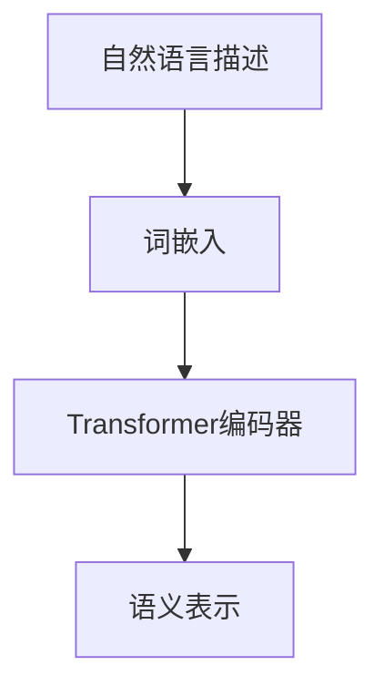
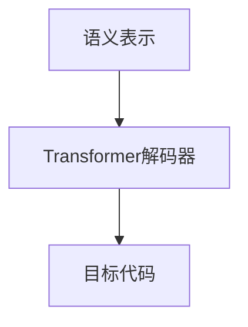
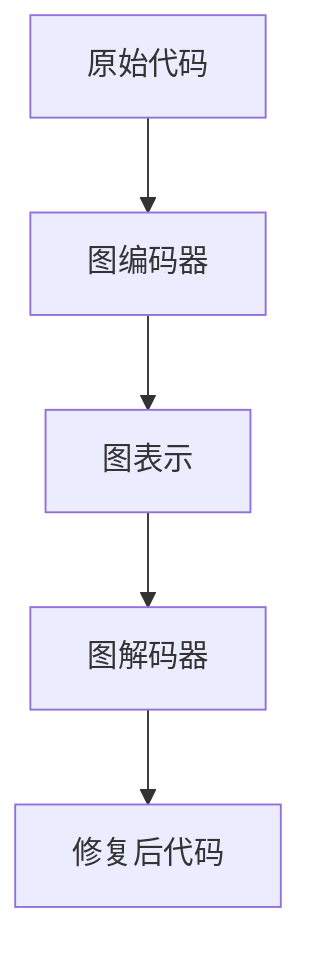

# CodeGen原理与代码实例讲解

## 1. 背景介绍

随着人工智能和机器学习技术的快速发展,代码生成(CodeGen)已成为一个备受关注的研究领域。CodeGen旨在通过输入一些自然语言描述或少量种子代码,自动生成完整、可执行的计算机程序代码。这项技术有望极大提高程序员的工作效率,降低编程门槛,促进人机协作,推动软件开发进入一个全新的阶段。

在传统的软件开发过程中,程序员需要手动编写每一行代码,这不仅耗时耗力,而且容易出现低级错误和bug。而CodeGen则可以根据开发需求自动生成代码框架和模板,减轻程序员的工作负担。此外,CodeGen还可应用于代码迁移、代码修复等多种场景,具有广阔的应用前景。

## 2. 核心概念与联系

CodeGen的核心思想是将自然语言或少量种子代码映射到目标程序代码的过程,这需要综合运用自然语言处理(NLP)、程序语法分析、机器学习等多种技术。下面是CodeGen中的几个关键概念:

1. **语义解析(Semantic Parsing)**: 将自然语言描述转换为结构化的语义表示,例如逻辑形式、抽象语法树等。这是CodeGen的第一步,也是最具挑战性的一步。

2. **代码生成(Code Generation)**: 根据语义表示生成目标程序代码。这通常需要结合语言模型、规则约束等技术。

3. **代码修复(Code Repair)**: 对生成的代码进行修复和优化,使其满足特定需求,如改正语法错误、提高效率等。

4. **迁移学习(Transfer Learning)**: 利用在某一领域学习到的知识,帮助CodeGen系统适应新的编程语言或应用场景。

5. **人机协作(Human-AI Collaboration)**: CodeGen系统与人工程师紧密协作,实现人机协同编程。

这些概念相互关联、环环相扣,共同构建了CodeGen的技术体系。下面我们将详细探讨其核心算法原理和实现细节。

## 3. 核心算法原理具体操作步骤

CodeGen的核心算法主要分为三个步骤:语义解析、代码生成和代码修复。

### 3.1 语义解析

语义解析的目标是将自然语言描述转换为结构化的语义表示,这是整个CodeGen过程的基础。主流的语义解析方法包括:

1. **基于规则的方法**: 利用一系列手工定义的规则和模板,将自然语言映射到语义表示。这种方法需要大量的人工努力,且缺乏通用性。

2. **基于监督学习的方法**: 将语义解析看作一个序列到序列(Seq2Seq)的转换问题,使用编码器-解码器模型进行端到端的训练。这种方法需要大量的标注数据,且容易受到领域偏移的影响。

3. **基于无监督学习的方法**: 利用大规模的自然语言语料和程序语料,通过自监督的方式学习语义解析模型。这种方法具有更强的通用性和可扩展性。

其中,基于无监督学习的方法是当前的研究热点,代表性工作包括CodeBERT、CodeGPT等。它们通过预训练的方式,学习自然语言和程序语言之间的语义对应关系,从而实现高质量的语义解析。

无监督语义解析的一般流程如下:

1. 收集大规模的自然语言语料(如书籍、网页等)和程序语料(如开源代码库)。

2. 使用自监督的目标函数(如掩码语言模型)对语料进行预训练,得到初始的语义表示。

3. 在预训练模型的基础上,使用少量标注数据进行微调,得到特定任务的语义解析模型。

4. 对新的自然语言描述,使用微调后的模型生成对应的语义表示。

在这个过程中,注意力机制、transformer编码器等技术发挥了重要作用。下面是一个基于transformer的语义解析模型架构示意图:

### 3.2 代码生成

获得语义表示后,下一步是将其转换为目标程序代码。主流的代码生成方法有:

1. **基于规则的方法**: 根据手工定义的规则和模板,将语义表示转换为代码。这种方法需要大量的人工努力,且缺乏灵活性。

2. **基于监督学习的方法**: 将代码生成看作一个Seq2Seq问题,使用编码器-解码器模型进行端到端训练。这种方法需要大量的并行数据(语义表示和对应代码),且容易受到领域偏移的影响。

3. **基于强化学习的方法**: 将代码生成看作一个序列决策问题,使用强化学习算法(如策略梯度)优化生成策略。这种方法具有更强的通用性,但收敛性和样本效率较低。

4. **基于无监督学习的方法**: 利用大规模的程序语料,通过自监督的方式学习代码生成模型。这种方法不需要并行数据,具有更强的通用性和可扩展性。

与语义解析类似,基于无监督学习的方法是当前代码生成的研究热点。代表性工作包括CodeGPT、PLBART等,它们通过预训练的方式,学习程序语言的语义和语法规则,从而实现高质量的代码生成。

无监督代码生成的一般流程如下:

1. 收集大规模的程序语料,如开源代码库、文档等。

2. 使用自监督的目标函数(如掩码语言模型)对语料进行预训练,得到初始的代码生成模型。

3. 在预训练模型的基础上,使用少量标注数据(语义表示和对应代码)进行微调,得到特定任务的代码生成模型。

4. 对新的语义表示,使用微调后的模型生成对应的目标程序代码。

在这个过程中,注意力机制、beam search等技术发挥了重要作用。下面是一个基于transformer的代码生成模型架构示意图:

### 3.3 代码修复

生成的代码通常不是完美的,需要进一步的修复和优化。主流的代码修复方法有:

1. **基于规则的方法**: 根据手工定义的规则和模板,对代码进行修复。这种方法需要大量的人工努力,且缺乏通用性。

2. **基于监督学习的方法**: 将代码修复看作一个Seq2Seq问题,使用编码器-解码器模型进行端到端训练。这种方法需要大量的标注数据(原始代码和修复后的代码),且容易受到领域偏移的影响。

3. **基于强化学习的方法**: 将代码修复看作一个序列决策问题,使用强化学习算法(如策略梯度)优化修复策略。这种方法具有更强的通用性,但收敛性和样本效率较低。

4. **基于无监督学习的方法**: 利用大规模的程序语料,通过自监督的方式学习代码修复模型。这种方法不需要标注数据,具有更强的通用性和可扩展性。

与前两个步骤类似,基于无监督学习的方法是当前代码修复的研究热点。代表性工作包括CodeBERT、GraphCodeBERT等,它们通过预训练的方式,学习程序语言的语义和语法规则,从而实现高质量的代码修复。

无监督代码修复的一般流程如下:

1. 收集大规模的程序语料,包括原始代码和修复后的代码。

2. 使用自监督的目标函数(如掩码语言模型)对语料进行预训练,得到初始的代码修复模型。

3. 在预训练模型的基础上,使用少量标注数据(原始代码和修复后的代码)进行微调,得到特定任务的代码修复模型。

4. 对新的原始代码,使用微调后的模型生成修复后的代码。

在这个过程中,图神经网络、对比学习等技术发挥了重要作用。下面是一个基于图神经网络的代码修复模型架构示意图:

通过以上三个步骤,CodeGen系统可以从自然语言描述或少量种子代码出发,生成完整、可执行的目标程序代码。这个过程综合运用了NLP、程序语法分析、机器学习等多种技术,是一个极具挑战的交叉研究领域。

## 4. 数学模型和公式详细讲解举例说明

在CodeGen的核心算法中,涉及了多种数学模型和公式,下面我们将详细讲解其中的几个代表性模型。

### 4.1 transformer模型

transformer是CodeGen中广泛使用的一种序列到序列(Seq2Seq)模型,它可以应用于语义解析、代码生成、代码修复等多个任务。transformer的核心思想是使用自注意力(self-attention)机制捕获序列中元素之间的长程依赖关系,从而更好地建模序列数据。

transformer的数学模型可以表示为:

$$Y = \text{Transformer}(X)$$

其中,X是输入序列,Y是输出序列。transformer的具体计算过程如下:

1. **词嵌入(Word Embedding)**: 将输入序列X中的每个元素(如单词或代码token)映射到一个连续的向量空间,得到嵌入矩阵$E_X$。

2. **位置编码(Positional Encoding)**: 为每个位置添加位置信息,得到位置编码矩阵$P_X$。

3. **多头自注意力(Multi-Head Self-Attention)**: 计算输入序列中元素之间的注意力权重,捕获长程依赖关系。具体计算公式如下:

$$\text{MultiHead}(Q, K, V) = \text{Concat}(\text{head}_1, \dots, \text{head}_h)W^O$$
$$\text{head}_i = \text{Attention}(QW_i^Q, KW_i^K, VW_i^V)$$
$$\text{Attention}(Q, K, V) = \text{softmax}(\frac{QK^T}{\sqrt{d_k}})V$$

其中,$Q$、$K$、$V$分别表示查询(Query)、键(Key)和值(Value),$W_i^Q$、$W_i^K$、$W_i^V$是可学习的线性投影参数,$W^O$是最终的线性变换。

4. **前馈神经网络(Feed-Forward Network)**: 对自注意力的输出进行非线性变换,捕获更复杂的特征。

5. **规范化(Normalization)和残差连接(Residual Connection)**: 用于稳定训练过程和缓解梯度消失问题。

通过上述计算,transformer可以生成输出序列Y,即目标语义表示、代码或修复后的代码。在实际应用中,transformer通常采用编码器-解码器的架构,其中编码器捕获输入序列的特征,解码器生成输出序列。

transformer模型在CodeGen中发挥了关键作用,它的自注意力机制能够有效捕获程序语言中的长程依赖关系,从而提高了模型的表示能力和生成质量。

### 4.2 图神经网络模型

除了transformer,图神经网络(Graph Neural Network, GNN)也是CodeGen中常用的一种模型,尤其在代码修复任务中发挥了重要作用。GNN可以直接对程序的抽象语法树(Abstract Syntax Tree, AST)进行建模,捕获程序语法和语义信息。

GNN的数学模型可以表示为:

$$H^{(l+1)} = \text{GNN}(H^{(l)}, A)$$

其中,$H^{(l)}$是第$l$层节点的特征矩阵,$A$是邻接矩阵,表示节点之间的结构关系。GNN的具体计算过程如下:

1. **节点初始化**: 将AST中的每个节点(如语句、表达式等)映射到一个初始的特征向量,得到初始特征矩阵$H^{(0)}$。

2. **信息传播**: 在每一层,每个节点的特征向量由