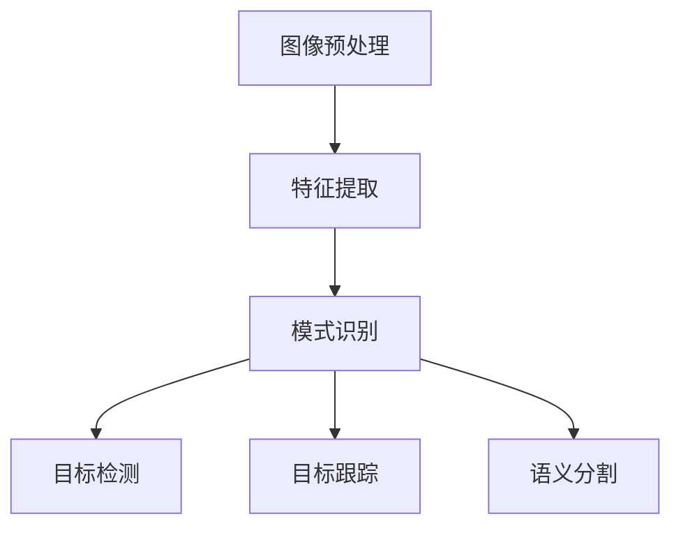
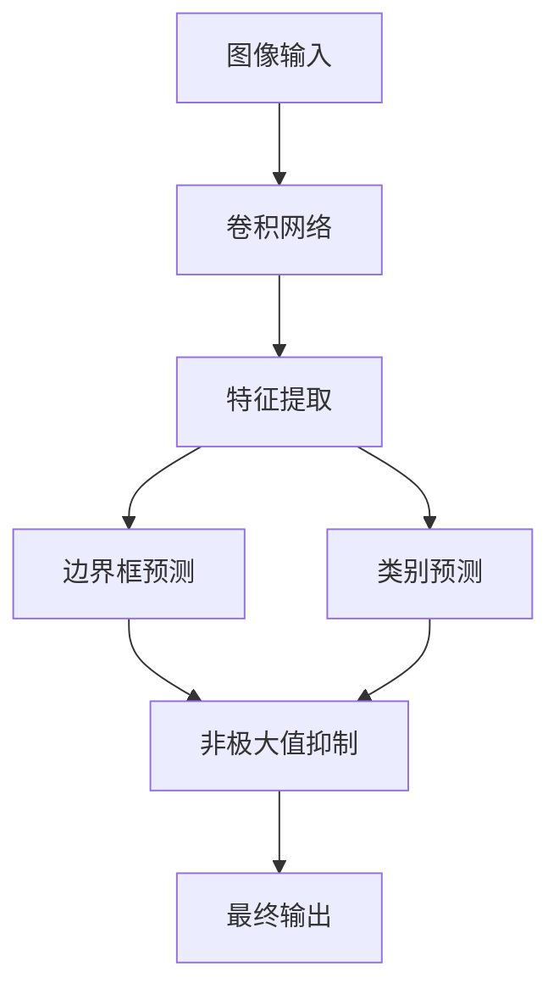

# Computer Vision Techniques 原理与代码实战案例讲解

## 1. 背景介绍

计算机视觉(Computer Vision)是人工智能领域的一个重要分支,旨在赋予机器以视觉能力,使其能够从图像或视频中获取有用信息并进行理解和处理。随着深度学习技术的飞速发展,计算机视觉已经渗透到我们生活的方方面面,包括自动驾驶、人脸识别、医疗影像分析、机器人视觉等诸多领域。

计算机视觉技术的核心在于从图像或视频数据中提取有用的特征信息,并基于这些特征进行高层次的理解和决策。传统的计算机视觉方法主要依赖于手工设计的特征提取算法,如SIFT、HOG等,但这些方法往往受到场景复杂性和数据量的限制。近年来,深度学习技术的兴起为计算机视觉带来了革命性的变革,使得机器能够自主学习特征表示,大幅提高了视觉任务的性能。

## 2. 核心概念与联系

计算机视觉涉及多个核心概念,包括图像预处理、特征提取、模式识别、目标检测、目标跟踪、语义分割等。这些概念相互关联,共同构建了计算机视觉的理论和实践框架。



1. **图像预处理**: 包括图像去噪、增强、几何变换等操作,旨在提高图像质量和适应后续处理。
2. **特征提取**: 从图像中提取有意义的特征信息,如边缘、角点、纹理等,是计算机视觉的基础。
3. **模式识别**: 基于提取的特征,对图像中的模式进行分类和识别。
4. **目标检测**: 在图像或视频中定位并框选出感兴趣的目标对象。
5. **目标跟踪**: 在视频序列中持续跟踪感兴趣目标的运动轨迹。
6. **语义分割**: 对图像中的每个像素进行语义级别的分类,将图像分割成不同的语义区域。

## 3. 核心算法原理具体操作步骤

计算机视觉算法通常包括以下几个核心步骤:

1. **图像采集**: 从摄像头、数据集等获取图像或视频数据。
2. **预处理**: 对原始图像进行去噪、增强、几何变换等预处理,以提高图像质量和适应后续处理。
3. **特征提取**: 使用手工设计或深度学习方法从图像中提取有意义的特征,如边缘、角点、纹理、深度特征等。
4. **模型训练**: 基于提取的特征,使用机器学习或深度学习算法训练分类器、检测器或其他模型。
5. **模型评估**: 在测试数据集上评估模型的性能,如准确率、召回率、F1分数等指标。
6. **模型优化**: 根据评估结果,调整模型参数、优化算法或增加训练数据,以提高模型性能。
7. **模型部署**: 将优化后的模型集成到实际应用系统中,实现目标检测、目标跟踪、语义分割等任务。

下面以目标检测任务为例,介绍一种流行的深度学习算法YOLO(You Only Look Once)的具体操作步骤:



1. **图像输入**: 将需要进行目标检测的图像输入到YOLO模型。
2. **卷积网络**: 图像通过一系列卷积层和池化层,提取出多尺度的特征图。
3. **特征提取**: 在最终特征图上应用锚框(Anchor Box)机制,为每个锚框生成边界框和类别预测。
4. **边界框预测**: 对每个锚框,预测其包围目标的边界框坐标。
5. **类别预测**: 对每个锚框,预测其包围目标的类别概率。
6. **非极大值抑制**: 对预测的边界框进行非极大值抑制,去除重叠的冗余框。
7. **最终输出**: 输出保留下来的目标边界框及其类别预测结果。

YOLO算法的优点是速度快,可以实时进行目标检测。但它也存在一些缺陷,如对小目标的检测精度较低、对密集排列的目标检测效果不佳等。因此,后续出现了改进版本YOLOv2、YOLOv3等,以提高检测精度。

## 4. 数学模型和公式详细讲解举例说明

计算机视觉中常用的数学模型和公式包括:

1. **卷积运算**:

   卷积是深度学习中最基本的操作之一,用于提取图像的局部特征。二维卷积的数学表达式为:

   $$
   G(i,j) = (f*k)(i,j) = \sum_{m}\sum_{n}f(i-m,j-n)k(m,n)
   $$

   其中,$f$是输入图像,$k$是卷积核,$G$是卷积后的特征图。卷积操作可以提取图像的边缘、纹理等局部模式。

2. **非极大值抑制(NMS)**:

   NMS是目标检测中常用的后处理步骤,用于去除重叠的冗余边界框。对于每个预测的边界框,计算其与其他框的交并比(IoU):

   $$
   \text{IoU}(b_1, b_2) = \frac{\text{Area}(b_1 \cap b_2)}{\text{Area}(b_1 \cup b_2)}
   $$

   如果两个框的IoU超过一定阈值,则保留得分更高的框,抑制得分较低的框。

3. **锚框(Anchor Box)机制**:

   锚框机制是YOLO等目标检测算法的核心思想。它将图像划分为网格,每个网格单元预测一组锚框,每个锚框对应一个边界框和类别预测。锚框的尺寸和比例是预先设定的,通常根据训练数据集中目标的统计信息确定。

   假设图像的尺寸为$W \times H$,划分为$S \times S$个网格单元,每个单元预测$N$个锚框。对于第$i$个网格单元的第$j$个锚框,其预测的边界框坐标为$(b_x, b_y, b_w, b_h)$,其中$(b_x, b_y)$是边界框中心相对于网格单元的偏移量,$b_w$和$b_h$是边界框的宽高。它们的计算公式为:

   $$
   \begin{aligned}
   b_x &= \sigma(t_x) + c_x \\
   b_y &= \sigma(t_y) + c_y \\
   b_w &= p_w e^{t_w} \\
   b_h &= p_h e^{t_h}
   \end{aligned}
   $$

   其中,$\sigma$是sigmoid函数,$(t_x, t_y, t_w, t_h)$是网络预测的偏移量,$(c_x, c_y)$是当前网格单元的坐标,$(p_w, p_h)$是当前锚框的宽高。

通过上述数学模型和公式,目标检测算法能够从图像中精确定位目标的位置和类别,实现准确的目标检测。

## 5. 项目实践: 代码实例和详细解释说明

下面我们使用PyTorch实现一个基于YOLO的目标检测示例,并对关键代码进行解释说明。

### 5.1 导入必要的库

```python
import torch
import torch.nn as nn
import torchvision
import torchvision.transforms as transforms
import numpy as np
import matplotlib.pyplot as plt
```

### 5.2 定义YOLO网络模型

```python
class YOLONet(nn.Module):
    def __init__(self, num_classes=20, anchors=None):
        super(YOLONet, self).__init__()
        # 定义卷积层和池化层
        self.conv_layers = nn.Sequential(
            nn.Conv2d(3, 64, kernel_size=7, stride=2, padding=3),
            nn.BatchNorm2d(64),
            nn.LeakyReLU(0.1),
            nn.MaxPool2d(kernel_size=2, stride=2),
            # 其他卷积层...
        )
        # 定义全连接层
        self.fc_layers = nn.Sequential(
            nn.Flatten(),
            nn.Linear(1024 * 7 * 7, 4096),
            nn.Dropout(0.5),
            nn.LeakyReLU(0.1),
            nn.Linear(4096, 7 * 7 * (5 * num_classes + 5)),
        )
        # 初始化锚框
        if anchors is None:
            anchors = [[1.08, 1.19], [3.42, 4.41], [6.63, 11.38], [9.42, 5.11], [16.62, 10.52]]
        self.anchors = torch.tensor(anchors, dtype=torch.float32)
        self.num_anchors = len(anchors)
        self.num_classes = num_classes

    def forward(self, x):
        x = self.conv_layers(x)
        x = self.fc_layers(x)
        # 解析输出
        batch_size = x.size(0)
        grid_size = 7
        prediction = (
            x.view(batch_size, grid_size, grid_size, self.num_anchors, 5 + self.num_classes)
            .permute(0, 1, 2, 4, 3)
            .contiguous()
        )
        # 获取边界框和类别预测
        xy = torch.sigmoid(prediction[..., 0:2])
        wh = prediction[..., 2:4]
        conf = torch.sigmoid(prediction[..., 4:5])
        cls_scores = torch.sigmoid(prediction[..., 5:])
        # 解码边界框
        xy = xy + torch.meshgrid([torch.arange(grid_size), torch.arange(grid_size)])[0].view(1, grid_size, grid_size, 1).repeat(batch_size, 1, 1, self.num_anchors)
        wh = torch.exp(wh) * self.anchors.repeat(batch_size, grid_size, grid_size, 1)
        boxes = torch.cat([xy, wh], dim=-1)
        return boxes, conf, cls_scores
```

上述代码定义了YOLO网络模型的核心部分。主要包括以下几个步骤:

1. 定义卷积层和池化层,用于从输入图像中提取特征。
2. 定义全连接层,将提取的特征映射到预测输出。
3. 初始化锚框(Anchor Box),用于预测边界框。
4. 在`forward`函数中,首先通过卷积层和全连接层获取预测输出。
5. 对预测输出进行解析,获取边界框坐标、置信度和类别分数。
6. 对边界框坐标进行解码,将其映射到实际图像坐标系。

### 5.3 加载数据集和预训练模型

```python
# 加载COCO数据集
dataset = torchvision.datasets.CocoDetection(root='data/coco', download=True)
data_loader = torch.utils.data.DataLoader(dataset, batch_size=8, shuffle=True)

# 加载预训练模型权重
model = YOLONet(num_classes=len(dataset.classes))
model.load_state_dict(torch.load('yolo_weights.pth'))
model.eval()
```

上述代码加载了COCO数据集,并创建了数据加载器。同时,它还加载了预先训练好的YOLO模型权重。

### 5.4 目标检测和可视化

```python
# 目标检测和可视化
for images, targets in data_loader:
    boxes, conf, cls_scores = model(images)
    # 应用非极大值抑制
    boxes, labels, scores = nms(boxes, conf, cls_scores)
    # 可视化结果
    for img, box, label, score in zip(images, boxes, labels, scores):
        plot_image(img, box, label, score)
```

上述代码对数据集中的图像进行目标检测。首先,将图像输入到YOLO模型中,获取预测的边界框、置信度和类别分数。然后,应用非极大值抑制(NMS)算法去除重叠的冗余框。最后,将检测结果可视化,在图像上绘制边界框和标签。

`nms`和`plot_image`函数的具体实现在此省略,读者可以自行补充。

通过上述代码示例,我们可以看到如何使用PyTorch实现YOLO目标检测算法,并在实际数据集上进行目标检测和可视化。

## 6. 实