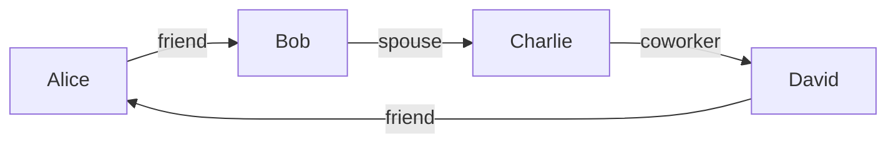

# Cosmos图计算引擎原理与Scope代码实例讲解

## 1.背景介绍

### 1.1 什么是Cosmos DB

Cosmos DB是Microsoft为全球化分布式应用程序提供的全球分布式、多模型数据库服务。它通过自动分片、自动故障转移、自动数据复制等功能,支持快速的数据迁移和数据复制,可实现全球范围内的低延迟数据访问。Cosmos DB可以透明地进行无缝扩展,并且能够独立扩展存储和吞吐量,使其成为大规模Web和移动应用程序的理想之选。

### 1.2 Cosmos DB的优势

Cosmos DB具有以下主要优势:

- **全球分布**:Cosmos DB通过自动复制数据到世界各地的区域,使应用程序能够在全球范围内实现低延迟数据访问。
- **多模型数据**:Cosmos DB原生支持文档、键值、宽列和关系数据模型。
- **自动索引**:Cosmos DB自动为数据建立索引,不需要手动编写复杂的索引管理代码。
- **高可用性**:Cosmos DB提供99.999%的高可用性SLA,并支持多主机写入。
- **无架构**:Cosmos DB采用无架构设计,可以自由添加或修改数据,无需预先定义架构。
- **自动分区**:Cosmos DB自动将数据分区并分布在多个物理分区上,实现水平扩展。

### 1.3 Cosmos DB图数据库引擎Gremlin

Cosmos DB图数据库引擎Gremlin是一个图形数据库,它使用Apache TinkerPop标准,支持Gremlin查询语言。Gremlin是一种功能强大的遍历语言,可以有效地在图形数据库中执行复杂的查询。Cosmos DB图数据库引擎具有以下主要特点:

- 完全兼容Apache TinkerPop标准
- 支持Gremlin查询语言
- 自动索引和查询优化
- 全球分布和多主机复制
- 自动分区和水平扩展

## 2.核心概念与联系

### 2.1 图数据库核心概念

图数据库是一种存储数据的方式,它以图形的形式表示和存储数据。图数据库由顶点(Vertex)和边(Edge)组成,顶点表示实体,边表示实体之间的关系。

- **顶点(Vertex)**:表示实体,如人、地点、事物等。每个顶点都有一个唯一的ID和一组属性。
- **边(Edge)**:表示顶点之间的关系,如朋友、家人、同事等关系。每条边都有一个唯一的ID、一个标签、一个方向和一组属性。
- **属性(Properties)**:顶点和边都可以有一组键值对形式的属性,用于存储实体的详细信息。
- **标签(Label)**:顶点和边都可以有一个或多个标签,用于对实体进行分类和过滤。

下面是一个简单的图形示例,展示了人与人之间的关系:



在这个示例中,Alice、Bob、Charlie和David是顶点,表示人;friend、spouse和coworker是边,表示人与人之间的关系。

### 2.2 Cosmos DB图数据库引擎Gremlin

Cosmos DB图数据库引擎Gremlin是一个完全兼容Apache TinkerPop标准的图形数据库,支持Gremlin查询语言。Gremlin是一种功能强大的遍历语言,可以有效地在图形数据库中执行复杂的查询。

Gremlin查询语言由一系列的步骤(Step)组成,每个步骤都会对数据进行一些处理或过滤操作。步骤可以链式组合,形成一个复杂的查询逻辑。Gremlin查询语言支持以下几种常见的步骤:

- **V()**:获取顶点
- **E()**:获取边
- **out()**:从当前顶点沿着出边遍历
- **in()**:从当前顶点沿着入边遍历
- **both()**:从当前顶点沿着出边和入边遍历
- **has()**:过滤顶点或边的属性
- **dedup()**:去重
- **order()**:排序
- **limit()**:限制结果数量

下面是一个简单的Gremlin查询示例,查找Alice的朋友:

```
g.V().has('name','Alice').out('friend')
```

这个查询首先获取名为Alice的顶点,然后沿着friend边遍历,最终返回Alice的朋友列表。

## 3.核心算法原理具体操作步骤

### 3.1 Gremlin查询执行流程

Cosmos DB图数据库引擎Gremlin在执行查询时,会经历以下几个主要步骤:

1. **查询解析**:将Gremlin查询语句解析为一系列的步骤(Step)。
2. **查询优化**:对解析后的步骤进行优化,如重新排序、合并等,以提高查询效率。
3. **索引查找**:根据查询条件,在索引中查找匹配的顶点或边。
4. **遍历执行**:按照优化后的步骤顺序,执行遍历操作,获取最终结果。
5. **结果返回**:将查询结果返回给客户端。

下面是一个具体的查询执行流程示例,查找Alice的朋友:

```mermaid
graph TD
    A[查询解析] --> B[查询优化]
    B --> C[索引查找]
    C --> D[遍历执行]
    D --> E[结果返回]
    
    C1>g.V().has('name','Alice')]
    D1>out('friend')]
```

1. 查询解析:将查询`g.V().has('name','Alice').out('friend')`解析为两个步骤,`V().has('name','Alice')`和`out('friend')`。
2. 查询优化:由于查询条件中包含`name`属性,因此可以利用索引进行优化。
3. 索引查找:在索引中查找名为Alice的顶点。
4. 遍历执行:从Alice顶点出发,沿着friend边遍历,获取所有朋友顶点。
5. 结果返回:将查询结果(Alice的朋友列表)返回给客户端。

### 3.2 Gremlin查询优化策略

为了提高查询效率,Cosmos DB图数据库引擎Gremlin采用了多种查询优化策略:

1. **索引优化**:利用顶点和边的属性索引,加速查询过程。
2. **查询重写**:对查询进行等价变换,以利用索引或减少计算量。
3. **并行执行**:将查询分解为多个子查询,并行执行,提高查询速度。
4. **查询缓存**:缓存频繁执行的查询结果,加速后续查询。
5. **查询终止**:在查询执行过程中,如果已经获得足够的结果,则终止查询,避免不必要的计算。

下面是一个查询优化示例,将查询`g.V().has('name','Alice').out('friend')`优化为`g.V().has('name','Alice').outE('friend').inV()`。优化后的查询可以利用friend边的索引,提高查询效率。

```mermaid
graph TD
    A[原始查询] --> B[优化查询]
    
    A1>g.V().has('name','Alice').out('friend')]
    B1>g.V().has('name','Alice').outE('friend').inV()]
```

### 3.3 Gremlin查询并行执行

为了进一步提高查询效率,Cosmos DB图数据库引擎Gremlin支持将查询分解为多个子查询,并行执行。这种并行执行策略可以充分利用多核CPU和分布式计算资源,加速查询处理。

下面是一个并行执行示例,查找Alice和Bob的朋友列表:

```mermaid
graph TD
    A[原始查询] --> B[分解子查询]
    B --> C1[子查询1]
    B --> C2[子查询2]
    C1 --> D[合并结果]
    C2 --> D
    
    A1>g.V().has('name',within('Alice','Bob')).out('friend')]
    B1>g.V().has('name','Alice').out('friend')]
    B2>g.V().has('name','Bob').out('friend')]
```

1. 原始查询:`g.V().has('name',within('Alice','Bob')).out('friend')`
2. 分解子查询:将原始查询分解为两个子查询,`g.V().has('name','Alice').out('friend')`和`g.V().has('name','Bob').out('friend')`。
3. 并行执行:并行执行两个子查询。
4. 合并结果:将两个子查询的结果合并,得到最终结果。

通过并行执行,可以充分利用计算资源,加速查询处理。

## 4.数学模型和公式详细讲解举例说明

### 4.1 PageRank算法

PageRank算法是一种用于计算网页重要性的算法,它被广泛应用于搜索引擎排名和社交网络分析等领域。在图数据库中,PageRank算法也可以用于计算顶点的重要性,从而发现重要的实体和关系。

PageRank算法的核心思想是,一个顶点的重要性不仅取决于它自身,还取决于指向它的边的数量和质量。具体来说,PageRank算法通过迭代计算,逐步更新每个顶点的PageRank值,直到收敛。

PageRank值的计算公式如下:

$$PR(v_i) = \frac{1-d}{N} + d \sum_{v_j \in In(v_i)} \frac{PR(v_j)}{Out(v_j)}$$

其中:

- $PR(v_i)$表示顶点$v_i$的PageRank值
- $In(v_i)$表示指向顶点$v_i$的入边集合
- $Out(v_j)$表示从顶点$v_j$出发的出边数量
- $N$表示图中顶点的总数
- $d$是一个阻尼系数,通常取值0.85

初始时,每个顶点的PageRank值都设置为$\frac{1}{N}$,然后按照上述公式进行迭代计算,直到PageRank值收敛或达到最大迭代次数。

下面是一个简单的PageRank计算示例:


假设阻尼系数$d=0.85$,初始时每个顶点的PageRank值都为$\frac{1}{4}=0.25$。经过一次迭代计算后,各顶点的PageRank值如下:

- $PR(A) = \frac{1-0.85}{4} + 0.85 \times \frac{0.25}{1} = 0.3625$
- $PR(B) = \frac{1-0.85}{4} + 0.85 \times \frac{0.25}{1} = 0.3625$
- $PR(C) = \frac{1-0.85}{4} + 0.85 \times \frac{0.25}{1} = 0.3625$
- $PR(D) = \frac{1-0.85}{4} + 0.85 \times \frac{0.25}{1} = 0.3625$

通过多次迭代,PageRank值将逐渐收敛,最终可以得到每个顶点的重要性排名。

### 4.2 社区发现算法

在图数据库中,社区发现算法用于识别图中的密集连接组件,即社区。社区发现算法可以帮助我们发现图中的密切关系群体,如朋友圈、同事群体等。

常见的社区发现算法包括:

- **Louvain算法**:基于模ул度优化的层次聚类算法,通过最大化模块度来划分社区。
- **标签传播算法**:每个顶点根据邻居的标签更新自己的标签,最终形成稳定的社区。
- **Girvan-Newman算法**:通过逐步移除边介数最高的边,将图分割为不同的社区。

下面以标签传播算法为例,介绍社区发现算法的原理和过程。

标签传播算法的基本思想是,每个顶点根据邻居的标签更新自己的标签,最终形成稳定的社区。算法过程如下:

1. 初始化:给每个顶点分配一个唯一的标签。
2. 迭代:
   - 对于每个顶点$v_i$,统计邻居顶点的标签分布。
   - 将$v_i$的标签更新为邻居中出现次数最多的标签。
   - 如果$v_i$的标签发生变化,则将其加入待处理队列。
3. 重复步骤2,直到所有顶点的标签不再变化。