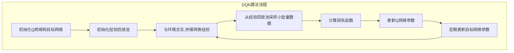

# DQN的应用案例分析：借鉴成功经验，启发创新思维

## 1.背景介绍

### 1.1 强化学习概述

强化学习(Reinforcement Learning)是机器学习的一个重要分支,它关注智能体(Agent)如何在与环境(Environment)的交互过程中,通过试错学习并获得最佳策略或行为方式。与监督学习和无监督学习不同,强化学习没有给定的输入-输出数据对,而是通过与环境交互获取奖励信号,并基于这些奖励信号调整行为策略。

### 1.2 深度强化学习的兴起

传统的强化学习算法在处理高维观测数据时存在瓶颈。深度神经网络的出现为强化学习提供了强大的函数拟合能力,使其能够直接从高维原始输入(如图像、视频等)中学习策略,从而催生了深度强化学习(Deep Reinforcement Learning)的兴起。

### 1.3 DQN算法的重要意义

在深度强化学习领域,深度Q网络(Deep Q-Network, DQN)算法是一个里程碑式的突破。DQN将深度神经网络应用于强化学习中的Q学习算法,成功解决了传统Q学习在处理高维观测数据时的困难,使得智能体能够直接从原始高维输入(如视频游戏画面)中学习出优秀的策略。DQN的提出极大推动了深度强化学习的发展,并在多个应用领域取得了卓越的成就。

## 2.核心概念与联系

### 2.1 马尔可夫决策过程(MDP)

马尔可夫决策过程(Markov Decision Process, MDP)是强化学习的数学基础模型。MDP由以下几个要素组成:

- 状态集合(State Space) $\mathcal{S}$
- 动作集合(Action Space) $\mathcal{A}$
- 状态转移概率(State Transition Probability) $\mathcal{P}_{ss'}^a = \Pr(S_{t+1}=s'|S_t=s, A_t=a)$
- 奖励函数(Reward Function) $\mathcal{R}_s^a = \mathbb{E}[R_{t+1}|S_t=s, A_t=a]$
- 折扣因子(Discount Factor) $\gamma \in [0, 1)$

目标是找到一个策略(Policy) $\pi: \mathcal{S} \rightarrow \mathcal{A}$,使得期望的累积折扣奖励(Expected Discounted Return)最大化:

$$
G_t = \sum_{k=0}^{\infty} \gamma^k R_{t+k+1}
$$

### 2.2 Q学习

Q学习是一种无模型(Model-free)的强化学习算法,它直接学习状态-动作值函数(State-Action Value Function) $Q(s, a)$,表示在状态 $s$ 下采取动作 $a$ 后能获得的期望累积折扣奖励。Q值函数满足以下贝尔曼方程(Bellman Equation):

$$
Q(s, a) = \mathbb{E}_{s' \sim \mathcal{P}_{ss'}^a} \left[ R_s^a + \gamma \max_{a'} Q(s', a') \right]
$$

通过不断更新Q值函数,最终可以得到最优策略 $\pi^*(s) = \arg\max_a Q^*(s, a)$。

### 2.3 深度Q网络(DQN)

深度Q网络(Deep Q-Network, DQN)将深度神经网络应用于Q学习算法中,使用神经网络来拟合Q值函数 $Q(s, a; \theta) \approx Q^*(s, a)$,其中 $\theta$ 为网络参数。

DQN算法的核心思想是使用经验回放(Experience Replay)和目标网络(Target Network)来提高训练稳定性和数据利用效率。

#### 2.3.1 经验回放

经验回放(Experience Replay)是指将智能体与环境交互过程中获得的转换经验 $(s_t, a_t, r_t, s_{t+1})$ 存储在经验回放池(Replay Buffer)中,并在训练时从中随机采样小批量数据进行训练。这种方法打破了强化学习数据的相关性,提高了数据的利用效率,并增加了训练的稳定性。

#### 2.3.2 目标网络

目标网络(Target Network)是一个与Q网络相同结构的网络,但参数是固定的。在训练过程中,我们使用目标网络的Q值作为更新Q网络参数的目标值,从而提高了训练的稳定性。目标网络的参数会定期复制自Q网络,以缓慢跟踪Q网络的变化。

DQN算法的损失函数定义为:

$$
\mathcal{L}(\theta) = \mathbb{E}_{(s, a, r, s') \sim \mathcal{D}} \left[ \left( r + \gamma \max_{a'} Q(s', a'; \theta^-) - Q(s, a; \theta) \right)^2 \right]
$$

其中 $\theta^-$ 表示目标网络的参数, $\mathcal{D}$ 为经验回放池。

DQN算法通过最小化上述损失函数,使Q网络的输出值逼近贝尔曼最优值,从而学习到最优的Q值函数和策略。



## 3.核心算法原理具体操作步骤

DQN算法的具体操作步骤如下:

1. **初始化**
   - 初始化Q网络和目标网络,两个网络的参数相同
   - 初始化经验回放池 $\mathcal{D}$

2. **与环境交互**
   - 在当前状态 $s_t$ 下,根据 $\epsilon$-贪婪策略选择动作 $a_t$
   - 执行动作 $a_t$,获得奖励 $r_{t+1}$ 和新状态 $s_{t+1}$
   - 将转换经验 $(s_t, a_t, r_{t+1}, s_{t+1})$ 存储到经验回放池 $\mathcal{D}$ 中

3. **采样数据并计算损失函数**
   - 从经验回放池 $\mathcal{D}$ 中随机采样一个小批量数据 $(s_j, a_j, r_j, s_{j+1})$
   - 计算目标值 $y_j = r_j + \gamma \max_{a'} Q(s_{j+1}, a'; \theta^-)$
   - 计算Q网络的输出值 $Q(s_j, a_j; \theta)$
   - 计算损失函数 $\mathcal{L}(\theta) = \frac{1}{N} \sum_j \left( y_j - Q(s_j, a_j; \theta) \right)^2$

4. **更新Q网络参数**
   - 使用优化算法(如梯度下降)最小化损失函数,更新Q网络的参数 $\theta$

5. **更新目标网络参数**
   - 每隔一定步长,将Q网络的参数复制到目标网络,以缓慢跟踪Q网络的变化

6. **重复步骤2-5,直到算法收敛**

通过上述步骤,DQN算法可以逐步学习到最优的Q值函数,从而获得最优的策略。

## 4.数学模型和公式详细讲解举例说明

在DQN算法中,我们需要学习一个近似的Q值函数 $Q(s, a; \theta) \approx Q^*(s, a)$,其中 $\theta$ 为神经网络的参数。为了使Q网络的输出值逼近真实的Q值函数,我们定义了以下损失函数:

$$
\mathcal{L}(\theta) = \mathbb{E}_{(s, a, r, s') \sim \mathcal{D}} \left[ \left( r + \gamma \max_{a'} Q(s', a'; \theta^-) - Q(s, a; \theta) \right)^2 \right]
$$

其中 $\mathcal{D}$ 为经验回放池, $\theta^-$ 表示目标网络的参数。

这个损失函数的目标是使Q网络的输出值 $Q(s, a; \theta)$ 尽可能接近贝尔曼最优值 $r + \gamma \max_{a'} Q(s', a'; \theta^-)$。

让我们通过一个简单的例子来理解这个损失函数:

假设我们从经验回放池中采样到一个转换经验 $(s, a, r, s')$,其中:

- $s$ 为当前状态
- $a$ 为在状态 $s$ 下采取的动作
- $r$ 为执行动作 $a$ 后获得的即时奖励
- $s'$ 为执行动作 $a$ 后转移到的新状态

我们的目标是使Q网络的输出值 $Q(s, a; \theta)$ 尽可能接近 $r + \gamma \max_{a'} Q(s', a'; \theta^-)$,即:

$$
Q(s, a; \theta) \approx r + \gamma \max_{a'} Q(s', a'; \theta^-)
$$

其中 $\gamma \max_{a'} Q(s', a'; \theta^-)$ 表示在新状态 $s'$ 下采取最优动作后能获得的期望累积折扣奖励。

为了实现这个目标,我们定义了上述的平方损失函数:

$$
\mathcal{L}(\theta) = \left( r + \gamma \max_{a'} Q(s', a'; \theta^-) - Q(s, a; \theta) \right)^2
$$

通过最小化这个损失函数,我们可以使Q网络的输出值 $Q(s, a; \theta)$ 逐渐逼近贝尔曼最优值 $r + \gamma \max_{a'} Q(s', a'; \theta^-)$,从而学习到一个近似的Q值函数。

在实际训练过程中,我们会从经验回放池中采样一个小批量数据,计算每个样本的损失,并对所有样本的损失求平均,得到最终的损失函数:

$$
\mathcal{L}(\theta) = \frac{1}{N} \sum_{j=1}^N \left( r_j + \gamma \max_{a'} Q(s_{j+1}, a'; \theta^-) - Q(s_j, a_j; \theta) \right)^2
$$

其中 $N$ 为小批量数据的大小。

通过最小化这个损失函数,我们可以使Q网络的输出值逐渐逼近真实的Q值函数,从而学习到最优的策略。

## 5.项目实践：代码实例和详细解释说明

为了更好地理解DQN算法,我们将通过一个简单的示例项目来实践该算法。在这个项目中,我们将训练一个智能体在经典的CartPole环境中学会平衡杆子。

### 5.1 环境介绍

CartPole环境是一个经典的强化学习环境,它模拟了一个小车在一条无限长的轨道上运动,小车上有一根杆子垂直固定。智能体的目标是通过向左或向右施加力,使杆子保持垂直并使小车在轨道上尽可能长时间地运动。

环境的状态由四个变量组成:

- 小车的位置
- 小车的速度
- 杆子的角度
- 杆子的角速度

环境的动作空间包括两个离散动作:向左施加力和向右施加力。

### 5.2 代码实现

我们将使用PyTorch框架来实现DQN算法。代码分为以下几个部分:

#### 5.2.1 导入所需库

```python
import gym
import math
import random
import numpy as np
import matplotlib.pyplot as plt
from collections import namedtuple, deque
from itertools import count

import torch
import torch.nn as nn
import torch.optim as optim
import torch.nn.functional as F
```

#### 5.2.2 定义经验回放池

```python
Transition = namedtuple('Transition', ('state', 'action', 'next_state', 'reward'))

class ReplayMemory(object):
    def __init__(self, capacity):
        self.memory = deque([], maxlen=capacity)

    def push(self, *args):
        self.memory.append(Transition(*args))

    def sample(self, batch_size):
        return random.sample(self.memory, batch_size)

    def __len__(self):
        return len(self.memory)
```

#### 5.2.3 定义DQN网络

```python
class DQN(nn.Module):
    def __init__(self, state_size, action_size):
        super(DQN, self).__init__()
        self.fc1 = nn.Linear(state_size, 24)
        self.fc2 = nn.Linear(24, 24)
        self.fc3 = nn.Linear(24,