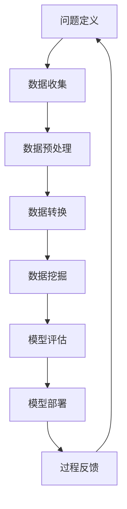
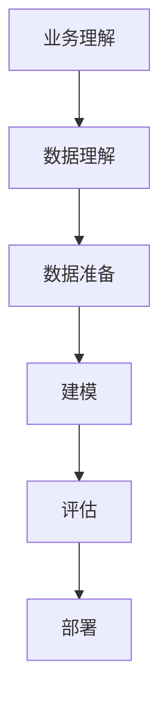

# Data Mining 原理与代码实战案例讲解

## 1.背景介绍

### 1.1 数据挖掘的概念

数据挖掘(Data Mining)是从大量数据中自动发现隐含规律、有价值的信息和知识的过程。它是一门跨领域的学科,涉及数据库理论、人工智能、机器学习、统计学、模式识别等多个领域。随着信息时代的到来,海量数据的积累使得传统的数据分析方法已经无法满足需求,数据挖掘应运而生。

### 1.2 数据挖掘的重要性

数据挖掘在当今大数据时代扮演着越来越重要的角色。企业、政府和科研机构都在利用数据挖掘技术从海量数据中发掘有价值的信息,用于决策支持、风险管理、欺诈检测、客户关系管理等诸多领域。数据挖掘还在互联网、金融、医疗、零售等行业得到了广泛应用。

### 1.3 数据挖掘的挑战

尽管数据挖掘具有巨大的应用前景,但它也面临一些挑战:

1. 数据质量问题:噪声、缺失值、不一致性等数据质量问题会影响挖掘结果的准确性。
2. 数据量和维度:大数据时代下海量高维数据给算法和计算能力带来了巨大压力。
3. 算法性能:对于特定问题需要设计高效的算法以满足实时性和可扩展性要求。
4. 结果解释性:许多算法是黑箱模型,结果缺乏解释性,难以被人类理解和信任。
5. 隐私和安全:数据挖掘过程中需要注意保护个人隐私和数据安全。

## 2.核心概念与联系

### 2.1 数据挖掘的步骤

数据挖掘是一个循环迭代的过程,主要包括以下几个步骤:



1. **问题定义**: 明确挖掘目标,确定相关先验知识。
2. **数据收集**: 从各种来源获取所需数据。
3. **数据预处理**: 处理缺失值、噪声、异常值等,进行数据清洗和集成。
4. **数据转换**: 根据算法需求对数据进行变换,如归一化、编码等。
5. **数据挖掘**: 选择合适的算法在数据上运行,得到模型。
6. **模型评估**: 评估模型的质量和可用性,必要时返回上一步调整。
7. **模型部署**: 将模型应用到实际系统和环境中。
8. **过程反馈**: 监控并维护已部署的模型,获取新的需求返回第一步。

### 2.2 数据挖掘的任务类型

数据挖掘可以分为以下几种主要任务类型:

1. **关联分析**(Association Analysis): 发现数据项之间有趣的关联或相关性规则,如购物篮分析。
2. **分类**(Classification): 基于已知样本对数据进行分类,如垃圾邮件分类、疾病诊断等。
3. **聚类**(Clustering): 根据相似性对数据进行分组,如客户细分、基因聚类等。
4. **回归**(Regression): 预测一个或多个连续值属性,如房价预测、销量预测等。
5. **异常检测**(Anomaly Detection): 发现数据中的离群点或异常模式,如欺诈检测、系统故障检测等。
6. **序列模式挖掘**(Sequential Pattern Mining): 发现序列数据中的频繁模式,如基因序列分析、网页访问模式等。

### 2.3 数据挖掘的过程模型

数据挖掘过程需要遵循一定的模型和标准,以确保高质量的结果。其中,最著名的是由数据挖掘先驱们提出的 CRISP-DM(Cross-Industry Standard Process for Data Mining) 模型。该模型将数据挖掘过程划分为6个阶段:



1. **业务理解**: 确定业务目标,评估情况,获取初步项目计划。
2. **数据理解**: 收集初步数据,识别数据质量问题,获取数据集的初步洞见。
3. **数据准备**: 构建用于建模的最终数据集,包括选取案例和属性,处理缺失值等。
4. **建模**: 选择合适的建模技术,在数据集上构建模型。
5. **评估**: 评估模型的质量和有效性,审查模型构建步骤,确定是否满足业务目标。
6. **部署**: 将模型应用到实际的业务系统和流程中。

## 3.核心算法原理具体操作步骤

数据挖掘涉及多种算法和技术,下面介绍其中几种核心算法的原理和具体操作步骤。

### 3.1 关联规则挖掘

关联规则挖掘旨在发现数据集中项集之间有趣的关联关系,常用于购物篮分析、网页挖掘等场景。其中,Apriori算法是关联规则挖掘的经典算法。

#### 3.1.1 Apriori算法原理

Apriori算法基于这样一个事实:如果一个项集是频繁的,那么它的所有子集也是频繁的。算法分两步渐进式计算:

1. **寻找频繁项集**:通过迭代计算每个项集的支持度,剪枝掉非频繁项集。
2. **生成关联规则**:对频繁项集,计算置信度大于最小置信度阈值的关联规则。

其中,支持度和置信度定义如下:

- 支持度(Support) = 包含该项集的记录数 / 总记录数
- 置信度(Confidence) = 包含X∪Y的记录数 / 包含X的记录数

算法伪代码如下:

```python
# Apriori算法伪代码
L1 = {频繁1-项集}
for (k = 2; Lk-1 != ∅; k++) {
    Ck = apriori_gen(Lk-1) # 生成候选k-项集
    for each 记录 t in 数据库 {
        Ct = 子集(Ck, t) # 获取t包含的候选k-项集  
        for each 候选项集 c in Ct
            c.count++ # 增加项集计数
    }
    Lk = {c in Ck | c.count >= min_support} # 获取频繁k-项集
}
return L = ⋃k Lk # 返回所有频繁项集
```

#### 3.1.2 Apriori算法步骤

1. 设定最小支持度和置信度阈值。
2. 统计数据集中各项的支持度,找出频繁1-项集L1。
3. 利用L1生成候选频繁2-项集C2。
4. 扫描数据集,统计C2中项集的支持度,找出频繁2-项集L2。
5. 重复以上步骤,直到Lk为空集。
6. 对频繁项集,计算支持度和置信度,输出满足阈值的关联规则。

### 3.2 决策树算法

决策树是一种常用的分类和回归算法,它以树状结构表示对实例进行分类或预测的决策过程。常用的决策树算法有ID3、C4.5和CART等。

#### 3.2.1 ID3算法原理

ID3(Iterative Dichotomiser 3)算法是一种基于信息增益准则构建决策树的算法,主要思想是:

1. 计算数据集的信息熵,作为不纯度的度量。
2. 对于每个特征,计算按该特征划分后的信息增益。
3. 选择信息增益最大的特征作为当前节点。
4. 对每个子节点,重复以上步骤,构建决策树。

其中,信息熵和信息增益的定义如下:

$$
Ent(D) = -\sum_{i=1}^{n}p_ilog_2p_i \\
Gain(D,a) = Ent(D) - \sum_{v=1}^V\frac{|D^v|}{|D|}Ent(D^v)
$$

- $Ent(D)$表示数据集D的信息熵
- $p_i$表示第i类实例所占比例
- $Gain(D,a)$表示特征a对数据集D的信息增益
- $D^v$表示特征a取值为v的子集
- $|D^v|/|D|$表示分支权重

算法伪代码如下:

```python
# ID3算法伪代码
def ID3(D, A):
    创建根节点
    if D是纯的或A为空:
        return 根节点为单节点树,标记为D中实例最多的类
    else:
        找出A中信息增益最大的特征a
        标记根节点为a
        for a的每个值v:
            Dv = {d in D | d.a = v} # 按a=v划分D
            if Dv为空:
                添加单节点树,标记为D中实例最多的类
            else:                
                以ID3(Dv, A-{a})为子树
    return 构建好的决策树
```

#### 3.2.2 决策树算法步骤

1. 从根节点开始,对于当前数据集,计算每个特征的信息增益。
2. 选择信息增益最大的特征作为当前节点。
3. 按该特征的取值将数据集划分为子集。
4. 对每个子集,重复以上步骤,构建子树。
5. 直到所有实例属于同一类或无特征可用为止。

### 3.3 K-Means聚类

K-Means是一种常用的无监督聚类算法,它将数据集划分为k个簇,使得簇内数据尽可能紧密,簇间数据尽可能疏松。

#### 3.3.1 K-Means算法原理

K-Means算法的目标是最小化所有簇的平方和:

$$
J = \sum_{j=1}^k\sum_{i=1}^{n_j}||x_i^{(j)} - \mu_j||^2
$$

其中:
- $k$是簇的个数
- $n_j$是第j个簇中数据点的个数
- $x_i^{(j)}$是第j个簇中的第i个数据点
- $\mu_j$是第j个簇的质心

算法使用迭代的方式优化目标函数J:

1. 随机选择k个初始质心
2. 将每个数据点分配到最近的质心所在的簇
3. 重新计算每个簇的质心
4. 重复步骤2和3,直到质心不再变化

#### 3.3.2 K-Means算法步骤

1. 选择k个初始质心(可随机选取)。
2. 对每个数据点,计算到各个质心的距离,将其分配到最近质心所在的簇。
3. 对每个簇,重新计算质心,作为新的簇质心。
4. 重复步骤2和3,直至质心不再变化或达到最大迭代次数。

### 3.4 其他核心算法

除了上述几种经典算法,数据挖掘还涉及诸如支持向量机(SVM)、朴素贝叶斯、EM算法、PageRank、FP-Growth等多种核心算法,由于篇幅有限这里不再赘述。

## 4.数学模型和公式详细讲解举例说明

数据挖掘中存在许多重要的数学模型和公式,下面详细讲解其中几个核心概念的数学模型。

### 4.1 信息熵和信息增益

在决策树算法中,信息熵和信息增益是衡量不确定性和特征重要性的关键指标。

#### 4.1.1 信息熵

信息熵(Entropy)反映了数据集D的混乱程度,定义为:

$$
Ent(D) = -\sum_{i=1}^{n}p_ilog_2p_i
$$

其中:
- $n$是数据集D中类别的个数
- $p_i$是第i类实例在D中所占的比例

信息熵的取值范围为$[0, log_2n]$,当只有一个类别时熵为0(纯度最高),当各类别比例相等时熵最大(纯度最低)。

**举例**:设有两个类别,