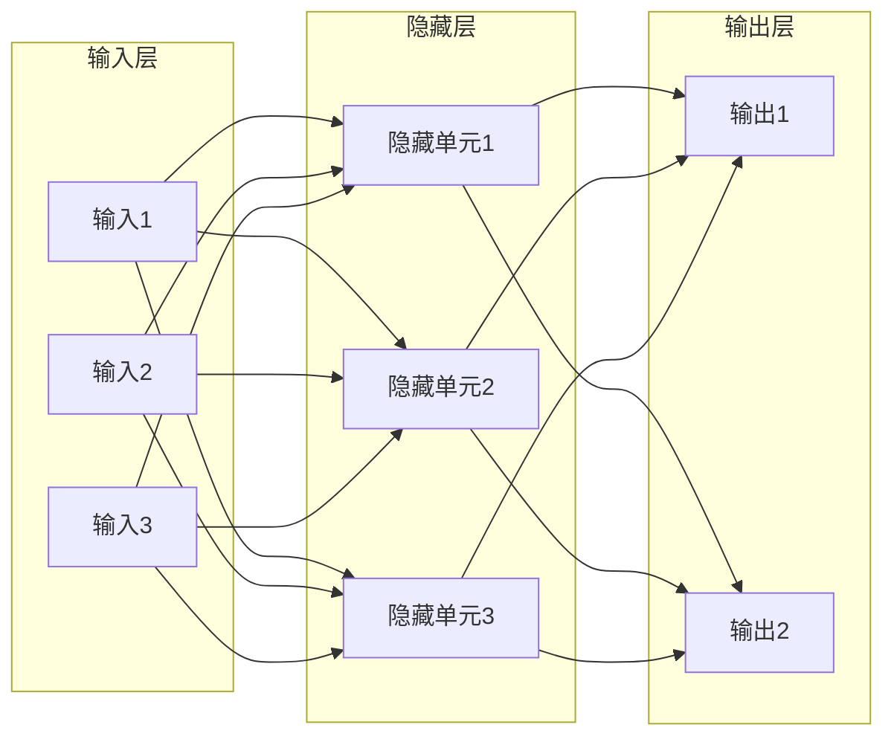
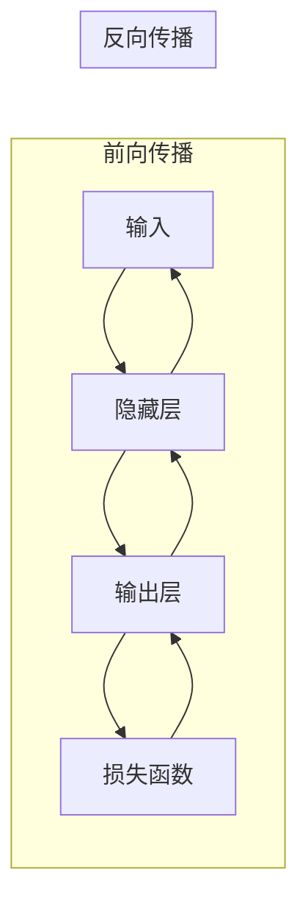
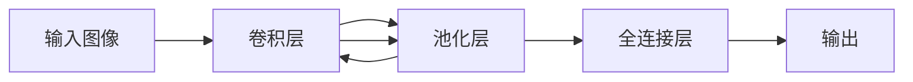
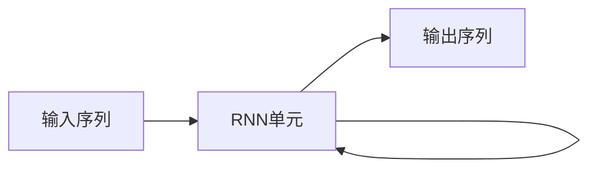
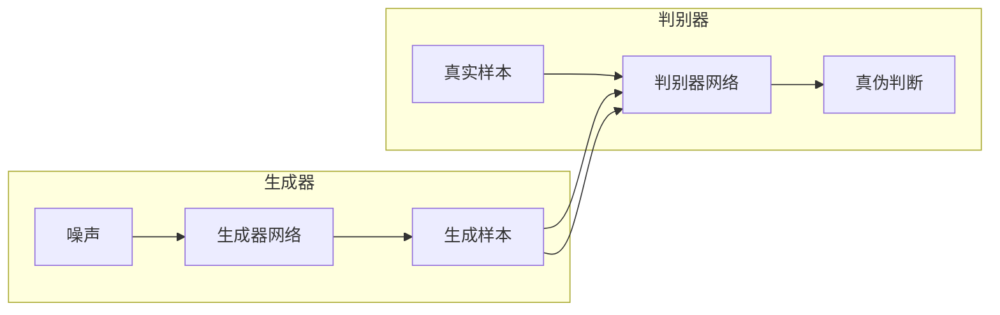
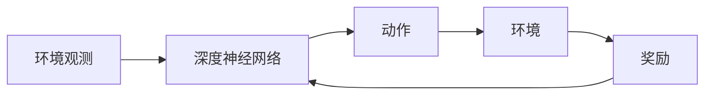

# Deep Learning原理与代码实例讲解

## 1.背景介绍

深度学习(Deep Learning)是机器学习的一个新的领域,其源远流长,可以追溯到20世纪60年代人工神经网络的发展。近年来,由于算力的飞速提升、数据量的爆炸式增长以及一些新的突破性算法的提出,深度学习取得了令人瞩目的成就,在计算机视觉、自然语言处理、语音识别等领域表现出卓越的性能。

深度学习的核心思想是通过构建具有多层非线性变换的神经网络模型,从大量数据中自动学习特征表示,并基于这些特征表示对复杂的样本数据进行预测和决策。与传统的机器学习算法相比,深度学习模型具有自动从数据中学习特征表示的能力,不需要人工设计特征,从而能够更好地解决高维、复杂的问题。

## 2.核心概念与联系

### 2.1 神经网络

神经网络是深度学习的核心模型,它借鉴了生物神经元的工作原理,由大量的人工神经元按层级组织而成。每个神经元接收来自上一层的输入信号,经过加权求和和非线性激活函数的运算,产生输出信号传递给下一层。

### 2.2 前馈神经网络与反向传播算法

前馈神经网络是最基本的神经网络结构,信号只从输入层单向传播到输出层。为了训练这种网络,我们需要使用反向传播算法,通过计算损失函数对网络权重的梯度,并使用优化算法如随机梯度下降来更新权重,从而使网络逐步拟合训练数据。

### 2.3 卷积神经网络

卷积神经网络(CNN)是一种专门用于处理网格结构数据(如图像)的神经网络。它由卷积层、池化层和全连接层组成,能够自动学习数据的空间局部相关特征,在计算机视觉等领域表现出色。

### 2.4 循环神经网络

循环神经网络(RNN)是一种适用于处理序列数据(如文本、语音)的神经网络。它通过引入状态向量来捕获序列之间的依赖关系,并可以处理任意长度的序列输入。长短期记忆网络(LSTM)和门控循环单元(GRU)是RNN的两种常用变体。

### 2.5 生成对抗网络

生成对抗网络(GAN)是一种通过对抗训练的方式学习生成模型的框架。它由生成器网络和判别器网络组成,生成器网络从噪声分布中生成样本,判别器网络判断样本是真实的还是生成的。两个网络相互对抗、不断优化,最终使生成器能够生成高质量的样本。

### 2.6 深度强化学习

深度强化学习是将深度学习应用于强化学习领域,使智能体能够直接从高维环境观测中学习策略,而无需人工设计状态特征。深度Q网络(DQN)、策略梯度等算法是该领域的代表性方法。

## 3.核心算法原理具体操作步骤

### 3.1 前馈神经网络训练

1. **网络初始化**:随机初始化网络的权重和偏置。
2. **前向传播**:对于每个训练样本,计算网络的前向传播过程,得到输出和损失函数值。
3. **反向传播**:使用反向传播算法计算损失函数关于网络权重的梯度。
4. **权重更新**:使用优化算法(如随机梯度下降)根据梯度更新网络权重。
5. **重复训练**:重复步骤2-4,直到网络收敛或达到最大训练轮数。

### 3.2 卷积神经网络训练

1. **网络初始化**:随机初始化卷积层和全连接层的权重和偏置。
2. **前向传播**:对于每个训练样本,计算卷积层的卷积和池化操作,以及全连接层的前向传播,得到输出和损失函数值。
3. **反向传播**:使用反向传播算法计算损失函数关于卷积层和全连接层权重的梯度。
4. **权重更新**:使用优化算法根据梯度更新卷积层和全连接层的权重。
5. **重复训练**:重复步骤2-4,直到网络收敛或达到最大训练轮数。

### 3.3 循环神经网络训练

1. **网络初始化**:随机初始化RNN单元的权重和偏置。
2. **前向传播**:对于每个训练序列,计算RNN单元的前向传播过程,得到输出序列和损失函数值。
3. **反向传播**:使用反向传播算法计算损失函数关于RNN单元权重的梯度。
4. **权重更新**:使用优化算法根据梯度更新RNN单元的权重。
5. **重复训练**:重复步骤2-4,直到网络收敛或达到最大训练轮数。

### 3.4 生成对抗网络训练

1. **网络初始化**:随机初始化生成器网络和判别器网络的权重。
2. **生成器训练**:从噪声分布中采样,通过生成器网络生成样本,将生成样本输入判别器网络,根据判别器的输出计算生成器的损失函数,使用反向传播算法更新生成器网络的权重。
3. **判别器训练**:从真实数据和生成器生成的样本中采样,输入判别器网络,根据判别器的输出计算判别器的损失函数,使用反向传播算法更新判别器网络的权重。
4. **重复训练**:重复步骤2-3,直到生成器和判别器网络达到平衡或达到最大训练轮数。

### 3.5 深度强化学习训练

1. **网络初始化**:随机初始化深度神经网络的权重。
2. **环境交互**:智能体与环境进行交互,从环境观测状态,选择动作,执行动作并获得奖励和新的观测状态。
3. **经验存储**:将(观测状态、动作、奖励、新观测状态)的转换存储到经验回放池中。
4. **网络训练**:从经验回放池中采样批次数据,通过深度神经网络计算动作值或策略,根据目标值(如Q值或优势函数)计算损失函数,使用反向传播算法更新网络权重。
5. **重复训练**:重复步骤2-4,直到智能体达到期望的性能水平。

## 4.数学模型和公式详细讲解举例说明

### 4.1 神经网络模型

神经网络模型可以表示为一个函数 $f(x; \theta)$,其中 $x$ 是输入数据, $\theta$ 是网络的可训练参数(权重和偏置)。对于一个具有 $L$ 层的前馈神经网络,其输出可以表示为:

$$f(x; \theta) = f^{(L)}(f^{(L-1)}(...f^{(2)}(f^{(1)}(x; \theta^{(1)}); \theta^{(2)})...); \theta^{(L)})$$

其中 $f^{(l)}$ 表示第 $l$ 层的变换函数,包括加权求和和非线性激活函数, $\theta^{(l)}$ 表示第 $l$ 层的参数。

在训练过程中,我们需要最小化损失函数 $\mathcal{L}(y, f(x; \theta))$,其中 $y$ 是真实标签。常用的损失函数包括均方误差损失函数和交叉熵损失函数。通过反向传播算法计算损失函数关于参数 $\theta$ 的梯度:

$$\frac{\partial \mathcal{L}}{\partial \theta} = \frac{\partial \mathcal{L}}{\partial f(x; \theta)} \frac{\partial f(x; \theta)}{\partial \theta}$$

然后使用优化算法如随机梯度下降法更新参数:

$$\theta \leftarrow \theta - \eta \frac{\partial \mathcal{L}}{\partial \theta}$$

其中 $\eta$ 是学习率。

### 4.2 卷积神经网络模型

卷积神经网络中的卷积层对输入进行局部特征提取,可以表示为:

$$\text{output}[i, j] = \sum_{m} \sum_{n} \text{input}[i+m, j+n] \cdot \text{kernel}[m, n]$$

其中 $\text{input}$ 是输入特征图, $\text{kernel}$ 是卷积核, $\text{output}$ 是输出特征图。卷积层通过在输入上滑动卷积核,计算局部区域与卷积核的点积,从而提取局部特征。

池化层则用于下采样特征图,常用的池化操作包括最大池化和平均池化:

$$\text{output}[i, j] = \text{pool}(\text{input}[i\cdot s:i\cdot s+k, j\cdot s:j\cdot s+k])$$

其中 $\text{pool}$ 表示池化函数(如取最大值或平均值), $s$ 是池化窗口的步长, $k$ 是池化窗口的大小。

### 4.3 循环神经网络模型

循环神经网络通过引入隐藏状态 $h_t$ 来捕获序列之间的依赖关系。对于一个简单的RNN单元,在时间步 $t$ 的隐藏状态可以表示为:

$$h_t = \tanh(W_{hh}h_{t-1} + W_{xh}x_t + b_h)$$

其中 $x_t$ 是时间步 $t$ 的输入, $W_{hh}$, $W_{xh}$ 和 $b_h$ 分别是隐藏状态到隐藏状态、输入到隐藏状态的权重矩阵和偏置向量。

基于隐藏状态 $h_t$,我们可以计算时间步 $t$ 的输出 $y_t$:

$$y_t = W_{yh}h_t + b_y$$

其中 $W_{yh}$ 和 $b_y$ 分别是隐藏状态到输出的权重矩阵和偏置向量。

在训练过程中,我们需要最小化序列的损失函数 $\mathcal{L}(y, \hat{y})$,其中 $y$ 是真实标签序列, $\hat{y}$ 是网络输出序列。通过反向传播算法计算损失函数关于网络参数的梯度,并使用优化算法更新参数。

### 4.4 生成对抗网络模型

生成对抗网络由生成器网络 $G$ 和判别器网络 $D$ 组成。生成器网络的目标是从噪声分布 $p_z(z)$ 中生成样本 $G(z)$,使其无法被判别器网络区分出来。判别器网络的目标是将真实样本 $x$ 和生成样本 $G(z)$ 正