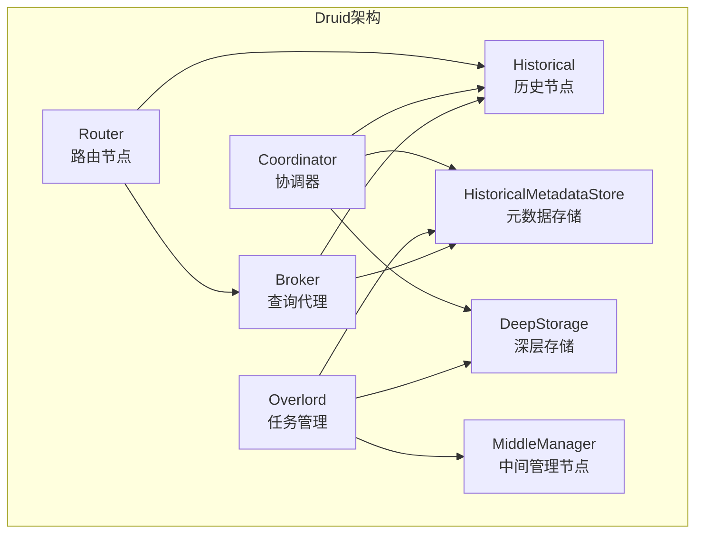

# Druid原理与代码实例讲解

## 1.背景介绍

在当今大数据时代,数据的爆炸式增长对传统数据库系统带来了巨大挑战。为了满足海量数据的实时查询和分析需求,Druid作为一款开源的分布式数据存储系统应运而生。它被广泛应用于网络广告、物联网、运维监控等领域,为企业提供了快速、灵活的数据分析能力。

Druid的核心设计理念是"为分析而生",它将数据存储和查询计算相分离,通过列式存储和数据分区技术实现高效的数据压缩和并行处理。与此同时,Druid还提供了丰富的数据摄取方式、灵活的查询语言以及强大的可视化功能,使其成为大数据分析领域中备受推崇的解决方案。

## 2.核心概念与联系

### 2.1 Druid架构

Druid采用了主从架构设计,主要由以下几个核心组件组成:



1. **HistoricalMetadataStore**:存储集群元数据信息,如数据段的位置、可用节点等。
2. **DeepStorage**:用于存储原始数据和元数据备份,通常使用分布式文件系统如HDFS或对象存储。
3. **Broker**:充当查询入口,将查询路由到相应的Historical节点并合并结果。
4. **Historical**:负责加载和扫描本地数据段,执行查询并返回结果。
5. **Overlord**:管理数据摄取任务的生命周期,包括创建、分发和监控任务。
6. **MiddleManager**:执行数据转换和加载任务,将处理后的数据持久化到DeepStorage。
7. **Coordinator**:负责数据段的管理和分配,确保集群的高可用性。
8. **Router**:可选组件,提供统一的查询入口并对查询进行负载均衡。

### 2.2 数据流程

Druid的数据流程可概括为三个主要阶段:

1. **数据摄取**:通过各种方式(如文件、kafka、hadoop等)将原始数据发送到Druid集群。
2. **数据处理**:MiddleManager节点对接收到的数据进行转换和处理,生成增量数据段。
3. **查询服务**:Historical节点加载数据段,Broker和Router接收查询请求并将其路由到相应的Historical节点执行。

## 3.核心算法原理具体操作步骤

### 3.1 列式存储

Druid采用了列式存储的设计,这使得它在执行聚合查询时具有很高的效率。列式存储的核心思想是将数据按列而非按行进行存储,这样在扫描某些列时就可以跳过其他不需要的列,从而大大减少了I/O开销。

Druid使用了一种称为"Stratified Columnar Storage"的列式存储格式,它将数据分为三个层次:

1. **列块(Column Chunk)**:每个列块存储一个列的数据,并对数据进行了压缩和编码。
2. **数据段(Data Segment)**:由多个列块组成,代表了一个数据分区。
3. **数据源(Data Source)**:由多个数据段组成,代表了一个完整的数据集。

在查询时,Druid只需要扫描所需的列块,从而实现了高效的数据访问。

### 3.2 数据分区

为了提高查询性能,Druid将数据按时间范围进行分区,每个分区对应一个数据段。这种设计使得Druid可以并行扫描多个数据段,从而充分利用集群资源。

数据分区的具体步骤如下:

1. **分区规则**:根据配置的分区规则(如按天或小时分区)对原始数据进行分区。
2. **分区任务**:Overlord将分区任务分发给MiddleManager节点执行。
3. **生成段**:MiddleManager将每个分区的数据转换为一个独立的数据段。
4. **持久化**:生成的数据段被持久化到DeepStorage中。
5. **加载段**:Coordinator将新生成的数据段分配给Historical节点加载。

通过数据分区,Druid可以有效地将查询并行化,从而提高查询性能。

### 3.3 查询处理

Druid提供了一种类SQL的查询语言,支持各种聚合、过滤和排序操作。查询处理的主要步骤如下:

1. **查询路由**:查询首先被发送到Broker或Router节点。
2. **元数据查询**:Broker查询HistoricalMetadataStore以确定哪些Historical节点持有所需的数据段。
3. **分布式查询**:Broker将查询并行发送到相关的Historical节点执行。
4. **结果合并**:Historical节点将查询结果返回给Broker,Broker对结果进行合并。
5. **响应查询**:Broker将最终结果返回给客户端。

Druid的查询引擎采用了向量化执行和代码生成等优化技术,使其能够高效地处理各种复杂查询。

## 4.数学模型和公式详细讲解举例说明

在Druid中,数据压缩和近似查询是两个重要的优化技术,它们都涉及到一些数学模型和公式。

### 4.1 数据压缩

Druid使用多种压缩算法来减小数据的存储空间,其中包括:

1. **LZF**:一种无损压缩算法,适用于压缩字符串和数字数据。
2. **Lempel-Ziv**:另一种无损压缩算法,适用于压缩重复数据。
3. **Delta编码**:一种有损压缩算法,通过存储相邻值之间的差值来压缩数字序列。

Delta编码的压缩比可以用下面的公式表示:

$$
CompressionRatio = \frac{OriginalSize}{CompressedSize + OverheadSize}
$$

其中,OriginalSize是原始数据大小,CompressedSize是压缩后的数据大小,OverheadSize是存储元数据所需的额外空间。

通过合理选择压缩算法和参数,Druid可以在存储空间和查询性能之间达到平衡。

### 4.2 近似查询

对于某些查询,如基数估计、近似TopN等,Druid提供了基于概率数据结构的近似算法,以牺牲少量精度换取更高的查询性能。

1. **HyperLogLog**:用于基数估计,它使用一种称为HyperLogLog的概率数据结构来近似计算基数。HyperLogLog的基本思想是将输入值哈希到一个较小的空间,并根据哈希值的前缀估计基数。其标准误差可以用下面的公式表示:

$$
StandardError = \frac{1.04}{\sqrt{m}}
$$

其中,m是HyperLogLog的精度参数,决定了所使用的内存空间。

2. **QuantilesDigest**:用于近似分位数计算,它使用一种称为QuantilesDigest的数据结构来近似计算分位数。QuantilesDigest将数据划分为多个区间(Bucket),并维护每个区间的计数信息,从而可以高效地计算近似分位数。

通过使用这些近似算法,Druid可以在保持较高查询性能的同时,节省大量内存和CPU资源。

## 5.项目实践:代码实例和详细解释说明

为了更好地理解Druid的原理和使用方法,我们将通过一个实际项目案例来进行详细讲解。在这个案例中,我们将构建一个简单的Druid集群,并加载一些示例数据进行查询分析。

### 5.1 环境准备

首先,我们需要准备以下环境:

- Java 8+
- Docker和Docker Compose
- Druid 24.0.0版本

我们将使用Docker Compose来快速启动一个单机版的Druid集群,包括Coordinator、Overlord、MiddleManager、Historical、Broker和Router等核心组件。

创建一个`docker-compose.yml`文件,内容如下:

```yaml
version: '3.7'
services:

  # Druid节点
  coordinator:
    image: apache/druid:24.0.0
    container_name: coordinator
    ports:
      - "8081:8081"
    volumes:
      - ./druid/conf/coordinator:/opt/conf
    command: coordinator

  broker:
    image: apache/druid:24.0.0
    container_name: broker
    ports:
      - "8082:8082"
    volumes:
      - ./druid/conf/broker:/opt/conf
    command: broker

  historical:
    image: apache/druid:24.0.0
    container_name: historical
    ports:
      - "8083:8083"
    volumes:
      - ./druid/conf/historical:/opt/conf
    command: historical

  router:
    image: apache/druid:24.0.0
    container_name: router
    ports:
      - "8888:8888"
    volumes:
      - ./druid/conf/router:/opt/conf
    command: router

  overlord:
    image: apache/druid:24.0.0
    container_name: overlord
    ports:
      - "8090:8090"
      - "8290:8290"
    volumes:
      - ./druid/conf/overlord:/opt/conf
    command: overlord

  middlemanager:
    image: apache/druid:24.0.0
    container_name: middlemanager
    ports:
      - "8091:8091"
      - "8100-8199:8100-8199"
    volumes:
      - ./druid/conf/middlemanager:/opt/conf
    command: middleManager

  # Zookeeper
  zookeeper:
    image: zookeeper:3.5
    container_name: zookeeper
    ports:
      - "2181:2181"

  # Metadata存储
  metadata:
    image: postgres:12
    container_name: metadata
    ports:
      - "5432:5432"
    environment:
      - POSTGRES_PASSWORD=druid

volumes:
  druid-metadata:
```

在本地创建一个`druid/conf`目录,用于存放各个组件的配置文件。

### 5.2 启动集群

使用以下命令启动Druid集群:

```bash
docker-compose up -d
```

等待所有容器启动完成后,我们可以通过`http://localhost:8888`访问Druid的控制台界面。

### 5.3 数据摄取

接下来,我们将使用一个示例数据集来演示Druid的数据摄取流程。这个数据集包含了一些网站的页面浏览记录,格式如下:

```json
{
  "timestamp": "2018-01-01T01:01:01.000Z",
  "website": "example.com",
  "userid": "user_1",
  "pageid": "homepage"
}
```

我们将使用Kafka作为数据源,首先需要启动一个Kafka容器:

```bash
docker run -d --name=kafka -p 9092:9092 --env ADVERTISED_HOST=localhost --env AUTO_CREATE_TOPICS=true confluentinc/cp-kafka
```

然后,使用一个数据生成器工具向Kafka发送示例数据:

```bash
git clone https://github.com/apache/druid.git
cd druid/integration-tests/docker
./kafka-load-stream.sh http://localhost:8090 quickstart_tutorial kafka localhost:9092 quickstart
```

这个命令会将示例数据持续发送到Kafka的`quickstart`主题。

### 5.4 创建数据摄取任务

接下来,我们需要在Druid中创建一个数据摄取任务,将Kafka中的数据加载到Druid集群。我们将使用Druid的REST API来创建任务。

创建一个`tutorial-kafka-ingestion.json`文件,内容如下:

```json
{
  "type": "kafka",
  "spec": {
    "dataSchema": {
      "dataSource": "quickstart_tutorial",
      "timestampSpec": {
        "column": "timestamp",
        "format": "iso"
      },
      "dimensionsSpec": {
        "dimensions": [
          "website",
          "userid",
          {
            "type": "string",
            "name": "pageid",
            "createBitmapIndex": true
          }
        ]
      },
      "metricsSpec": [],
      "granularitySpec": {
        "type": "uniform",
        "segmentGranularity": "DAY",
        "queryGranularity": "NONE"
      }
    },
    "ioConfig": {
      "topic": "quickstart",
      "consumerProperties": {
        "bootstrap.