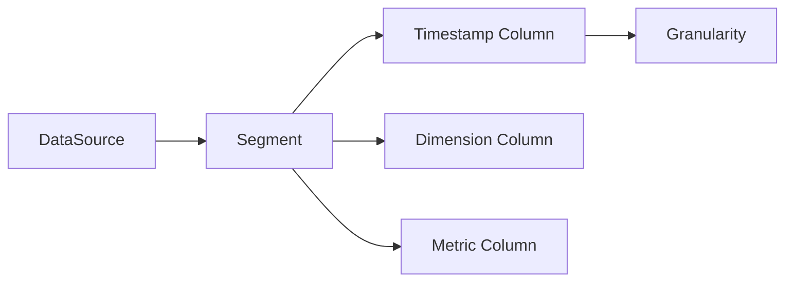

# Druid原理与代码实例讲解

## 1.背景介绍
### 1.1 Druid的诞生背景
随着大数据时代的到来,企业需要处理和分析海量数据的需求日益增长。传统的数据仓库和OLAP系统难以满足实时查询和高并发访问的要求。为了解决这一问题,Druid应运而生。Druid是一个开源的分布式实时OLAP系统,由Metamarkets公司开发,旨在提供亚秒级的实时查询和高吞吐量的数据摄取能力。

### 1.2 Druid的主要特点
- 列式存储:Druid采用列式存储,可以高效地压缩和编码数据,减少I/O开销。
- 分布式架构:Druid基于分布式架构设计,可以横向扩展,支持PB级别的海量数据存储和查询。
- 实时摄取:Druid支持流式和批量两种数据摄取方式,可以实时接收和处理数据。
- 亚秒级查询:Druid通过预聚合、索引、内存缓存等技术,实现了亚秒级的OLAP查询响应。
- 多租户:Druid支持多租户架构,不同的用户可以访问不同的数据源。

### 1.3 Druid的应用场景
Druid广泛应用于需要实时数据分析和高并发查询的场景,如:
- 广告分析平台:实时统计广告的曝光、点击、转化等指标。
- 用户行为分析:实时分析用户的浏览、搜索、购买等行为。
- 运维监控:实时监控系统的各项指标,快速发现和定位问题。
- 物联网:实时处理和分析海量传感器数据。

## 2.核心概念与联系
### 2.1 数据源(DataSource)
数据源是Druid中的顶层概念,代表一个数据集合。一个数据源包含多个Segment。

### 2.2 段(Segment)
段是Druid存储数据的基本单元,每个段对应一个时间范围内的数据。段是不可变的,一旦生成就不能修改。Druid通过不断生成新的段来实现数据的更新。

### 2.3 时间戳列(Timestamp Column)
每个数据源都有一个时间戳列,用于表示数据的时间维度。Druid根据时间戳列对数据进行分段和排序。

### 2.4 维度列(Dimension Column)  
维度列是用于过滤和分组的列,通常是枚举值或离散值。Druid对维度列进行字典编码,提高存储和过滤效率。

### 2.5 指标列(Metric Column)
指标列是用于聚合计算的列,通常是数值型。Druid支持多种聚合函数,如求和、平均值、最大值等。

### 2.6 聚合粒度(Granularity)
聚合粒度指查询结果的时间粒度,如秒、分、时、天等。Druid支持不同的聚合粒度,可以灵活满足不同的分析需求。

下图展示了Druid的核心概念之间的关系:



## 3.核心算法原理具体操作步骤
### 3.1 数据摄取
Druid支持流式和批量两种数据摄取方式。
1. 定义摄取规范:指定数据源、时间戳列、维度列、指标列等信息。
2. 配置Realtime Node或MiddleManager:用于实时摄取或批量摄取。  
3. 启动摄取任务:将数据推送到Druid接入点。
4. Realtime Node或MiddleManager接收数据,根据规范进行解析和转换。
5. 将转换后的数据写入Deep Storage,同时在Metadata Storage记录段元数据。

### 3.2 查询处理
Druid采用Broker+Historical+MiddleManager的架构处理查询。
1. 客户端将SQL或JSON格式的查询请求发送给Broker。
2. Broker对查询进行解析和优化,生成查询执行计划。
3. Broker根据段元数据信息,确定需要查询的Historical Node和MiddleManager。
4. Broker将查询请求分发给选定的Historical Node和MiddleManager。
5. Historical Node和MiddleManager在本地执行查询,返回结果给Broker。
6. Broker汇总所有结果,按照查询要求进行排序、限制、分页等操作。
7. Broker将最终结果返回给客户端。

### 3.3 Segment生命周期管理
Druid通过Coordinator和Historical Node协作管理Segment的生命周期。
1. 数据源的Segment元数据存储在Metadata Storage。
2. Coordinator监听Metadata Storage的变更事件。
3. 当有新的Segment元数据出现时,Coordinator选择一个Historical Node加载该Segment。
4. Coordinator将Segment的加载任务下发给选定的Historical Node。
5. Historical Node从Deep Storage获取Segment数据,加载到内存。
6. Historical Node周期性地将Segment缓存到本地磁盘,加速查询。
7. 当Segment过期或被替换时,Coordinator通知Historical Node卸载Segment。

## 4.数学模型和公式详细讲解举例说明
### 4.1 Druid数据模型
Druid的数据模型可以表示为一个三维的数据立方体(Data Cube)。
- 时间维度:表示数据的时间属性,如时间戳。
- 维度:表示数据的分类属性,如地区、性别等。
- 指标:表示数据的度量值,如销售额、访问量等。

数据立方体可以用以下数学模型表示:

$C = \{T, D, M\}$

其中,$T$表示时间维度,$D$表示维度集合,$M$表示指标集合。

对于给定的时间范围$[t_1, t_2]$,Druid通过以下公式选择相关的段:

$Segments = \{S | S.startTime \leq t_2 \and S.endTime \geq t_1\}$

其中,$S$表示一个段,$S.startTime$和$S.endTime$分别表示段的起始时间和结束时间。

### 4.2 聚合计算
Druid支持多种聚合函数,常用的有:
- 求和:$\sum_{i=1}^{n} x_i$
- 平均值:$\frac{1}{n} \sum_{i=1}^{n} x_i$
- 最大值:$\max_{i=1}^{n} x_i$
- 最小值:$\min_{i=1}^{n} x_i$
- 计数:$\sum_{i=1}^{n} 1$

其中,$x_i$表示第$i$个数据点的值,$n$表示数据点的总数。

例如,计算销售额的总和可以用以下公式表示:

$Sales = \sum_{i=1}^{n} x_i$

其中,$x_i$表示第$i$笔订单的销售额。

### 4.3 近似查询
为了提高查询性能,Druid引入了近似查询(Approximate Query)的概念。近似查询通过数据采样和概率估计,在牺牲一定精度的情况下显著提高查询速度。

常用的近似查询算法有:
- 计数近似:使用HyperLogLog算法估计基数。
- 分位数近似:使用Quantiles算法估计分位数。
- TopN近似:使用近似算法选取前N个值。

以计数近似为例,HyperLogLog算法的误差公式为:

$\epsilon = 1.04/\sqrt{2^b}$

其中,$\epsilon$表示相对误差,$b$表示桶的比特数。

例如,当$b=12$时,相对误差约为2%。Druid默认使用12个比特的HyperLogLog,在大多数场景下可以满足精度要求。

## 5.项目实践：代码实例和详细解释说明
下面通过一个简单的例子演示如何使用Druid进行数据分析。
### 5.1 数据准备
假设我们有一个销售数据集sales.json,包含以下字段:
- timestamp:销售时间戳
- city:销售城市
- category:产品类别
- price:销售金额

示例数据如下:
```json
{"timestamp":"2023-06-01T10:00:00Z","city":"北京","category":"电子产品","price":1000}
{"timestamp":"2023-06-01T11:00:00Z","city":"上海","category":"服装","price":500}
{"timestamp":"2023-06-01T12:00:00Z","city":"北京","category":"电子产品","price":2000}
{"timestamp":"2023-06-02T10:00:00Z","city":"广州","category":"家具","price":800}
{"timestamp":"2023-06-02T11:00:00Z","city":"深圳","category":"服装","price":600}
```

### 5.2 数据摄取
首先,我们需要将数据摄取到Druid中。定义如下的摄取规范spec.json:
```json
{
  "type": "index",
  "spec": {
    "dataSchema": {
      "dataSource": "sales",
      "timestampSpec": {
        "column": "timestamp",
        "format": "iso"
      },
      "dimensionsSpec": {
        "dimensions": [
          "city",
          "category"
        ]
      },
      "metricsSpec": [
        {
          "type": "doubleSum",
          "name": "price",
          "fieldName": "price"
        }
      ],
      "granularitySpec": {
        "type": "uniform",
        "segmentGranularity": "day",
        "queryGranularity": "none",
        "intervals": ["2023-06-01/2023-06-03"]
      }
    },
    "ioConfig": {
      "type": "index",
      "firehose": {
        "type": "local",
        "baseDir": "/path/to/data",
        "filter": "sales.json"
      }
    },
    "tuningConfig": {
      "type": "index"
    }
  }
}
```

然后使用以下命令启动摄取任务:
```bash
curl -X 'POST' -H 'Content-Type:application/json' -d @spec.json http://localhost:8081/druid/indexer/v1/task
```

### 5.3 数据查询
摄取完成后,我们可以使用Druid SQL或原生查询语言进行数据分析。

例如,按照城市维度统计销售总额:
```sql
SELECT city, SUM(price) AS total_price 
FROM sales
GROUP BY city
```

返回结果:
```json
[
  {
    "city": "北京",
    "total_price": 3000
  },
  {
    "city": "上海", 
    "total_price": 500
  },
  {
    "city": "广州",
    "total_price": 800  
  },
  {
    "city": "深圳",
    "total_price": 600
  }
]
```

再例如,按照产品类别统计每天的销售总额:
```sql
SELECT 
  TIME_FLOOR(__time, 'P1D') AS day,
  category,
  SUM(price) AS total_price
FROM sales  
GROUP BY 1, 2
```

返回结果:
```json
[
  {
    "day": "2023-06-01T00:00:00.000Z",
    "category": "电子产品",
    "total_price": 3000
  },
  {
    "day": "2023-06-01T00:00:00.000Z",
    "category": "服装",
    "total_price": 500
  },
  {
    "day": "2023-06-02T00:00:00.000Z", 
    "category": "家具",
    "total_price": 800
  },
  {
    "day": "2023-06-02T00:00:00.000Z",
    "category": "服装",
    "total_price": 600
  }
]
```

通过以上简单的示例,我们可以看到Druid强大的数据分析能力。Druid提供了灵活的多维分析、实时聚合等功能,可以满足各种复杂的数据分析场景。

## 6.实际应用场景
Druid在实际生产环境中有广泛的应用,下面列举几个典型的应用场景。

### 6.1 广告分析平台
在广告分析平台中,Druid可以用于实时统计各种广告指标,如曝光数、点击数、点击率、转化数等。通过Druid,广告主可以实时了解广告投放效果,及时优化广告策略。

### 6.2 电商用户行为分析
在电商领域,Druid可以用于实时分析用户行为数据,如浏览、搜索、下单、支付等。通过对用户行为数据的多维分析,电商平台可以洞察用户偏好,优化推荐策略,提升转化率和销售额。

### 6.3 物联网设备监控
在物联网场景下,Druid可以用于实时处理和分析海量传感器数据。通过Druid,可以实时监控设备的运行状态,及时发现异常情况,预测设备故障,优化