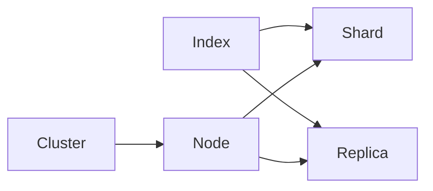

# ElasticSearch原理与代码实例讲解

## 1. 背景介绍
### 1.1 搜索引擎的发展历程
#### 1.1.1 早期的文件检索系统
#### 1.1.2 基于关键词的搜索引擎 
#### 1.1.3 全文搜索引擎的崛起
### 1.2 ElasticSearch的诞生
#### 1.2.1 Lucene搜索库的局限性
#### 1.2.2 基于Lucene的ElasticSearch
#### 1.2.3 ElasticSearch的快速发展
### 1.3 ElasticSearch的应用现状
#### 1.3.1 企业级搜索引擎
#### 1.3.2 日志分析平台
#### 1.3.3 实时数据分析

## 2. 核心概念与联系
### 2.1 Node与Cluster
#### 2.1.1 Node的概念
#### 2.1.2 Cluster的概念
#### 2.1.3 Node与Cluster的关系
### 2.2 Index、Type与Document
#### 2.2.1 Index的概念
#### 2.2.2 Type的概念
#### 2.2.3 Document的概念
#### 2.2.4 三者之间的关系
### 2.3 Shard与Replica
#### 2.3.1 Shard的概念与作用
#### 2.3.2 Replica的概念与作用
#### 2.3.3 Shard与Replica的关系



## 3. 核心算法原理具体操作步骤
### 3.1 倒排索引
#### 3.1.1 倒排索引的基本概念
#### 3.1.2 倒排索引的构建过程
#### 3.1.3 倒排索引的优缺点
### 3.2 相关度算分
#### 3.2.1 TF-IDF算法
#### 3.2.2 BM25算法
#### 3.2.3 实际应用中的优化策略
### 3.3 查询过程
#### 3.3.1 查询语句的解析
#### 3.3.2 查询语句的执行
#### 3.3.3 相关度算分与排序

## 4. 数学模型和公式详细讲解举例说明
### 4.1 布尔模型
#### 4.1.1 布尔模型的基本概念
#### 4.1.2 布尔模型的数学表示
#### 4.1.3 布尔模型的优缺点
### 4.2 向量空间模型
#### 4.2.1 向量空间模型的基本概念
#### 4.2.2 向量空间模型的数学表示
$$ sim(d_j,q) = \frac{\sum_{i=1}^N w_{i,j} \cdot w_{i,q}}{\sqrt{\sum_{i=1}^N w_{i,j}^2} \cdot \sqrt{\sum_{i=1}^N w_{i,q}^2}} $$
#### 4.2.3 向量空间模型的优缺点
### 4.3 概率模型
#### 4.3.1 概率模型的基本概念
#### 4.3.2 概率模型的数学表示
$$ P(R|d_j,q) = \frac{P(d_j,q|R) \cdot P(R)}{P(d_j,q)} $$
#### 4.3.3 概率模型的优缺点

## 5. 项目实践：代码实例和详细解释说明
### 5.1 环境准备
#### 5.1.1 ElasticSearch安装与配置
#### 5.1.2 Java客户端安装与配置
#### 5.1.3 可视化工具介绍
### 5.2 索引的创建与管理
#### 5.2.1 创建索引的代码实例
```java
CreateIndexRequest request = new CreateIndexRequest("my-index");
CreateIndexResponse response = client.indices().create(request, RequestOptions.DEFAULT);
```
#### 5.2.2 删除索引的代码实例
```java
DeleteIndexRequest request = new DeleteIndexRequest("my-index");
AcknowledgedResponse response = client.indices().delete(request, RequestOptions.DEFAULT);
```
#### 5.2.3 索引设置的代码实例
### 5.3 文档的增删改查
#### 5.3.1 新增文档的代码实例
```java
IndexRequest request = new IndexRequest("my-index");
request.id("1");
request.source("field1", "value1", "field2", "value2");
IndexResponse response = client.index(request, RequestOptions.DEFAULT);
```
#### 5.3.2 删除文档的代码实例
```java
DeleteRequest request = new DeleteRequest("my-index", "1");
DeleteResponse response = client.delete(request, RequestOptions.DEFAULT);
```
#### 5.3.3 更新文档的代码实例
```java
UpdateRequest request = new UpdateRequest("my-index", "1");
request.doc("field1", "new-value1");
UpdateResponse response = client.update(request, RequestOptions.DEFAULT);
```
#### 5.3.4 查询文档的代码实例
```java
GetRequest request = new GetRequest("my-index", "1");
GetResponse response = client.get(request, RequestOptions.DEFAULT);
```
### 5.4 复杂查询的实现
#### 5.4.1 全文搜索的代码实例
```java
SearchRequest request = new SearchRequest("my-index");
SearchSourceBuilder sourceBuilder = new SearchSourceBuilder();
sourceBuilder.query(QueryBuilders.matchQuery("field1", "search-term"));
request.source(sourceBuilder);
SearchResponse response = client.search(request, RequestOptions.DEFAULT);
```
#### 5.4.2 聚合分析的代码实例
```java
SearchRequest request = new SearchRequest("my-index");
SearchSourceBuilder sourceBuilder = new SearchSourceBuilder();
TermsAggregationBuilder aggregation = AggregationBuilders.terms("by-field1").field("field1.keyword");
sourceBuilder.aggregation(aggregation);
request.source(sourceBuilder);
SearchResponse response = client.search(request, RequestOptions.DEFAULT);
```
#### 5.4.3 地理位置搜索的代码实例
```java
SearchRequest request = new SearchRequest("my-index");
SearchSourceBuilder sourceBuilder = new SearchSourceBuilder();
GeoDistanceQueryBuilder query = QueryBuilders.geoDistanceQuery("location")
        .point(40.7128, -74.0060)
        .distance(100, DistanceUnit.KILOMETERS);
sourceBuilder.query(query);
request.source(sourceBuilder);
SearchResponse response = client.search(request, RequestOptions.DEFAULT);
```

## 6. 实际应用场景
### 6.1 电商搜索引擎
#### 6.1.1 商品信息的索引与检索
#### 6.1.2 用户行为数据的分析
#### 6.1.3 个性化推荐系统
### 6.2 日志分析平台
#### 6.2.1 日志数据的收集与存储
#### 6.2.2 日志数据的实时分析
#### 6.2.3 异常行为的检测与告警
### 6.3 金融风控系统
#### 6.3.1 用户信用评估
#### 6.3.2 实时反欺诈
#### 6.3.3 舆情监测与分析

## 7. 工具和资源推荐
### 7.1 官方文档与社区
#### 7.1.1 ElasticSearch官方文档
#### 7.1.2 ElasticSearch官方论坛
#### 7.1.3 ElasticSearch中文社区
### 7.2 可视化工具
#### 7.2.1 Kibana
#### 7.2.2 Grafana
#### 7.2.3 ElasticHD
### 7.3 周边生态系统
#### 7.3.1 Logstash
#### 7.3.2 Beats
#### 7.3.3 X-Pack

## 8. 总结：未来发展趋势与挑战
### 8.1 ElasticSearch的发展趋势
#### 8.1.1 云原生与容器化部署
#### 8.1.2 机器学习的深度融合
#### 8.1.3 实时数据处理能力的增强
### 8.2 ElasticSearch面临的挑战
#### 8.2.1 数据规模的持续增长
#### 8.2.2 数据安全与隐私保护
#### 8.2.3 性能优化与成本控制
### 8.3 ElasticSearch的未来展望
#### 8.3.1 全面拥抱云计算与人工智能
#### 8.3.2 成为数据分析与洞察的核心平台
#### 8.3.3 助力企业数字化转型

## 9. 附录：常见问题与解答
### 9.1 ElasticSearch与关系型数据库的区别？
### 9.2 ElasticSearch的分布式架构是如何实现的？
### 9.3 ElasticSearch的数据可靠性如何保证？
### 9.4 如何优化ElasticSearch的查询性能？
### 9.5 ElasticSearch适合哪些应用场景？

作者：禅与计算机程序设计艺术 / Zen and the Art of Computer Programming