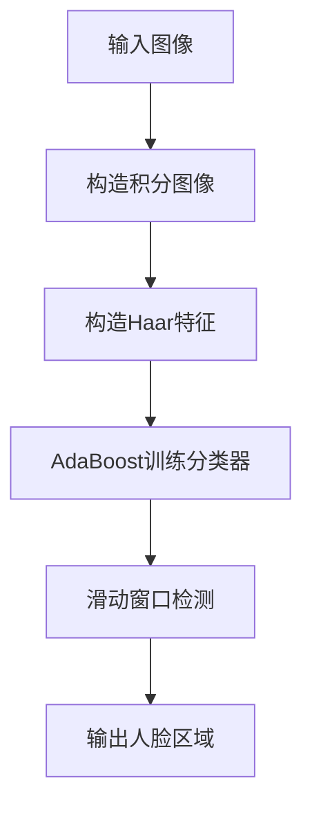
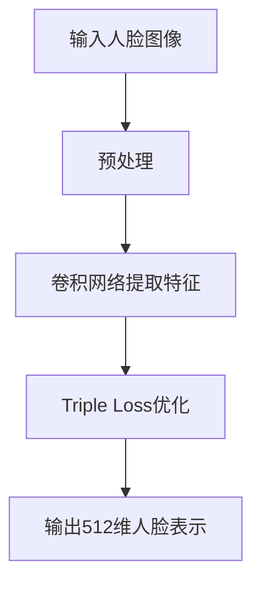
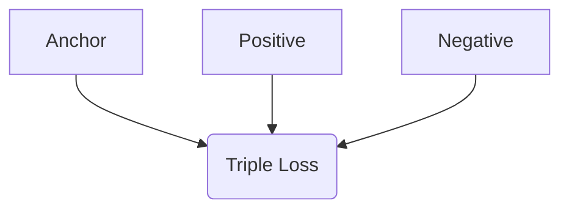

# Face Recognition原理与代码实例讲解

## 1.背景介绍

人脸识别技术是一种基于计算机视觉和模式识别技术的生物识别技术,它可以自动检测、跟踪、识别和验证人脸图像或视频中的人物身份。随着人工智能和深度学习算法的快速发展,人脸识别技术已经广泛应用于安全监控、刷脸支付、人员通行管理、社交媒体标记等多个领域。

人脸识别系统通常由以下几个关键模块组成:

- 人脸检测(Face Detection): 从图像或视频流中定位并提取人脸区域
- 人脸表示(Face Representation): 将检测到的人脸编码为易于比较和匹配的特征向量
- 人脸匹配(Face Matching): 将提取的人脸特征与数据库中已知身份的人脸特征进行比对,输出最相似的匹配结果

## 2.核心概念与联系

### 2.1 人脸检测

人脸检测是人脸识别的第一步,目标是从给定的图像或视频流中定位并提取人脸区域。常用的人脸检测算法包括:

1. **Viola-Jones算法**: 基于Haar特征和AdaBoost分类器,具有较高的检测精度和速度。
2. **HOG(Histogram of Oriented Gradients)**: 基于图像梯度方向直方图特征和SVM分类器。
3. **CNN(卷积神经网络)**: 基于深度学习的端到端人脸检测模型,如MTCNN、FaceBoxes等。

### 2.2 人脸表示

人脸表示的目标是将检测到的人脸编码为易于比较和匹配的特征向量。常用的人脸表示方法包括:

1. **基于手工特征**: 如LBP(局部二值模式)、Gabor等传统特征。
2. **基于深度学习**: 利用CNN等深度神经网络自动学习人脸特征,如FaceNet、VGGFace等。

### 2.3 人脸匹配

人脸匹配的目标是将提取的人脸特征与数据库中已知身份的人脸特征进行比对,输出最相似的匹配结果。常用的人脸匹配算法包括:

1. **基于距离度量**: 如欧氏距离、余弦相似度等,计算待识别人脸特征与数据库中人脸特征的距离或相似度。
2. **基于分类器**: 如SVM、神经网络等,将人脸匹配问题转化为分类问题。

## 3.核心算法原理具体操作步骤 

### 3.1 人脸检测算法原理

以Viola-Jones人脸检测算法为例,其核心思想是通过机器学习方法训练出一个强分类器,用于快速检测图像窗口中是否存在人脸。算法主要包括以下几个步骤:

1. **构造积分图像**: 为了加快计算Haar特征,先构造出积分图像(Integral Image),使得每个像素点的值等于其左上角矩形区域内所有像素值之和。
2. **构造Haar特征**: 设计出一系列简单的矩形Haar特征,用于编码人脸的典型模式。
3. **训练分类器**: 使用AdaBoost算法从大量的Haar特征中选择出一些"关键特征",并训练出一个强分类器。
4. **滑动窗口检测**: 在图像上使用不同尺度的滑动窗口,对每个窗口提取Haar特征,输入强分类器判断是否为人脸。



### 3.2 人脸表示算法原理

以FaceNet为例,它是一种基于深度卷积神经网络的人脸表示学习方法,能够将人脸图像映射到高维欧氏空间中的紧凑的欧几里得球体,使得同一个人的人脸映射点彼此靠近,不同人的人脸映射点彼此远离。算法主要包括以下几个步骤:

1. **数据预处理**: 对人脸图像进行对齐、裁剪和归一化等预处理。
2. **卷积网络提取特征**: 使用深度卷积神经网络(如Inception-ResNet)对预处理后的人脸图像提取高层次特征。
3. **Triple Loss优化**: 使用Triple Loss损失函数,最小化同一个人的人脸embedding之间的距离,最大化不同人的人脸embedding之间的距离。
4. **人脸表示输出**: 网络最终输出512维的人脸embedding向量,作为人脸的紧凑表示。



### 3.3 人脸匹配算法原理

人脸匹配的目标是计算待识别人脸的表示向量与数据库中已知人脸的表示向量之间的相似度,找到最相似的匹配结果。常用的相似度度量包括:

1. **欧氏距离**: 计算两个向量之间的欧氏距离,距离越小表示越相似。
2. **余弦相似度**: 计算两个向量的夹角余弦值,余弦值越大表示越相似。

假设待识别人脸的表示向量为$\vec{x}$,数据库中第$i$个人脸的表示向量为$\vec{y_i}$,则欧氏距离和余弦相似度分别计算如下:

$$
d(\vec{x}, \vec{y_i}) = \sqrt{\sum_{j=1}^{n}(x_j - y_{ij})^2}
$$

$$
\text{cos}(\vec{x}, \vec{y_i}) = \frac{\vec{x} \cdot \vec{y_i}}{||\vec{x}|| \cdot ||\vec{y_i}||} = \frac{\sum_{j=1}^{n}x_j y_{ij}}{\sqrt{\sum_{j=1}^{n}x_j^2} \sqrt{\sum_{j=1}^{n}y_{ij}^2}}
$$

通常会设置一个阈值,如果待识别人脸与数据库中某个人脸的相似度高于阈值,则认为是同一个人,否则为陌生人。

## 4.数学模型和公式详细讲解举例说明

### 4.1 Triple Loss

Triple Loss是FaceNet算法中用于优化人脸表示的核心损失函数,其目标是最小化同一个人的人脸embedding之间的距离,最大化不同人的人脸embedding之间的距离。具体来说,给定一个三元组$(x_a, x_p, x_n)$,其中$x_a$为anchor样本,$x_p$为正样本(与anchor同一个人),$x_n$为负样本(与anchor不同人),则Triple Loss定义为:

$$
L = \sum_{i=1}^{N} \Big[ \big\| f(x_a^{(i)}) - f(x_p^{(i)}) \big\|_2^2 - \big\| f(x_a^{(i)}) - f(x_n^{(i)}) \big\|_2^2 + \alpha \Big]_+
$$

其中$f(x)$表示网络对输入$x$的embedding输出,即人脸表示向量;$\alpha$是一个超参数,控制正负样本embedding之间的最小距离边界;$[\cdot]_+$表示取正值部分,即$\max(0, \cdot)$。

Triple Loss的目标是使得同一个人的正样本embedding距离最小,不同人的负样本embedding距离最大,并且两者之间保持至少$\alpha$的边界。以下是一个Triple Loss的示意图:



在实际训练中,通常会对每个anchor样本构造多个正负样本对,并对所有的三元组求和计算总的Triple Loss,然后使用梯度下降等优化算法最小化该损失函数。

### 4.2 FaceNet Embedding

FaceNet将人脸表示学习问题建模为一个数据嵌入(data embedding)任务,目标是将人脸图像映射到一个高维的欧几里得空间中,使得同一个人的人脸映射点彼此靠近,不同人的人脸映射点彼此远离。具体来说,给定一个人脸图像$x$,FaceNet将其映射到一个$d$维的欧几里得空间中的一个点$f(x) \in \mathbb{R}^d$,这个$d$维向量就是人脸的embedding表示。

在FaceNet论文中,作者使用了一个深度卷积神经网络(Inception-ResNet)作为embedding函数$f$,输入是经过预处理的人脸图像,输出是512维的人脸embedding向量。网络使用Triple Loss进行训练,目标是最小化同一个人的人脸embedding之间的距离,最大化不同人的人脸embedding之间的距离。

训练好的FaceNet模型可以将任意一张人脸图像映射到512维的embedding空间中,这个embedding向量就是该人脸的紧凑表示。在人脸识别和验证任务中,只需要计算待识别人脸的embedding向量与数据库中已知人脸的embedding向量之间的距离或相似度,就可以判断是否为同一个人。

FaceNet embedding的一个优点是,即使是在不同的照片拍摄条件(如光照、角度等)下,同一个人的embedding向量也会比较接近,这使得FaceNet具有很好的泛化能力。

## 5.项目实践:代码实例和详细解释说明

以下是一个使用Python和深度学习框架PyTorch实现的人脸识别项目示例,包括人脸检测、人脸表示提取和人脸匹配等核心模块。

### 5.1 环境配置

```python
import cv2
import numpy as np
import torch
from torchvision import transforms
from facenet_pytorch import MTCNN, InceptionResnetV1
```

- `cv2`: OpenCV计算机视觉库,用于图像/视频IO和基本图像处理
- `numpy`: Python科学计算库,用于数值计算
- `torch`: PyTorch深度学习框架
- `torchvision`: PyTorch计算机视觉工具库
- `facenet_pytorch`: 基于PyTorch实现的FaceNet模型

### 5.2 人脸检测

```python
# 初始化MTCNN人脸检测器
mtcnn = MTCNN(keep_all=True)

# 读取图像并检测人脸
img = cv2.imread("test.jpg")
boxes, probs = mtcnn.detect(img)

# 可视化检测结果
draw = img.copy()
for box, prob in zip(boxes, probs):
    x1, y1, x2, y2 = [int(v) for v in box]
    cv2.rectangle(draw, (x1, y1), (x2, y2), (0, 0, 255), 2)
    
cv2.imshow("Face Detection", draw)
cv2.waitKey(0)
```

上述代码使用MTCNN (Multi-task Cascaded Convolutional Networks)算法进行人脸检测。MTCNN是一种基于深度卷积神经网络的联级人脸检测框架,能够实现高精度、多尺度和实时的人脸检测。

代码首先初始化MTCNN检测器,然后读取测试图像并调用`detect`方法检测人脸。`detect`方法返回一个包含人脸边界框坐标和置信度分数的列表。最后,代码在原始图像上绘制检测到的人脸边界框,并显示可视化结果。

### 5.3 人脸表示提取

```python
# 初始化FaceNet模型
resnet = InceptionResnetV1(pretrained='vggface2').eval()

# 图像预处理
transform = transforms.Compose([
    transforms.ToPILImage(),
    transforms.Resize((160, 160)),
    transforms.ToTensor(),
    transforms.Normalize(mean=[0.5, 0.5, 0.5], std=[0.5, 0.5, 0.5])
])

# 提取人脸表示
embeddings = []
for box in boxes:
    x1, y1, x2, y2 = [int(v) for v in box]
    face = img[y1:y2, x1:x2]
    face = transform(face)
    face = face.unsqueeze(0)
    emb = resnet(face).detach().numpy()
    embeddings.append(emb)
```

上述代码使用预训练的FaceNet模型(InceptionResnetV1)提取人脸图像的embedding表示。

首先,初始化FaceNet模型并设置为评估模式。然后定义一个图像预处理变换,包括转换为PIL图像、调整大小、转换为张量和归一化等步骤。

接下来,对于