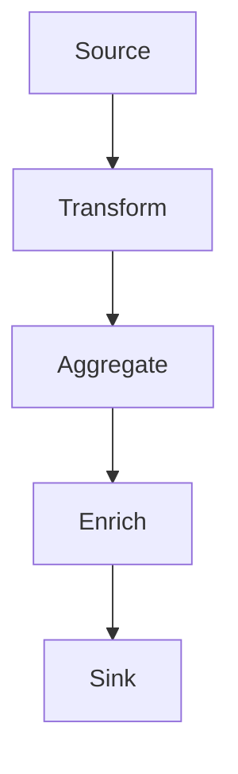

# FlinkTableAPI&SQL案例分析：实时安全监控系统

## 1.背景介绍

随着网络攻击日益增多和复杂化,实时安全监控系统变得越来越重要。传统的安全监控系统通常是基于批处理模式,无法满足实时性的要求。而实时流数据处理技术的兴起,为构建实时安全监控系统提供了可能。Apache Flink是一个开源的分布式流处理框架,支持高吞吐量和低延迟的数据处理。Flink提供了丰富的API,包括DataStream和Table/SQL API,使得编写流处理应用程序变得更加简单。本文将重点介绍如何利用Flink的Table API和SQL来构建一个实时安全监控系统。

## 2.核心概念与联系

实时安全监控系统的核心概念包括:

### 2.1 数据源

安全监控系统需要从各种数据源获取数据,如网络流量数据、系统日志、威胁情报等。这些数据源通常是无界的流数据。

### 2.2 数据处理

对获取的数据进行实时处理和分析,包括数据清洗、特征提取、模式匹配、异常检测等。

### 2.3 检测规则

基于已知的攻击模式、异常行为等定义检测规则,用于识别潜在的安全威胁。

### 2.4 告警与响应

当检测到安全事件时,需要及时发出告警并采取相应的响应措施,如阻断恶意流量、隔离受感染主机等。

Flink Table API和SQL可以帮助我们更好地处理这些核心概念:

- 利用Flink的连ectors从各种数据源获取数据
- 使用Table API和SQL进行数据转换、聚合、关联和模式匹配等处理
- 将检测规则转化为SQL查询,方便维护和管理
- 通过SQL查询的结果触发下游告警和响应操作

## 3.核心算法原理具体操作步骤 

实时安全监控系统的核心算法包括数据处理、模式匹配和异常检测等。下面将介绍这些算法的原理和在Flink Table API&SQL中的具体实现步骤。

### 3.1 数据处理



1. **Source**: 从数据源获取数据,可以使用Flink的连接器,如Kafka连接器、文件连接器等。

```sql
CREATE TABLE source_table (
    ...
) WITH (
    'connector' = 'kafka',
    ...
);
```

2. **Transform**: 对原始数据进行转换,如投影、过滤、计算新字段等。

```sql
SELECT 
    field1, 
    field2,
    CONCAT(field3, field4) AS new_field
FROM source_table;
```

3. **Aggregate**: 对数据进行聚合,如统计计数、求和等。

```sql
SELECT 
    field1,
    COUNT(*) AS cnt 
FROM source_table
GROUP BY field1;
```

4. **Enrich**: 使用外部数据源丰富数据,如关联维表数据。

```sql
SELECT
    t1.field1,
    t1.field2,
    t2.dimension1,
    t2.dimension2
FROM source_table t1
JOIN dim_table t2 ON t1.key = t2.key;
```

5. **Sink**: 将处理后的结果输出到下游系统,如Kafka主题、文件等。

```sql
CREATE TABLE sink_table (
    ...
) WITH (
    'connector' = 'kafka',
    ...
);

INSERT INTO sink_table
SELECT 
    field1,
    field2,
    ...
FROM processed_table;
```

### 3.2 模式匹配

模式匹配是一种常用的检测技术,通过匹配特定的事件序列来识别安全威胁。Flink提供了强大的模式匹配功能,可以在Table API和SQL中使用。

```sql
SELECT 
    user, 
    sequence 
FROM (
  SELECT 
    user, 
    attempt, 
    row_number() over (PARTITION BY user ORDER BY event_time) as row_num
  FROM login_attempts
)
MATCH_RECOGNIZE (
  PARTITION BY user
  ORDER BY row_num
  MEASURES
    MATCH_SEQUENCE(attempt) AS sequence
  ONE ROW PER MATCH
  AFTER MATCH SKIP TO NEXT ROW
  PATTERN (attempt+ attempt+)
  DEFINE
    attempt AS attempt = 'FAILED'
)
ORDER BY sequence DESC;
```

上面的查询用于检测连续两次以上的登录失败事件。首先为每个用户的登录尝试事件添加一个行号,然后使用`MATCH_RECOGNIZE`子句进行模式匹配。`PATTERN`子句定义了要匹配的模式,这里是两个或更多的`FAILED`事件。`MEASURES`子句指定了要输出的内容,这里是用户和匹配到的事件序列。

### 3.3 异常检测

异常检测是另一种常用的安全监控技术,通过检测数据中的异常值来发现潜在的威胁。Flink提供了多种异常检测算法,如基于统计的异常检测、基于距离的异常检测等。

```sql
SELECT
    user,
    lon,
    lat,
    score
FROM (
  SELECT
    user,
    lon,
    lat,
    SQRT(POW(lon - lon_median, 2) + POW(lat - lat_median, 2)) AS distance
  FROM (
    SELECT
      user,
      lon,
      lat,
      median(lon) OVER (PARTITION BY user) AS lon_median,
      median(lat) OVER (PARTITION BY user) AS lat_median
    FROM locations
  )
)
JOIN (
  SELECT
    user,
    percentile(distance, 0.99) OVER (PARTITION BY user) AS threshold
  FROM (
    SELECT
      user,
      SQRT(POW(lon - lon_median, 2) + POW(lat - lat_median, 2)) AS distance
    FROM (
      SELECT
        user,
        lon,
        lat,
        median(lon) OVER (PARTITION BY user) AS lon_median,
        median(lat) OVER (PARTITION BY user) AS lat_median
      FROM locations
    )
  )
)
USING (user)
WHERE distance > threshold;
```

上面的查询用于检测异常的地理位置事件。首先计算每个用户的经纬度中位数,然后计算每个事件与中位数的距离。接着计算每个用户距离的99百分位数作为阈值。最后输出距离大于阈值的事件,即异常事件。

这只是一个基本的异常检测示例,实际应用中可以使用更复杂的算法,如基于机器学习的异常检测模型。Flink提供了Python API,可以方便地集成Python生态系统中的机器学习库。

## 4.数学模型和公式详细讲解举例说明

在实时安全监控系统中,常常需要使用一些数学模型和公式进行数据分析和异常检测。下面将介绍一些常用的模型和公式。

### 4.1 统计模型

统计模型通常用于描述数据的分布特征,并基于这些特征进行异常检测。常用的统计量包括均值、中位数、标准差、分位数等。

**均值和标准差**

均值 $\mu$ 和标准差 $\sigma$ 可以用于检测偏离正常范围的异常值。

$$\mu = \frac{1}{n}\sum_{i=1}^n x_i$$

$$\sigma = \sqrt{\frac{1}{n}\sum_{i=1}^n (x_i - \mu)^2}$$

如果一个值 $x$ 与均值的差值超过了 $k\sigma$ (通常取 $k=3$),则可以认为是异常值。

**中位数和分位数**

中位数和分位数对于分布不对称的数据更加稳健。

$$
\begin{cases}
median = 
\begin{cases}
x_{(n+1)/2}, & \text{if n is odd}\\
\frac{1}{2}(x_{n/2} + x_{n/2+1}), & \text{if n is even}
\end{cases}
\end{cases}
$$

$p$ 分位数 $Q_p$ 是使得至少有 $p\%$ 的数据小于或等于 $Q_p$ 的值。常用的分位数包括 $Q_{0.25}$ (下四分位数)、$Q_{0.75}$ (上四分位数)等。分位数可用于检测离群值。

### 4.2 距离模型

距离模型通过计算数据点之间的距离,用于发现异常的孤立点或小簇。常用的距离度量包括欧几里得距离、曼哈顿距离等。

**欧几里得距离**

欧几里得距离是两个点在欧几里得空间中的直线距离。对于 $n$ 维空间中的两个点 $\vec{x} = (x_1, x_2, \dots, x_n)$ 和 $\vec{y} = (y_1, y_2, \dots, y_n)$,它们的欧几里得距离为:

$$d(\vec{x}, \vec{y}) = \sqrt{\sum_{i=1}^n (x_i - y_i)^2}$$

**曼哈顿距离**

曼哈顿距离是两个点在每个维度上差值的绝对值之和。对于 $n$ 维空间中的两个点 $\vec{x}$ 和 $\vec{y}$,它们的曼哈顿距离为:

$$d(\vec{x}, \vec{y}) = \sum_{i=1}^n |x_i - y_i|$$

距离模型常用于基于密度和基于聚类的异常检测算法中。

### 4.3 相似度模型

相似度模型用于度量两个对象之间的相似程度,常用于检测异常模式。常用的相似度度量包括jaccard相似度、cosine相似度等。

**Jaccard相似度**

Jaccard相似度用于计算两个集合的相似度,定义为两个集合的交集大小除以两个集合的并集大小。对于两个集合 $A$ 和 $B$,它们的Jaccard相似度为:

$$J(A, B) = \frac{|A \cap B|}{|A \cup B|}$$

**Cosine相似度**

Cosine相似度常用于计算两个向量之间的相似度,定义为两个向量的点积除以它们的范数乘积。对于两个向量 $\vec{a}$ 和 $\vec{b}$,它们的Cosine相似度为:

$$\text{cosine}(\vec{a}, \vec{b}) = \frac{\vec{a} \cdot \vec{b}}{||\vec{a}|| \cdot ||\vec{b}||} = \frac{\sum_{i=1}^n a_i b_i}{\sqrt{\sum_{i=1}^n a_i^2} \sqrt{\sum_{i=1}^n b_i^2}}$$

相似度模型常用于基于模式的异常检测算法中,通过计算新模式与已知正常模式的相似度,判断是否为异常模式。

## 5.项目实践：代码实例和详细解释说明

为了更好地理解如何使用Flink Table API和SQL构建实时安全监控系统,下面将给出一个完整的项目实践示例。该示例基于一个网络入侵检测场景,通过分析网络流量数据实时检测潜在的攻击行为。

### 5.1 数据源

我们使用一个Kafka主题作为网络流量数据的数据源。每条消息包含以下字段:

- `timestamp`: 事件发生的时间戳
- `src_ip`: 源IP地址
- `dst_ip`: 目的IP地址
- `src_port`: 源端口号
- `dst_port`: 目的端口号
- `protocol`: 网络协议
- `bytes`: 传输的字节数

### 5.2 环境准备

首先,我们需要创建一个Flink流处理环境和表环境。

```scala
import org.apache.flink.streaming.api.scala._
import org.apache.flink.table.api.bridge.scala._

val env = StreamExecutionEnvironment.getExecutionEnvironment
val tEnv = StreamTableEnvironment.create(env)
```

然后,从Kafka主题创建一个表作为数据源。

```scala
tEnv.executeSql("""
    CREATE TABLE network_traffic (
        timestamp BIGINT,
        src_ip STRING,
        dst_ip STRING,
        src_port INT,
        dst_port INT,
        protocol STRING,
        bytes BIGINT
    ) WITH (
        'connector' = 'kafka',
        'topic' = 'network_traffic',
        'properties.bootstrap.servers' = 'kafka:9092',
        'scan.startup.mode' = 'latest-offset'
    )
""")
```

### 5.3 数据处理

接下来,我们对网络流量数据进行一些基本的处理和转换。

```scala
val processed = tEnv.sqlQuery("""
    SELECT
        TUMBLE_START(timestamp, INTERVAL '1' MINUTE) AS window_start,
        src_ip,
        dst_ip,
        protocol,
        COUNT(*) AS num_flows,
        SUM(bytes) AS total_bytes
    FROM network_traffic
    GROUP BY
        TUMBLE(timestamp, INTERVAL '1' MINUTE),
        src_ip,
        dst_ip,
        protocol
""")

tEnv.createTemporaryView("processed", processed)
```

这个SQL查询将网络流量数据按照1分钟的滚动