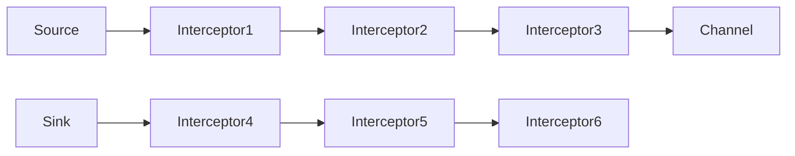

# Flume Interceptor原理与代码实例讲解

## 1.背景介绍

Apache Flume是一个分布式、可靠、高可用的海量日志数据采集系统,广泛应用于日志数据的收集、聚合和移动。在Flume的数据传输过程中,Interceptor扮演着至关重要的角色,它可以在数据进入Flume之前或离开Flume之前对数据进行拦截、过滤、转换等操作。

Interceptor的引入使得Flume在数据传输过程中具备了更强大的灵活性和可扩展性。通过Interceptor,我们可以实现诸如数据过滤、数据转换、数据路由、数据分流等功能,从而满足不同场景下的业务需求。

## 2.核心概念与联系

### 2.1 Interceptor接口

Interceptor是一个接口,定义了以下方法:

```java
public interface Interceptor {
  void initialize();
  Event intercept(Event event);
  List<Event> intercept(List<Event> events);
  void close();
  //...
}
```

- `initialize()`方法用于初始化Interceptor实例,通常在该方法中完成必要的资源加载和配置初始化工作。
- `intercept(Event event)`方法用于拦截单个Event对象,并对其执行相应的操作,如数据过滤、转换等。
- `intercept(List<Event> events)`方法用于批量拦截多个Event对象,通常会遍历events列表,对每个Event对象执行intercept(Event event)操作。
- `close()`方法用于释放Interceptor实例占用的资源,如关闭文件句柄、断开数据库连接等。

### 2.2 Interceptor链

Flume支持为每个Source或Sink配置多个Interceptor,这些Interceptor会按照配置的顺序组成一条Interceptor链。数据在进入或离开Flume时,会依次经过这条Interceptor链上的每个Interceptor实例。

Interceptor链的执行顺序如下:



上图展示了一个典型的Flume数据流,其中Source端和Sink端分别配置了3个Interceptor。数据在Source端进入Flume时,会先经过Interceptor1、Interceptor2、Interceptor3的拦截;而在Sink端离开Flume时,则会经过Interceptor4、Interceptor5、Interceptor6的拦截。

### 2.3 Interceptor类型

Flume提供了多种开箱即用的Interceptor实现,用于满足不同场景下的需求:

- **TimestampInterceptor**: 为每个Event添加时间戳。
- **HostInterceptor**: 为每个Event添加主机名称。
- **StaticInterceptor**: 为每个Event添加静态的头信息。
- **RegexFilteringInterceptor**: 根据正则表达式过滤Event。
- **RegexExtractorInterceptor**: 根据正则表达式从Event主体中提取数据,并将其存储在Event头中。
- **MorphlineInterceptor**: 使用Morphline配置文件对Event进行复杂的数据转换操作。
- **SearchAndReplaceInterceptor**: 使用正则表达式搜索和替换Event主体中的内容。

除了这些开箱即用的Interceptor外,Flume还支持用户自定义Interceptor,以满足特殊的业务需求。

## 3.核心算法原理具体操作步骤

自定义Interceptor的核心步骤如下:

1. **实现Interceptor接口**

   首先需要创建一个类,并实现Interceptor接口中定义的四个方法。

   ```java
   public class MyInterceptor implements Interceptor {
     // 实现initialize()、intercept(Event)、intercept(List<Event>)和close()方法
   }
   ```

2. **配置Interceptor**

   在Flume的配置文件中,为Source或Sink添加Interceptor配置。

   ```properties
   # Source配置
   a1.sources.r1.interceptors = i1 i2
   a1.sources.r1.interceptors.i1.type = com.example.MyInterceptor
   a1.sources.r1.interceptors.i1.param1 = value1
   # ...

   # Sink配置  
   a1.sinks.k1.interceptors = i3 i4
   a1.sinks.k1.interceptors.i3.type = com.example.MyInterceptor
   # ...
   ```

3. **实现Interceptor逻辑**

   在Interceptor的intercept方法中,编写具体的数据处理逻辑。例如,下面是一个简单的Interceptor实现,它会将Event主体中的所有字母转换为大写。

   ```java
   public class UppercaseInterceptor implements Interceptor {
     @Override
     public void initialize() {
       // 执行初始化操作
     }

     @Override
     public Event intercept(Event event) {
       // 获取Event主体
       byte[] body = event.getBody();
       if (body == null) {
         return event;
       }
       // 将主体转换为大写
       String upperBody = new String(body).toUpperCase();
       // 创建新的Event对象,并设置转换后的主体
       Event outEvent = EventBuilder.withBody(upperBody.getBytes());
       // 复制Event头信息
       outEvent.setHeaders(event.getHeaders());
       return outEvent;
     }

     @Override
     public List<Event> intercept(List<Event> events) {
       List<Event> outEvents = new ArrayList<>();
       for (Event event : events) {
         outEvents.add(intercept(event));
       }
       return outEvents;
     }

     @Override
     public void close() {
       // 执行资源释放操作
     }
   }
   ```

4. **构建和部署**

   将自定义Interceptor打包为jar文件,并将其复制到Flume的`classpath`中。然后重启Flume服务,即可生效。

## 4.数学模型和公式详细讲解举例说明

在某些场景下,我们可能需要对Event中的数值数据进行一些数学运算或转换。例如,将温度值从摄氏度转换为华氏度、对日志中的数值特征执行标准化等。在这种情况下,我们可以编写一个自定义的Interceptor来实现这些功能。

假设我们需要编写一个Interceptor,用于将Event主体中的数值数据标准化(z-score标准化)。标准化的数学公式如下:

$$z = \frac{x - \mu}{\sigma}$$

其中:

- $x$是原始数据值
- $\mu$是数据集的均值
- $\sigma$是数据集的标准差

我们可以编写一个`ZScoreNormalizationInterceptor`来实现这一功能:

```java
public class ZScoreNormalizationInterceptor implements Interceptor {
  private double mean; // 数据集均值
  private double std; // 数据集标准差

  @Override
  public void initialize() {
    // 从配置文件或其他来源加载均值和标准差
    mean = /* ... */;
    std = /* ... */;
  }

  @Override
  public Event intercept(Event event) {
    // 获取Event主体
    byte[] body = event.getBody();
    if (body == null) {
      return event;
    }
    String bodyStr = new String(body);
    double value;
    try {
      value = Double.parseDouble(bodyStr);
    } catch (NumberFormatException e) {
      // 如果主体不是数值,直接返回原始Event
      return event;
    }
    // 执行z-score标准化
    double zScore = (value - mean) / std;
    // 创建新的Event对象,并设置标准化后的主体
    Event outEvent = EventBuilder.withBody(String.valueOf(zScore).getBytes());
    // 复制Event头信息
    outEvent.setHeaders(event.getHeaders());
    return outEvent;
  }

  // 省略intercept(List<Event>)和close()方法实现
}
```

在上面的实现中,我们首先从配置文件或其他来源加载了数据集的均值和标准差。然后在`intercept(Event event)`方法中,我们尝试将Event主体解析为double类型的数值。如果解析成功,则执行z-score标准化计算,并将结果设置为新Event的主体。如果解析失败,则直接返回原始Event。

通过这种方式,我们可以方便地在Flume数据流中插入数学转换操作,从而满足特定的数据处理需求。

## 5.项目实践:代码实例和详细解释说明

在本节中,我们将通过一个实际的代码示例,演示如何编写一个自定义的Interceptor,并将其集成到Flume数据流中。

假设我们需要开发一个Interceptor,用于从Event主体中提取特定格式的日志数据,并将提取的字段作为Event头存储。我们将这个Interceptor命名为`LogExtractorInterceptor`。

### 5.1 定义日志格式

首先,我们需要定义日志的格式。在本示例中,假设日志格式如下:

```
<TIMESTAMP> <LEVEL> [<THREAD>] <CLASS>: <MESSAGE>
```

其中:

- `<TIMESTAMP>`是日志时间戳,格式为`yyyy-MM-dd HH:mm:ss,SSS`
- `<LEVEL>`是日志级别,如INFO、WARN、ERROR等
- `<THREAD>`是线程名称
- `<CLASS>`是日志所在的类名
- `<MESSAGE>`是日志消息内容

### 5.2 实现Interceptor

接下来,我们将实现`LogExtractorInterceptor`。

```java
import java.util.*;
import java.util.regex.Matcher;
import java.util.regex.Pattern;

import org.apache.flume.Context;
import org.apache.flume.Event;
import org.apache.flume.interceptor.Interceptor;

public class LogExtractorInterceptor implements Interceptor {
  private static final Pattern LOG_PATTERN = Pattern.compile(
      "^(\\d{4}-\\d{2}-\\d{2} \\d{2}:\\d{2}:\\d{2},\\d{3}) (\\w+) \\[(.*)\\] (\\S+):\\s*(.*)$");

  private List<Event> intercept(List<Event> events) {
    List<Event> outEvents = new ArrayList<>();
    for (Event event : events) {
      outEvents.add(intercept(event));
    }
    return outEvents;
  }

  private Event intercept(Event event) {
    byte[] body = event.getBody();
    if (body == null) {
      return event;
    }
    String log = new String(body);
    Matcher matcher = LOG_PATTERN.matcher(log);
    if (matcher.matches()) {
      Map<String, String> headers = new HashMap<>();
      headers.put("timestamp", matcher.group(1));
      headers.put("level", matcher.group(2));
      headers.put("thread", matcher.group(3));
      headers.put("class", matcher.group(4));
      headers.put("message", matcher.group(5));
      Event outEvent = EventBuilder.withBody(body, headers);
      return outEvent;
    } else {
      return event;
    }
  }

  @Override
  public void initialize() {
    // 无需初始化操作
  }

  @Override
  public void close() {
    // 无需关闭操作
  }

  public static class Builder implements Interceptor.Builder {
    @Override
    public Interceptor build() {
      return new LogExtractorInterceptor();
    }

    @Override
    public void configure(Context context) {
      // 无需配置
    }
  }
}
```

在上面的实现中,我们首先定义了一个正则表达式`LOG_PATTERN`,用于匹配日志格式。然后在`intercept(Event event)`方法中,我们尝试使用该正则表达式匹配Event主体。如果匹配成功,则从匹配结果中提取出时间戳、日志级别、线程名、类名和消息内容,并将它们作为Event头存储在新创建的Event对象中。如果匹配失败,则直接返回原始Event。

`intercept(List<Event> events)`方法则是遍历events列表,对每个Event执行`intercept(Event event)`操作。

`initialize()`和`close()`方法在本示例中为空,因为我们无需执行初始化和资源释放操作。

最后,我们定义了一个`Builder`类,用于创建`LogExtractorInterceptor`实例。Flume在加载Interceptor时,会通过反射调用`Builder`类的`build()`方法来创建Interceptor实例。

### 5.3 配置Interceptor

接下来,我们需要在Flume的配置文件中添加`LogExtractorInterceptor`的配置。假设我们要为名为`r1`的Source配置该Interceptor,配置如下:

```properties
# Source配置
a1.sources.r1.type = /* ... */
a1.sources.r1.channels = c1

# Interceptor配置
a1.sources.r1.interceptors = i1
a1.sources.r1.interceptors.i1.type = com.example.LogExtractorInterceptor$Builder
```

在上面的配置中,我们为Source `r1`添加了一个名为`i1`的Interceptor,并指定了它的类型为`com.example.LogExtractorInterceptor$Builder`。

### 5.4 构建和部署

最后一步是将`LogExtractorInterceptor`打包为jar文件,并将其复制到Flume的`classpath`中。然后重启Flume服务,即可生效。

当Flume接收到符合日志格式的数据时