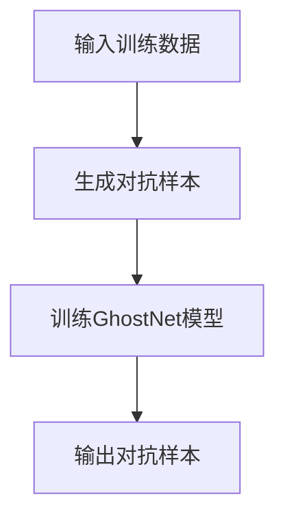
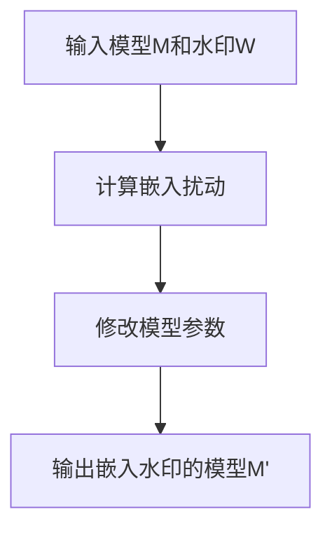
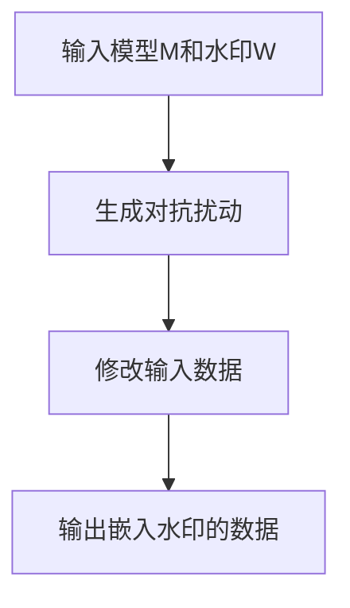

# GhostNet与对抗水印:AI版权保护的新思路

## 1.背景介绍

随着人工智能(AI)技术的快速发展,AI模型的版权保护问题日益受到重视。传统的数字版权管理(DRM)技术难以有效保护AI模型,因为模型的复制和传播成本极低。与此同时,AI模型训练数据和模型参数也容易被盗窃,给模型所有者带来巨大经济损失。因此,迫切需要新的技术手段来保护AI模型的知识产权。

GhostNet和对抗水印技术应运而生,为AI版权保护提供了全新的解决方案。它们利用对抗样本和数字水印的原理,在AI模型中嵌入隐蔽的"指纹",以实现版权认证和追踪。这些创新技术有望彻底改变AI知识产权的保护格局。

## 2.核心概念与联系

### 2.1 GhostNet

GhostNet是一种对抗性对象检测网络,旨在生成对抗样本作为数字水印,嵌入到AI模型中。它的核心思想是:在训练数据中注入微小但有目标的扰动,使模型在特定输入上产生预期的输出,从而达到"指纹"嵌入的目的。

GhostNet的优势在于:

1. 对抗样本隐蔽性强,人眼难以察觉
2. 可控制嵌入的"指纹"模式
3. 嵌入成本低,不影响模型性能

### 2.2 对抗水印

对抗水印是一种利用对抗样本实现数字水印嵌入的技术。它的关键在于,生成的对抗样本不仅可以作为"指纹"嵌入模型,还能对抗一定程度的扰动,从而提高水印的鲁棒性。

对抗水印可分为两类:

1. 白盒对抗水印:需要访问模型内部结构
2. 黑盒对抗水印:只需要模型输入输出对

无论哪种方式,对抗水印都能为AI模型提供有效的版权保护。

### 2.3 GhostNet与对抗水印的关系

GhostNet是生成对抗样本的网络模型,而对抗水印则是利用这些对抗样本实现版权保护的技术手段。二者有机结合,就能构建出完整的AI版权保护解决方案。

GhostNet负责"指纹"生成,对抗水印负责"指纹"嵌入,从而实现模型版权的认证和追踪,保护AI知识产权。

## 3.核心算法原理具体操作步骤

### 3.1 GhostNet算法流程

GhostNet的核心算法流程如下:



具体步骤:

1. 输入原始训练数据
2. 生成对抗样本作为"指纹"
3. 将对抗样本注入训练数据,训练GhostNet模型
4. GhostNet模型输出对抗样本

### 3.2 对抗水印嵌入算法

对抗水印嵌入算法分为白盒和黑盒两种情况:

#### 3.2.1 白盒对抗水印嵌入



1. 输入待保护模型M和水印对抗样本W
2. 计算嵌入水印W所需的模型参数扰动
3. 将扰动应用到模型M的参数上
4. 输出嵌入水印的新模型M'

#### 3.2.2 黑盒对抗水印嵌入  



1. 输入待保护模型M和水印对抗样本W  
2. 生成将水印W嵌入模型M所需的输入对抗扰动
3. 将扰动应用到输入数据上
4. 输出嵌入水印的对抗输入数据

无论白盒还是黑盒,对抗水印嵌入的目标都是将"指纹"隐蔽地植入模型中,以实现版权保护。

## 4.数学模型和公式详细讲解举例说明

### 4.1 生成对抗样本

对抗样本的生成可以建模为一个优化问题:

$$
\underset{r}{\mathrm{minimize}} \; \|r\|_p + c \cdot L(x+r, l)
$$

其中:
- $x$是原始输入数据
- $l$是期望的"指纹"标签  
- $L$是模型的损失函数
- $r$是需要求解的对抗扰动
- $\|r\|_p$是扰动的范数约束,控制扰动大小
- $c$是平衡因子,权衡扰动大小和"指纹"嵌入效果

通过优化求解,可以得到"指纹"对抗样本$x^{adv} = x + r$。

例如,对于图像分类任务,我们可以将"指纹"编码为一个特殊的类别标签$l$,然后生成将原始图像$x$误分类为$l$的对抗样本$x^{adv}$,从而达到嵌入"指纹"的目的。

### 4.2 白盒对抗水印嵌入

对于白盒情况,我们可以直接修改模型参数$\theta$来嵌入对抗水印。

首先定义一个嵌入损失函数:

$$
L_{emb}(\theta) = \sum_{x^{adv} \in \mathcal{W}} L(f(x^{adv};\theta), l^{adv})
$$

其中:
- $\mathcal{W}$是对抗水印集合
- $l^{adv}$是对抗样本$x^{adv}$的"指纹"标签
- $L$是模型的损失函数
- $f(x;\theta)$是模型的前向传播

我们的目标是找到新的模型参数$\theta^*$,使得嵌入损失$L_{emb}$最小化:

$$
\theta^* = \underset{\theta}{\mathrm{argmin}} \; L_{emb}(\theta)
$$

通过优化求解,我们可以得到嵌入了对抗水印的新模型$f(x;\theta^*)$。

### 4.3 黑盒对抗水印嵌入  

对于黑盒情况,我们无法直接修改模型内部参数,只能通过生成对抗输入数据的方式嵌入水印。

定义黑盒嵌入损失函数:

$$
L_{emb}^{bb}(x) = \sum_{x^{adv} \in \mathcal{W}} L(f(x^{adv}), l^{adv})  
$$

其中符号含义与白盒情况相同。我们需要找到对抗输入数据$x^*$,使得黑盒嵌入损失最小化:

$$
x^* = \underset{x}{\mathrm{argmin}} \; L_{emb}^{bb}(x)
$$

通过优化求解,我们可以得到嵌入了对抗水印的对抗输入数据$x^*$。将$x^*$输入到模型$f$中,即可实现黑盒对抗水印嵌入。

以上数学模型和公式阐明了GhostNet生成对抗样本和对抗水印嵌入的核心原理,为AI版权保护提供了理论基础。

## 5.项目实践:代码实例和详细解释说明

### 5.1 GhostNet实现

以下是使用PyTorch实现GhostNet的简化代码示例:

```python
import torch
import torch.nn as nn

class GhostNet(nn.Module):
    def __init__(self, base_model):
        super().__init__()
        self.base_model = base_model
        self.watermark_layer = nn.Linear(base_model.output_dim, 1)

    def forward(self, x):
        features = self.base_model(x)
        watermark_logits = self.watermark_layer(features)
        return watermark_logits

# 训练函数
def train_ghostnet(model, data_loader, optimizer, watermark_label):
    for x, y in data_loader:
        optimizer.zero_grad()
        watermark_logits = model(x)
        watermark_loss = nn.BCEWithLogitsLoss()(watermark_logits, watermark_label)
        watermark_loss.backward()
        optimizer.step()

# 生成对抗样本
ghostnet = GhostNet(base_model)
watermark_label = torch.ones(batch_size, 1) # 设置"指纹"标签
optimizer = torch.optim.SGD(ghostnet.parameters(), lr=0.01)
train_ghostnet(ghostnet, data_loader, optimizer, watermark_label)
```

在这个示例中,我们构建了一个GhostNet模型,它在基础模型的输出上添加了一个线性层,用于预测"指纹"标签。在训练过程中,我们最小化"指纹"标签的二值交叉熵损失,从而将对抗样本作为"指纹"嵌入到模型中。

通过调整训练数据和"指纹"标签,我们可以生成不同的对抗样本,实现个性化的版权保护。

### 5.2 白盒对抗水印嵌入

下面是使用PyTorch实现白盒对抗水印嵌入的代码示例:

```python
import torch
import torch.nn as nn

def embed_watermark(model, watermark_set, optimizer, num_epochs):
    for epoch in range(num_epochs):
        for x_adv, y_adv in watermark_set:
            optimizer.zero_grad()
            outputs = model(x_adv)
            loss = nn.CrossEntropyLoss()(outputs, y_adv)
            loss.backward()
            optimizer.step()

# 加载模型和对抗水印集合
model = MyModel()
watermark_set = load_watermark_set()

# 嵌入对抗水印
optimizer = torch.optim.SGD(model.parameters(), lr=0.01)
embed_watermark(model, watermark_set, optimizer, num_epochs=10)
```

在这个示例中,我们定义了一个`embed_watermark`函数,它将对抗水印集合`watermark_set`中的对抗样本及其对应的"指纹"标签输入到模型中,并最小化交叉熵损失,从而将对抗水印嵌入到模型参数中。

通过多次迭代优化,我们可以得到嵌入了对抗水印的新模型,实现了白盒版权保护。

### 5.3 黑盒对抗水印嵌入

以下是使用PyTorch实现黑盒对抗水印嵌入的代码示例:

```python
import torch
import torch.nn as nn

def embed_watermark_blackbox(model, watermark_set, num_steps=1000, step_size=0.01):
    x_adv = torch.rand_like(watermark_set[0][0]) # 初始化对抗输入
    x_adv.requires_grad = True

    for step in range(num_steps):
        outputs = model(x_adv)
        loss = 0
        for x, y in watermark_set:
            loss += nn.CrossEntropyLoss()(outputs, y)
        loss.backward()
        x_adv.data = x_adv.data - step_size * x_adv.grad.data
        x_adv.grad.data.zero_()

    return x_adv.detach()

# 加载模型和对抗水印集合
model = MyModel()
watermark_set = load_watermark_set()

# 嵌入对抗水印
x_watermarked = embed_watermark_blackbox(model, watermark_set)
```

在这个示例中,我们定义了一个`embed_watermark_blackbox`函数,它通过对抗训练的方式生成嵌入了对抗水印的对抗输入数据`x_watermarked`。

具体来说,我们初始化一个可训练的对抗输入`x_adv`,然后通过多次迭代,最小化对抗水印集合中所有样本的交叉熵损失,并根据损失梯度更新`x_adv`。最终,我们得到的`x_watermarked`就是嵌入了对抗水印的对抗输入数据。

将`x_watermarked`输入到模型中,即可实现黑盒对抗水印嵌入,从而保护模型的版权。

以上代码示例展示了如何使用PyTorch实现GhostNet生成对抗样本,以及白盒和黑盒对抗水印嵌入的具体流程。通过这些实现,我们可以更好地理解和应用GhostNet和对抗水印技术,为AI版权保护提供有力支持。

## 6.实际应用场景

GhostNet和对抗水印技术在以下场景具有广泛的应用前景:

1.{"msg_type":"generate_answer_finish","data":"","from_module":null,"from_unit":null}