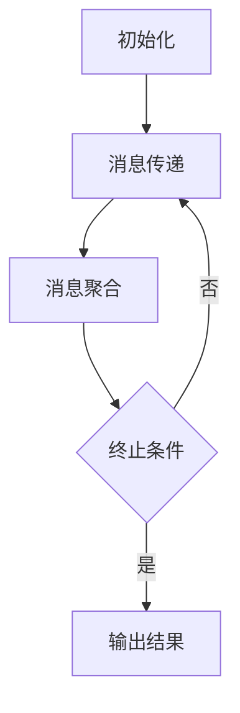
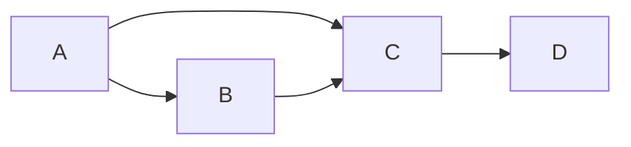

# GraphX原理与代码实例讲解

## 1.背景介绍

在大数据时代,对海量数据进行高效处理和分析是一个巨大的挑战。Apache Spark作为一种快速、通用的大规模数据处理引擎,可以高效地处理大数据工作负载。GraphX是Spark中用于图形数据处理的API,它将图形数据抽象为顶点和边的集合,并提供了一系列高效的图形运算和迭代算法。

图形处理在诸多领域都有着广泛的应用,例如社交网络分析、网页排名、推荐系统、交通网络优化等。因此,GraphX作为Spark生态系统中的重要组成部分,为图形计算提供了高效、可扩展的解决方案。

## 2.核心概念与联系

GraphX将图形数据抽象为顶点(Vertex)和边(Edge)的集合。每个顶点都包含一个唯一的ID和相关的属性值,而每条边则连接两个顶点,并可以携带一些属性值。GraphX使用分布式的属性图(Distributed Property Graph)来表示图形数据,其中顶点和边都是分区的,可以跨越多个执行器进行并行计算。

GraphX中的核心概念包括:

### 2.1 属性图(Property Graph)

属性图由以下几个部分组成:

- 顶点属性(Vertex Property): 顶点的属性值
- 顶点RDD(Vertex RDD): 包含所有顶点的RDD
- 边属性(Edge Property): 边的属性值
- 边RDD(Edge RDD): 包含所有边的RDD
- 反向边视图(Reverse View): 用于高效访问某个顶点的入边

### 2.2 消息传递(Message Passing)

消息传递是GraphX中实现图形算法的核心机制。在每次迭代中,每个顶点根据自身状态和收到的消息,更新自身状态并向邻居顶点发送新的消息。通过这种方式,信息可以在图形中高效传播。

### 2.3 图形运算(Graph Operations)

GraphX提供了一系列基本的图形运算,如subgraph、mapVertices、mapEdges等,用于转换和操作图形数据。此外,还提供了一些常用的图形算法,如PageRank、连通分量、三角形计数等。

### 2.4 图形构建(Graph Construction)

GraphX支持从各种数据源构建图形,如RDD、边列表、图形文件等。同时也提供了一些工具函数,用于生成特定类型的图形数据。

## 3.核心算法原理具体操作步骤  

GraphX的核心算法原理基于消息传递范式(Message Passing Paradigm)。在这种范式下,图形算法通过在顶点之间传递消息来实现。每个顶点根据收到的消息更新自身状态,并向邻居顶点发送新的消息。通过多次迭代,信息就可以在整个图形中传播。

以PageRank算法为例,其核心操作步骤如下:

1. **初始化**:为每个顶点赋予初始的PageRank值,通常为1/N(N为顶点数量)。

2. **消息传递**:每个顶点将自身的PageRank值平均分配给所有出边的邻居顶点,构成消息并发送出去。

3. **消息聚合**:每个顶点接收来自所有入边邻居的消息,并将它们累加起来,作为新的PageRank值。

4. **终止条件**:重复步骤2和3,直到PageRank值收敛或达到最大迭代次数。

这个过程可以用Mermaid流程图表示如下:



在GraphX中,可以使用Pregel API来实现这种消息传递范式。Pregel API提供了一种简洁的方式来表达图形算法,开发者只需要定义三个函数:

1. **vertexProgram**: 定义每个顶点在每次迭代中需要执行的操作。

2. **sendMessage**: 定义每个顶点如何向邻居发送消息。

3. **mergeMessage**: 定义每个顶点如何聚合收到的消息。

以PageRank为例,可以使用Pregel API如下实现:

```scala
import org.apache.spark.graphx._

val graph: Graph[Double, Double] = ... // 构建图形

val pageRanks = graph.pageRank(0.001).vertices

def vertexProgram(id: VertexId, attr: Double, msgSum: Double): Double =
  0.15 + 0.85 * msgSum

def sendMessage(triplet: EdgeTriplet[Double, Double]): Iterator[(VertexId, Double)] = {
  Iterator((triplet.dstId, triplet.srcAttr / triplet.srcAttr.outDegree))
}

def mergeMessage(msg1: Double, msg2: Double): Double = msg1 + msg2

pageRanks.saveAsTextFile("pageranks.txt")
```

在上面的示例中,`vertexProgram`函数定义了每个顶点如何更新自身的PageRank值;`sendMessage`函数定义了每个顶点如何向邻居发送消息;`mergeMessage`函数定义了每个顶点如何聚合收到的消息。通过调用`pageRank`方法并传入这三个函数,GraphX就可以高效地计算出每个顶点的PageRank值。

## 4.数学模型和公式详细讲解举例说明

GraphX中的许多图形算法都基于数学模型和公式。以PageRank算法为例,其数学模型基于随机游走过程。

设有一个包含N个顶点的图形G,我们定义一个随机游走过程,即从任意一个顶点出发,每次以相等的概率随机选择一条出边进行跳转。PageRank算法的目标是计算出每个顶点在这个随机游走过程中被访问的概率。

我们用$PR(v_i)$表示顶点$v_i$的PageRank值,即它被访问的概率。根据随机游走过程的定义,我们可以得到以下公式:

$$
PR(v_i) = (1 - d) + d \sum_{v_j \in In(v_i)} \frac{PR(v_j)}{Out(v_j)}
$$

其中:

- $d$是一个阻尼系数(damping factor),通常取值0.85。
- $In(v_i)$表示所有指向顶点$v_i$的入边的源顶点集合。
- $Out(v_j)$表示顶点$v_j$的出边数量。

这个公式可以解释为:一个顶点的PageRank值由两部分组成。第一部分$(1 - d)$是一个常数,表示随机游走过程中有一定概率会直接跳转到该顶点,而不经过任何边。第二部分是所有入边邻居顶点的PageRank值的加权平均值,权重为该邻居顶点指向当前顶点的出边数量占该邻居顶点所有出边的比例。

为了计算PageRank值,我们可以使用迭代法。首先,给每个顶点赋予初始的PageRank值,通常为$1/N$。然后,根据上述公式重复计算每个顶点的新PageRank值,直到收敛或达到最大迭代次数。

让我们用一个简单的示例来说明PageRank算法的计算过程。假设有一个包含4个顶点的图形,如下所示:



我们初始化每个顶点的PageRank值为0.25,阻尼系数$d$取0.85。在第一次迭代中,每个顶点的新PageRank值计算如下:

- $PR(A) = (1 - 0.85) + 0.85 \times 0 = 0.15$
- $PR(B) = (1 - 0.85) + 0.85 \times (0.25 / 2) = 0.2625$
- $PR(C) = (1 - 0.85) + 0.85 \times (0.25 / 2 + 0.25) = 0.4125$
- $PR(D) = (1 - 0.85) + 0.85 \times (0.25) = 0.3625$

在后续的迭代中,我们使用上一次迭代的结果继续计算,直到PageRank值收敛。最终,我们可以得到每个顶点的稳定PageRank值。

通过这个示例,我们可以看到PageRank算法如何利用图形结构来计算每个顶点的重要性。具有更多入边的顶点会获得更高的PageRank值,而且入边来源的重要性也会影响目标顶点的PageRank值。

## 5.项目实践:代码实例和详细解释说明

在本节中,我们将通过一个实际的项目示例来展示如何使用GraphX进行图形处理。我们将构建一个简单的社交网络,并使用GraphX计算每个用户的PageRank值。

### 5.1 构建图形

首先,我们需要从数据源构建图形。在本例中,我们将使用一个边列表文件,其中每行表示一条边,格式为"源顶点ID 目标顶点ID"。

```scala
import org.apache.spark.graphx._
import org.apache.spark.rdd.RDD

// 从边列表文件构建图形
val edges: RDD[(VertexId, VertexId)] = sc.textFile("edges.txt")
  .map { line =>
    val Array(src, dst) = line.split(" ")
    (src.toLong, dst.toLong)
  }

// 创建图形
val graph: Graph[Long, Long] = Graph.fromEdgeTuples(edges, 1)
```

在上面的代码中,我们首先从文件中读取边列表,并将每行转换为一对顶点ID。然后,使用`Graph.fromEdgeTuples`方法创建一个图形对象。由于我们没有提供顶点属性,所以每个顶点的属性值都被初始化为1。

### 5.2 计算PageRank

接下来,我们使用GraphX计算每个顶点的PageRank值。

```scala
import org.apache.spark.graphx._

// 定义消息传递函数
def vertexProgram(id: VertexId, attr: Double, msgSum: Double): Double =
  0.15 + 0.85 * msgSum

def sendMessage(triplet: EdgeTriplet[Double, Double]): Iterator[(VertexId, Double)] = {
  Iterator((triplet.dstId, triplet.srcAttr / triplet.srcAttr.outDegree))
}

def mergeMessage(msg1: Double, msg2: Double): Double = msg1 + msg2

// 计算PageRank
val pageRanks = graph.pageRank(0.001, vertexProgram, sendMessage, mergeMessage)

// 输出结果
pageRanks.vertices.saveAsTextFile("pageranks.txt")
```

在上面的代码中,我们定义了三个函数`vertexProgram`、`sendMessage`和`mergeMessage`,分别用于更新顶点状态、发送消息和聚合消息。这些函数的实现与前面介绍的PageRank算法原理相同。

然后,我们调用`graph.pageRank`方法,传入这三个函数和一个收敛阈值(0.001),即可计算出每个顶点的PageRank值。最后,我们将结果保存到文件中。

### 5.3 结果分析

运行上述代码后,我们可以在"pageranks.txt"文件中查看每个顶点的PageRank值。文件的格式为"顶点ID PageRank值"。

通过分析这些PageRank值,我们可以了解每个用户在社交网络中的重要性。具有更高PageRank值的用户通常拥有更多的入边(被更多用户关注),或者被重要用户关注。这些信息可以用于推荐系统、影响力分析等应用场景。

## 6.实际应用场景

GraphX提供了强大的图形处理能力,可以应用于多个领域。下面是一些典型的应用场景:

### 6.1 社交网络分析

在社交网络中,用户之间的关系可以抽象为一个图形,每个用户表示为一个顶点,用户之间的关系表示为边。通过GraphX,我们可以计算用户的PageRank值、社区发现、影响力分析等,为社交网络的推荐系统、广告投放等提供支持。

### 6.2 网页排名

PageRank算法最初就是用于网页排名。将网页抽象为顶点,超链接表示为边,我们可以使用GraphX计算每个网页的PageRank值,从而确定其重要性和排名。

### 6.3 推荐系统

在推荐系统中,我们可以将用户和商品抽象为顶点,用户对商品的评分或购买行为表示为边。然后,使用GraphX进行协同过滤、个性化排名等算法,为用户推荐感兴趣的商品。

### 6.4 交通网络优化

将道路抽象为边,路口抽