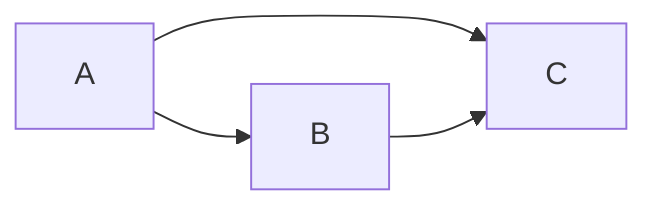

# GraphX原理与代码实例讲解

## 1.背景介绍
### 1.1 大数据时代下的图计算需求
在当今大数据时代,各行各业都产生了海量的数据,传统的数据处理和分析方法已经无法满足需求。图作为一种重要的数据结构,能够很好地表示事物之间的复杂关系,因此图计算在众多领域得到广泛应用,如社交网络分析、推荐系统、欺诈检测等。然而,对于大规模图数据的处理是一项极具挑战性的任务,这就需要高效、可扩展的分布式图计算框架。

### 1.2 Spark GraphX的诞生
GraphX是Apache Spark生态系统中的分布式图计算框架,它建立在Spark之上,继承了Spark的内存计算、DAG执行引擎等优势,同时针对图计算进行了专门的优化。GraphX将图计算抽象为一系列基本操作,并提供了丰富的API,使得用户能够方便地在海量图数据上进行复杂的图分析。

## 2.核心概念与联系
### 2.1 属性图(Property Graph)
GraphX使用属性图模型来表示图数据。属性图由顶点(Vertex)和边(Edge)组成,每个顶点和边都可以携带属性。形式化定义为:
$$G = (V, E, P_V, P_E)$$
其中,$V$表示顶点集合,$E$表示有向边集合,$P_V$和$P_E$分别表示顶点和边的属性。

### 2.2 弹性分布式数据集(RDD)
GraphX是构建在Spark的弹性分布式数据集(RDD)之上的。RDD是Spark的基本数据抽象,表示一个分布式的、只读的记录集合。GraphX将图数据表示为一个顶点RDD和一个边RDD:
```scala
class Graph[VD, ED] {
  val vertices: VertexRDD[VD] 
  val edges: EdgeRDD[ED]
}
```
其中,`VertexRDD[VD]`表示顶点RDD,`VD`为顶点属性类型;`EdgeRDD[ED]`表示边RDD,`ED`为边属性类型。

### 2.3 Pregel编程模型
GraphX借鉴了Google的Pregel模型,提供了一种"思考方式像顶点(think like a vertex)"的图计算范式。在Pregel中,计算被分解为一系列超步(superstep),在每个超步中:
1. 每个顶点接收来自上一超步的消息
2. 根据接收到的消息和自身状态,更新顶点状态
3. 向相邻顶点发送消息
4. 如果顶点状态不再改变且没有消息发送,顶点可以投票停止计算

GraphX通过`Pregel`运算符实现了这一模型:
```scala
def pregel[A](
  initialMsg: A, 
  maxIter: Int = Int.MaxValue, 
  activeDir: EdgeDirection = EdgeDirection.Out)
  (vprog: (VertexId, VD, A) => VD,
  sendMsg: EdgeTriplet[VD, ED] => Iterator[(VertexId, A)],
  mergeMsg: (A, A) => A)
  : Graph[VD, ED]
```

## 3.核心算法原理具体操作步骤
下面以PageRank算法为例,介绍GraphX中图算法的实现原理和步骤。PageRank是一种用于评估网页重要性的算法,其基本思想是:如果一个网页被很多其他重要网页链接到,那么这个网页也应当是重要的。

### 3.1 构建图
首先,我们需要将数据加载为GraphX中的图对象。假设我们有如下的网页链接数据:
```
src dst
A   B
A   C
B   C
```
使用GraphX构建图的代码如下:
```scala
val vertices = spark.sparkContext.parallelize(
  Seq((1L, ("A", 1.0)), (2L, ("B", 1.0)), (3L, ("C", 1.0)))
)
val edges = spark.sparkContext.parallelize(
  Seq(Edge(1L, 2L, 1), Edge(1L, 3L, 1), Edge(2L, 3L, 1))
)
val graph = Graph(vertices, edges)
```
这里我们为每个网页分配一个初始的PageRank值1.0。

### 3.2 PageRank计算
接下来,使用Pregel模型实现PageRank计算:
```scala
val alpha = 0.15
def vertexProgram(id: VertexId, attr: (String, Double), msgSum: Double): (String, Double) = {
  val newPR = alpha + (1 - alpha) * msgSum
  (attr._1, newPR)
}
def sendMessage(edge: EdgeTriplet[(String, Double), Int]): Iterator[(VertexId, Double)] = {
  Iterator((edge.dstId, edge.srcAttr._2 / edge.srcAttr._1.length))  
}
def messageCombiner(a: Double, b: Double): Double = a + b

val pagerankGraph = graph.pregel(0.0, 10)(vertexProgram, sendMessage, messageCombiner)
```
在每一轮迭代中:
1. `vertexProgram`根据接收到的消息和顶点当前的PageRank值,计算新的PageRank值
2. `sendMessage`将当前顶点的PageRank值平均分配给出边相连的顶点
3. `messageCombiner`对发送给同一顶点的PageRank值求和

迭代多轮直至收敛,得到每个网页的最终PageRank值。

## 4.数学模型和公式详细讲解举例说明
PageRank的数学定义为:
$$PR(p_i) = \frac{1-d}{N} + d \sum_{p_j \in M(p_i)} \frac{PR(p_j)}{L(p_j)}$$
其中:
- $PR(p_i)$: 网页$p_i$的PageRank值
- $d$: 阻尼系数,一般取0.85
- $N$: 所有网页数量 
- $M(p_i)$: 链接到网页$p_i$的网页集合
- $L(p_j)$: 网页$p_j$的出链数量

举例说明,考虑如下的网页链接关系:


假设阻尼系数$d=0.85$,初始时A、B、C的PageRank值都为1,那么:
- 第一轮迭代后:
$$
\begin{aligned}
PR(A) &= 0.15 + 0.85 \times 0 = 0.15 \\  
PR(B) &= 0.15 + 0.85 \times \frac{1}{2} = 0.575 \\
PR(C) &= 0.15 + 0.85 \times (\frac{1}{2} + 1) = 1.275
\end{aligned}
$$
- 第二轮迭代后:
$$
\begin{aligned}
PR(A) &= 0.15 + 0.85 \times 0 = 0.15 \\
PR(B) &= 0.15 + 0.85 \times \frac{0.15}{2} = 0.21375 \\ 
PR(C) &= 0.15 + 0.85 \times (\frac{0.15}{2} + 0.575) = 0.790625
\end{aligned}
$$
最终PageRank值在多轮迭代后会收敛。

## 5.项目实践：代码实例和详细解释说明
下面给出使用GraphX进行PageRank计算的完整Scala代码:
```scala
import org.apache.spark.graphx._
import org.apache.spark.rdd.RDD

object PageRank {
  def main(args: Array[String]): Unit = {
    // 创建SparkSession
    val spark = SparkSession.builder()
      .appName("PageRank")
      .getOrCreate()
    val sc = spark.sparkContext
    
    // 加载边数据
    val edgesRDD: RDD[Edge[Double]] = sc.textFile("data/edges.txt")
      .map { line => 
        val fields = line.split("\\s+")
        Edge(fields(0).toLong, fields(1).toLong, 1.0)
      }
    
    // 构建图,设置顶点和边的初始属性  
    val graph: Graph[(String, Double), Double] = Graph.fromEdges(
      edgesRDD, 
      ("", 1.0)
    ).mapVertices { case (id, (_, pr)) => (id.toString, pr) }
    
    // 定义Pregel中的消息传递函数
    def sendMessage(e: EdgeTriplet[(String, Double), Double]) = {
      Iterator((e.dstId, e.srcAttr._2 / e.srcAttr._1.length))
    }
    
    // 定义Pregel中的顶点程序
    def vertexProgram(id: VertexId, attr: (String, Double), msgSum: Double) = {
      val newPR = 0.15 + 0.85 * msgSum
      (attr._1, newPR)
    }
    
    // 运行Pregel
    val pagerankGraph = graph.pregel(0.0, 10, activeDirection = EdgeDirection.Out)(
      vertexProgram, 
      sendMessage,
      _ + _)
      
    // 显示结果  
    pagerankGraph.vertices.collect().foreach(println)
    
    spark.stop()
  }
}
```
代码说明:
1. 首先创建SparkSession,作为Spark程序的入口
2. 使用`sc.textFile`加载边数据,并解析每一行构建`Edge`
3. 使用`Graph.fromEdges`从边RDD构建图,并使用`mapVertices`设置初始的顶点属性(id,1.0)
4. 定义Pregel运算符中的消息传递函数`sendMessage`和顶点程序`vertexProgram`
5. 调用`Graph.pregel`运行PageRank计算,传入消息传递函数、顶点程序和消息合并函数
6. 使用`pagerankGraph.vertices.collect()`获取顶点的最终PageRank值并打印

## 6.实际应用场景
GraphX在许多领域都有广泛应用,下面列举几个典型场景:

### 6.1 社交网络分析
GraphX可以用于分析社交网络中的用户关系和影响力。例如:
- 使用PageRank、中心性等算法评估用户的重要性
- 使用连通分量、社区发现算法检测用户社区
- 使用最短路径、Landmark Labeling等算法计算用户之间的距离,预测潜在的关系

### 6.2 推荐系统
利用GraphX可以基于图的结构实现高效、准确的推荐:
- 将用户和物品看作图中的顶点,user-item交互看作边,使用协同过滤算法计算相似度,生成推荐
- 使用Random Walk、Personalized PageRank等算法在用户-物品二部图上游走,发现用户可能感兴趣的物品

### 6.3 欺诈检测
GraphX在欺诈检测中也有重要应用:
- 将交易、账户看作图中的顶点,交易关系看作边,使用图挖掘算法检测异常交易模式
- 使用Label Propagation、Belief Propagation等算法在交易网络中传播欺诈分数,识别可疑账户

## 7.工具和资源推荐
如果想深入学习GraphX,推荐以下资源:
- 官方文档: https://spark.apache.org/docs/latest/graphx-programming-guide.html
- Spark GraphX源码: https://github.com/apache/spark/tree/master/graphx
- 《Spark GraphX源码分析》: https://github.com/endymecy/spark-graphx-source-analysis
- 《GraphX in Action》: https://www.manning.com/books/graphx-in-action

除了GraphX,还有其他一些优秀的图计算框架值得了解:
- Pregel: Google提出的图计算框架,是GraphX的理论基础
- Giraph: 基于Hadoop的开源图计算框架,实现了Pregel模型
- GraphLab: 基于参数服务器的图计算框架,提供了同步和异步计算模式
- Neo4j: 著名的图数据库,支持图的CRUD操作和图算法

## 8.总结：未来发展趋势与挑战
图计算是大数据分析中的重要方向,GraphX为其提供了高层次的抽象和强大的分布式计算能力。未来GraphX有望在以下方面取得进一步发展:
- 更加智能的图计算,如支持图神经网络(GNN)、知识图谱推理等
- 更好的性能和可扩展性,如改进图数据分区、容错机制,扩展到万亿顶点级别
- 更多样的图数据源,如支持从图数据库、RDF数据等直接导入
- 更友好的开发接口,如支持更多编程语言,提供更简单易用的API

同时,GraphX也面临一些挑战:
- 图计算模型的局限性,如BSP模型同步开销大,异步模型收敛速度慢
- 大规模图的高效存储和计算,如减少数据洗牌、通信量,提高内存利用率
- 与其他大数据处理框架的整合,如与深度学习框架(TensorFlow)、流处理框架(Spark Streaming)的无缝衔接

总之,图计算是一