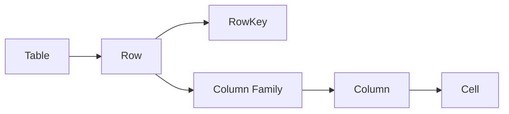

# HBase二级索引原理与代码实例讲解

## 1.背景介绍

在大数据时代,数据的规模和复杂性都在不断增长,传统的关系型数据库已经无法满足海量数据的存储和查询需求。为了解决这个问题,诞生了一种全新的数据存储和处理模型——列式数据库(Column-Oriented Database),HBase就是这种列式数据库的杰出代表之一。

HBase是一个分布式、可伸缩、面向列的开源大数据存储系统,它建立在Hadoop文件系统(HDFS)之上,利用Hadoop的MapReduce来处理存储在HDFS上的大规模数据集。HBase不仅可以存储结构化和半结构化的数据,而且支持数据的快速随机读写访问。

然而,HBase作为一个分布式的NoSQL数据库,在查询方面存在一些缺陷。由于HBase的数据模型是基于键值对的,因此只能根据行键(RowKey)进行查询,这使得HBase在某些场景下无法满足灵活的查询需求。为了解决这一问题,就需要引入二级索引(Secondary Index)的概念。

## 2.核心概念与联系

### 2.1 HBase数据模型

在讲解二级索引之前,我们先来了解一下HBase的数据模型。HBase的逻辑数据模型类似于Google的BigTable数据模型,主要由以下几个部分组成:

- **Table**(表): HBase中的数据存储在表中,每个表由多个行组成。
- **Row**(行): 每行由一个行键(RowKey)和多个列组成,行键用于唯一标识一行数据。
- **Column Family**(列族): 列族是列的逻辑分组,所有列都必须属于某个列族。
- **Column**(列): 列是由列族和列限定符(Column Qualifier)组成,用于存储数据。
- **Cell**(单元格): 单元格是行、列族、列限定符和版本号的组合,用于存储实际的数据值。



### 2.2 二级索引概念

二级索引(Secondary Index)是在HBase的数据模型之上构建的一种索引机制,它为HBase提供了除RowKey之外的其他查询路径。通过二级索引,我们可以根据列族、列限定符或者列值来查询数据,从而极大地提高了查询的灵活性和效率。

二级索引的核心思想是将需要建立索引的列数据作为键(Key),将RowKey作为值(Value)存储在另一张索引表中。当我们需要根据列数据进行查询时,首先在索引表中查找对应的RowKey,然后再到原始表中查询具体的数据。


## 3.核心算法原理具体操作步骤

HBase官方并没有提供二级索引的原生支持,但是社区中有许多开源的二级索引实现方案,其中比较出名的有Phoenix、Hbase-rs-index和Lily HBase Indexer等。这些方案在实现原理上有一些差异,但是总体思路都是基于协处理器(Coprocessor)来实现的。

以Phoenix为例,它的二级索引实现原理如下:

1. **创建索引表**: 首先需要创建一张索引表,索引表的结构与原始表类似,但是索引键和RowKey的位置互换。
2. **写入数据时更新索引表**: 当向原始表写入数据时,Phoenix会自动将需要建立索引的列数据作为键,RowKey作为值写入到索引表中。
3. **查询时利用索引表**: 当根据列数据进行查询时,Phoenix会先在索引表中查找对应的RowKey,然后再到原始表中查询具体的数据。

下面是Phoenix创建二级索引的示例代码:

```sql
-- 创建原始表
CREATE TABLE users (
    id CHAR(20) NOT NULL,
    name VARCHAR,
    age INTEGER,
    CONSTRAINT pk PRIMARY KEY (id)
);

-- 创建索引表
CREATE INDEX users_name_idx ON users (name) INCLUDE (age);

-- 插入数据
UPSERT INTO users VALUES ('user1', 'Alice', 25);
UPSERT INTO users VALUES ('user2', 'Bob', 30);

-- 根据name查询
SELECT * FROM users WHERE name = 'Alice';
```

在上面的示例中,我们首先创建了一张用户表`users`,然后在`name`列上创建了一个二级索引`users_name_idx`。当插入数据时,Phoenix会自动将`name`和`age`列的数据写入到索引表中。最后,当我们根据`name`进行查询时,Phoenix会先在索引表中查找对应的`id`,然后再到原始表中查询完整的数据。

## 4.数学模型和公式详细讲解举例说明

在HBase二级索引的实现中,涉及到一些数学模型和公式,用于优化索引的性能和效率。下面我们来详细讲解其中的一些核心概念。

### 4.1 Bloom Filter

Bloom Filter是一种空间高效的概率数据结构,用于快速判断一个元素是否存在于一个集合中。它的核心思想是使用一个位数组和多个哈希函数来表示集合,可以有效地减少内存占用和提高查询效率。

Bloom Filter的工作原理如下:

1. 初始化一个长度为m的位数组,所有位均初始化为0。
2. 选择k个哈希函数,每个哈希函数可以将元素映射到[0, m-1]的范围内。
3. 对于每个需要插入的元素x,计算k个哈希值h1(x), h2(x), ..., hk(x),并将位数组中对应的位置设置为1。
4. 对于需要查询的元素y,计算k个哈希值h1(y), h2(y), ..., hk(y),如果位数组中对应的位置都为1,则认为y可能存在于集合中;否则,y一定不存在于集合中。

Bloom Filter的优点是空间效率高,只需要很小的内存开销就可以表示一个大集合。但是它也存在一定的缺陷,就是存在一定的误报率(False Positive),即认为某个元素存在于集合中,但实际上它不存在。不过,Bloom Filter不会产生漏报(False Negative),即如果一个元素确实存在于集合中,它一定会被正确识别。

在HBase二级索引的实现中,Bloom Filter通常用于优化查询效率。例如,在查询时,我们可以先使用Bloom Filter快速判断RowKey是否存在于索引表中,如果不存在,就可以直接跳过后续的查询操作,从而提高查询性能。

### 4.2 局部性原理

局部性原理(Principle of Locality)是计算机系统设计中的一个重要概念,它描述了程序访问内存和磁盘数据的规律性。局部性原理包括两个方面:时间局部性(Temporal Locality)和空间局部性(Spatial Locality)。

- **时间局部性**:如果一个数据被访问过一次,在不久的将来它很可能会被再次访问。
- **空间局部性**:如果一个数据被访问过,与它相邻的数据也很可能会被访问。

在HBase二级索引的设计中,我们需要充分考虑局部性原理,以提高索引的查询效率。例如,在创建索引表时,我们可以将相关的数据存储在相邻的位置,从而利用空间局部性原理,减少磁盘寻道时间。同时,我们还可以采用缓存机制,利用时间局部性原理,将热数据缓存在内存中,加速查询速度。

### 4.3 数据分区和负载均衡

在分布式系统中,数据分区和负载均衡是两个非常重要的概念。由于数据量非常庞大,我们需要将数据分散存储在多个节点上,以提高系统的可扩展性和容错性。同时,为了确保系统的高效运行,我们还需要合理地分配工作负载,避免出现数据倾斜和热点问题。

在HBase二级索引的实现中,我们需要考虑如何对索引数据进行分区和负载均衡。一种常见的方法是采用一致性哈希(Consistent Hashing)算法,将数据均匀地分布在多个节点上。同时,我们还可以引入虚拟节点(Virtual Node)的概念,进一步提高数据分布的均匀性。

此外,我们还需要关注数据倾斜问题。由于数据分布的不均匀性,可能会导致某些节点承担过多的工作负载,而其他节点则相对空闲。为了解决这个问题,我们可以采用动态分区和负载均衡策略,根据实时的数据分布情况动态调整分区和负载均衡策略。

## 5.项目实践:代码实例和详细解释说明

为了更好地理解HBase二级索引的原理和实现,我们来看一个基于Lily HBase Indexer的实例项目。Lily HBase Indexer是一个开源的二级索引解决方案,它提供了多种索引类型和丰富的查询功能。

### 5.1 项目环境准备

首先,我们需要准备好项目所需的环境,包括HBase集群和Lily HBase Indexer。

1. 安装并启动HBase集群,可以参考官方文档进行操作。
2. 下载Lily HBase Indexer的二进制包,并解压缩到指定目录。
3. 修改Lily HBase Indexer的配置文件,指定HBase集群的地址和其他参数。

### 5.2 创建原始表和索引表

接下来,我们创建一个示例表`users`,并在`name`列上创建二级索引。

```java
// 创建原始表
HTableDescriptor tableDescriptor = new HTableDescriptor(TableName.valueOf("users"));
HColumnDescriptor columnFamily = new HColumnDescriptor("info");
tableDescriptor.addFamily(columnFamily);
admin.createTable(tableDescriptor);

// 创建索引表
Map<String, String> options = new HashMap<>();
options.put(IndexCodecFactory.INDEX_CODEC_CLASS, "RawCodec");
options.put(IndexCodecFactory.INDEX_FAILURE_POLICY, "STOP");
IndexDescriptor indexDescriptor = new IndexDescriptor("users_name_idx", "info", "name", options);
indexManager.createIndex(indexDescriptor);
```

在上面的代码中,我们首先创建了一个名为`users`的原始表,包含一个列族`info`。然后,我们使用`IndexDescriptor`创建了一个名为`users_name_idx`的索引,索引的列为`name`。

### 5.3 写入数据和查询数据

接下来,我们向原始表中插入一些示例数据,并尝试使用二级索引进行查询。

```java
// 插入数据
Put put = new Put(Bytes.toBytes("user1"));
put.addColumn(Bytes.toBytes("info"), Bytes.toBytes("name"), Bytes.toBytes("Alice"));
put.addColumn(Bytes.toBytes("info"), Bytes.toBytes("age"), Bytes.toBytes(25));
table.put(put);

// 使用索引查询
Scan scan = new Scan();
scan.addColumn(Bytes.toBytes("info"), Bytes.toBytes("name"));
scan.addColumn(Bytes.toBytes("info"), Bytes.toBytes("age"));
SingleColumnValueFilter filter = new SingleColumnValueFilter(Bytes.toBytes("info"), Bytes.toBytes("name"), CompareOperator.EQUAL, Bytes.toBytes("Alice"));
scan.setFilter(filter);
ResultScanner scanner = indexManager.queryIndex("users_name_idx", scan);
for (Result result : scanner) {
    System.out.println("RowKey: " + Bytes.toString(result.getRow()));
    System.out.println("Name: " + Bytes.toString(result.getValue(Bytes.toBytes("info"), Bytes.toBytes("name"))));
    System.out.println("Age: " + Bytes.toInt(result.getValue(Bytes.toBytes("info"), Bytes.toBytes("age"))));
}
scanner.close();
```

在上面的代码中,我们首先向`users`表中插入了一条数据,包含`name`和`age`两个列。然后,我们使用`SingleColumnValueFilter`创建了一个过滤器,用于查询`name`列等于`Alice`的数据。最后,我们使用`indexManager.queryIndex()`方法,通过二级索引`users_name_idx`进行查询,并输出查询结果。

### 5.4 代码解释

在上面的示例代码中,我们使用了Lily HBase Indexer提供的API进行二级索引的创建、写入和查询操作。下面我们来详细解释一下这些代码的含义。

1. **创建原始表和索引表**

```java
HTableDescriptor tableDescriptor = new HTableDescriptor(TableName.valueOf("users"));
HColumnDescriptor columnFamily = new HColumnDescriptor("info");
tableDescriptor.addFamily(columnFamily);
admin.createTable