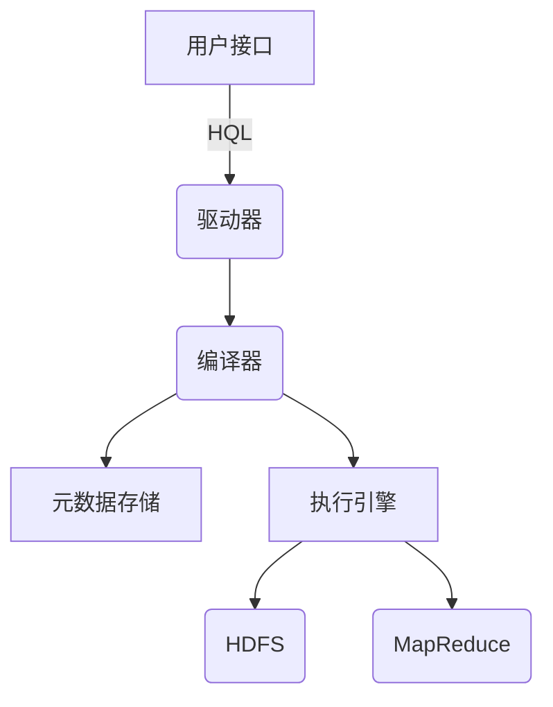

# Hive集群搭建：从零开始搭建Hive集群

## 1.背景介绍

随着大数据时代的到来,数据量呈现爆炸式增长,传统的数据库管理系统已经无法满足大数据场景下的存储和计算需求。Apache Hive作为构建在Hadoop之上的数据仓库工具,为大数据环境提供了数据摄取、存储、查询和分析等功能,成为大数据生态系统中不可或缺的重要组件。

本文将详细介绍如何从零开始搭建一个高可用的Hive集群,包括Hive的核心概念、架构原理、部署步骤以及实际应用场景等,为读者提供一个完整的Hive集群搭建和使用指南。

## 2.核心概念与联系

### 2.1 Hive概述

Apache Hive是基于Hadoop的一个数据仓库工具,它可以将结构化的数据文件映射为一张数据库表,并提供类SQL查询语言HQL(Hive Query Language)来管理和查询这些数据。Hive的设计目标是通过类SQL语法降低大数据开发的门槛,使开发人员可以无缝地将熟悉的SQL技能迁移到Hadoop生态系统中。

### 2.2 Hive架构

Hive的架构主要包括以下几个核心组件:

- **用户接口(CLI/Web UI)**: 用户可以通过命令行界面(CLI)或Web UI向Hive发送查询请求。
- **驱动器(Driver)**: 负责将HQL语句转换为一系列的MapReduce任务。
- **编译器(Compiler)**: 将HQL语句转换为执行计划。
- **元数据存储(Metastore)**: 存储Hive表、列、分区等元数据信息。
- **执行引擎(Execution Engine)**: 在Hadoop集群上执行MapReduce任务。



## 3.核心算法原理具体操作步骤

### 3.1 Hive查询执行流程

当用户通过CLI或Web UI提交一个HQL查询时,Hive的执行流程如下:

1. **语法解析**: 驱动器将HQL语句解析为抽象语法树(AST)。
2. **类型检查和语义分析**: 编译器对AST进行类型检查和语义分析,生成查询块(Query Block)。
3. **逻辑优化**: 编译器对查询块进行一系列的逻辑优化,如投影剪裁、分区剪裁等。
4. **物理优化**: 编译器将逻辑查询计划转换为物理查询计划,包括选择合适的Join算法、决定每个任务的数据位置等。
5. **执行**: 驱动器协调执行引擎在Hadoop集群上执行MapReduce任务。

### 3.2 Hive查询优化

Hive在查询执行过程中进行了多种优化,以提高查询性能:

1. **投影剪裁(Projection Pruning)**: 只读取查询中需要的列,减少I/O开销。
2. **分区剪裁(Partition Pruning)**: 只扫描查询中需要的分区,避免全表扫描。
3. **谓词下推(Predicate Pushdown)**: 将查询条件下推到存储层,避免不必要的数据读取。
4. **Join重排序(Join Reorder)**: 优化Join顺序,减少中间结果的大小。
5. **向量化查询执行(Vectorized Query Execution)**: 使用向量化执行引擎,提高CPU利用率。

## 4.数学模型和公式详细讲解举例说明

在大数据场景下,常常需要对海量数据进行统计分析,这就涉及到一些数学模型和公式的应用。以下是Hive中常用的一些数学模型和公式:

### 4.1 聚合函数

聚合函数用于对一组值进行统计计算,常用的聚合函数包括:

- $count(expr)$: 计算expr非NULL值的个数。
- $sum(expr)$: 计算expr的总和。
- $avg(expr)$: 计算expr的平均值。
- $max(expr)$: 计算expr的最大值。
- $min(expr)$: 计算expr的最小值。

例如,计算某表中所有记录的平均值:

```sql
SELECT avg(col1) FROM table;
```

### 4.2 统计函数

统计函数用于描述数据的统计特征,常用的统计函数包括:

- $variance(expr)$: 计算expr的样本方差。
- $var_pop(expr)$: 计算expr的总体方差。
- $stddev(expr)$: 计算expr的样本标准差。
- $stddev_pop(expr)$: 计算expr的总体标准差。

例如,计算某表中某列的标准差:

```sql
SELECT stddev(col1) FROM table;
```

### 4.3 数学函数

Hive还提供了一些常用的数学函数,如:

- $round(x, d)$: 将x四舍五入到小数点后d位。
- $floor(x)$: 返回小于或等于x的最大整数。
- $ceil(x)$: 返回大于或等于x的最小整数。
- $pow(x, y)$: 计算x的y次方。
- $ln(x)$: 计算x的自然对数。

例如,计算某表中某列值的自然对数:

```sql
SELECT ln(col1) FROM table;
```

## 5.项目实践：代码实例和详细解释说明

接下来,我们将通过一个实际的项目案例,演示如何使用Hive进行数据分析。假设我们有一个包含用户访问日志的数据集,其中包括以下字段:

- uid: 用户ID
- time: 访问时间
- url: 访问的URL
- referer: 来源URL
- ip: IP地址

### 5.1 创建Hive表

首先,我们需要在Hive中创建一个表来存储这些数据:

```sql
CREATE TABLE access_log (
    uid INT,
    time BIGINT,
    url STRING,
    referer STRING,
    ip STRING
)
ROW FORMAT DELIMITED
FIELDS TERMINATED BY '\t'
STORED AS TEXTFILE;
```

这里我们使用了`TEXTFILE`格式来存储数据,每个字段用制表符`\t`分隔。

### 5.2 加载数据

接下来,我们可以从HDFS中加载数据到Hive表中:

```sql
LOAD DATA INPATH '/path/to/access_log' INTO TABLE access_log;
```

### 5.3 数据分析

有了数据之后,我们就可以使用HQL进行各种数据分析操作了。

#### 5.3.1 统计每个URL的访问次数

```sql
SELECT url, count(*) AS count
FROM access_log
GROUP BY url
ORDER BY count DESC;
```

这个查询统计了每个URL的访问次数,并按访问次数降序排列。

#### 5.3.2 统计每个IP的访问次数

```sql
SELECT ip, count(*) AS count
FROM access_log
GROUP BY ip
ORDER BY count DESC
LIMIT 10;
```

这个查询统计了每个IP的访问次数,并按访问次数降序排列,只显示前10条记录。

#### 5.3.3 统计每个小时的访问量

```sql
SELECT 
    hour(from_unixtime(time)) AS hour,
    count(*) AS count
FROM access_log
GROUP BY hour
ORDER BY hour;
```

这个查询根据访问时间计算每个小时的访问量。`from_unixtime`函数将Unix时间戳转换为普通时间格式,`hour`函数提取小时部分。

#### 5.3.4 计算每个URL的平均响应时间

假设我们还有一个表`response_time`存储了每个请求的响应时间,那么我们可以使用JOIN操作来计算每个URL的平均响应时间:

```sql
SELECT 
    a.url,
    avg(r.time) AS avg_time
FROM access_log a
JOIN response_time r ON (a.uid = r.uid AND a.time = r.time)
GROUP BY a.url
ORDER BY avg_time DESC;
```

这个查询首先通过`uid`和`time`字段将`access_log`和`response_time`表JOIN在一起,然后计算每个URL的平均响应时间,并按响应时间降序排列。

## 6.实际应用场景

Hive作为大数据生态系统中的重要组件,在许多实际应用场景中发挥着重要作用,包括但不限于:

### 6.1 网站日志分析

网站日志是互联网公司的重要数据源之一,通过对日志数据进行分析,可以了解用户的访问行为、热门内容、流量来源等信息,为网站优化和广告投放等提供决策依据。Hive可以高效地存储和处理海量的网站日志数据。

### 6.2 电商用户行为分析

在电商领域,分析用户的浏览、购买行为对于个性化推荐、优化营销策略等至关重要。Hive可以对电商平台的用户行为数据进行挖掘和分析,为决策提供支持。

### 6.3 金融风险控制

金融行业对数据安全和风险控制有着严格的要求,需要对交易数据、风险数据等进行实时监控和分析。Hive可以与其他大数据工具(如Spark Streaming)配合,构建金融风控系统。

### 6.4 物联网数据分析

物联网设备产生的海量数据需要进行存储和分析,以发现潜在的规律和价值。Hive可以对物联网数据进行批量处理,为后续的实时分析提供支持。

## 7.工具和资源推荐

在搭建和使用Hive集群的过程中,有一些工具和资源可以为您提供帮助:

### 7.1 Hive官方文档

Apache Hive官方网站提供了详细的文档,包括安装指南、语法参考、最佳实践等,是学习Hive的重要资源。网址: https://hive.apache.org/

### 7.2 Hive元数据工具

Hive元数据工具(Hive Metastore Tools)可以帮助您管理Hive的元数据,包括查看、导出、导入元数据等操作。这对于备份和迁移元数据非常有用。

### 7.3 Hive性能优化工具

Hive性能优化工具(Hive Performance Tuning Tools)可以帮助您分析和优化Hive查询的性能,包括查看查询计划、识别性能瓶颈等功能。

### 7.4 Hive UI

Hive UI是一个基于Web的用户界面,可以方便地浏览Hive元数据、提交查询、监控作业等。它提供了比命令行更友好的交互方式。

### 7.5 Hive书籍和在线课程

市面上有许多关于Hive的书籍和在线课程,可以帮助您深入学习Hive的理论和实践知识。例如《Hive编程指南》、Coursera上的"大数据处理:Hive"课程等。

## 8.总结:未来发展趋势与挑战

Hive作为大数据生态系统中的重要组件,在未来仍将扮演着重要的角色。但同时,它也面临着一些挑战和发展趋势:

### 8.1 性能优化

虽然Hive已经进行了多方面的优化,但在处理实时查询和迭代式计算方面,性能仍然是一个bottleneck。未来需要进一步提升Hive的查询执行效率,缩短响应时间。

### 8.2 云原生支持

随着云计算的普及,Hive需要更好地支持云原生环境,如Kubernetes等。这将使Hive在云环境中的部署和管理更加方便。

### 8.3 机器学习集成

大数据分析和机器学习的结合是未来的发展趋势。Hive需要与机器学习框架(如Spark MLlib)更好地集成,提供端到端的数据处理和建模能力。

### 8.4 流式处理支持

虽然Hive主要面向批处理场景,但未来可能需要支持流式处理,以满足实时数据处理的需求。这可能需要与流处理引擎(如Spark Streaming)进行整合。

### 8.5 安全性和治理

随着数据量和用户数的增加,数据安全性和治理将变得越来越重要。Hive需要提供更强大的安全控制和数据治理功能,以满足企业级应用的需求。

## 9.附录:常见问题与解答

### 9.1 Hive与传统数据库的区别是什么?

Hive是一个构建在Hadoop之上的数据仓库工具,旨在处理海量数据,而传统数据库更适合处理结构化的、交互式的数据查询。两者在设计目标、存储格