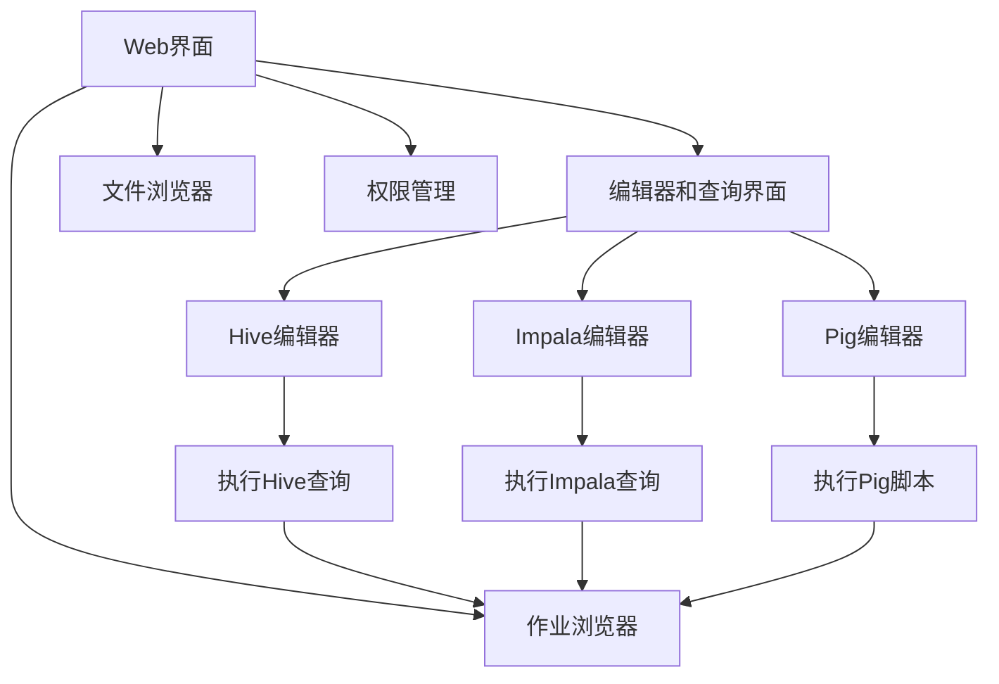
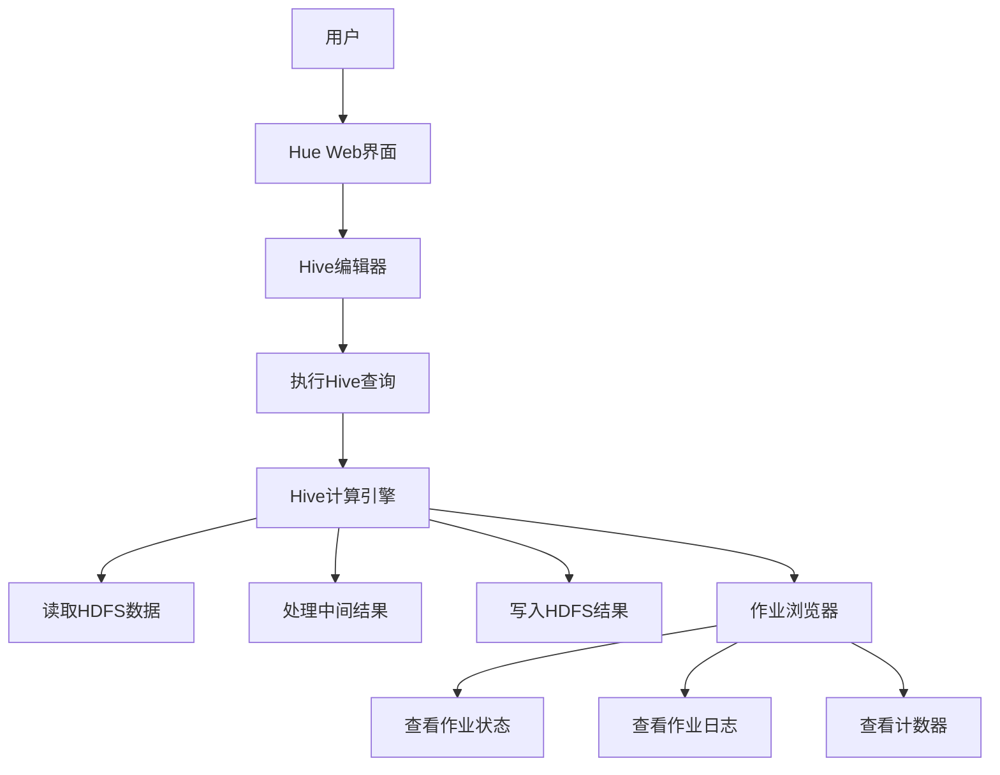

# Hue原理与代码实例讲解

## 1. 背景介绍

Hue是一个开源的Web界面,用于与Apache Hadoop生态系统进行交互。它是一个基于浏览器的工具,旨在简化大数据分析流程,使用户能够轻松地查询、浏览和可视化数据。Hue支持多种编程语言,如SQL、Python、Java等,并提供了对Hadoop生态系统中多个组件的集成,包括HDFS、YARN、Hive、Impala、Pig、Spark等。

Hue最初由Cloudera公司开发,后来被捐赠给Apache软件基金会,成为Apache顶级项目。它的主要目标是提供一个统一的用户界面,简化Hadoop生态系统的使用,从而降低大数据分析的复杂性。

## 2. 核心概念与联系

Hue的核心概念包括以下几个方面:

1. **Web界面**: Hue提供了一个基于Web的用户界面,使用户可以通过浏览器访问和操作Hadoop生态系统。

2. **集成多种组件**: Hue集成了Hadoop生态系统中的多个组件,如HDFS、YARN、Hive、Impala、Pig、Spark等,为用户提供了一站式的大数据分析体验。

3. **编辑器和查询界面**: Hue包含了多种编辑器和查询界面,如Hive编辑器、Impala编辑器、Pig编辑器等,用户可以在这些界面中编写和执行相应的查询语句。

4. **作业浏览器**: Hue提供了作业浏览器,用户可以在其中查看和管理正在运行或已完成的作业。

5. **文件浏览器**: Hue包含了文件浏览器,用户可以通过它浏览和管理HDFS上的文件和目录。

6. **权限管理**: Hue支持基于角色的访问控制(RBAC),管理员可以为不同的用户和组分配不同的权限。

7. **可扩展性**: Hue是一个可扩展的平台,开发人员可以开发自定义应用程序并集成到Hue中。

这些核心概念相互关联,共同构建了Hue的功能和特性。例如,通过Web界面,用户可以访问编辑器和查询界面,执行查询语句;通过作业浏览器,用户可以监控查询的执行情况;通过文件浏览器,用户可以管理输入和输出数据;通过权限管理,管理员可以控制不同用户对资源的访问权限。



## 3. 核心算法原理具体操作步骤

Hue的核心算法原理主要体现在以下几个方面:

1. **查询解析和优化**

   Hue在执行查询语句之前,需要对查询语句进行解析和优化。这个过程包括以下步骤:

   a. **词法分析**: 将查询语句分解成一系列的标记(token)。
   b. **语法分析**: 根据查询语言的语法规则,构建抽象语法树(AST)。
   c. **语义分析**: 检查查询语句的语义是否正确,如表和列是否存在、类型是否匹配等。
   d. **查询重写**: 对查询语句进行等价变换,以优化查询执行效率。
   e. **查询优化**: 根据数据统计信息和代价模型,选择最优的查询执行计划。

2. **查询执行**

   经过解析和优化后,Hue将查询提交给相应的计算引擎(如Hive、Impala等)执行。查询执行的过程包括以下步骤:

   a. **任务划分**: 将查询划分为多个任务,并分配给不同的节点执行。
   b. **数据读取**: 从HDFS或其他数据源读取输入数据。
   c. **中间结果处理**: 对中间结果进行处理,如过滤、聚合、排序等。
   d. **结果写入**: 将最终结果写入HDFS或其他存储系统。

3. **作业监控和管理**

   Hue提供了作业浏览器,用户可以在其中监控和管理正在运行或已完成的作业。作业监控和管理的主要步骤包括:

   a. **作业提交**: 将查询任务提交给计算引擎。
   b. **作业跟踪**: 跟踪作业的执行状态和进度。
   c. **作业管理**: 根据需要,暂停、恢复或终止作业。
   d. **日志查看**: 查看作业执行过程中的日志信息,以便排查问题。

4. **权限控制**

   Hue支持基于角色的访问控制(RBAC),管理员可以为不同的用户和组分配不同的权限。权限控制的主要步骤包括:

   a. **用户和组管理**: 创建和管理用户和组。
   b. **角色定义**: 定义不同的角色,并为每个角色分配相应的权限。
   c. **权限分配**: 将用户或组分配给特定的角色。
   d. **权限验证**: 在执行操作时,验证用户是否具有相应的权限。

这些核心算法原理和操作步骤保证了Hue能够高效地执行查询、监控作业、管理权限等功能,为用户提供了便捷的大数据分析体验。

## 4. 数学模型和公式详细讲解举例说明

在大数据分析领域,数学模型和公式扮演着重要的角色。Hue虽然主要是一个Web界面,但它也涉及到一些数学模型和公式,尤其是在查询优化和代价模型方面。

### 4.1 查询优化中的代价模型

在查询优化过程中,需要评估不同的查询执行计划,并选择代价最小的计划。代价模型用于估计每个执行计划的代价,通常包括以下几个方面:

1. **I/O代价**

   I/O代价指读取和写入数据所需的时间。它与数据量和I/O速度有关,可以用以下公式表示:

   $$IO\_Cost = \frac{Data\_Size}{IO\_Bandwidth}$$

   其中,`Data_Size`表示需要读取或写入的数据量,`IO_Bandwidth`表示I/O带宽。

2. **CPU代价**

   CPU代价指执行查询所需的CPU时间。它与数据量、操作复杂度和CPU性能有关,可以用以下公式表示:

   $$CPU\_Cost = \frac{Data\_Size \times Operation\_Complexity}{CPU\_Performance}$$

   其中,`Operation_Complexity`表示操作的复杂度,`CPU_Performance`表示CPU的性能。

3. **网络代价**

   在分布式环境中,需要考虑数据传输的网络代价。它与传输数据量和网络带宽有关,可以用以下公式表示:

   $$Network\_Cost = \frac{Data\_Size}{Network\_Bandwidth}$$

   其中,`Network_Bandwidth`表示网络带宽。

4. **内存代价**

   一些查询操作需要在内存中进行,如排序、聚合等。内存代价与需要使用的内存量有关,可以用以下公式表示:

   $$Memory\_Cost = Memory\_Usage$$

   其中,`Memory_Usage`表示需要使用的内存量。

总的代价模型可以将上述各个方面的代价相加,得到整个查询执行计划的总代价:

$$Total\_Cost = IO\_Cost + CPU\_Cost + Network\_Cost + Memory\_Cost$$

查询优化器会评估不同执行计划的总代价,并选择代价最小的执行计划。

### 4.2 其他数学模型和公式

除了查询优化中的代价模型外,Hue还可能涉及到其他数学模型和公式,例如:

1. **统计模型**

   在查询优化过程中,需要使用数据的统计信息,如数据分布、数据倾斜等。这些统计信息可以通过建模和采样得到,并用于指导查询优化。

2. **机器学习模型**

   Hue可以利用机器学习模型来优化查询执行,如通过历史查询数据训练模型,预测查询的执行时间和资源需求。

3. **图论模型**

   在处理复杂的数据流程时,可以将其建模为有向无环图(DAG),并应用图论算法进行优化和调度。

4. **概率模型**

   在处理不确定数据或缺失数据时,可以使用概率模型进行推断和估计。

这些数学模型和公式为Hue提供了强大的分析和优化能力,使其能够高效地处理大规模数据。然而,具体使用哪些模型和公式,还需要根据实际情况进行选择和调整。

## 5. 项目实践:代码实例和详细解释说明

为了更好地理解Hue的工作原理,我们将通过一个实际的代码示例来演示如何使用Hue执行Hive查询。

### 5.1 环境准备

首先,我们需要确保已经正确安装和配置了Hadoop生态系统,包括HDFS、YARN和Hive等组件。同时,也需要安装并启动Hue服务。

### 5.2 创建Hive表

在开始查询之前,我们需要创建一个Hive表。以下是创建一个名为`sales`的表的SQL语句:

```sql
CREATE TABLE sales (
  order_id INT,
  product_name STRING,
  category STRING,
  price DOUBLE,
  quantity INT,
  order_date STRING
)
ROW FORMAT DELIMITED
FIELDS TERMINATED BY ','
STORED AS TEXTFILE;
```

这个表包含了销售订单的信息,如订单ID、产品名称、类别、价格、数量和订单日期。我们可以在Hue的Hive编辑器中执行这个SQL语句来创建表。

### 5.3 加载数据

接下来,我们需要将数据加载到刚刚创建的`sales`表中。假设我们有一个名为`sales_data.csv`的CSV文件,包含了销售数据,我们可以使用以下命令将其加载到Hive表中:

```sql
LOAD DATA INPATH '/path/to/sales_data.csv' INTO TABLE sales;
```

请将`/path/to/sales_data.csv`替换为实际的文件路径。

### 5.4 执行查询

现在,我们可以在Hue的Hive编辑器中执行查询语句了。以下是一个示例查询,它计算每个产品类别的总销售额:

```sql
SELECT category, SUM(price * quantity) AS total_sales
FROM sales
GROUP BY category;
```

在执行查询后,我们可以在Hue的结果面板中查看查询结果。

```
+----------------+-------------+
|    category    | total_sales |
+----------------+-------------+
| Electronics    | 125678.25   |
| Clothing       | 87654.10    |
| Home Appliances| 98765.43    |
+----------------+-------------+
```

### 5.5 查看作业详情

除了查看查询结果,我们还可以在Hue的作业浏览器中查看作业的详细信息,包括作业状态、日志、计数器等。这对于监控和调试查询执行非常有帮助。



通过这个示例,我们可以看到如何使用Hue执行Hive查询,从创建表、加载数据到执行查询和查看结果的整个流程。同时,Hue还提供了作业浏览器等功能,方便我们监控和管理查询执行。

## 6. 实际应用场景

Hue作为一个方便易用的Web界面,在大数据分析领域有着广泛的应用场景。以下是一些典型的应用场景:

1. **数据探索和分析**

   Hue提供了一个统一的界面,使用户能够轻松地探索和分析存储在Hadoop生态系统中的大数据。用户可以使用SQL、Python或其他语言编写查询,并直接在Hue中执行和查看结果。这对于数据分析师、数据科学家和业务{"msg_type":"generate_answer_finish","data":"","from_module":null,"from_unit":null}