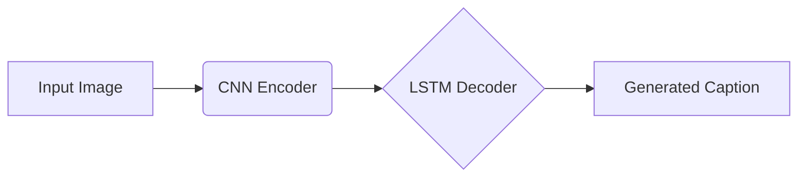
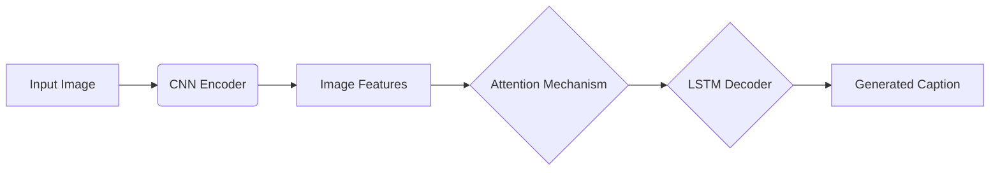

# Image Captioning原理与代码实例讲解

## 1. 背景介绍

### 1.1 什么是Image Captioning
Image Captioning(图像描述)是一项人工智能任务,旨在根据给定的图像自动生成自然语言描述。它结合了计算机视觉和自然语言处理两个领域的技术,试图让计算机像人类一样理解图像内容,并用自然语言表达出来。

### 1.2 Image Captioning的应用场景
Image Captioning在很多领域都有广泛应用,例如:

- 辅助视障人士了解图像内容
- 图像搜索引擎,根据图像内容自动生成标签和描述 
- 智能监控系统,自动分析监控画面并生成文字报告
- 无人驾驶,让车辆可以描述周围环境
- 医学影像分析,自动生成医学影像报告

### 1.3 Image Captioning面临的挑战
尽管Image Captioning取得了很大进展,但仍然面临诸多挑战:

- 图像理解的准确性有待提高
- 描述语句的多样性和准确性有待加强 
- 缺乏大规模高质量的图像描述数据集
- 评估指标难以全面衡量生成描述的质量

## 2. 核心概念与联系

### 2.1 Encoder(编码器)
通常使用卷积神经网络(CNN)作为图像特征提取器,将输入图像编码为一个紧凑的特征向量。常用的CNN包括VGG,ResNet,Inception等。

### 2.2 Decoder(解码器)  
使用循环神经网络(RNN),通常是LSTM或GRU,根据Encoder提取的图像特征,逐词生成描述语句。在每个时间步,根据之前生成的词和当前图像特征,预测下一个最可能的词。

### 2.3 Attention机制
Attention机制让Decoder可以根据当前时间步的隐藏状态,自适应地分配不同权重到图像的不同区域。这让模型可以更好地捕捉图像中的细节,生成更加准确和详细的描述。常见的Attention机制包括Soft Attention和Adaptive Attention。

### 2.4 强化学习
一些工作将强化学习应用到Image Captioning中,通过设计奖励函数鼓励模型生成更加多样、准确和符合人类语言习惯的描述。强化学习可以弥补利用MLE训练的局限性。

## 3. 核心算法原理具体操作步骤

### 3.1 基于Encoder-Decoder框架的Image Captioning



1. 使用预训练的CNN(如ResNet)提取图像特征
2. 将图像特征输入到LSTM Decoder的初始隐藏状态和记忆细胞
3. Decoder在每个时间步根据前一时刻的输出词和隐藏状态,预测下一个词的概率分布
4. 选择概率最大的词作为当前时刻的输出,并作为下一时刻的输入
5. 重复步骤3-4,直到生成结束符<EOS>或达到最大长度

### 3.2 引入Attention机制



1. CNN提取图像特征,得到一组向量,每个向量对应图像的一个区域
2. 在每个时间步,Decoder的隐藏状态与所有图像区域特征进行计算,得到注意力权重
3. 基于注意力权重对图像特征进行加权求和,得到当前时刻的上下文向量 
4. 将上下文向量与前一时刻的输出词一起输入到LSTM,预测下一个词
5. 重复步骤2-4,直到生成完整句子

### 3.3 Self-Critical Sequence Training (SCST)

1. 使用基于MLE的方法预训练模型
2. 对于每个训练样本,使用当前模型采样生成一个句子
3. 使用评估指标(如CIDEr)计算采样句子的得分r
4. 使用当前模型贪心搜索生成一个句子
5. 计算贪心句子的得分b  
6. 计算奖励 R = r - b
7. 使用策略梯度算法基于奖励R更新模型参数
8. 重复步骤2-7,直到收敛

## 4. 数学模型和公式详细讲解举例说明

### 4.1 LSTM的前向计算

$$ i_t = \sigma(W_{ii} x_t + b_{ii} + W_{hi} h_{t-1} + b_{hi}) $$

$$ f_t = \sigma(W_{if} x_t + b_{if} + W_{hf} h_{t-1} + b_{hf}) $$

$$ g_t = \tanh(W_{ig} x_t + b_{ig} + W_{hg} h_{t-1} + b_{hg}) $$

$$ o_t = \sigma(W_{io} x_t + b_{io} + W_{ho} h_{t-1} + b_{ho}) $$

$$ c_t = f_t * c_{t-1} + i_t * g_t $$

$$ h_t = o_t * \tanh(c_t) $$

其中:
- $x_t$是时刻t的输入向量
- $h_t$是时刻t的隐藏状态
- $c_t$是时刻t的记忆细胞
- $i_t, f_t, o_t$分别是输入门、遗忘门和输出门
- $W, b$是可学习的参数矩阵和偏置项
- $\sigma$是sigmoid激活函数
- $*$表示Hadamard乘积

### 4.2 Soft Attention

$$ e_{ti} = v^T \tanh(W_h h_t + W_I I_i + b) $$

$$ \alpha_{ti} = \frac{\exp(e_{ti})}{\sum_k \exp(e_{tk})} $$  

$$ c_t = \sum_i \alpha_{ti} I_i $$

其中:
- $I_i$是第i个图像区域的特征向量
- $h_t$是Decoder在t时刻的隐藏状态
- $e_{ti}$是t时刻对第i个区域的注意力得分
- $\alpha_{ti}$是t时刻对第i个区域的注意力权重
- $c_t$是t时刻的上下文向量
- $W_h, W_I, v, b$是可学习的参数

### 4.3 强化学习目标函数

$$ L_{RL} = - \mathbb{E}_{w^s \sim p_{\theta}} [r(w^s)] $$

其中:
- $\theta$表示模型参数
- $w^s$是从模型$p_{\theta}$采样得到的句子
- $r$是评估函数,用于计算句子$w^s$的得分
- $L_{RL}$表示我们希望最大化的目标函数,即采样句子的期望得分

根据策略梯度定理,目标函数$L_{RL}$的梯度为:

$$ \nabla_{\theta} L_{RL} = - \mathbb{E}_{w^s \sim p_{\theta}} [r(w^s) \nabla_{\theta} \log p_{\theta}(w^s)] $$

实际优化时,我们使用蒙特卡洛采样估计梯度:

$$ \nabla_{\theta} L_{RL} \approx - \frac{1}{N} \sum_{i=1}^N r(w_i^s) \nabla_{\theta} \log p_{\theta}(w_i^s) $$

其中$w_i^s$是第$i$个采样句子。

## 5. 项目实践:代码实例和详细解释说明

下面是一个使用PyTorch实现基于注意力机制的Image Captioning模型的简要示例:

```python
import torch
import torch.nn as nn
import torchvision.models as models

class EncoderCNN(nn.Module):
    def __init__(self):
        super(EncoderCNN, self).__init__()
        resnet = models.resnet50(pretrained=True)
        modules = list(resnet.children())[:-1]
        self.resnet = nn.Sequential(*modules)
        
    def forward(self, images):
        features = self.resnet(images)
        features = features.permute(0, 2, 3, 1)
        features = features.view(features.size(0), -1, features.size(-1))
        return features

class AttentionLSTM(nn.Module):
    def __init__(self, encoder_dim, decoder_dim, attention_dim):
        super(AttentionLSTM, self).__init__()
        self.encoder_dim = encoder_dim
        self.attention_dim = attention_dim
        self.decoder_dim = decoder_dim
        
        self.attention = nn.Linear(encoder_dim + decoder_dim, attention_dim) 
        self.gate = nn.Linear(encoder_dim + decoder_dim, decoder_dim)
        self.lstm_cell = nn.LSTMCell(encoder_dim + decoder_dim, decoder_dim, bias=True)
        
    def forward(self, features, hidden_state, cell_state):
        hidden_feat = hidden_state.unsqueeze(1).expand_as(features)
        concat_feat = torch.cat([features, hidden_feat], dim=-1)
        
        attention_weights = torch.tanh(self.attention(concat_feat))
        attention_weights = attention_weights.squeeze(2)
        attention_weights = torch.softmax(attention_weights, dim=-1)
        
        context = torch.bmm(attention_weights.unsqueeze(1), features).squeeze(1)
        
        gate_weights = torch.sigmoid(self.gate(torch.cat([hidden_state, context], dim=-1))) 
        gated_context = gate_weights * context
        
        hidden_state, cell_state = self.lstm_cell(torch.cat([hidden_state, gated_context], dim=-1), (hidden_state, cell_state))
        return hidden_state, cell_state, attention_weights

class DecoderRNN(nn.Module):
    def __init__(self, attention_dim, embed_dim, decoder_dim, vocab_size):
        super(DecoderRNN, self).__init__()
        self.attention_lstm = AttentionLSTM(attention_dim, decoder_dim, attention_dim)
        self.embedding = nn.Embedding(vocab_size, embed_dim)
        self.dropout = nn.Dropout(p=0.5)
        self.decode_step = nn.LSTMCell(embed_dim + attention_dim, decoder_dim, bias=True)
        self.h_lin = nn.Linear(decoder_dim, decoder_dim)
        self.c_lin = nn.Linear(decoder_dim, decoder_dim)
        self.fc = nn.Linear(decoder_dim, vocab_size)
        
    def forward(self, features, captions):
        batch_size = features.size(0)
        num_features = features.size(1)
        
        captions = self.embedding(captions)
        hidden_state = torch.zeros((batch_size, self.decoder_dim))
        cell_state = torch.zeros((batch_size, self.decoder_dim))

        outputs = []        
        for t in range(captions.size(1)):
            hidden_state, cell_state, _ = self.attention_lstm(features, hidden_state, cell_state)
            hidden_state = self.dropout(hidden_state)
            h_att = self.h_lin(hidden_state)
            input_embeddings = captions[:, t, :]
            hidden_state, cell_state = self.decode_step(torch.cat([input_embeddings, h_att], dim=-1), (hidden_state, cell_state))
            outputs.append(self.fc(hidden_state))

        outputs = torch.stack(outputs, dim=1)
        return outputs

class ImageCaptioningModel(nn.Module):
    def __init__(self, encoded_image_size=14, attention_dim=512, embed_dim=512, decoder_dim=512, vocab_size=10000):
        super(ImageCaptioningModel, self).__init__()
        self.encoder = EncoderCNN()
        self.decoder = DecoderRNN(attention_dim, embed_dim, decoder_dim, vocab_size)
        
    def forward(self, images, captions):
        features = self.encoder(images)
        outputs = self.decoder(features, captions)
        return outputs
```

### 代码解释:

- `EncoderCNN`: 使用预训练的ResNet-50提取图像特征。移除最后一层全连接层,保留空间维度为14x14的特征图。将特征图reshape为(batch_size, num_pixels, encoder_dim)的形状。 

- `AttentionLSTM`: 实现基于注意力机制的LSTM。在每个时间步,根据前一时刻的隐藏状态和图像特征计算注意力权重,得到加权的上下文向量。将上下文向量和隐藏状态concat后输入到LSTM进行状态更新。

- `DecoderRNN`: 整个解码器网络。使用AttentionLSTM作为基本单元。在每个时间步将AttentionLSTM的输出和词嵌入向量concat后输入到另一个LSTM中,最后经过全连接层输出每个词的概率分布。

- `ImageCaptioningModel`: 将CNN编码器和RNN解码器结合成端到端的Image Captioning模型。编码器对图像进行特征提取,解码器根据图像特征和之前生成的词预测下一个词。

以上就是一个简单的PyTorch实现示例,展示了Image Captioning模型的基本结构。实际应用中还需要在更大的数据集上进行训练,并加入Beam Search、强化学习等技术来提