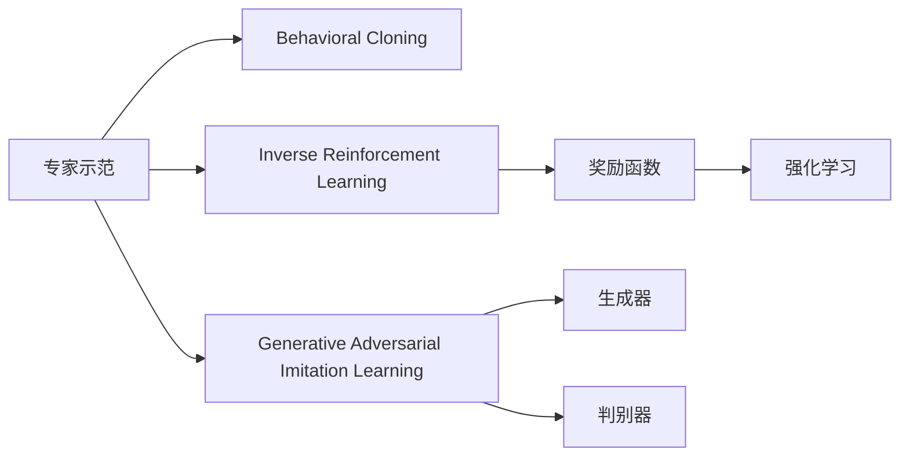

# Imitation Learning原理与代码实例讲解

## 1. 背景介绍

### 1.1 Imitation Learning的起源与发展
Imitation Learning(模仿学习)是机器学习领域的一个重要分支,其目标是通过模仿专家的行为来学习策略,从而使智能体能够完成特定的任务。Imitation Learning起源于上世纪80年代,最初主要应用于机器人领域,通过示教的方式让机器人学习如何执行任务。随着深度学习的兴起,Imitation Learning也得到了长足的发展,并在自动驾驶、游戏AI、自然语言处理等领域取得了广泛应用。

### 1.2 Imitation Learning的优势
与传统的强化学习相比,Imitation Learning具有以下优势:

1. 样本效率高:模仿学习可以通过少量的专家示范数据就实现较好的性能,不需要大量的环境交互和试错。
2. 训练速度快:模仿学习直接学习专家的行为策略,避免了强化学习中的探索过程,因此训练速度更快。  
3. 适用范围广:模仿学习可以应用于连续或离散的状态和动作空间,对环境的要求相对宽松。

### 1.3 Imitation Learning的挑战
尽管Imitation Learning具有诸多优势,但它也面临一些挑战:

1. 专家数据的质量和数量:模仿学习的性能很大程度上取决于专家示范数据的质量和数量,获取高质量的专家数据可能比较困难和昂贵。
2. 泛化能力:模仿学习容易过拟合专家数据,导致在新的环境中泛化能力较差。
3. 安全性:模仿学习可能学到专家的一些不安全行为,在实际应用中存在安全隐患。

## 2. 核心概念与联系

### 2.1 Behavioral Cloning
Behavioral Cloning是Imitation Learning的一种最简单和直观的方法。其核心思想是通过监督学习直接学习专家的行为策略。具体来说,就是用专家的状态-动作对作为训练数据,训练一个映射函数(通常是深度神经网络),输入状态,输出对应的动作。训练好的模型可以在新的状态下模仿专家的行为。

### 2.2 Inverse Reinforcement Learning
Inverse Reinforcement Learning(IRL)是Imitation Learning的另一种重要方法。与Behavioral Cloning直接学习专家策略不同,IRL先从专家的示范数据中学习到一个奖励函数,再利用学到的奖励函数通过强化学习得到最优策略。IRL分为两个阶段:

1. 学习奖励函数:给定一组专家的轨迹数据,IRL算法学习一个奖励函数,使得专家的行为在该奖励函数下是最优的。
2. 强化学习:利用学到的奖励函数,通过强化学习算法(如Q-learning、策略梯度等)求解最优策略。

### 2.3 Generative Adversarial Imitation Learning
Generative Adversarial Imitation Learning(GAIL)是近年来提出的一种Imitation Learning新框架,它借鉴了生成对抗网络(GAN)的思想。GAIL由一个生成器(Generator)和一个判别器(Discriminator)组成:

- 生成器:策略网络,根据当前状态生成动作。
- 判别器:用于区分生成器的行为轨迹和专家的行为轨迹。

生成器和判别器通过对抗训练不断更新,最终生成器学到接近专家的策略,判别器无法区分两者。

### 2.4 核心概念之间的联系
下图展示了Imitation Learning几个核心概念之间的联系:



Behavioral Cloning直接利用专家示范学习策略;IRL从专家示范中学习奖励函数,再通过强化学习得到策略;GAIL利用生成对抗思想,生成器和判别器博弈学习专家策略。

## 3. 核心算法原理具体操作步骤

### 3.1 Behavioral Cloning算法步骤

1. 数据收集:收集专家的示范数据,包括状态特征和对应的动作。
2. 数据预处理:对收集的数据进行清洗、特征提取等预处理操作。
3. 模型选择:选择合适的机器学习模型,如深度神经网络。
4. 模型训练:将状态特征作为输入,动作作为标签,训练监督学习模型。
5. 模型评估:在测试集上评估模型的模仿性能。
6. 策略执行:将训练好的模型部署到智能体上执行任务。

### 3.2 Inverse Reinforcement Learning算法步骤

1. 数据收集:收集专家的示范轨迹数据。
2. 特征提取:从原始状态中提取有意义的特征表示。  
3. 奖励函数学习:利用IRL算法从专家轨迹中学习隐含的奖励函数,常见算法有:
   - 最大熵IRL
   - 高斯过程IRL
   - 生成对抗IRL
4. 强化学习:利用学到的奖励函数,通过强化学习算法求解最优策略。
5. 策略评估:在仿真或真实环境中评估学到的策略。
6. 迭代优化:根据评估结果,调整奖励函数学习算法或强化学习算法,迭代优化策略。

### 3.3 Generative Adversarial Imitation Learning算法步骤

1. 数据收集:收集专家的示范轨迹数据。
2. 生成器和判别器初始化:随机初始化生成器(策略网络)和判别器(分类网络)的参数。
3. 对抗训练:
   - 固定生成器,训练判别器去区分生成器的轨迹和专家的轨迹。
   - 固定判别器,训练生成器去欺骗判别器,使生成的轨迹更接近专家轨迹。
   - 交替进行以上两个步骤,直到达到平衡。
4. 策略评估:在仿真或真实环境中评估学到的策略。  
5. 迭代优化:根据评估结果,调整生成器和判别器的网络结构和超参数,迭代优化策略。

## 4. 数学模型和公式详细讲解举例说明

### 4.1 Behavioral Cloning的数学模型
Behavioral Cloning可以表示为一个监督学习问题:

$$\min_{\theta} \mathbb{E}_{(s,a) \sim D}[L(\pi_{\theta}(s), a)]$$

其中,$\theta$是策略网络的参数,$D$是专家的示范数据集,$(s,a)$是状态-动作对,$L$是损失函数(如均方误差),$\pi_{\theta}(s)$是策略网络在状态$s$下的动作输出。

举例说明:假设我们要训练一个自动驾驶模型,状态$s$包括车速、车辆与道路中心的距离等信息,动作$a$为方向盘转角。我们收集专家驾驶员的驾驶数据$(s,a)$,训练一个深度神经网络$\pi_{\theta}$,使其输入状态$s$,输出动作$a$,最小化均方误差损失:

$$L(\pi_{\theta}(s), a) = (\pi_{\theta}(s) - a)^2$$

### 4.2 最大熵IRL的数学模型
最大熵IRL是一种经典的IRL算法,其目标是学习一个奖励函数$R(s)$,使专家的轨迹在该奖励函数下具有最大熵。数学上可以表示为一个优化问题:

$$\max_{R} \sum_{i=1}^{m} \log P(\tau_i | R) - \lambda \Vert R \Vert^2$$

其中,$\tau_i$是第$i$条专家轨迹,$m$是轨迹数量,$P(\tau_i | R)$是轨迹$\tau_i$在奖励函数$R$下的概率,$\lambda$是正则化系数。

求解该优化问题可以得到奖励函数$R(s)$,然后利用强化学习算法(如值迭代、策略梯度)求解最优策略。

举例说明:假设我们要训练一个机器人打高尔夫,我们收集专家的高尔夫示范轨迹数据。每条轨迹包含一系列状态(球的位置、杆的角度等)和动作(挥杆)。我们用最大熵IRL学习隐含的奖励函数,使专家的轨迹具有最大熵。学到奖励函数后,再用强化学习求解最优挥杆策略。

### 4.3 GAIL的数学模型
GAIL的数学模型借鉴了GAN的思想,可以表示为一个最小最大优化问题:

$$\min_{\pi} \max_{D} \mathbb{E}_{\pi}[\log D(s,a)] + \mathbb{E}_{expert}[\log(1-D(s,a))] - \lambda H(\pi)$$

其中,$\pi$是策略(生成器),$D$是判别器,$\mathbb{E}_{\pi}$是策略$\pi$生成的轨迹分布下的期望,$\mathbb{E}_{expert}$是专家轨迹分布下的期望,$H(\pi)$是策略$\pi$的熵,用于鼓励探索。

生成器$\pi$和判别器$D$通过对抗训练不断更新:

- 判别器$D$最大化目标函数,去区分生成轨迹和专家轨迹。
- 生成器$\pi$最小化目标函数,去欺骗判别器,使生成轨迹接近专家轨迹。

最终收敛时,生成器$\pi$学到专家的策略,判别器$D$无法区分生成轨迹和专家轨迹。

举例说明:假设我们要训练一个对话机器人模仿人类聊天。我们收集人类聊天的对话轨迹数据,每条轨迹包含一系列状态(聊天上下文)和动作(生成的回复)。我们用GAIL训练一个生成器(聊天机器人)和一个判别器。生成器根据当前对话状态生成回复,判别器去区分生成器的回复和人类的回复。通过对抗训练,最终得到一个可以模仿人类聊天的对话机器人。

## 5. 项目实践:代码实例和详细解释说明

下面我们通过一个简单的例子,用PyTorch实现Behavioral Cloning算法。

### 5.1 导入依赖库

```python
import numpy as np
import torch
import torch.nn as nn
import torch.optim as optim
from torch.utils.data import Dataset, DataLoader
```

### 5.2 准备数据集

我们随机生成一些专家的示范数据,每个数据点包含状态(长度为4的向量)和动作(长度为2的向量)。

```python
class ExpertDataset(Dataset):
    def __init__(self, num_samples):
        self.states = np.random.uniform(low=-1, high=1, size=(num_samples, 4))
        self.actions = np.random.uniform(low=-1, high=1, size=(num_samples, 2))
        
    def __len__(self):
        return len(self.states)
    
    def __getitem__(self, idx):
        state = self.states[idx]
        action = self.actions[idx]
        return state, action

dataset = ExpertDataset(num_samples=1000)
dataloader = DataLoader(dataset, batch_size=32, shuffle=True)
```

### 5.3 定义策略网络

我们定义一个简单的多层感知机作为策略网络,输入状态,输出动作。

```python
class PolicyNet(nn.Module):
    def __init__(self, state_dim, action_dim):
        super(PolicyNet, self).__init__()
        self.fc1 = nn.Linear(state_dim, 128)
        self.fc2 = nn.Linear(128, 64)
        self.fc3 = nn.Linear(64, action_dim)
        
    def forward(self, x):
        x = torch.relu(self.fc1(x))
        x = torch.relu(self.fc2(x))
        x = self.fc3(x)
        return x

state_dim = 4
action_dim = 2
policy_net = PolicyNet(state_dim, action_dim)
```

### 5.4 训练策略网络

我们使用均方误差损失函数和Adam优化器来训练策略网络。

```python
criterion = nn.MSELoss()
optimizer = optim.Adam(policy_net.parameters(), lr=0.001)

num_epochs = 50
for epoch in range(num_epochs):
    for states, actions in dataloader:
        optimizer.zero_grad()
        predicted_actions = policy_net(states)