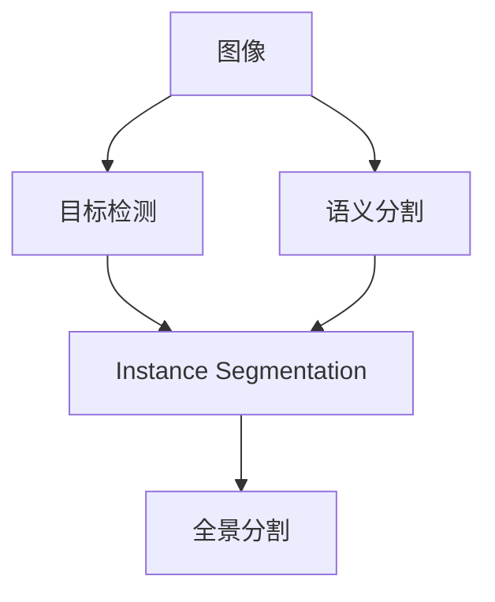

# Instance Segmentation原理与代码实例讲解

## 1. 背景介绍
### 1.1 Instance Segmentation的定义与意义
Instance Segmentation(实例分割)是计算机视觉领域的一个重要任务,旨在从图像中检测出每个目标实例(如人、车、动物等),并为其生成像素级别的分割掩码。与传统的语义分割不同,实例分割不仅需要判断每个像素属于哪个类别,还要进一步区分不同的目标个体。这项技术在自动驾驶、医学影像分析、智能监控等领域有广泛应用前景。

### 1.2 Instance Segmentation的研究历史与发展
Instance Segmentation的研究始于2014年,由Hariharan等人[^Hariharan2014]首次提出。此后该领域迅速发展,涌现出一系列经典方法,如Mask R-CNN[^He2017]、PANet[^Liu2018]等。近年来,随着深度学习技术的进步,Instance Segmentation的性能不断提升,在准确性和速度上都取得了显著突破。一些最新的工作,如CondInst[^Tian2020]、SOLOv2[^Wang2020]等,更是将实例分割推向了新的高度。

### 1.3 Instance Segmentation面临的挑战
尽管Instance Segmentation取得了长足进步,但仍面临诸多挑战:
1. 目标尺度差异大,小目标易漏检;
2. 目标密集、遮挡严重时,分割质量下降; 
3. 边界细节捕捉困难,存在锯齿、断裂等问题;
4. 计算开销大,难以实时运行;
5. 泛化能力不足,模型易过拟合数据集。

如何应对这些挑战,是当前Instance Segmentation领域的研究重点。

## 2. 核心概念与联系
### 2.1 目标检测(Object Detection)
目标检测是Instance Segmentation的基础,旨在从图像中定位出感兴趣的目标,并给出其类别和边界框(bounding box)。主流的两阶段检测器如Faster R-CNN[^Ren2015],先使用区域候选网络(Region Proposal Network, RPN)提取候选框,再对其分类和回归;单阶段检测器如YOLO[^Redmon2016]、SSD[^Liu2016]等则直接在特征图上密集采样锚框(anchor)进行预测。

### 2.2 语义分割(Semantic Segmentation) 
语义分割是像素级别的分类任务,将图像的每个像素划分到预定义的类别中。其代表方法有全卷积网络FCN[^Long2015]、U-Net[^Ronneberger2015]等。语义分割擅长提取像素的类别信息,但无法区分同类实例。

### 2.3 全景分割(Panoptic Segmentation)
全景分割[^Kirillov2019]是语义分割和实例分割的统一框架,对图像中的所有像素进行分割,可处理stuff(如天空、道路等无法数清的"物质")和thing(如人、车等可数的"物体")。其需在实例间强制使用非重叠的掩码。

### 2.4 概念之间的关系
Instance Segmentation是目标检测和语义分割的结合,继承了二者的特点,既能检测和定位个体目标,又能生成像素级掩码。全景分割则在实例分割的基础上,进一步支持对背景stuff的分割。它们的关系如下图所示:



## 3. 核心算法原理具体操作步骤
本节介绍几种主流的Instance Segmentation算法及其原理和步骤。

### 3.1 两阶段法
两阶段法先使用检测器提取候选区域,再对其进行分割,代表是Mask R-CNN[^He2017]。
1. 骨干网提取图像特征;
2. 区域候选网络生成目标候选框;
3. RoIAlign在候选框内采样并池化,得到固定尺寸的区域特征;
4. 并行的分类、框回归和掩码预测分支,分别预测类别、边界框和分割掩码;
5. 后处理阶段过滤低质量检测,并生成最终的实例分割结果。

### 3.2 单阶段法
单阶段法省去候选区域生成步骤,直接密集地预测,代表是YOLACT[^Bolya2019]、PolarMask[^Xie2020]等。以YOLACT为例:
1. 骨干网提取图像特征;
2. 检测分支预测各个锚框的类别和坐标;
3. 原型(prototype)分支学习若干公共的掩码表示;
4. 掩码系数分支为每个检测框生成一组系数;
5. 线性组合原型掩码和掩码系数,再经过阈值化,即可得到每个实例的分割掩码。

### 3.3 Proposal-free法
Proposal-free法不依赖候选区域,直接在图像/特征图上进行实例分割,代表是SOLO[^Wang2019]系列。以SOLOv2[^Wang2020]为例:
1. 骨干网提取多尺度图像特征;
2. 分类分支预测各个位置的类别;
3. 掩码分支学习像素到实例中心的相对坐标;
4. 根据预测的类别得分和像素坐标,将每个像素指派到对应的实例掩码;
5. 通过掩码NMS去除冗余掩码,生成最终实例分割。

### 3.4 基于Transformer的方法
最新的尝试是将Transformer[^Vaswani2017]引入Instance Segmentation,代表是DETR[^Carion2020]、MaskFormer[^Cheng2021]等。以MaskFormer为例:
1. 骨干网提取图像特征;
2. 像素解码器学习逐像素的类别表示;
3. Transformer解码器在图像特征图上采样若干查询(query),预测实例的类别、边界框和掩码嵌入;
4. 掩码头将掩码嵌入解码为实际的分割掩码;
5. 后处理阶段过滤重叠实例,生成最终分割结果。

## 4. 数学模型和公式详细讲解举例说明
本节以Mask R-CNN为例,详细讲解其中的关键模块和公式。

### 4.1 区域候选网络(RPN)
RPN以图像特征图为输入,滑动一个小的卷积网络,在每个位置上生成$k$个锚框(anchor box),并为每个锚框预测其是否包含目标(objectness score)以及边界框坐标。

设输入特征图为 $\mathbf{F} \in \mathbb{R}^{H \times W \times C}$,锚框的宽高比(aspect ratio)集合为 $\mathcal{R}$,尺度(scale)集合为 $\mathcal{S}$。则锚框总数为:
$$
k = |\mathcal{R}| \times |\mathcal{S}|
$$

对于特征图上的每个位置 $(i,j)$,RPN预测 $k$ 个锚框的目标概率 $\mathbf{p}_{i,j} \in \mathbb{R}^k$ 和边界框坐标 $\mathbf{t}_{i,j} \in \mathbb{R}^{4k}$:
$$
\begin{aligned}
\mathbf{p}_{i,j} &= \text{sigmoid}(\text{Conv}_{1 \times 1}(\mathbf{F}_{i,j})) \\
\mathbf{t}_{i,j} &= \text{Conv}_{1 \times 1}(\mathbf{F}_{i,j})
\end{aligned}
$$

其中 $\text{Conv}_{1 \times 1}$ 表示核大小为 $1 \times 1$ 的卷积层。

训练时,根据锚框与真值框(ground-truth box)的交并比(Intersection-over-Union, IoU),划分正负样本,采用二元交叉熵损失和Smooth L1损失分别优化分类和回归分支。预测时,采用非极大值抑制(Non-Maximum Suppression, NMS)过滤重叠候选框。

### 4.2 RoIAlign
传统的RoI池化通过量化操作提取候选区域特征,存在不可微和像素偏移等问题。RoIAlign采用双线性插值,修正了这一问题。

设候选区域的坐标为 $\mathbf{b} = (x, y, w, h)$,表示其左上角坐标和宽高。RoIAlign将 $\mathbf{b}$ 均匀划分为 $n \times n$ 个子区域(bin),每个子区域的特征聚合公式为:
$$
\mathbf{r}_{i,j} = \sum_{p \in \text{bin}(i,j)} w_p \cdot \mathbf{F}(p)
$$

其中 $\mathbf{r}_{i,j}$ 是第 $(i,j)$ 个子区域的特征, $p$ 是子区域内的采样点, $w_p$ 是对应的双线性插值权重。采样点数量可以通过超参数调节,以权衡速度和精度。

### 4.3 掩码分支
掩码分支以RoI特征为输入,预测实例的像素级分割掩码。设RoI特征为 $\mathbf{r} \in \mathbb{R}^{H' \times W' \times C'}$,掩码分支通过一系列卷积层将其映射为 $K$ 个 $m \times m$ 的掩码概率图 $\mathbf{M} \in [0, 1]^{m \times m \times K}$:
$$
\mathbf{M} = \sigma(\text{Conv}_{1 \times 1}(\text{ConvBlock}(\mathbf{r})))
$$

其中 $\text{ConvBlock}$ 由若干卷积层组成,$\sigma$ 是sigmoid函数。$K$ 是类别数,每个类别对应一个二值掩码。

训练时,采用逐像素的二元交叉熵损失,公式为:
$$
\mathcal{L}_\text{mask} = -\frac{1}{m^2} \sum_{i=1}^m \sum_{j=1}^m [y_{i,j} \log \hat{y}_{i,j} + (1 - y_{i,j}) \log (1 - \hat{y}_{i,j})]
$$

其中 $y_{i,j}$ 是真值掩码, $\hat{y}_{i,j}$ 是预测掩码。预测时,对掩码概率图进行阈值化,得到最终的二值掩码。

## 5. 项目实践：代码实例和详细解释说明
本节以Mask R-CNN为例,给出PyTorch版本的核心代码实现。完整代码请参考[maskrcnn-benchmark](https://github.com/facebookresearch/maskrcnn-benchmark)。

### 5.1 模型定义
首先定义Mask R-CNN模型,其主要组件包括:骨干网(backbone)、区域候选网络(rpn)、RoI池化层(roi_heads)等。

```python
class MaskRCNN(nn.Module):
    def __init__(self, backbone, rpn, roi_heads):
        super().__init__()
        self.backbone = backbone
        self.rpn = rpn
        self.roi_heads = roi_heads
    
    def forward(self, images, targets=None):
        # 提取特征
        features = self.backbone(images.tensors)
        
        # 区域候选
        proposals, rpn_losses = self.rpn(images, features, targets)
        
        # 检测和分割
        detections, mask_losses = self.roi_heads(features, proposals, targets)
        
        losses = {}
        losses.update(rpn_losses)
        losses.update(mask_losses)

        return losses, detections
```

### 5.2 骨干网络
使用ResNet-FPN作为骨干网络,从图像中提取多尺度特征。

```python
class Backbone(nn.Module):
    def __init__(self, name, pretrained):
        super().__init__()
        self.body = resnet_fpn_backbone(name, pretrained=pretrained)

    def forward(self, images):
        features = self.body(images)
        return features
```

### 5.3 区域候选网络
RPN首先使用3x3卷积层生成共享特征,再并行地预测目标概率和边界框坐标。

```python
class RPNHead(nn.Module):
    def __init__(self, in_channels, num_anchors):
        super().__init__()
        self.conv = nn.Conv2d(in_channels, in_channels, 3, 1, 1)
        self.cls_logits = nn.Conv2d(in_channels, num_anchors, 1)
        self.bbox_pred = nn.Conv2d(in_channels, num_anchors * 4, 1)
    
    def forward(self, features):
        logits = []
        bbox_reg = []
        for feature in features:
            t = F.relu(self.conv(feature))
            logits.append(self.cls_logits(t))
            bbox_reg.appen