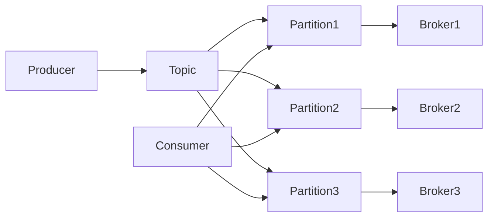

## 1.背景介绍

Apache Kafka是一种流行的分布式流处理平台，具有高吞吐量、可扩展性和故障容错性等特点。它被广泛用于大数据和实时数据处理场景。在Kafka中，Partition（分区）是数据存储和处理的基本单元。理解Partition的工作原理，对于有效使用Kafka和优化其性能至关重要。

## 2.核心概念与联系

在Kafka中，Topic是消息的类别或者说是消息的集合，Partition是Topic的分片。每个Partition都是一个有序的、不可改变的消息序列，新的消息被追加到Partition的末尾。Partition可以跨多个服务器进行分布，以实现数据的负载均衡和高可用性。



## 3.核心算法原理具体操作步骤

当Producer发送消息到Kafka时，它需要决定将消息发送到哪个Partition。这个过程通常由Partitioner组件来完成。默认的Partitioner是RoundRobinPartitioner，它会轮流将消息发送到所有的Partition。如果消息有Key，那么默认的Partitioner会根据Key的hash值来选择Partition，保证相同Key的消息总是发送到同一个Partition，这样就能保证消息的顺序性。

Consumer从Partition中读取数据，每个Consumer都有一个当前的offset，表示下一条要读取的消息的位置。Consumer读取数据后，会更新自己的offset。如果Consumer停止或者崩溃，它可以从上次的offset开始继续读取数据，这样就实现了消息的"at least once"语义。

## 4.数学模型和公式详细讲解举例说明

在选择Partition时，如果消息没有Key，那么Partitioner会使用Round-Robin算法，公式如下：

$$
P = (i \mod n) + 1
$$

其中，$P$是Partition的编号，$i$是消息的编号，$n$是Partition的总数。这样可以保证消息均匀地分布到所有的Partition。

如果消息有Key，那么Partitioner会使用Hash算法，公式如下：

$$
P = hash(K) \mod n
$$

其中，$K$是消息的Key，$hash()$是hash函数。这样可以保证相同Key的消息总是发送到同一个Partition。

## 5.项目实践：代码实例和详细解释说明

下面是一个简单的Producer和Consumer的代码示例。Producer发送消息到一个有3个Partition的Topic，Consumer从这个Topic中读取数据。

Producer代码：

```java
Properties props = new Properties();
props.put("bootstrap.servers", "localhost:9092");
props.put("key.serializer", "org.apache.kafka.common.serialization.StringSerializer");
props.put("value.serializer", "org.apache.kafka.common.serialization.StringSerializer");

Producer<String, String> producer = new KafkaProducer<>(props);
for (int i = 0; i < 100; i++) {
    producer.send(new ProducerRecord<String, String>("my-topic", Integer.toString(i), Integer.toString(i)));
}
producer.close();
```

Consumer代码：

```java
Properties props = new Properties();
props.put("bootstrap.servers", "localhost:9092");
props.put("group.id", "test");
props.put("key.deserializer", "org.apache.kafka.common.serialization.StringDeserializer");
props.put("value.deserializer", "org.apache.kafka.common.serialization.StringDeserializer");

Consumer<String, String> consumer = new KafkaConsumer<>(props);
consumer.subscribe(Arrays.asList("my-topic"));

while (true) {
    ConsumerRecords<String, String> records = consumer.poll(100);
    for (ConsumerRecord<String, String> record : records) {
        System.out.printf("offset = %d, key = %s, value = %s%n", record.offset(), record.key(), record.value());
    }
}
```

## 6.实际应用场景

在大数据处理和实时流处理场景中，Kafka和Partition被广泛应用。例如，实时日志处理系统，可以使用Kafka收集和传输日志数据，每个日志源对应一个Partition，这样就可以并行处理大量的日志数据。又如，实时推荐系统，可以使用Kafka接收用户的实时行为数据，每个用户对应一个Partition，这样就可以实时更新用户的推荐结果。

## 7.工具和资源推荐

- Apache Kafka官网：https://kafka.apache.org/
- Kafka Python客户端：https://github.com/dpkp/kafka-python
- Kafka Streams：https://kafka.apache.org/documentation/streams/

## 8.总结：未来发展趋势与挑战

随着数据量的增长，Kafka和Partition的使用会越来越广泛。但是，如何有效管理大量的Partition，如何保证Partition的均衡分布，如何处理Partition的故障，都是未来需要解决的挑战。

## 9.附录：常见问题与解答

Q: Partition的数量应该设置为多少？

A: Partition的数量取决于你的需求。如果你需要高吞吐量，你应该设置更多的Partition。但是，Partition的数量越多，管理的复杂性和开销也越大。

Q: 如何处理Partition的故障？

A: Kafka提供了Replica机制来处理Partition的故障。每个Partition可以有多个Replica，分布在不同的Broker上。如果一个Broker失败，那么其他的Broker可以接管它的Partition。

作者：禅与计算机程序设计艺术 / Zen and the Art of Computer Programming